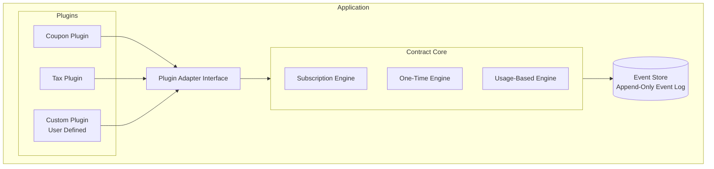
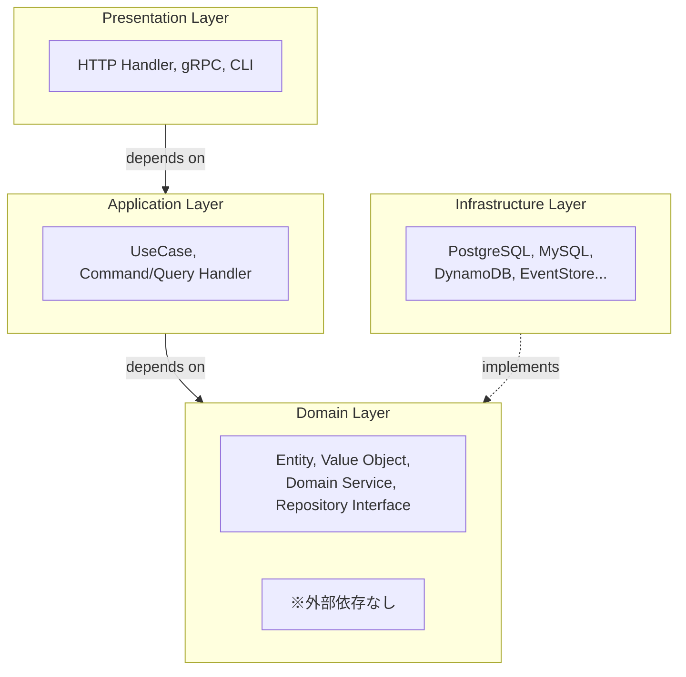

# Contract Billing Core - アーキテクチャ概要

**イベントソーシング + プラグインアーキテクチャによる契約決済OSSパッケージ**

## 1. 概要

### 1.1 目的

SaaSやサービス事業において、契約・決済ロジックは本質的に類似している。本パッケージは以下を提供する：

- 契約ライフサイクル管理（買い切り / サブスクリプション / 従量課金）
- イベントソーシングによる全操作の完全な監査証跡
- プラグインアーキテクチャによる拡張性（クーポン、割引、税計算など）

### 1.2 システム構成



## 2. 設計原則

### 2.1 依存逆転の原則（DIP）



### 2.2 CQRS（コマンド・クエリ分離）

| 項目 | 決定 |
|------|------|
| CQRS | **簡易CQRS** |
| Projection更新 | **利用者が選択** |
| 説明 | 同一DBでProjectionテーブルを使用。同期/非同期をオプションで指定可能 |

### 2.3 その他の設計方針

| 項目 | 決定 | 備考 |
|------|------|------|
| マルチテナント | サービス側に委ねる | OSS側では対応しない |
| タイムゾーン | **UTC固定** | 全イベント時刻はUTC |
| 請求サイクル | 選択肢をOSSで提供 | 日次/週次/月次/年次 |

## 3. パッケージ構成

```
github.com/yourorg/contract-billing-core/
├── domain/                      # ドメイン層（依存なし）
│   ├── contract/
│   │   ├── entity.go
│   │   ├── repository.go        # インターフェース定義
│   │   ├── events.go
│   │   └── service.go
│   ├── invoice/
│   ├── payment/
│   ├── usage/
│   └── shared/                  # 共通値オブジェクト
│       ├── money.go
│       ├── datetime.go
│       └── identifier.go
│
├── application/                 # アプリケーション層
│   ├── command/
│   ├── query/
│   └── service/
│
├── plugin/                      # プラグインシステム
│   ├── registry.go
│   ├── hooks.go
│   └── context.go
│
├── eventstore/                  # Event Store インターフェース
│   ├── store.go
│   ├── event.go
│   └── snapshot.go
│
├── batch/                       # バッチ処理
│   ├── processor.go
│   └── ...
│
├── infrastructure/              # インフラ実装（別モジュール可）
│   ├── postgres/
│   ├── mysql/
│   └── inmemory/               # テスト用
│
├── plugins/                     # 公式プラグイン
│   ├── coupon/
│   └── tax/
│
└── api/                        # API層
    ├── http/
    └── grpc/
```

## 4. 主要コンポーネント

### 4.1 コアドメイン

| ドメイン | 責務 |
|---------|------|
| **Contract** | 契約のライフサイクル管理（作成、有効化、一時停止、解約、更新） |
| **Invoice** | 請求書の生成、発行、支払い記録 |
| **Payment** | 決済処理、返金 |
| **Usage** | 従量課金のメトリクス記録・集計 |

### 4.2 契約タイプ

| タイプ | 説明 |
|--------|------|
| `one_time` | 買い切り |
| `subscription` | サブスクリプション（定期課金） |
| `usage_based` | 従量課金 |

### 4.3 契約ステータス

```go
type ContractStatus string

const (
    ContractStatusDraft     ContractStatus = "draft"
    ContractStatusTrialing  ContractStatus = "trialing"  // トライアル
    ContractStatusActive    ContractStatus = "active"
    ContractStatusSuspended ContractStatus = "suspended"
    ContractStatusCancelled ContractStatus = "cancelled"
    ContractStatusExpired   ContractStatus = "expired"
)
```

## 5. プラグインシステム

### 5.1 拡張ポイント

| フック | 用途 |
|--------|------|
| `InvoiceCalculationHook` | 請求書計算への介入（クーポン、税計算等） |
| `ContractLifecycleHook` | 契約ライフサイクルへの介入 |
| `PaymentHook` | 支払い処理への介入 |
| `MetricsHook` | メトリクス収集 |
| `InvoiceGenerationHook` | 請求書生成・送付 |

### 5.2 実行順序

会計基準に則った順序で実行：

```
1. 基本料金計算
2. 数量調整（従量課金）
3. 割引適用（クーポン等）
4. 小計算出
5. 税計算（割引後に対して）
6. 合計算出
```

## 6. 関連ドキュメント

| ドキュメント | 内容 |
|-------------|------|
| [ドメインモデル設計](./design/domain-model.md) | エンティティ、値オブジェクトの詳細設計 |
| [イベントソーシング設計](./design/event-sourcing.md) | Event Store、時点再構築の詳細 |
| [プラグインシステム設計](./design/plugin-system.md) | プラグインの実装方法 |
| [決済ゲートウェイ設計](./design/payment-gateway.md) | 決済インターフェースの詳細 |
| [メトリクス・インボイス生成設計](./design/metrics-invoicegen.md) | 集計・レポート、請求書発行 |
| [設計決定事項](./decisions/design-decisions.md) | 設計上の判断とその理由 |
| [利用ガイド](./guides/usage-guide.md) | サービスへの導入方法 |
