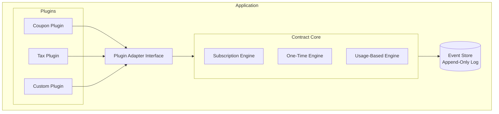
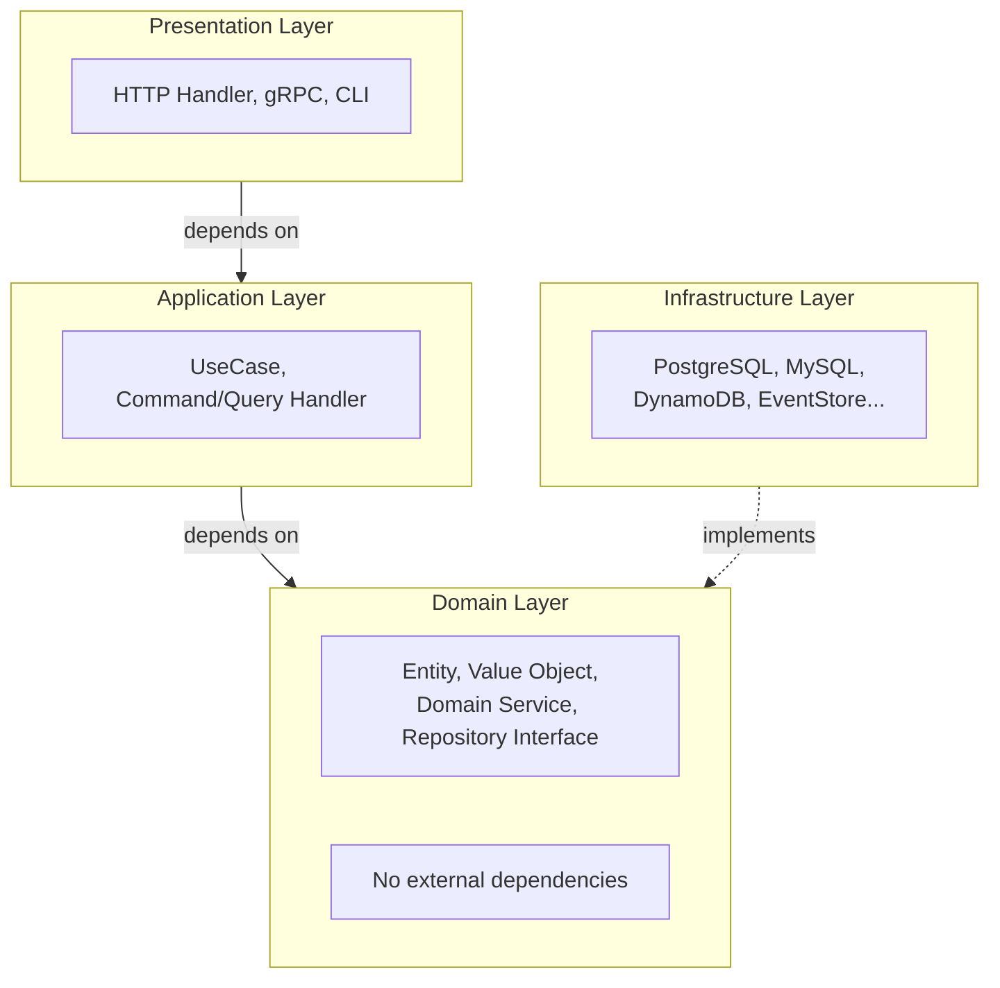
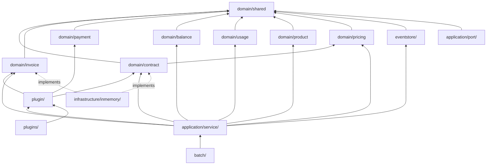
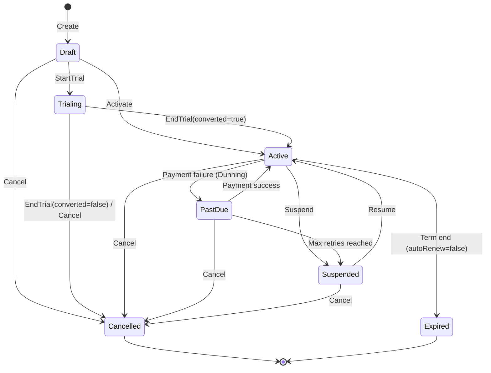
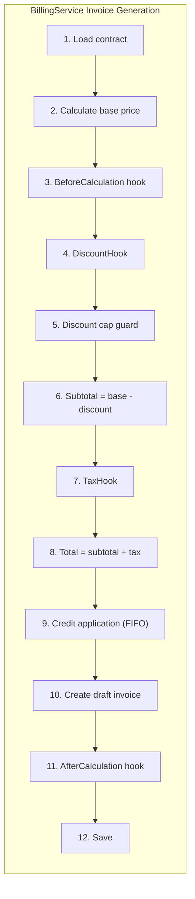

# Architecture Overview

**Event Sourcing + Plugin Architecture for contract-to-cash billing**

## 1. Overview

### 1.1 Purpose

Contract and billing logic is fundamentally similar across SaaS and service businesses. This package provides:

- Contract lifecycle management (one-time / subscription / usage-based)
- Complete audit trail via Event Sourcing
- Extensibility through a Plugin Architecture (coupons, discounts, tax, etc.)

### 1.2 System Diagram



## 2. Design Principles

### 2.1 Layer Architecture (Clean Architecture + DDD)



**Strict rules:**

- `domain/` must have zero external dependencies (stdlib + `ulid` only)
- `application/` depends only on `domain/`, never on `infrastructure/`
- Dependencies always point inward (Dependency Inversion)
- Interfaces are defined in `domain/` or `application/port/`; implementations live in `infrastructure/`

### 2.2 Dependency Graph



### 2.3 CQRS (Command Query Responsibility Segregation)

| Item | Decision |
|------|----------|
| CQRS | **Simplified CQRS** |
| Projection updates | **Consumer's choice** |
| Description | Uses projection tables in the same DB. Sync/async selectable via options |

### 2.4 Other Design Decisions

| Item | Decision | Notes |
|------|----------|-------|
| Multi-tenancy | Delegated to consumer | Not handled by this library |
| Timezone | **UTC only** | All event timestamps are UTC |
| Billing cycles | Provided by library | Daily / Weekly / Monthly / Yearly |

## 3. Package Structure

```
github.com/contract-to-cash/core/
├── domain/                      # Domain layer (no external deps)
│   ├── contract/                #   Event Sourced aggregate
│   ├── invoice/                 #   Invoice + CreditNote entities
│   ├── payment/                 #   Payment entity + Dunning
│   ├── balance/                 #   Credit ledger
│   ├── billing/                 #   Billing calculation abstraction
│   ├── pricing/                 #   Immutable Price, pricing models
│   ├── product/                 #   Product definition
│   ├── usage/                   #   Usage record + summary
│   └── shared/                  #   Shared value objects (Money, Clock, etc.)
│
├── application/                 # Application layer
│   ├── port/                    #   External integration IFs (PaymentGateway, etc.)
│   ├── query/                   #   Temporal query service
│   ├── projection/              #   Projection service (sync/async)
│   ├── tx/                      #   Transaction management (TxManager, Saga)
│   └── service/                 #   BillingService, PaymentService, SnapshotService, CreditNoteService
│
├── plugin/                      # Plugin system core
├── eventstore/                  # Event Store interfaces
├── batch/                       # Batch processing (ContractRenewal, etc.)
├── infrastructure/inmemory/     # In-memory implementations (test/demo)
└── plugins/                     # Official plugins
    ├── coupon/
    ├── tax/
    └── invoicecleanup/
```

## 4. Core Components

### 4.1 Domain Entities

| Entity | Kind | Notes |
|--------|------|-------|
| **Contract** | Event Sourced Aggregate | States: Draft -> Trialing -> Active -> PastDue/Suspended -> Cancelled/Expired |
| **Invoice** | Entity | Revision chain support (void-and-recreate) |
| **CreditNote** | Entity | Line-item-level adjustments |
| **Payment** | Entity | Idempotency key required |
| **Price** | Immutable Entity | Flat / Tiered (Graduated, Volume) / Usage pricing models |
| **Product** | Entity | Defines "what to sell"; separated from Price ("how to charge") |
| **BalanceEntry** | Entity | FIFO consumption, expiration support |

### 4.2 Contract Types

| Type | Description |
|------|-------------|
| `one_time` | One-time purchase |
| `subscription` | Recurring billing |
| `usage_based` | Metered billing |

### 4.3 Contract State Machine



## 5. Payment-Gated Provisioning (Recommended Flow)

A pattern where service access is withheld until the first payment succeeds. This uses existing state transitions only -- no new statuses needed.

### 5.1 Flow

| Step | Contract Status | Invoice Status | Description |
|------|----------------|----------------|-------------|
| 1 | Draft | (none) | Create contract |
| 2 | Draft | Draft | Generate invoice (Draft status allows this) |
| 3 | Active | Finalized | User confirms; finalize both contract and invoice |
| 4 | Suspended | Finalized | Immediately suspend (awaiting payment) |
| 5 | Active | Paid | Payment confirmed -> Resume -> Service starts |

### 5.2 Design Points

- **Unified Suspended state**: Used for both "awaiting first payment" and "payment failure suspension"
- **No new transitions needed**: Active -> Suspended -> Active (Resume) already exists
- **Payment gates service access**: Activate then immediately Suspend; Resume only after payment confirmation

A simpler flow (`Draft -> Activate -> Generate Invoice -> Process Payment`) is also supported. Choose based on business requirements.

## 6. Plugin System

### 6.1 Extension Points

All hooks follow ISP (Interface Segregation Principle). Implement only the hooks you need.

| Category | Hooks | Purpose |
|----------|-------|---------|
| **Billing calculation** | `DiscountHook`, `TaxHook`, `InvoiceLifecycleHook` | Discounts, tax, pre/post calculation |
| **Contract lifecycle** | `OnContractCreate/Activate/Suspend/Resume/Cancel/Renew/TrialEndHook` | React to individual contract events |
| **Payment** | `BeforeChargeHook`, `AfterChargeHook`, `OnPaymentFailedHook`, `OnRefundHook` | Pre/post charge, failure, refund |
| **Credit notes** | `OnCreditNoteIssuedHook`, `OnInvoiceRevisedHook` | CN issuance, invoice revision |
| **Metrics** | `OnContractChangeHook`, `OnInvoiceIssuedHook`, `OnPaymentProcessedHook` | KPI collection |
| **Invoice generation** | `InvoiceGenerationHook` | PDF generation, delivery |

### 6.2 Hook Firing Responsibility

Not every hook is fired by the core. Of the 20 hook interfaces, 14 are invoked
automatically by core services/batch processors; the rest are fired by the
integrator or by an adapter (see `docs/internals/plugin-system.md` section 5.3
for the per-hook detail):

| Fired by | Hooks | Where |
|----------|-------|-------|
| **Core** (14) | `DiscountHook`, `TaxHook`, `InvoiceLifecycleHook`, `OnInvoiceIssuedHook` | `BillingService` (billing pipeline; `FinalizeInvoice` fires OnInvoiceIssued) |
| | `BeforeChargeHook`, `AfterChargeHook`, `OnPaymentProcessedHook`, `OnPaymentFailedHook`, `OnRefundHook` | `PaymentService` |
| | `OnCreditNoteIssuedHook`, `OnInvoiceRevisedHook` | `CreditNoteService` |
| | `OnContractRenewHook`, `OnContractTrialEndHook`, `OnContractChangeHook` | `batch.ContractRenewalProcessor`, `batch.TrialExpirationProcessor` |
| **Integrator** (5) | `OnContractCreate/Activate/Suspend/Resume/Cancel Hook` | Contract lifecycle operations call aggregate methods directly (no core application service), so the integrator fires the matching hooks. Reference: `examples/hosting-integration-demo/main.go` |
| **Adapter** (1) | `InvoiceGenerationHook` | Invoice rendering/delivery is out of core scope; the consumer's invoice-generation adapter fires BuildDocument/AfterRender/AfterDelivery (see `docs/internals/metrics-invoicegen.md`) |

### 6.3 Billing Pipeline

The core structurally guarantees the accounting-correct calculation order. Plugin `Priority` values only control execution order *within* the same hook type.



**Calculation order detail:**

1. `InvoiceLifecycleHook.BeforeCalculation()` -- Pre-calculation processing
2. Base price calculation (core, branched by contract type)
   - subscription: fixed price
   - usage_based: UsageRecord aggregation -> included allowance deduction -> PricingModel
   - one_time: fixed price (once)
   - hybrid: base price + usage charge
3. `DiscountHook.CalculateDiscount()` -- Discount calculation
   - Discount cap guard: total discount is capped at subtotal
4. Subtotal computation (core: subtotal - totalDiscount)
5. `TaxHook.CalculateTax()` -- Tax on post-discount amount
6. Total computation (core: afterDiscount + totalTax)
7. Credit ledger application (core) -- FIFO deduction from balance
8. Create draft invoice -> finalize after GracePeriod
9. `InvoiceLifecycleHook.AfterCalculation()` -- Post-calculation processing

## 7. Related Documents

| Document | Contents |
|----------|----------|
| [Domain Model](./concepts/domain-model.md) | Entities, value objects, detailed design |
| [Event Sourcing](./concepts/event-sourcing.md) | Event Store, temporal reconstruction |
| [Plugin System](./concepts/plugin-system.md) | Plugin implementation guide |
| [Payment Gateway](./concepts/payment-gateway.md) | Payment interface design |
| [Metrics & Invoice Generation](./internals/metrics-invoicegen.md) | Aggregation, reporting, invoice rendering |
| [Design Decisions](./decisions/design-decisions.md) | Key decisions and rationale |
| [Integration Guide](./guides/integration.md) | How to integrate into your service |
