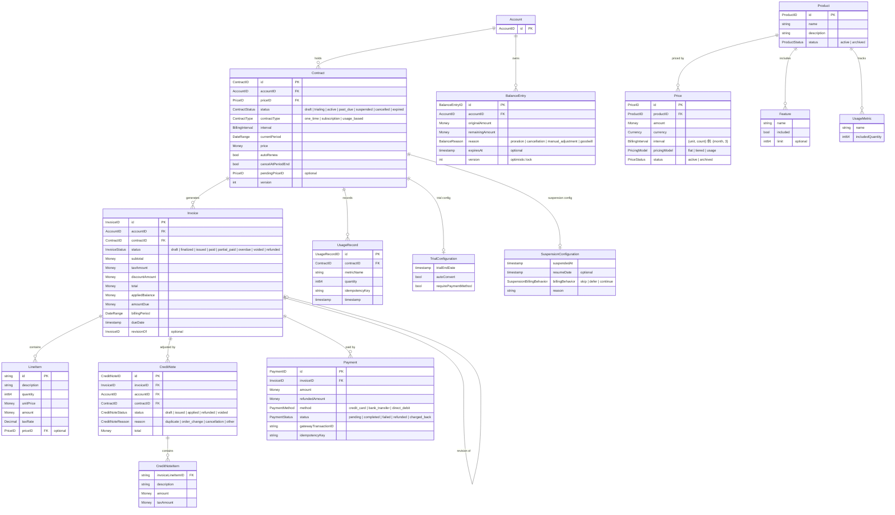
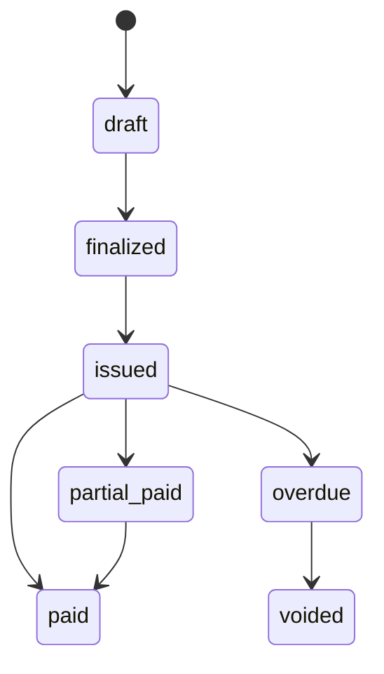

# Domain Model

The domain model consists of entities, value objects, and aggregates that represent the billing domain.

## Entity Relationship Diagram

:::info Legend
- **Account** is an external boundary (managed outside this domain)
- **Contract** is the event-sourced aggregate root (`ContractAggregate`)
- **Money** is a `big.Rat`-based value object; IDs are ULID-generated
- **TrialConfiguration / SuspensionConfiguration** are value objects (no persistence ID)
:::

## Contract Aggregate

The contract is the central entity, modeled as an event-sourced aggregate root. It manages the full lifecycle of a billing agreement.

### States

| Status | Description |
|--------|-------------|
| `draft` | Contract created but not yet active |
| `trialing` | In trial period |
| `active` | Currently active and billable |
| `past_due` | Payment overdue (dunning in progress) |
| `suspended` | Temporarily suspended |
| `cancelled` | Permanently cancelled |
| `expired` | Term ended without renewal |

### Contract Types

| Type | Description |
|------|-------------|
| `one_time` | Single purchase, no recurring billing |
| `subscription` | Recurring billing at a fixed interval |
| `usage_based` | Charges based on metered usage |

### Operations

The aggregate supports lifecycle management, price changes, trials, and scheduled cancellations. All operations emit domain events for the event store.

> For complete struct definitions, commands, and getters, see [Domain Types Reference](../api/domain-types.md#contract).

## Invoice

Invoices are generated by `BillingService` and track the billing calculation result.

### States

Invoices support a **revision chain** (void-and-recreate) for corrections: `originalInvoiceID` points to the chain root, `revisionOf` points to the direct parent.

> For construction options, methods, and line item details, see [Domain Types Reference](../api/domain-types.md#invoice).

## Payment

Tracks individual payment transactions with idempotency keys for duplicate prevention.

States: `pending` → `completed` / `failed` → `partially_refunded` / `refunded` / `charged_back`

> For complete type definitions, see [Domain Types Reference](../api/domain-types.md#payment).

## Product and Price

Following the Stripe pattern of separating **what you sell** from **how you charge**:

- **Product** — Defines the offering: name, features, usage metrics
- **Price** — Defines billing: amount, currency, cycle, pricing model. **Immutable after creation** — to change pricing, create a new Price

Pricing models: `FlatPrice`, `TieredPrice` (graduated or volume), `UsagePrice`

> For complete type definitions and pricing model details, see [Domain Types Reference](../api/domain-types.md#product).

## Credit Ledger

FIFO-based credit system for handling prorations, cancellation credits, and adjustments. Credits are automatically consumed during invoice generation, oldest first.

Reasons: `proration`, `cancellation`, `manual_adjustment`, `refund_conversion`, `goodwill`

> For complete type definitions, see [Domain Types Reference](../api/domain-types.md#credit).

## Shared Value Objects

| Type | Description |
|------|-------------|
| **Money** | Arbitrary-precision (`big.Rat`) monetary value with currency. Currencies: JPY, USD, EUR |
| **DateRange** | Half-open interval `[start, end)` for billing periods |
| **ID Types** | ULID-based: `ContractID`, `InvoiceID`, `PaymentID`, `ProductID`, `PriceID`, etc. |
| **Clock** | Time abstraction (`SystemClock` for production, `FixedClock` for tests) |
| **DomainError** | Structured errors with `ErrorCode` for business vs technical errors |

> For complete value object APIs, see [Domain Types Reference](../api/domain-types.md#shared-value-objects).
