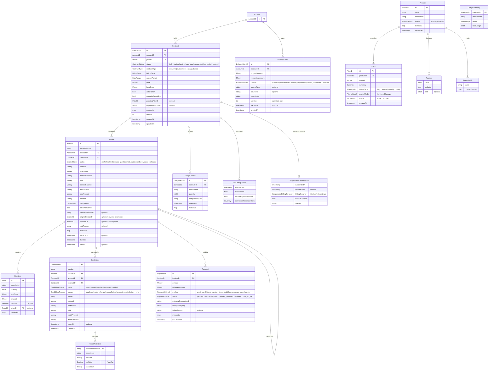

# ドメインモデル設計

> **ソースコード参照**: 各エンティティの実装は対応するパッケージのソースコードを参照のこと。
> 本ドキュメントは設計意図・制約・関連性を記述し、Goインターフェース定義はソースに委ねる。

## 論理データモデル図



> **凡例:** Account は外部境界（このドメイン外で管理）。Contract はイベントソーシング集約根（`ContractAggregate`）。
> Money は `big.Rat` ベースの値オブジェクト、Decimal は `*big.Rat`、ID は ULID で生成。
> TrialConfiguration / SuspensionConfiguration / UsageSummary は値オブジェクト（独立した永続化IDを持たない）。

## 1. Account（アカウント）

> Account はこのドメイン外（サービス側）で管理される外部境界エンティティ。
> 以下はOSSが期待するフィールド構成の設計仕様。`domain/account/` パッケージは未実装。

| フィールド群 | 主要フィールド | 説明 |
|-------------|---------------|------|
| 基本情報 | `id: AccountID`, `name`, `email` | アカウント識別 |
| 請求情報 | `BillingInfo` | 住所、税ID、支払い期限（日数） |
| クレジット設定 | `BillingInfo.BalanceConfig` | nil = グローバルデフォルトを使用 |

`BalanceConfig` は `Account.BillingInfo` に含める。未設定の場合はグローバルデフォルトを使用する（`domain/balance/policy.go` 参照）。

## 2. 共通値オブジェクト

ソース: `domain/shared/`

| 型 | ファイル | 説明 |
|---|---|---|
| `Money` | `money.go` | `big.Rat` ベースの通貨付き金額。浮動小数点は使用禁止。Add/Subtract時に通貨一致を検証 |
| `DateRange` | `datetime.go` | 半開区間 `[start, end)` の期間。`Next(cycle)` で次の請求サイクルを算出 |
| `Currency` | `money.go` | JPY, USD, EUR |
| ID型 | `identifier.go` | `AccountID`, `ContractID`, `InvoiceID` 等。ULID で生成。循環依存回避のため `shared` に集約 |
| `DomainError` | `errors.go` | `ErrorCode` + `Message` + `Cause` の構造化エラー |
| `Clock` | `clock.go` | 時刻取得の抽象化。`SystemClock`（本番）と `FixedClock`（テスト） |

**設計判断:**
- `AddBillingCycleDuration()` は `DateRange.Next()` と `ContractAggregate` の両方から参照される唯一の変換ロジック
- `time.Now()` の直接呼び出しはドメイン層・アプリケーション層で禁止。必ず `Clock` IF 経由

## 2. Contract（契約）

ソース: `domain/contract/`

### 状態遷移

```
draft → active | trialing | cancelled（作成直後のキャンセル）
trialing → active（トライアル終了・自動移行）| cancelled（トライアル中の解約）
active → past_due | suspended | cancelled | expired
past_due → active（支払い成功）| suspended（リトライ上限到達）| cancelled
suspended → active（再開）| cancelled（一時停止中の解約）
cancelled → 終端状態（遷移なし）
expired → 終端状態（遷移なし）
```

### 契約タイプ

| タイプ | 説明 |
|--------|------|
| `one_time` | 買い切り |
| `subscription` | サブスクリプション（定期課金） |
| `usage_based` | 従量課金 |

### ContractAggregate

- イベントソーシング対応の集約ルート（`eventstore.BaseAggregate` を埋め込み）
- 15種以上のドメインイベント（`events.go` 参照）
- `Create`, `Activate`, `Suspend`, `Resume`, `Cancel`, `ChangePrice`, `Renew` 等のコマンドメソッド
- `LoadFromHistory()` でイベント履歴から状態を復元、`LoadFromSnapshot()` でスナップショットから復元
- `BillingCycle` は `pricing.BillingCycle` のエイリアス（定義元は `pricing`）
- 契約は `CreateContractCommand.PriceID` で Price を指定する

### 価格変更ポリシー

| ポリシー | 説明 |
|----------|------|
| `immediate` | 即座に変更を適用。日割り計算が発生しうる |
| `end_of_term` | 次回更新時に変更を適用。`pendingPriceID` に予約 |

### トライアル設定

`TrialConfiguration`: トライアル終了日、自動本契約移行、支払い方法事前登録必須、移行リマインダー

### 一時停止設定

`SuspensionConfiguration`: 請求動作（skip/defer/continue）、契約期間延長、再開日

### 日割り計算設定

`ProrationBehavior`: immediate（即時日割り）、next_cycle（次サイクルから）、immediate_full（即時全額）

## ドメインサービス: billing.Calculator

ソース: `domain/billing/service.go`

`Calculator` は **contract と invoice を橋渡しする、両方のドメインを参照してよい唯一のドメインサービス**。
他のドメインサービスは単一のドメインパッケージ内に閉じること。

### ProrationResult のセマンティクス

`ProrationResult` は日割り計算結果を保持する。`AdjustmentAmount = ChargeAmount - CreditAmount`。

| AdjustmentAmount | 意味 | 決済時の動作 |
|-----------------|------|------------|
| `> 0` | アップグレード | AdjustmentAmount のみ1回請求 |
| `< 0` | ダウングレード | BalancePolicy に従って処理（ledger/refund/none） |
| `= 0` | 同額価格変更 | 決済なし |

## 4. Invoice（請求書）

ソース: `domain/invoice/`

### 状態遷移

```
draft → finalized（確定。GracePeriod後）
finalized → issued（送付済み）
issued → paid | partial_paid | overdue
partial_paid → paid（残額入金）
overdue → paid | voided
paid → refunded（返金）
voided → 終端状態
```

### 設計上のポイント

- Functional Options パターンによるコンストラクタ（`WithStatus`, `WithBillingPeriod` 等）
- リビジョンチェーン: `originalInvoiceID`（チェーンのルート）と `revisionOf`（直接の親）の2レベルリンク
- `appliedBalance`: クレジット台帳から充当された金額。`amountDue = total - appliedBalance`
- 部分入金: `allowPartialPay` フラグで制御。`paidAmount` と `balance` で残高追跡
- `LineItem.quantity` は `int64`（メトリクスの `InvoiceLineItem.Quantity` は `float64`、変換時にキャスト）

### CreditNote（クレジットノート）

- 発行済み請求書に対する行項目レベルの調整
- ステータス: draft → issued → applied | refunded | voided
- 発行理由: duplicate, order_change, cancellation, product_unsatisfactory, other
- `CreditNoteItem` で請求書明細に対応する調整額と税率を保持

## 4. Payment（支払い）

ソース: `domain/payment/`

### 状態遷移

```
pending → completed | failed
completed → partially_refunded | refunded | charged_back
partially_refunded → refunded（残額返金時）
failed → pending（リトライ時。DunningConfig.MaxRetries に達した場合は終端）
charged_back, refunded → 終端状態
```

### 設計上のポイント

- `idempotencyKey` 必須（リトライ時の重複防止）
- `RecordRefund(amount)` で返金額を累計に記録、ステータスを自動更新
- 決済ゲートウェイとの連携は `application/port/` のインターフェースを使用（`domain/payment/` にはエンティティ・イベント・リポジトリIFのみ。詳細は [payment-gateway.md](./payment-gateway.md) 参照）

### Dunning（支払い回収）

`DunningConfig`: 最大リトライ回数、リトライ間隔、ステップごとのアクション（retry/notify/suspend/cancel）

## 5. Usage（従量課金）

ソース: `domain/usage/`

- `UsageRecord`: 契約ごとのメトリクス使用量の記録。`idempotencyKey` で重複登録防止
- `UsageSummary`: 期間集計結果（value object）
- メータリング（生イベントの収集・集計）はOSSスコープ外。利用者側で集計し `UsageRecord` として記録

## 6. Pricing（料金モデル）

ソース: `domain/pricing/`

### Price エンティティ

- 「どう課金するか」を表すイミュータブルなエンティティ。作成後は変更不可、価格改定時は新しい Price を作成
- `BillingCycle` の定義元パッケージ。`contract.BillingCycle` はエイリアス

### PricingModel（Strategy パターン）

| モデル | 説明 |
|--------|------|
| `FlatPrice` | 固定料金 |
| `TieredPrice` (graduated) | 段階別課金。各段階に該当する使用量にその段階の単価を適用 |
| `TieredPrice` (volume) | 全量課金。到達した段階の単価を全使用量に適用。**注意: クリフエッジ問題あり**（下記参照） |

> **TieredPrice (volume) のクリフエッジ問題:**
> Graduated例: 0-100回@¥10 + 101-500回@¥8 → 250回 = (100×¥10)+(150×¥8) = ¥2,200
> Volume例: 同条件 → 250回 = 250×¥8 = ¥2,000
> Volume注意: 100回=¥1,000 > 101回=¥808 となり、使用量増で料金が下がるクリフエッジが発生しうる
| `UsagePrice` | 従量料金。最低料金・最大料金（上限）オプション |

## 7. Product（プロダクト）

ソース: `domain/product/`

- 「何を売るか」を表すエンティティ。Price（「どう課金するか」）と分離
- `Feature`: 機能定義（名前、含有フラグ、上限）
- `UsageMetric`: 従量課金メトリクス定義（名前、含有枠）
- ステータス: active → archived

> **非推奨（Deprecated）**: `pricing.UsageMetric` と `pricing.Feature` は `product.UsageMetric` / `product.Feature` に置き換えられた。
> 従量料金計算で `PricingModel` を保持するため `pricing` 側の型は残存するが、プロダクト定義には `product.*` を使用すること。

## 8. Balance（クレジット台帳）

ソース: `domain/balance/`

### BalancePolicy

| ポリシー | 説明 |
|----------|------|
| `ledger` | クレジット台帳に積み、次回以降の請求書で自動差引（デフォルト） |
| `refund` | 即座に元の決済手段に返金 |
| `none` | クレジットを発生させない（差額は切り捨て） |

### BalanceEntry

- FIFO消費（古いクレジットから順に使用）
- 有効期限対応（`expiresAt`、nil = 無期限）
- 楽観的ロック（`version` / `loadedVersion`）
- `Consume(amount)` は残高不足の場合は残高分のみ消費

### 請求書生成時のクレジット適用フロー

1. `FindAvailable(accountID, currency)` で同一通貨かつ有効期限内のクレジットをFIFO取得
2. 古いクレジットから順に消費（有効期限切れはスキップ）
3. `Invoice.appliedBalance` に適用額を記録、`BalanceApplication` レコード作成
4. 実請求額 = 合計 - クレジット適用額（0なら決済不要）

### トランザクション戦略

クレジット適用は BalanceEntry と Invoice を跨ぐ操作。簡易CQRS（同一DB）のため、アプリケーションサービス層での同一DBトランザクションでアトミック性を保証する。

**フルCQRS移行時の移行パス（Saga パターン）:**
1. `InvoiceFinalizedEvent` を発行
2. `BalanceApplicationSaga` がイベントを受信し、クレジット適用コマンドを発行
3. 成功時: `CreditAppliedEvent` → Invoice の amountDue を更新
4. 失敗時: 補償トランザクション（クレジット適用取消）を実行

### ダウングレード時のフロー

`ProrationResult.AdjustmentAmount < 0` の場合、`BalancePolicy` に従い分岐:
- `ledger` → BalanceEntry 作成（reason: proration）、次回請求で自動差引
- `refund` → PaymentGateway.Refund() で即時返金
- `none` → 何もしない
