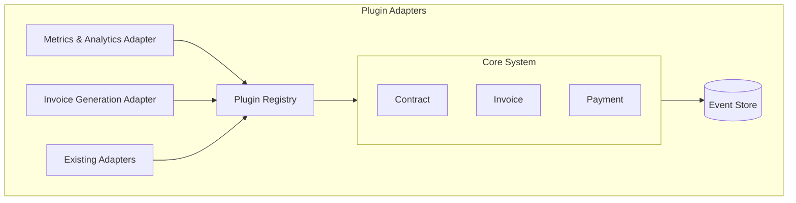
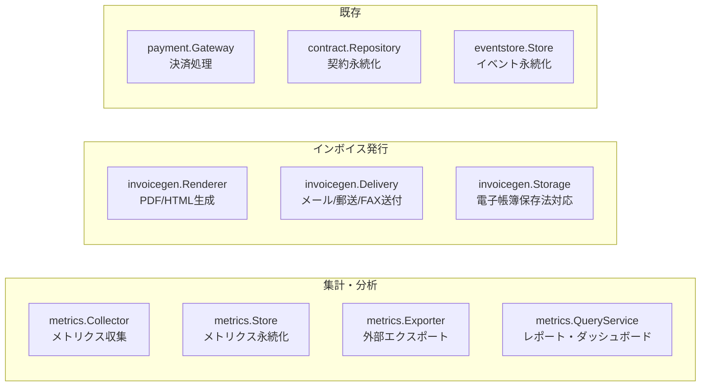

# プラグインAdapter設計: 集計・レポート & インボイス発行

## 1. 概要

### 1.1 追加するAdapter



### 1.2 Adapter一覧

| Adapter | 役割 | 実装例 |
|---------|------|--------|
| `MetricsCollector` | 契約・請求・決済の集計 | 日次バッチ、リアルタイム |
| `AnalyticsExporter` | 外部分析ツールへのエクスポート | BigQuery, Redshift |
| `InvoiceRenderer` | 請求書のレンダリング | PDF, HTML |
| `InvoiceDelivery` | 請求書の送付 | メール, 郵送API |
| `InvoiceStorage` | 請求書の保管 | S3, GCS（電子帳簿保存法対応） |

---

## 2. 集計・分析 Adapter

### 2.1 メトリクス定義

```go
// plugin/metrics/types.go
package metrics

import (
    "time"

    "github.com/contract-to-cash/core/domain/shared"
)

// ============================================================
// 契約メトリクス
// ============================================================

// ContractMetrics 契約関連メトリクス
type ContractMetrics struct {
    Date      time.Time `json:"date"`
    Period    Period    `json:"period"`  // daily, monthly, yearly

    // 契約数
    NewContracts       int64 `json:"new_contracts"`        // 新規契約数
    RenewedContracts   int64 `json:"renewed_contracts"`    // 更新数
    CancelledContracts int64 `json:"cancelled_contracts"`  // 解約数
    ExpiredContracts   int64 `json:"expired_contracts"`    // 失効数
    SuspendedContracts int64 `json:"suspended_contracts"`  // 一時停止数
    ResumedContracts   int64 `json:"resumed_contracts"`    // 再開数

    // 累積
    ActiveContracts    int64 `json:"active_contracts"`     // 有効契約数（累積）
    TotalContracts     int64 `json:"total_contracts"`      // 総契約数（累積）

    // 契約タイプ別内訳
    ByType map[string]ContractTypeMetrics `json:"by_type"`
}

type ContractTypeMetrics struct {
    Type             string `json:"type"`
    NewContracts     int64  `json:"new_contracts"`
    ActiveContracts  int64  `json:"active_contracts"`
    CancelledContracts int64 `json:"cancelled_contracts"`
}

// ============================================================
// 収益メトリクス
// ============================================================

// RevenueMetrics 収益関連メトリクス
type RevenueMetrics struct {
    Date     time.Time    `json:"date"`
    Period   Period       `json:"period"`
    Currency shared.Currency `json:"currency"`

    // MRR（Monthly Recurring Revenue）
    MRR           shared.Money `json:"mrr"`
    MRRNew        shared.Money `json:"mrr_new"`         // 新規からのMRR
    MRRExpansion  shared.Money `json:"mrr_expansion"`   // アップグレードによる増加
    MRRContraction shared.Money `json:"mrr_contraction"` // ダウングレードによる減少
    MRRChurn      shared.Money `json:"mrr_churn"`       // 解約によるMRR減少
    MRRNet        shared.Money `json:"mrr_net"`         // 純増減

    // ARR（Annual Recurring Revenue）
    ARR shared.Money `json:"arr"`

    // 売上
    GrossRevenue   shared.Money `json:"gross_revenue"`    // 総売上
    Discounts      shared.Money `json:"discounts"`        // 割引額
    Refunds        shared.Money `json:"refunds"`          // 返金額
    NetRevenue     shared.Money `json:"net_revenue"`      // 純売上

    // クレジット
    CreditIssued    shared.Money `json:"credit_issued"`    // 発行されたクレジット総額
    CreditConsumed  shared.Money `json:"credit_consumed"`  // 消費されたクレジット総額
    CreditBalance   shared.Money `json:"credit_balance"`   // 未消費クレジット残高

    // 従量課金
    UsageRevenue   shared.Money `json:"usage_revenue"`    // 従量課金売上

    // 買い切り
    OneTimeRevenue shared.Money `json:"one_time_revenue"` // 買い切り売上
}

// ============================================================
// 決済メトリクス
// ============================================================

// PaymentMetrics 決済関連メトリクス
type PaymentMetrics struct {
    Date   time.Time `json:"date"`
    Period Period    `json:"period"`

    // 件数
    TotalPayments     int64 `json:"total_payments"`
    SuccessfulPayments int64 `json:"successful_payments"`
    FailedPayments    int64 `json:"failed_payments"`
    PendingPayments   int64 `json:"pending_payments"`

    // 金額
    TotalAmount       shared.Money `json:"total_amount"`
    SuccessfulAmount  shared.Money `json:"successful_amount"`
    FailedAmount      shared.Money `json:"failed_amount"`

    // 成功率
    SuccessRate       float64 `json:"success_rate"`

    // 決済方法別内訳
    ByMethod map[string]PaymentMethodMetrics `json:"by_method"`

    // リトライ
    RetryCount        int64 `json:"retry_count"`
    RetrySuccessCount int64 `json:"retry_success_count"`
}

type PaymentMethodMetrics struct {
    Method         string       `json:"method"`
    Count          int64        `json:"count"`
    Amount         shared.Money `json:"amount"`
    SuccessRate    float64      `json:"success_rate"`
}

// ============================================================
// 請求メトリクス
// ============================================================

// InvoiceMetrics 請求関連メトリクス
type InvoiceMetrics struct {
    Date   time.Time `json:"date"`
    Period Period    `json:"period"`

    // 件数
    GeneratedInvoices int64 `json:"generated_invoices"` // 生成数
    IssuedInvoices    int64 `json:"issued_invoices"`    // 発行数
    PaidInvoices      int64 `json:"paid_invoices"`      // 支払済数
    OverdueInvoices   int64 `json:"overdue_invoices"`   // 延滞数
    CancelledInvoices int64 `json:"cancelled_invoices"` // キャンセル数

    // 金額
    TotalBilled       shared.Money `json:"total_billed"`       // 請求総額
    TotalPaid         shared.Money `json:"total_paid"`         // 回収額
    TotalOutstanding  shared.Money `json:"total_outstanding"`  // 未回収額
    TotalOverdue      shared.Money `json:"total_overdue"`      // 延滞額

    // クレジット充当
    TotalAppliedBalance shared.Money `json:"total_applied_balance"` // クレジット充当合計
    InvoicesWithCredit int64        `json:"invoices_with_credit"` // クレジット充当された請求書数

    // 平均
    AverageInvoiceAmount shared.Money `json:"avg_invoice_amount"` // 平均請求額
    AverageDaysToPay     float64      `json:"avg_days_to_pay"`    // 平均支払日数
}

// ============================================================
// チャーンメトリクス
// ============================================================

// ChurnMetrics 解約関連メトリクス
type ChurnMetrics struct {
    Date   time.Time `json:"date"`
    Period Period    `json:"period"`

    // 契約ベース
    ContractChurnRate  float64 `json:"contract_churn_rate"`   // 解約率
    ContractChurnCount int64   `json:"contract_churn_count"`  // 解約数

    // 収益ベース
    RevenueChurnRate   float64      `json:"revenue_churn_rate"`  // 収益ベース解約率
    ChurnedMRR         shared.Money `json:"churned_mrr"`         // 解約MRR

    // 解約理由内訳
    ByReason map[string]int64 `json:"by_reason"`
}

// ============================================================
// コホートメトリクス
// ============================================================

// CohortMetrics コホート分析用メトリクス
type CohortMetrics struct {
    CohortMonth time.Time `json:"cohort_month"` // コホート（契約開始月）

    // 月ごとの残存率
    RetentionByMonth map[int]float64 `json:"retention_by_month"` // key: 経過月数
    
    // 月ごとの残存契約数
    ActiveByMonth map[int]int64 `json:"active_by_month"`

    // LTV関連
    CumulativeRevenueByMonth map[int]shared.Money `json:"cumulative_revenue_by_month"`
}

// ============================================================
// 期間
// ============================================================

type Period string

const (
    PeriodDaily   Period = "daily"
    PeriodWeekly  Period = "weekly"
    PeriodMonthly Period = "monthly"
    PeriodYearly  Period = "yearly"
)
```

### 2.2 MetricsCollector Adapter

```go
// plugin/metrics/adapter.go
package metrics

import (
    "context"
    "time"
)

// ============================================================
// MetricsCollector Adapter（コアが定義）
// ============================================================

// Collector メトリクス収集インターフェース
type Collector interface {
    // ============================================================
    // 契約メトリクス
    // ============================================================

    // CollectContractMetrics 指定日の契約メトリクスを収集
    CollectContractMetrics(ctx context.Context, date time.Time, period Period) (*ContractMetrics, error)

    // CollectContractMetricsRange 期間内の契約メトリクスを収集
    CollectContractMetricsRange(ctx context.Context, from, to time.Time, period Period) ([]ContractMetrics, error)

    // GetActiveContractCountAsOf 指定時点の有効契約数
    GetActiveContractCountAsOf(ctx context.Context, asOf time.Time) (int64, error)

    // ============================================================
    // 収益メトリクス
    // ============================================================

    // CollectRevenueMetrics 指定日の収益メトリクスを収集
    CollectRevenueMetrics(ctx context.Context, date time.Time, period Period) (*RevenueMetrics, error)

    // CalculateMRR 指定時点のMRRを計算
    CalculateMRR(ctx context.Context, asOf time.Time) (*MRRBreakdown, error)

    // ============================================================
    // 決済メトリクス
    // ============================================================

    // CollectPaymentMetrics 指定日の決済メトリクスを収集
    CollectPaymentMetrics(ctx context.Context, date time.Time, period Period) (*PaymentMetrics, error)

    // ============================================================
    // 請求メトリクス
    // ============================================================

    // CollectInvoiceMetrics 指定日の請求メトリクスを収集
    CollectInvoiceMetrics(ctx context.Context, date time.Time, period Period) (*InvoiceMetrics, error)

    // ============================================================
    // チャーン・コホート
    // ============================================================

    // CollectChurnMetrics 解約メトリクスを収集
    CollectChurnMetrics(ctx context.Context, date time.Time, period Period) (*ChurnMetrics, error)

    // CollectCohortMetrics コホートメトリクスを収集
    CollectCohortMetrics(ctx context.Context, cohortMonth time.Time) (*CohortMetrics, error)
}

// MRRBreakdown MRR内訳
type MRRBreakdown struct {
    Total         shared.Money            `json:"total"`
    ByProduct     map[string]shared.Money `json:"by_product"`
    ByPlan        map[string]shared.Money `json:"by_plan"`
    ByContractType map[string]shared.Money `json:"by_contract_type"`
}

// ============================================================
// MetricsStore Adapter（永続化）
// ============================================================

// Store メトリクス保存インターフェース
type Store interface {
    // 保存
    SaveContractMetrics(ctx context.Context, metrics *ContractMetrics) error
    SaveRevenueMetrics(ctx context.Context, metrics *RevenueMetrics) error
    SavePaymentMetrics(ctx context.Context, metrics *PaymentMetrics) error
    SaveInvoiceMetrics(ctx context.Context, metrics *InvoiceMetrics) error
    SaveChurnMetrics(ctx context.Context, metrics *ChurnMetrics) error

    // 取得
    GetContractMetrics(ctx context.Context, date time.Time, period Period) (*ContractMetrics, error)
    GetRevenueMetrics(ctx context.Context, date time.Time, period Period) (*RevenueMetrics, error)
    GetPaymentMetrics(ctx context.Context, date time.Time, period Period) (*PaymentMetrics, error)
    GetInvoiceMetrics(ctx context.Context, date time.Time, period Period) (*InvoiceMetrics, error)

    // 範囲取得
    GetContractMetricsRange(ctx context.Context, from, to time.Time, period Period) ([]ContractMetrics, error)
    GetRevenueMetricsRange(ctx context.Context, from, to time.Time, period Period) ([]RevenueMetrics, error)
}

// ============================================================
// AnalyticsExporter Adapter（外部連携）
// ============================================================

// Exporter 外部分析ツールへのエクスポート
type Exporter interface {
    // ExportContractEvents 契約イベントをエクスポート
    ExportContractEvents(ctx context.Context, from, to time.Time) error

    // ExportRevenueData 収益データをエクスポート
    ExportRevenueData(ctx context.Context, from, to time.Time) error

    // ExportRawEvents 生イベントをエクスポート
    ExportRawEvents(ctx context.Context, from, to time.Time) error

    // SupportedDestinations サポートするエクスポート先
    SupportedDestinations() []string
}

// ExportDestination エクスポート先
type ExportDestination string

const (
    ExportDestinationBigQuery  ExportDestination = "bigquery"
    ExportDestinationRedshift  ExportDestination = "redshift"
    ExportDestinationSnowflake ExportDestination = "snowflake"
    ExportDestinationS3        ExportDestination = "s3"
    ExportDestinationGCS       ExportDestination = "gcs"
)
```

### 2.3 MetricsCollector フック

```go
// plugin/metrics/hook.go
package metrics

import (
    "context"

    "github.com/contract-to-cash/core/plugin"
)

// ============================================================
// MetricsHook（コアシステムに組み込むフック）
// ============================================================

// メトリクス収集フック
// 注: フック定義の正式な定義は plugin-system.md を参照。
// ISP準拠により以下の3つの個別フックIFに分離されている:
//   - plugin.OnContractChangeHook  — 契約変更メトリクス
//   - plugin.OnInvoiceIssuedHook   — 請求書発行メトリクス
//   - plugin.OnPaymentProcessedHook — 支払い処理メトリクス
//
// 以下は本ドキュメント内での使用例のための簡略表記。
// 実装時は plugin-system.md の定義に従うこと。

// ContractEventData 契約イベントデータ
type ContractEventData struct {
    EventType    string
    ContractID   string
    AccountID    string
    ContractType string
    OccurredAt   time.Time
    
    // イベント固有データ
    PreviousStatus *string
    NewStatus      *string
    MRRChange      *shared.Money
}

// InvoiceEventData 請求書イベントデータ
type InvoiceEventData struct {
    EventType  string
    InvoiceID  string
    ContractID string
    AccountID  string
    Amount     shared.Money
    OccurredAt time.Time
}

// PaymentEventData 決済イベントデータ
type PaymentEventData struct {
    EventType     string
    PaymentID     string
    InvoiceID     string
    Amount        shared.Money
    PaymentMethod string
    Status        string
    OccurredAt    time.Time
}
```

### 2.4 レポートクエリサービス

```go
// plugin/metrics/query_service.go
package metrics

import (
    "context"
    "time"
)

// QueryService レポートクエリサービス
type QueryService interface {
    // ============================================================
    // ダッシュボード用
    // ============================================================

    // GetDashboardSummary ダッシュボードサマリー取得
    GetDashboardSummary(ctx context.Context, asOf time.Time) (*DashboardSummary, error)

    // GetTrendData トレンドデータ取得
    GetTrendData(ctx context.Context, metric string, from, to time.Time, period Period) (*TrendData, error)

    // ============================================================
    // 詳細レポート
    // ============================================================

    // GetContractReport 契約レポート
    GetContractReport(ctx context.Context, req ContractReportRequest) (*ContractReport, error)

    // GetRevenueReport 収益レポート
    GetRevenueReport(ctx context.Context, req RevenueReportRequest) (*RevenueReport, error)

    // GetChurnReport 解約レポート
    GetChurnReport(ctx context.Context, req ChurnReportRequest) (*ChurnReport, error)

    // GetCohortReport コホートレポート
    GetCohortReport(ctx context.Context, req CohortReportRequest) (*CohortReport, error)
}

// DashboardSummary ダッシュボードサマリー
type DashboardSummary struct {
    AsOf time.Time `json:"as_of"`

    // 主要KPI
    ActiveContracts int64        `json:"active_contracts"`
    MRR             shared.Money `json:"mrr"`
    ARR             shared.Money `json:"arr"`
    ChurnRate       float64      `json:"churn_rate"`

    // 前月比
    ActiveContractsChange float64 `json:"active_contracts_change"` // %
    MRRChange             float64 `json:"mrr_change"`              // %

    // 今月の動き
    NewContractsThisMonth      int64        `json:"new_contracts_this_month"`
    ChurnedContractsThisMonth  int64        `json:"churned_contracts_this_month"`
    RevenueThisMonth           shared.Money `json:"revenue_this_month"`
}

// TrendData トレンドデータ
type TrendData struct {
    Metric     string      `json:"metric"`
    Period     Period      `json:"period"`
    DataPoints []DataPoint `json:"data_points"`
}

type DataPoint struct {
    Date  time.Time   `json:"date"`
    Value interface{} `json:"value"`
}

// ContractReportRequest 契約レポートリクエスト
type ContractReportRequest struct {
    From          time.Time
    To            time.Time
    Period        Period
    ContractTypes []string
    GroupBy       []string // type, status, product
}

// ContractReport 契約レポート
type ContractReport struct {
    Request  ContractReportRequest     `json:"request"`
    Summary  ContractReportSummary     `json:"summary"`
    Timeline []ContractMetrics         `json:"timeline"`
    Breakdown map[string]interface{}   `json:"breakdown"`
}

type ContractReportSummary struct {
    TotalNew       int64 `json:"total_new"`
    TotalCancelled int64 `json:"total_cancelled"`
    TotalRenewed   int64 `json:"total_renewed"`
    NetChange      int64 `json:"net_change"`
    EndingActive   int64 `json:"ending_active"`
}

// RevenueReportRequest 収益レポートリクエスト
type RevenueReportRequest struct {
    From     time.Time
    To       time.Time
    Period   Period
    Currency shared.Currency
    GroupBy  []string // product, plan, contract_type
}

// RevenueReport 収益レポート
type RevenueReport struct {
    Request  RevenueReportRequest    `json:"request"`
    Summary  RevenueReportSummary    `json:"summary"`
    Timeline []RevenueMetrics        `json:"timeline"`
    MRRMovement MRRMovementAnalysis  `json:"mrr_movement"`
}

type RevenueReportSummary struct {
    TotalRevenue   shared.Money `json:"total_revenue"`
    RecurringRevenue shared.Money `json:"recurring_revenue"`
    OneTimeRevenue shared.Money `json:"one_time_revenue"`
    UsageRevenue   shared.Money `json:"usage_revenue"`
    StartingMRR    shared.Money `json:"starting_mrr"`
    EndingMRR      shared.Money `json:"ending_mrr"`
}

type MRRMovementAnalysis struct {
    NewMRR         shared.Money `json:"new_mrr"`
    ExpansionMRR   shared.Money `json:"expansion_mrr"`
    ContractionMRR shared.Money `json:"contraction_mrr"`
    ChurnMRR       shared.Money `json:"churn_mrr"`
    ReactivationMRR shared.Money `json:"reactivation_mrr"`
    NetMRR         shared.Money `json:"net_mrr"`
}

// CohortReportRequest コホートレポートリクエスト
type CohortReportRequest struct {
    FromCohort time.Time // 開始コホート月
    ToCohort   time.Time // 終了コホート月
    MetricType string    // retention, revenue, ltv
}

// CohortReport コホートレポート
type CohortReport struct {
    Request  CohortReportRequest `json:"request"`
    Cohorts  []CohortData        `json:"cohorts"`
}

type CohortData struct {
    CohortMonth    time.Time          `json:"cohort_month"`
    InitialCount   int64              `json:"initial_count"`
    MonthlyData    map[int]CohortCell `json:"monthly_data"` // key: 経過月数
}

type CohortCell struct {
    Count         int64        `json:"count"`
    RetentionRate float64      `json:"retention_rate"`
    Revenue       shared.Money `json:"revenue"`
}
```

---

## 3. インボイス発行 Adapter

### 3.1 インボイスデータモデル

```go
// plugin/invoicegen/types.go
package invoicegen

import (
    "time"

    "github.com/contract-to-cash/core/domain/shared"
)

// ============================================================
// インボイス（適格請求書）データ
// ============================================================

// InvoiceDocument 請求書ドキュメント
type InvoiceDocument struct {
    // 基本情報
    InvoiceID     shared.InvoiceID `json:"invoice_id"`
    InvoiceNumber string           `json:"invoice_number"` // 請求書番号
    IssueDate     time.Time        `json:"issue_date"`
    DueDate       time.Time        `json:"due_date"`
    
    // 適格請求書情報（インボイス制度対応）
    IsQualifiedInvoice bool   `json:"is_qualified_invoice"` // 適格請求書か
    RegistrationNumber string `json:"registration_number"`  // 登録番号（T+13桁）
    
    // 発行者情報
    Issuer IssuerInfo `json:"issuer"`
    
    // 請求先情報
    BillTo BillToInfo `json:"bill_to"`
    
    // 明細
    LineItems []InvoiceLineItem `json:"line_items"`
    
    // 税率別内訳（インボイス制度対応）
    TaxSummary []TaxSummaryItem `json:"tax_summary"`
    
    // 合計
    Subtotal shared.Money `json:"subtotal"`
    TaxTotal shared.Money `json:"tax_total"`
    Total    shared.Money `json:"total"`
    
    // 支払い情報
    PaymentInfo PaymentInfo `json:"payment_info"`
    
    // 備考
    Notes    string `json:"notes"`
    Memo     string `json:"memo"`     // 社内メモ
    
    // メタデータ
    Metadata map[string]interface{} `json:"metadata"`
}

// IssuerInfo 発行者情報
type IssuerInfo struct {
    Name               string  `json:"name"`
    RegistrationNumber string  `json:"registration_number"` // 適格請求書発行事業者登録番号
    PostalCode         string  `json:"postal_code"`
    Address            string  `json:"address"`
    Phone              string  `json:"phone"`
    Email              string  `json:"email"`
    LogoURL            string  `json:"logo_url"`
}

// BillToInfo 請求先情報
type BillToInfo struct {
    AccountID   shared.AccountID `json:"account_id"`
    Name        string           `json:"name"`
    PostalCode  string           `json:"postal_code"`
    Address     string           `json:"address"`
    Department  string           `json:"department"`
    ContactName string           `json:"contact_name"`
    Email       string           `json:"email"`
}

// InvoiceLineItem 請求明細行
type InvoiceLineItem struct {
    LineNumber  int          `json:"line_number"`
    Description string       `json:"description"`
    Quantity    float64      `json:"quantity"`
    Unit        string       `json:"unit"`
    UnitPrice   shared.Money `json:"unit_price"`
    Amount      shared.Money `json:"amount"`
    TaxRate     TaxRate      `json:"tax_rate"`
    TaxAmount   shared.Money `json:"tax_amount"`
    
    // 期間（サブスクの場合）
    PeriodStart *time.Time `json:"period_start,omitempty"`
    PeriodEnd   *time.Time `json:"period_end,omitempty"`
    
    // 商品情報
    ProductID   string `json:"product_id"`
    ProductName string `json:"product_name"`
}

// TaxRate 税率
type TaxRate struct {
    Rate        float64 `json:"rate"`         // 税率（例: 10, 8）
    RateType    string  `json:"rate_type"`    // standard, reduced
    Description string  `json:"description"`  // 表示用（例: "10%対象", "軽減8%対象"）
}

// TaxSummaryItem 税率別内訳（インボイス制度対応）
type TaxSummaryItem struct {
    TaxRate     TaxRate      `json:"tax_rate"`
    TaxableAmount shared.Money `json:"taxable_amount"` // 税抜金額
    TaxAmount   shared.Money `json:"tax_amount"`       // 税額
}

// PaymentInfo 支払い情報
type PaymentInfo struct {
    Method      string `json:"method"`       // bank_transfer, credit_card, etc.
    BankName    string `json:"bank_name"`
    BranchName  string `json:"branch_name"`
    AccountType string `json:"account_type"` // 普通, 当座
    AccountNumber string `json:"account_number"`
    AccountHolder string `json:"account_holder"`
    Notes       string `json:"notes"`
}

// ============================================================
// レンダリング設定
// ============================================================

// RenderOptions レンダリングオプション
type RenderOptions struct {
    Format      OutputFormat `json:"format"`       // pdf, html, json
    Template    string       `json:"template"`     // テンプレート名
    Locale      string       `json:"locale"`       // ja, en
    TimeZone    string       `json:"timezone"`
    PaperSize   PaperSize    `json:"paper_size"`   // a4, letter
    ColorScheme string       `json:"color_scheme"` // カラースキーム名
}

type OutputFormat string

const (
    OutputFormatPDF  OutputFormat = "pdf"
    OutputFormatHTML OutputFormat = "html"
    OutputFormatJSON OutputFormat = "json"
    OutputFormatXML  OutputFormat = "xml"  // 電子インボイス用
)

type PaperSize string

const (
    PaperSizeA4     PaperSize = "a4"
    PaperSizeLetter PaperSize = "letter"
)
```

### 3.2 InvoiceRenderer Adapter

```go
// plugin/invoicegen/adapter.go
package invoicegen

import (
    "context"
    "io"
)

// ============================================================
// Renderer Adapter（コアが定義）
// ============================================================

// Renderer 請求書レンダリングインターフェース
type Renderer interface {
    // Render 請求書をレンダリング
    Render(ctx context.Context, doc *InvoiceDocument, opts RenderOptions) ([]byte, error)

    // RenderToWriter 請求書をWriterにレンダリング
    RenderToWriter(ctx context.Context, doc *InvoiceDocument, opts RenderOptions, w io.Writer) error

    // SupportedFormats サポートするフォーマット一覧
    SupportedFormats() []OutputFormat

    // SupportedTemplates サポートするテンプレート一覧
    SupportedTemplates() []TemplateInfo
}

// TemplateInfo テンプレート情報
type TemplateInfo struct {
    Name        string   `json:"name"`
    Description string   `json:"description"`
    Formats     []OutputFormat `json:"formats"`
    Preview     string   `json:"preview"` // プレビュー画像URL
}

// ============================================================
// Delivery Adapter（送付）
// ============================================================

// Delivery 請求書送付インターフェース
type Delivery interface {
    // Send 請求書を送付
    Send(ctx context.Context, req *DeliveryRequest) (*DeliveryResult, error)

    // SendBatch 一括送付
    SendBatch(ctx context.Context, requests []*DeliveryRequest) ([]*DeliveryResult, error)

    // GetDeliveryStatus 送付状況取得
    GetDeliveryStatus(ctx context.Context, deliveryID string) (*DeliveryStatus, error)

    // SupportedMethods サポートする送付方法
    SupportedMethods() []DeliveryMethod
}

// DeliveryRequest 送付リクエスト
type DeliveryRequest struct {
    InvoiceID     shared.InvoiceID `json:"invoice_id"`
    Document      *InvoiceDocument `json:"document"`
    RenderedData  []byte           `json:"rendered_data"` // レンダリング済みデータ
    Format        OutputFormat     `json:"format"`
    Method        DeliveryMethod   `json:"method"`
    Recipients    []Recipient      `json:"recipients"`
    ScheduledAt   *time.Time       `json:"scheduled_at"` // 予約送信
    IdempotencyKey string          `json:"idempotency_key"`
}

type DeliveryMethod string

const (
    DeliveryMethodEmail    DeliveryMethod = "email"
    DeliveryMethodPost     DeliveryMethod = "post"      // 郵送
    DeliveryMethodFax      DeliveryMethod = "fax"
    DeliveryMethodDownload DeliveryMethod = "download"  // ダウンロードリンク
    DeliveryMethodAPI      DeliveryMethod = "api"       // 外部システム連携
)

// Recipient 送付先
type Recipient struct {
    Type    string `json:"type"`    // to, cc, bcc
    Name    string `json:"name"`
    Email   string `json:"email"`
    Address string `json:"address"` // 郵送の場合
    Fax     string `json:"fax"`     // FAXの場合
}

// DeliveryResult 送付結果
type DeliveryResult struct {
    DeliveryID    string         `json:"delivery_id"`
    InvoiceID     shared.InvoiceID `json:"invoice_id"`
    Method        DeliveryMethod `json:"method"`
    Status        DeliveryStatus `json:"status"`
    SentAt        *time.Time     `json:"sent_at"`
    Error         *string        `json:"error,omitempty"`
    ExternalID    string         `json:"external_id"` // 外部サービスのID
}

type DeliveryStatus string

const (
    DeliveryStatusPending   DeliveryStatus = "pending"
    DeliveryStatusSent      DeliveryStatus = "sent"
    DeliveryStatusDelivered DeliveryStatus = "delivered"
    DeliveryStatusFailed    DeliveryStatus = "failed"
    DeliveryStatusBounced   DeliveryStatus = "bounced"
)

// ============================================================
// Storage Adapter（保管）
// ============================================================

// Storage 請求書保管インターフェース（電子帳簿保存法対応）
type Storage interface {
    // Store 請求書を保管
    Store(ctx context.Context, req *StoreRequest) (*StoreResult, error)

    // Retrieve 請求書を取得
    Retrieve(ctx context.Context, invoiceID shared.InvoiceID) (*StoredInvoice, error)

    // Search 請求書を検索（電子帳簿保存法の検索要件対応）
    Search(ctx context.Context, query *SearchQuery) (*SearchResult, error)

    // GetAuditLog 監査ログ取得
    GetAuditLog(ctx context.Context, invoiceID shared.InvoiceID) ([]AuditLogEntry, error)
}

// StoreRequest 保管リクエスト
type StoreRequest struct {
    InvoiceID     shared.InvoiceID `json:"invoice_id"`
    Document      *InvoiceDocument `json:"document"`
    RenderedPDF   []byte           `json:"rendered_pdf"`
    RenderedXML   []byte           `json:"rendered_xml"` // 電子インボイス用
    Metadata      map[string]string `json:"metadata"`
    
    // 電子帳簿保存法対応
    Timestamp     time.Time `json:"timestamp"`      // タイムスタンプ
    HashAlgorithm string    `json:"hash_algorithm"` // SHA-256
    Hash          string    `json:"hash"`           // ファイルハッシュ
}

// StoreResult 保管結果
type StoreResult struct {
    StorageID   string    `json:"storage_id"`
    InvoiceID   shared.InvoiceID `json:"invoice_id"`
    StoredAt    time.Time `json:"stored_at"`
    Location    string    `json:"location"` // 保管場所（S3 URL等）
    Hash        string    `json:"hash"`
}

// StoredInvoice 保管済み請求書
type StoredInvoice struct {
    StorageID     string           `json:"storage_id"`
    InvoiceID     shared.InvoiceID `json:"invoice_id"`
    Document      *InvoiceDocument `json:"document"`
    PDFData       []byte           `json:"pdf_data"`
    XMLData       []byte           `json:"xml_data"`
    StoredAt      time.Time        `json:"stored_at"`
    Hash          string           `json:"hash"`
    Verified      bool             `json:"verified"` // 改ざんチェック結果
}

// SearchQuery 検索クエリ（電子帳簿保存法の検索要件）
type SearchQuery struct {
    // 取引年月日（必須検索項目）
    IssueDateFrom *time.Time `json:"issue_date_from"`
    IssueDateTo   *time.Time `json:"issue_date_to"`
    
    // 取引金額（必須検索項目）
    AmountFrom *int64 `json:"amount_from"`
    AmountTo   *int64 `json:"amount_to"`
    
    // 取引先（必須検索項目）
    BillToName *string `json:"bill_to_name"`
    
    // その他
    InvoiceNumber *string `json:"invoice_number"`
    AccountID     *shared.AccountID `json:"account_id"`
    
    // ページング
    Limit  int `json:"limit"`
    Offset int `json:"offset"`
}

// SearchResult 検索結果
type SearchResult struct {
    Items      []StoredInvoiceSummary `json:"items"`
    TotalCount int64                  `json:"total_count"`
    Limit      int                    `json:"limit"`
    Offset     int                    `json:"offset"`
}

type StoredInvoiceSummary struct {
    StorageID     string           `json:"storage_id"`
    InvoiceID     shared.InvoiceID `json:"invoice_id"`
    InvoiceNumber string           `json:"invoice_number"`
    IssueDate     time.Time        `json:"issue_date"`
    BillToName    string           `json:"bill_to_name"`
    Total         shared.Money     `json:"total"`
    StoredAt      time.Time        `json:"stored_at"`
}

// AuditLogEntry 監査ログエントリ
type AuditLogEntry struct {
    Timestamp   time.Time `json:"timestamp"`
    Action      string    `json:"action"` // created, viewed, downloaded, sent
    UserID      string    `json:"user_id"`
    IPAddress   string    `json:"ip_address"`
    UserAgent   string    `json:"user_agent"`
    Details     string    `json:"details"`
}
```

### 3.3 InvoiceGeneration フック

```go
// plugin/invoicegen/hook.go
package invoicegen

import (
    "context"

    "github.com/contract-to-cash/core/domain/invoice"
    "github.com/contract-to-cash/core/plugin"
)

// ============================================================
// InvoiceGenerationHook（コアシステムに組み込むフック）
// ============================================================

// GenerationHook 請求書生成フック
// 請求書生成フック
// 注: フック定義の正式な定義は plugin-system.md を参照。
// plugin-system.md の InvoiceGenerationHook は以下の3メソッドを定義:
//   - BuildDocument   — ドキュメント構築時
//   - AfterRender     — レンダリング後
//   - AfterDelivery   — 送付後
//
// 以下の拡張メソッド（BeforeRender, BeforeDelivery, BuildInvoiceDocument）は
// 本ドキュメントでの詳細設計として記載。実装時にplugin-system.mdの
// InvoiceGenerationHookを拡張するか、個別フックIFに分離する。
type GenerationHook interface {
    plugin.Plugin

    // BuildInvoiceDocument Invoiceエンティティからドキュメントを構築
    BuildInvoiceDocument(ctx context.Context, inv *invoice.Invoice, opts *BuildOptions) (*InvoiceDocument, error)

    // BeforeRender レンダリング前処理
    BeforeRender(ctx context.Context, doc *InvoiceDocument) error

    // AfterRender レンダリング後処理
    AfterRender(ctx context.Context, doc *InvoiceDocument, rendered []byte) error

    // BeforeDelivery 送付前処理
    BeforeDelivery(ctx context.Context, doc *InvoiceDocument, method DeliveryMethod) error

    // AfterDelivery 送付後処理
    AfterDelivery(ctx context.Context, doc *InvoiceDocument, result *DeliveryResult) error
}

// BuildOptions ドキュメント構築オプション
type BuildOptions struct {
    IncludeLogo     bool   `json:"include_logo"`
    IncludePaymentInfo bool `json:"include_payment_info"`
    Locale          string `json:"locale"`
    CustomFields    map[string]interface{} `json:"custom_fields"`
}
```

### 3.4 インボイス発行サービス

```go
// plugin/invoicegen/service.go
package invoicegen

import (
    "context"
    "crypto/sha256"
    "encoding/hex"
    "time"

    "github.com/contract-to-cash/core/domain/invoice"
    "github.com/contract-to-cash/core/domain/shared"
)

// Service インボイス発行サービス
type Service struct {
    invoiceRepo    invoice.Repository
    renderer       Renderer
    delivery       Delivery
    storage        Storage
    generationHook GenerationHook
    issuerInfo     IssuerInfo
    clock          shared.Clock // 時刻生成（time.Now()の直接呼び出し禁止）
}

func NewService(
    invoiceRepo invoice.Repository,
    renderer Renderer,
    delivery Delivery,
    storage Storage,
    generationHook GenerationHook,
    issuerInfo IssuerInfo,
    clock shared.Clock,
) *Service {
    return &Service{
        invoiceRepo:    invoiceRepo,
        renderer:       renderer,
        delivery:       delivery,
        storage:        storage,
        generationHook: generationHook,
        issuerInfo:     issuerInfo,
        clock:          clock,
    }
}

// GenerateAndSend 請求書を生成して送付
func (s *Service) GenerateAndSend(
    ctx context.Context,
    invoiceID shared.InvoiceID,
    opts GenerateAndSendOptions,
) (*GenerateAndSendResult, error) {
    // 1. Invoiceエンティティ取得
    inv, err := s.invoiceRepo.FindByID(ctx, invoiceID)
    if err != nil {
        return nil, err
    }

    // 2. ドキュメント構築
    doc, err := s.generationHook.BuildInvoiceDocument(ctx, inv, &opts.BuildOptions)
    if err != nil {
        return nil, err
    }
    doc.Issuer = s.issuerInfo

    // 3. レンダリング前処理
    if err := s.generationHook.BeforeRender(ctx, doc); err != nil {
        return nil, err
    }

    // 4. レンダリング
    rendered, err := s.renderer.Render(ctx, doc, opts.RenderOptions)
    if err != nil {
        return nil, err
    }

    // 5. レンダリング後処理
    if err := s.generationHook.AfterRender(ctx, doc, rendered); err != nil {
        return nil, err
    }

    // 6. 保管（電子帳簿保存法対応）
    hash := sha256.Sum256(rendered)
    storeResult, err := s.storage.Store(ctx, &StoreRequest{
        InvoiceID:     invoiceID,
        Document:      doc,
        RenderedPDF:   rendered,
        Timestamp:     s.clock.Now(), // Clock IF 経由（time.Now()の直接呼び出し禁止）
        HashAlgorithm: "SHA-256",
        Hash:          hex.EncodeToString(hash[:]),
    })
    if err != nil {
        return nil, err
    }

    // 7. 送付（オプション）
    var deliveryResult *DeliveryResult
    if opts.SendImmediately {
        if err := s.generationHook.BeforeDelivery(ctx, doc, opts.DeliveryMethod); err != nil {
            return nil, err
        }

        deliveryResult, err = s.delivery.Send(ctx, &DeliveryRequest{
            InvoiceID:     invoiceID,
            Document:      doc,
            RenderedData:  rendered,
            Format:        opts.RenderOptions.Format,
            Method:        opts.DeliveryMethod,
            Recipients:    opts.Recipients,
            IdempotencyKey: opts.IdempotencyKey,
        })
        if err != nil {
            return nil, err
        }

        if err := s.generationHook.AfterDelivery(ctx, doc, deliveryResult); err != nil {
            return nil, err
        }
    }

    return &GenerateAndSendResult{
        InvoiceID:      invoiceID,
        Document:       doc,
        StorageResult:  storeResult,
        DeliveryResult: deliveryResult,
    }, nil
}

type GenerateAndSendOptions struct {
    BuildOptions    BuildOptions
    RenderOptions   RenderOptions
    SendImmediately bool
    DeliveryMethod  DeliveryMethod
    Recipients      []Recipient
    IdempotencyKey  string
}

type GenerateAndSendResult struct {
    InvoiceID      shared.InvoiceID
    Document       *InvoiceDocument
    StorageResult  *StoreResult
    DeliveryResult *DeliveryResult
}

// Download 請求書をダウンロード
func (s *Service) Download(
    ctx context.Context,
    invoiceID shared.InvoiceID,
    format OutputFormat,
) ([]byte, error) {
    stored, err := s.storage.Retrieve(ctx, invoiceID)
    if err != nil {
        return nil, err
    }

    // 改ざんチェック
    if !stored.Verified {
        return nil, ErrInvoiceTampered
    }

    switch format {
    case OutputFormatPDF:
        return stored.PDFData, nil
    case OutputFormatXML:
        return stored.XMLData, nil
    default:
        return nil, ErrUnsupportedFormat
    }
}

// Search 請求書検索（電子帳簿保存法対応）
func (s *Service) Search(ctx context.Context, query *SearchQuery) (*SearchResult, error) {
    return s.storage.Search(ctx, query)
}
```

---

## 4. プラグインレジストリへの統合

メトリクス・請求書生成フックの Registry 管理は `plugin-system.md` の Registry 定義に
統合されている。ISP分離により、以下の個別フックIFでRegistryに自動分類される:

**メトリクスフック:**
- `plugin.OnContractChangeHook` → `registry.GetOnContractChangeHooks()`
- `plugin.OnInvoiceIssuedHook` → `registry.GetOnInvoiceIssuedHooks()`
- `plugin.OnPaymentProcessedHook` → `registry.GetOnPaymentProcessedHooks()`

**請求書生成フック:**
- `plugin.InvoiceGenerationHook` → `registry.GetInvoiceGenerationHooks()`

詳細は `docs/design/plugin-system.md` のセクション4（プラグインレジストリ）を参照。

---

## 5. ディレクトリ構成（最終版）

```
github.com/contract-to-cash/core/
├── domain/
│   ├── contract/
│   ├── invoice/
│   ├── payment/
│   ├── usage/
│   └── shared/
│
├── application/
│   └── service/
│       ├── billing_service.go
│       ├── payment_service.go
│       ├── subscription_service.go
│       └── temporal_query_service.go
│
├── eventstore/
│   ├── store.go
│   ├── event.go
│   ├── aggregate.go
│   └── snapshot.go
│
├── plugin/
│   ├── plugin.go
│   ├── registry.go
│   ├── hooks.go
│   ├── context.go
│   │
│   ├── metrics/              # ★ 集計・分析 Adapter
│   │   ├── types.go          # メトリクス型定義
│   │   ├── adapter.go        # Collector, Store, Exporter IF
│   │   ├── hook.go           # MetricsHook
│   │   └── query_service.go  # レポートクエリ
│   │
│   └── invoicegen/           # ★ インボイス発行 Adapter
│       ├── types.go          # InvoiceDocument等
│       ├── adapter.go        # Renderer, Delivery, Storage IF
│       ├── hook.go           # GenerationHook
│       └── service.go        # インボイス発行サービス
│
├── plugins/                  # 公式プラグイン（実装例）
│   ├── coupon/
│   ├── tax/
│   ├── metrics-basic/        # 基本メトリクス実装
│   └── invoicegen-pdf/       # PDF生成実装
│
└── infrastructure/
    ├── gateway/
    └── postgres/
```

---

## 6. サービスAでの実装例

### 6.1 メトリクス収集実装

```go
// サービスA: internal/infrastructure/metrics/collector.go
package metrics

import (
    "context"
    "time"

    "github.com/contract-to-cash/core/eventstore"
    pluginmetrics "github.com/contract-to-cash/core/plugin/metrics"
)

type Collector struct {
    eventStore eventstore.Store
    evolver    contract.ContractEvolver
}

func NewCollector(eventStore eventstore.Store) *Collector {
    return &Collector{
        eventStore: eventStore,
        evolver:    contract.ContractEvolver{},
    }
}

// CollectContractMetrics 契約メトリクスを収集
func (c *Collector) CollectContractMetrics(
    ctx context.Context,
    date time.Time,
    period pluginmetrics.Period,
) (*pluginmetrics.ContractMetrics, error) {
    from, to := c.getPeriodRange(date, period)

    // イベントストリームを読み込み
    eventCh, err := c.eventStore.ReadStreamUntil(ctx, to, eventstore.StreamOptions{
        AggregateTypes: []string{"Contract"},
    })
    if err != nil {
        return nil, err
    }

    metrics := &pluginmetrics.ContractMetrics{
        Date:   date,
        Period: period,
        ByType: make(map[string]pluginmetrics.ContractTypeMetrics),
    }

    // 期間開始時点の状態を計算（累積用）
    activeAtStart, err := c.countActiveContractsAsOf(ctx, from)
    if err != nil {
        return nil, err
    }

    // イベントを処理
    for event := range eventCh {
        // 期間内のイベントのみカウント
        if event.OccurredAt.Before(from) {
            continue
        }

        switch event.Type {
        case "ContractCreated":
            metrics.NewContracts++
        case "ContractActivated":
            // 新規有効化
        case "ContractCancelled":
            metrics.CancelledContracts++
        case "ContractExpired":
            metrics.ExpiredContracts++
        case "ContractSuspended":
            metrics.SuspendedContracts++
        case "ContractResumed":
            metrics.ResumedContracts++
        case "ContractRenewed":
            metrics.RenewedContracts++
        }
    }

    // 累積値計算
    metrics.ActiveContracts = activeAtStart + metrics.NewContracts - 
                              metrics.CancelledContracts - metrics.ExpiredContracts

    return metrics, nil
}

// GetActiveContractCountAsOf 指定時点の有効契約数
func (c *Collector) GetActiveContractCountAsOf(ctx context.Context, asOf time.Time) (int64, error) {
    return c.countActiveContractsAsOf(ctx, asOf)
}

func (c *Collector) countActiveContractsAsOf(ctx context.Context, asOf time.Time) (int64, error) {
    // 全契約のイベントを読み込み、指定時点の状態を再構築してカウント
    // （実装は最適化の余地あり - Projectionを使う等）
    
    eventCh, err := c.eventStore.ReadStreamUntil(ctx, asOf, eventstore.StreamOptions{
        AggregateTypes: []string{"Contract"},
    })
    if err != nil {
        return 0, err
    }

    states := make(map[string]contract.ContractState)
    
    for event := range eventCh {
        state := states[event.AggregateID]
        state = c.evolver.Apply(state, event)
        states[event.AggregateID] = state
    }

    var count int64
    for _, state := range states {
        if state.Status == contract.ContractStatusActive {
            count++
        }
    }

    return count, nil
}
```

### 6.2 PDF Renderer実装

```go
// サービスA: internal/infrastructure/invoicegen/pdf_renderer.go
package invoicegen

import (
    "bytes"
    "context"
    "html/template"
    "io"

    "github.com/chromedp/chromedp"  // または wkhtmltopdf等
    plugingen "github.com/contract-to-cash/core/plugin/invoicegen"
)

type PDFRenderer struct {
    templates map[string]*template.Template
}

func NewPDFRenderer() *PDFRenderer {
    return &PDFRenderer{
        templates: loadTemplates(),
    }
}

func (r *PDFRenderer) SupportedFormats() []plugingen.OutputFormat {
    return []plugingen.OutputFormat{
        plugingen.OutputFormatPDF,
        plugingen.OutputFormatHTML,
    }
}

func (r *PDFRenderer) SupportedTemplates() []plugingen.TemplateInfo {
    return []plugingen.TemplateInfo{
        {Name: "standard", Description: "標準テンプレート", Formats: []plugingen.OutputFormat{plugingen.OutputFormatPDF, plugingen.OutputFormatHTML}},
        {Name: "simple", Description: "シンプルテンプレート", Formats: []plugingen.OutputFormat{plugingen.OutputFormatPDF, plugingen.OutputFormatHTML}},
    }
}

func (r *PDFRenderer) Render(
    ctx context.Context,
    doc *plugingen.InvoiceDocument,
    opts plugingen.RenderOptions,
) ([]byte, error) {
    var buf bytes.Buffer
    if err := r.RenderToWriter(ctx, doc, opts, &buf); err != nil {
        return nil, err
    }
    return buf.Bytes(), nil
}

func (r *PDFRenderer) RenderToWriter(
    ctx context.Context,
    doc *plugingen.InvoiceDocument,
    opts plugingen.RenderOptions,
    w io.Writer,
) error {
    // 1. HTMLを生成
    tmpl := r.templates[opts.Template]
    if tmpl == nil {
        tmpl = r.templates["standard"]
    }

    var htmlBuf bytes.Buffer
    if err := tmpl.Execute(&htmlBuf, doc); err != nil {
        return err
    }

    if opts.Format == plugingen.OutputFormatHTML {
        _, err := w.Write(htmlBuf.Bytes())
        return err
    }

    // 2. HTMLをPDFに変換
    return r.htmlToPDF(ctx, htmlBuf.Bytes(), w, opts)
}

func (r *PDFRenderer) htmlToPDF(ctx context.Context, html []byte, w io.Writer, opts plugingen.RenderOptions) error {
    // chromedp を使用してPDF生成
    ctx, cancel := chromedp.NewContext(ctx)
    defer cancel()

    var pdfBuf []byte
    if err := chromedp.Run(ctx,
        chromedp.Navigate("data:text/html,"+string(html)),
        chromedp.ActionFunc(func(ctx context.Context) error {
            var err error
            pdfBuf, _, err = page.PrintToPDF().
                WithPaperWidth(8.27).  // A4
                WithPaperHeight(11.69).
                WithMarginTop(0.4).
                WithMarginBottom(0.4).
                WithMarginLeft(0.4).
                WithMarginRight(0.4).
                Do(ctx)
            return err
        }),
    ); err != nil {
        return err
    }

    _, err := w.Write(pdfBuf)
    return err
}
```

### 6.3 DI設定

```go
// サービスA: cmd/api/main.go
func main() {
    // ...

    // メトリクス
    metricsCollector := metrics.NewCollector(eventStore)
    metricsStore := postgres.NewMetricsStore(db)
    
    // インボイス発行
    pdfRenderer := invoicegen.NewPDFRenderer()
    emailDelivery := sendgrid.NewDelivery(sendgridClient)
    s3Storage := s3.NewInvoiceStorage(s3Client, bucket)
    
    invoiceGenService := plugingen.NewService(
        invoiceRepo,
        pdfRenderer,
        emailDelivery,
        s3Storage,
        invoiceGenHook,
        issuerInfo,
        clock, // shared.Clock（time.Now()の直接呼び出し禁止）
    )

    // プラグイン登録
    metricsPlugin := metricsbasic.NewPlugin(metricsCollector, metricsStore)
    registry.Register(metricsPlugin)
    registry.Enable(ctx, "metrics-basic", nil)

    // ...
}
```

---

## 7. 利用例

### 7.1 メトリクス取得

```go
// 今日の契約メトリクス
metrics, _ := metricsCollector.CollectContractMetrics(ctx, time.Now(), metrics.PeriodDaily)
fmt.Printf("新規契約: %d, 解約: %d, 有効契約数: %d\n", 
    metrics.NewContracts, 
    metrics.CancelledContracts, 
    metrics.ActiveContracts,
)

// MRR計算
mrr, _ := metricsCollector.CalculateMRR(ctx, time.Now())
fmt.Printf("MRR: %d円\n", mrr.Total.Amount())

// ダッシュボードサマリー
summary, _ := queryService.GetDashboardSummary(ctx, time.Now())

// コホート分析
cohort, _ := queryService.GetCohortReport(ctx, CohortReportRequest{
    FromCohort: time.Date(2024, 1, 1, 0, 0, 0, 0, time.UTC),
    ToCohort:   time.Date(2024, 6, 1, 0, 0, 0, 0, time.UTC),
    MetricType: "retention",
})
```

### 7.2 インボイス発行

```go
// 請求書を生成して送付
result, _ := invoiceGenService.GenerateAndSend(ctx, invoiceID, GenerateAndSendOptions{
    BuildOptions: BuildOptions{
        IncludeLogo: true,
        Locale:      "ja",
    },
    RenderOptions: RenderOptions{
        Format:    OutputFormatPDF,
        Template:  "standard",
        PaperSize: PaperSizeA4,
    },
    SendImmediately: true,
    DeliveryMethod:  DeliveryMethodEmail,
    Recipients: []Recipient{
        {Type: "to", Email: "customer@example.com"},
    },
})

// 請求書検索（電子帳簿保存法対応）
searchResult, _ := invoiceGenService.Search(ctx, &SearchQuery{
    IssueDateFrom: &startOfMonth,
    IssueDateTo:   &endOfMonth,
    BillToName:    stringPtr("株式会社"),
    Limit:         100,
})
```

---

## 8. まとめ


