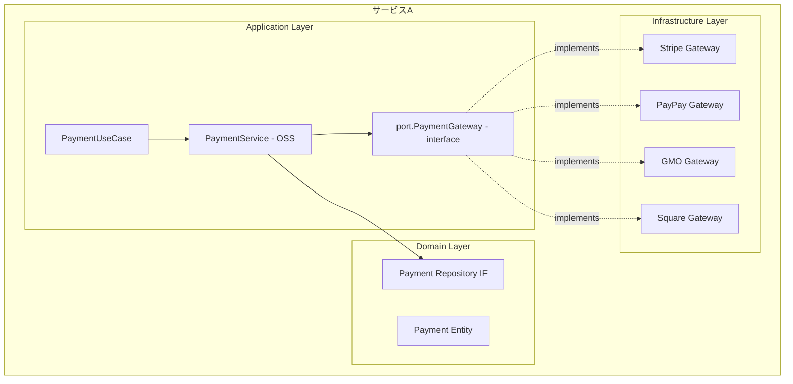
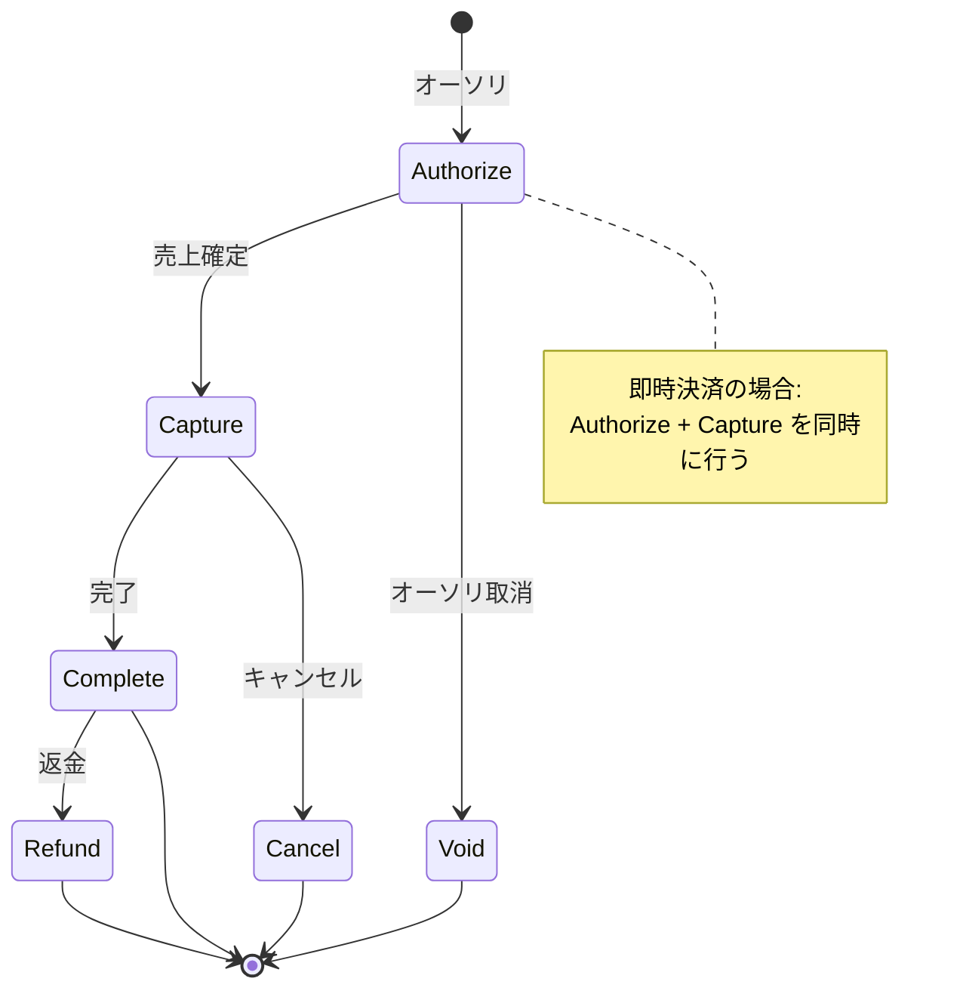
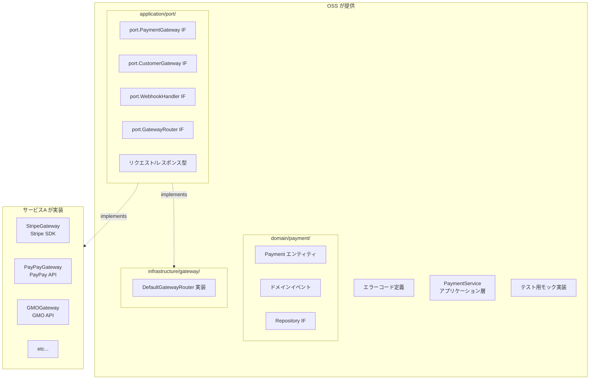

# Payment Gateway Interface 設計

## 1. 概要

決済サービス（Stripe, PayPay, GMO, Square等）に依存しない抽象化レイヤーを提供する。



### パッケージ配置方針

| パッケージ | 配置するもの | 根拠 |
|-----------|-------------|------|
| `domain/payment/` | Payment エンティティ、ドメインイベント、Repository IF | 純粋なドメイン概念のみ |
| `application/port/` | PaymentGateway IF, CustomerGateway IF, WebhookHandler IF, GatewayRouter IF, リクエスト/レスポンス型 | 外部決済サービスとの統合境界（ポート） |
| `infrastructure/gateway/` | DefaultGatewayRouter, 各ゲートウェイ実装 | 具象実装（アダプタ） |

> `docs/architecture.md` の「Domain層は外部依存なし」原則に準拠するため、
> HTTP ヘッダー・リダイレクト URL・生レスポンスバイト列等のインフラ詳細を
> `domain/payment/` から `application/port/` に移動した。

---

## 2. 決済の種類と対応範囲

### 2.1 決済方法

| 決済方法 | 説明 | 対応 |
|----------|------|------|
| クレジットカード | Visa, Master, JCB等 | ✅ |
| デビットカード | 即時引落 | ✅ |
| 銀行振込 | 振込依頼→入金確認 | ✅ |
| コンビニ払い | 払込票/バーコード | ✅ |
| QRコード決済 | PayPay, LINE Pay等 | ✅ |
| キャリア決済 | docomo, au, SoftBank | ✅ |
| 後払い | Paidy, NP後払い等 | ✅ |
| 口座振替 | 定期引落 | ✅ |

### 2.2 決済フロー



---

## 3. コアインターフェース

### 3.1 PaymentGateway（メインインターフェース）

```go
// application/port/gateway.go
package port

import (
    "context"
    "time"

    "github.com/contract-to-cash/core/domain/shared"
)

// PaymentGateway 決済ゲートウェイインターフェース
// 各決済サービス（Stripe, PayPay等）はこのインターフェースを実装する
// 旧 domain/payment/gateway.go から application/port/ に移動
type PaymentGateway interface {
    // ============================================================
    // 基本情報
    // ============================================================
    
    // ゲートウェイ識別子（例: "stripe", "paypay", "gmo"）
    ID() string
    
    // サポートする決済方法
    SupportedMethods() []PaymentMethodType

    // ============================================================
    // 決済処理
    // ============================================================

    // Charge 即時決済（オーソリ+キャプチャ同時）
    Charge(ctx context.Context, req *ChargeRequest) (*ChargeResponse, error)

    // Authorize オーソリのみ（与信枠確保）
    Authorize(ctx context.Context, req *AuthorizeRequest) (*AuthorizeResponse, error)

    // Capture 売上確定（オーソリ後）
    Capture(ctx context.Context, req *CaptureRequest) (*CaptureResponse, error)

    // Void オーソリ取消
    Void(ctx context.Context, req *VoidRequest) (*VoidResponse, error)

    // Refund 返金
    Refund(ctx context.Context, req *RefundRequest) (*RefundResponse, error)

    // Cancel キャンセル（売上確定後）
    Cancel(ctx context.Context, req *CancelRequest) (*CancelResponse, error)

    // ============================================================
    // 決済状態
    // ============================================================

    // GetTransaction トランザクション詳細取得
    GetTransaction(ctx context.Context, transactionID string) (*Transaction, error)

    // ============================================================
    // 支払い方法管理
    // ============================================================

    // RegisterPaymentMethod 支払い方法登録（カード情報等）
    RegisterPaymentMethod(ctx context.Context, req *RegisterPaymentMethodRequest) (*PaymentMethodDetail, error)

    // DeletePaymentMethod 支払い方法削除
    DeletePaymentMethod(ctx context.Context, paymentMethodID string) error

    // GetPaymentMethod 支払い方法取得
    GetPaymentMethod(ctx context.Context, paymentMethodID string) (*PaymentMethodDetail, error)

    // ListPaymentMethods 支払い方法一覧
    ListPaymentMethods(ctx context.Context, customerID string) ([]*PaymentMethodDetail, error)
}

// ============================================================
// 決済方法タイプ
// ============================================================

type PaymentMethodType string

const (
    PaymentMethodCreditCard     PaymentMethodType = "credit_card"
    PaymentMethodDebitCard      PaymentMethodType = "debit_card"
    PaymentMethodBankTransfer   PaymentMethodType = "bank_transfer"
    PaymentMethodConvenienceStore PaymentMethodType = "convenience_store"
    PaymentMethodQRCode         PaymentMethodType = "qr_code"
    PaymentMethodCarrier        PaymentMethodType = "carrier"        // キャリア決済
    PaymentMethodPostpay        PaymentMethodType = "postpay"        // 後払い
    PaymentMethodDirectDebit    PaymentMethodType = "direct_debit"   // 口座振替
)
```

### 3.2 リクエスト/レスポンス型

```go
// application/port/gateway_types.go
package port

import (
    "time"

    "github.com/contract-to-cash/core/domain/shared"
)

// ============================================================
// Charge（即時決済）
// ============================================================

type ChargeRequest struct {
    // 必須
    Amount      shared.Money
    CustomerID  string           // ゲートウェイ側の顧客ID
    Description string

    // 支払い方法（いずれか必須）
    PaymentMethodID *string      // 登録済みの支払い方法ID
    Token           *string      // ワンタイムトークン（決済GWのJS SDKで取得）

    // オプション
    IdempotencyKey  string       // 冪等性キー
    Metadata        map[string]string
    StatementDescriptor string   // 明細表示名

    // 3Dセキュア
    ThreeDSecure    *ThreeDSecureRequest
}

type ChargeResponse struct {
    TransactionID   string
    Status          TransactionStatus
    Amount          shared.Money
    Fee             *shared.Money    // 決済手数料
    Net             *shared.Money    // 手数料差引後
    PaymentMethodID string
    CreatedAt       time.Time
    Metadata        map[string]string
    // RawResponse []byte は削除（インフラ詳細のため）
    // デバッグ用の生レスポンスはインフラ層の実装側でログに記録する
}

// ============================================================
// Authorize（オーソリ）
// ============================================================

type AuthorizeRequest struct {
    Amount          shared.Money
    CustomerID      string
    PaymentMethodID *string
    Token           *string      // ワンタイムトークン
    IdempotencyKey  string
    Metadata        map[string]string

    // オーソリ有効期限（指定しない場合はゲートウェイのデフォルト）
    ExpiresIn       *time.Duration
}

type AuthorizeResponse struct {
    AuthorizationID string
    TransactionID   string
    Status          TransactionStatus
    Amount          shared.Money
    ExpiresAt       *time.Time
    CreatedAt       time.Time
    Metadata        map[string]string
}

// ============================================================
// Capture（売上確定）
// ============================================================

type CaptureRequest struct {
    AuthorizationID string
    Amount          *shared.Money   // nilの場合はオーソリ全額
    IdempotencyKey  string
    Metadata        map[string]string
}

type CaptureResponse struct {
    TransactionID   string
    AuthorizationID string
    Status          TransactionStatus
    Amount          shared.Money
    Fee             *shared.Money
    Net             *shared.Money
    CapturedAt      time.Time
}

// ============================================================
// Void（オーソリ取消）
// ============================================================

type VoidRequest struct {
    AuthorizationID string
    IdempotencyKey  string
}

type VoidResponse struct {
    AuthorizationID string
    Status          TransactionStatus
    VoidedAt        time.Time
}

// ============================================================
// Refund（返金）
// ============================================================

type RefundRequest struct {
    TransactionID   string
    Amount          *shared.Money   // nilの場合は全額返金
    Reason          RefundReason
    IdempotencyKey  string
    Metadata        map[string]string
}

type RefundReason string

const (
    RefundReasonDuplicate           RefundReason = "duplicate"
    RefundReasonFraudulent          RefundReason = "fraudulent"
    RefundReasonRequestedByCustomer RefundReason = "requested_by_customer"
    RefundReasonOther               RefundReason = "other"
)

type RefundResponse struct {
    RefundID        string
    TransactionID   string
    Status          RefundStatus
    Amount          shared.Money
    Reason          RefundReason
    RefundedAt      time.Time
}

type RefundStatus string

const (
    RefundStatusPending   RefundStatus = "pending"
    RefundStatusSucceeded RefundStatus = "succeeded"
    RefundStatusFailed    RefundStatus = "failed"
    RefundStatusCanceled  RefundStatus = "canceled"
)

// ============================================================
// Cancel（キャンセル）
// ============================================================

type CancelRequest struct {
    TransactionID  string
    IdempotencyKey string
}

type CancelResponse struct {
    TransactionID string
    Status        TransactionStatus
    CanceledAt    time.Time
}

// ============================================================
// Transaction（トランザクション）
// ============================================================

type Transaction struct {
    ID              string
    GatewayID       string            // どのゲートウェイか
    Type            TransactionType
    Status          TransactionStatus
    Amount          shared.Money
    Fee             *shared.Money
    Net             *shared.Money
    CustomerID      string
    PaymentMethodID string
    Description     string
    Metadata        map[string]string
    
    // 関連ID
    AuthorizationID *string
    RefundIDs       []string
    
    // タイムスタンプ
    CreatedAt       time.Time
    UpdatedAt       time.Time
    CapturedAt      *time.Time
    RefundedAt      *time.Time
    
    // エラー情報
    FailureCode     *string
    FailureMessage  *string
}

type TransactionType string

const (
    TransactionTypeCharge       TransactionType = "charge"
    TransactionTypeAuthorize    TransactionType = "authorize"
    TransactionTypeCapture      TransactionType = "capture"
    TransactionTypeRefund       TransactionType = "refund"
    TransactionTypeVoid         TransactionType = "void"
)

type TransactionStatus string

const (
    TransactionStatusPending    TransactionStatus = "pending"
    TransactionStatusAuthorized TransactionStatus = "authorized"
    TransactionStatusCaptured   TransactionStatus = "captured"
    TransactionStatusSucceeded  TransactionStatus = "succeeded"
    TransactionStatusFailed     TransactionStatus = "failed"
    TransactionStatusCanceled   TransactionStatus = "canceled"
    TransactionStatusRefunded   TransactionStatus = "refunded"
    TransactionStatusPartiallyRefunded TransactionStatus = "partially_refunded"
)

// ============================================================
// PaymentMethodDetail（支払い方法詳細 — ポート層）
// ============================================================

type PaymentMethodDetail struct {
    ID          string
    CustomerID  string
    Type        PaymentMethodType
    IsDefault   bool
    CreatedAt   time.Time
    
    // タイプ別詳細（どれか1つが設定される）
    Card        *CardDetails
    BankAccount *BankAccountDetails
    QRCode      *QRCodeDetails
}

type CardDetails struct {
    Brand       CardBrand
    Last4       string
    ExpMonth    int
    ExpYear     int
    Fingerprint string   // カード識別子（重複検知用）
    Country     string
    Funding     string   // credit, debit, prepaid
}

type CardBrand string

const (
    CardBrandVisa       CardBrand = "visa"
    CardBrandMastercard CardBrand = "mastercard"
    CardBrandJCB        CardBrand = "jcb"
    CardBrandAmex       CardBrand = "amex"
    CardBrandDiners     CardBrand = "diners"
    CardBrandDiscover   CardBrand = "discover"
    CardBrandUnknown    CardBrand = "unknown"
)

type BankAccountDetails struct {
    BankName      string
    BankCode      string
    BranchName    string
    BranchCode    string
    AccountType   string  // 普通, 当座
    AccountNumber string  // マスク済み（下4桁等）
    AccountHolder string
}

type QRCodeDetails struct {
    Provider string  // paypay, linepay, etc.
    UserID   string
}

// ============================================================
// セキュリティ方針: カード情報の非通過型設計
// ============================================================
//
// 本ライブラリはPCI DSS SAQ A相当の「非通過型」設計を採用する。
// カード番号・CVC等のセンシティブ情報はサーバーサイドのコードに
// 一切登場しない。
//
// 決済フロー:
//   1. クライアント側で決済GWのJS SDK（Stripe Elements, payjp.js v2,
//      GMO MpToken.js, Square Web Payments SDK等）を使用
//   2. カード情報は決済GWサーバーに直接送信されトークン化
//   3. サーバーにはトークン（またはPaymentMethodID）のみが送信される
//
// CardSource型（カード番号・CVCの直接受信）は意図的に提供しない。
// これにより:
//   - PCI DSSスコープを最小化（SAQ A: 約30要件）
//   - 改正割賦販売法（2018年施行）の非保持化要件に準拠
//   - OSSライブラリ利用者のセキュリティリスクを排除
//
// 参考:
//   - PCI DSS 4.0 要件3.2.2: 認証後のCVC保持は禁止
//   - 改正割賦販売法: PCI DSS非準拠の加盟店は非通過型が義務
//   - Square: カード番号直接送信APIを提供しない設計を採用

// ============================================================
// 3Dセキュア
// ============================================================

// ThreeDSecureRequest は application/port/ に配置
// ReturnURL（リダイレクトURL）はインフラ寄りの概念だが、
// ゲートウェイIF のリクエストパラメータとしてポート層に含める
type ThreeDSecureRequest struct {
    Required    bool
    ReturnURL   string  // 認証後のリダイレクトURL
}

type ThreeDSecureResult struct {
    Status      ThreeDSecureStatus
    RedirectURL *string  // 3DS認証ページURL
}

type ThreeDSecureStatus string

const (
    ThreeDSecureStatusSucceeded       ThreeDSecureStatus = "succeeded"
    ThreeDSecureStatusAttempted       ThreeDSecureStatus = "attempted"
    ThreeDSecureStatusFailed          ThreeDSecureStatus = "failed"
    ThreeDSecureStatusNotSupported    ThreeDSecureStatus = "not_supported"
    ThreeDSecureStatusRequired        ThreeDSecureStatus = "required"
)

// ============================================================
// 支払い方法登録
// ============================================================

type RegisterPaymentMethodRequest struct {
    CustomerID    string
    Type          PaymentMethodType
    SetAsDefault  bool

    // トークン（必須）
    // 決済GWのJS SDKでカード情報/銀行口座情報をトークン化したもの
    Token         string

    // 請求先住所（3Dセキュア等で使用）
    BillingAddress *Address
}

// BankAccountSource は削除。
// 銀行口座情報もトークン化して RegisterPaymentMethodRequest.Token で渡す。
// ゲートウェイ実装が口座振替対応の場合、各GWのJS SDKまたは
// ホスト型フォームで口座情報をトークン化する。

type Address struct {
    PostalCode string
    Country    string
    State      string
    City       string
    Line1      string
    Line2      string
}
```

### 3.3 顧客管理インターフェース

```go
// application/port/customer_gateway.go
package port

import (
    "context"
    "time"
)

// CustomerGateway 顧客管理インターフェース
// 決済ゲートウェイ側の顧客情報を管理
// 旧 domain/payment/customer.go から application/port/ に移動
type CustomerGateway interface {
    // 顧客作成
    CreateCustomer(ctx context.Context, req *CreateCustomerRequest) (*Customer, error)
    
    // 顧客更新
    UpdateCustomer(ctx context.Context, req *UpdateCustomerRequest) (*Customer, error)
    
    // 顧客取得
    GetCustomer(ctx context.Context, customerID string) (*Customer, error)
    
    // 顧客削除
    DeleteCustomer(ctx context.Context, customerID string) error
}

type CreateCustomerRequest struct {
    Email       string
    Name        string
    Description string
    Phone       string
    Address     *Address
    Metadata    map[string]string
    
    // 内部ID（自サービスのAccountIDなど）
    InternalID  string
}

type UpdateCustomerRequest struct {
    CustomerID  string
    Email       *string
    Name        *string
    Description *string
    Phone       *string
    Address     *Address
    Metadata    map[string]string
}

type Customer struct {
    ID          string
    Email       string
    Name        string
    Description string
    Phone       string
    Address     *Address
    Metadata    map[string]string
    CreatedAt   time.Time
    UpdatedAt   time.Time
    
    // 関連する支払い方法
    DefaultPaymentMethodID *string
}
```

### 3.4 Webhookインターフェース

```go
// application/port/webhook.go
package port

import (
    "context"
    "time"

    "github.com/contract-to-cash/core/domain/shared"
)

// WebhookHandler Webhookハンドラインターフェース
// ゲートウェイごとに実装する。署名検証・タイムスタンプ検証・パースを担当。
// 旧 domain/payment/webhook.go から application/port/ に移動
type WebhookHandler interface {
    // ParseAndVerify Webhookリクエストの検証とパースを一括で行う
    // 以下を順に実行する:
    //   1. 署名検証（HMAC-SHA256等、ゲートウェイ固有）
    //   2. タイムスタンプ検証（許容範囲外のイベントを拒否）
    //   3. ペイロードのパース
    ParseAndVerify(ctx context.Context, req *WebhookRequest) (*WebhookEvent, error)
}

// WebhookRequest HTTP Webhookリクエスト
type WebhookRequest struct {
    Headers map[string]string
    Body    []byte
}

// WebhookEvent パース済みWebhookイベント
type WebhookEvent struct {
    ID        string           // イベント一意ID（重複検出に使用）
    Type      WebhookEventType
    CreatedAt time.Time        // イベント発生時刻（UTC必須、タイムスタンプ検証対象）
    Data      WebhookEventData
    RawData   []byte
}

// ============================================================
// Webhook処理サービス（アプリケーション層）
// ============================================================
//
// WebhookHandlerはゲートウェイ固有のパース・検証を担当する。
// 以下の横断的関心事はアプリケーション層の WebhookProcessor が担当する:
//   - タイムスタンプ双方向検証（リプレイ攻撃防止）
//   - イベント重複検出（冪等性保証）
//   - リトライ可能/不可能エラーの分類
//   - Dead Letter Queue（リトライ超過時の追跡）
//
// 設計根拠:
//   - Standard Webhooks仕様に準拠した双方向タイムスタンプ検証
//   - Stripeは最長3日間リトライするため、重複検出TTLは72時間が必要
//   - 決済GWは「2xxか否か」でリトライ判定するため、HTTPステータスの使い分けが重要

// デフォルト値
const (
    DefaultTimestampTolerance = 5 * time.Minute   // Standard Webhooks仕様準拠
    DefaultDeduplicationTTL   = 72 * time.Hour     // Stripeの最大リトライ期間(3日)に合わせる
    DefaultMaxRetries         = 3
    DefaultRetryBackoff       = 1 * time.Second
)

// WebhookProcessor Webhook処理サービス
type WebhookProcessor struct {
    handler      WebhookHandler
    deduplicator WebhookDeduplicator
    dlq          WebhookDeadLetterQueue // nil許容（DLQなしでも動作）
    clock        shared.Clock           // テスト時にタイムスタンプ検証の「現在時刻」を制御
    config       WebhookProcessorConfig
}

// WebhookProcessorConfig Webhook処理設定
type WebhookProcessorConfig struct {
    // TimestampTolerance タイムスタンプの許容範囲（双方向）
    // 過去・未来ともにこの範囲外のイベントを拒否する
    // デフォルト: 5分（Standard Webhooks仕様準拠）
    TimestampTolerance time.Duration

    // DeduplicationTTL 重複検出レコードの保持期間
    // Stripeは最長3日間リトライするため、72時間以上を推奨
    // デフォルト: 72時間
    DeduplicationTTL time.Duration

    // MaxRetries リトライ可能エラー発生時の最大リトライ回数
    // デフォルト: 3
    MaxRetries int

    // RetryBackoff リトライ間隔の基準値（指数バックオフ + ジッター）
    // 実際の間隔: backoff * 2^(attempt-1) + random(0, backoff/10)
    // デフォルト: 1秒
    RetryBackoff time.Duration
}

// ============================================================
// 重複検出インターフェース
// ============================================================

// WebhookDeduplicator イベント重複検出インターフェース
// 利用者がストレージ実装を提供する（Redis SETNX + TTL、RDB UPSERT等）
type WebhookDeduplicator interface {
    // IsDuplicate イベントIDが処理済みかチェックし、未処理なら記録する
    // ttl: レコード保持期間。期限切れ後は自動削除される
    // 原子的に「チェック＆マーク」を行うこと（Redis: SETNX+EXPIRE、RDB: INSERT ON CONFLICT）
    IsDuplicate(ctx context.Context, eventID string, ttl time.Duration) (bool, error)
}

// 推奨ストレージ実装:
//
// Redis（高速・推奨）:
//   SET webhook:{eventID} 1 NX EX {ttl_seconds}
//   → OK: 初回（処理実行）、nil: 重複（スキップ）
//
// RDB（永続・監査対応）:
//   INSERT INTO processed_webhooks (event_id, processed_at, expires_at)
//   VALUES ($1, NOW(), NOW() + $2)
//   ON CONFLICT (event_id) DO NOTHING
//   → affected=1: 初回、affected=0: 重複
//
// ハイブリッド（推奨）:
//   Redis で高速フィルタ（第一防衛線）
//   + RDB で永続記録（監査ログ兼第二防衛線）

// ============================================================
// Dead Letter Queue インターフェース
// ============================================================

// WebhookDeadLetterQueue リトライ超過イベントの記録先
// リトライ上限を超えたイベントを保存し、手動/バッチでの再処理を可能にする
type WebhookDeadLetterQueue interface {
    // Send 処理失敗したイベントをDLQに記録する
    Send(ctx context.Context, entry *WebhookDLQEntry) error
}

// WebhookDLQEntry DLQエントリ
type WebhookDLQEntry struct {
    EventID    string
    EventType  WebhookEventType
    Payload    []byte           // 元のWebhookペイロード
    LastError  string           // 最後のエラーメッセージ
    RetryCount int              // 実行したリトライ回数
    CreatedAt  time.Time        // DLQ投入時刻
}

// ============================================================
// エラー分類
// ============================================================

// WebhookRetryableError リトライ可能なエラーをラップする
// ネットワークエラー、DB一時障害等に使用する
type WebhookRetryableError struct {
    Err error
}

func (e *WebhookRetryableError) Error() string { return e.Err.Error() }
func (e *WebhookRetryableError) Unwrap() error { return e.Err }

// isRetryable エラーがリトライ可能か判定する
// WebhookRetryableError でラップされている場合のみリトライする
// それ以外（ビジネスロジックエラー等）は即座にDLQへ送る
func isRetryable(err error) bool {
    var retryable *WebhookRetryableError
    return errors.As(err, &retryable)
}

// エラー分類ガイド:
//
// リトライ可能（WebhookRetryableErrorでラップ）:
//   - DB接続エラー、タイムアウト
//   - 外部API一時障害（5xx）
//   - Rate Limit（429）
//
// リトライ不可（素のerrorで返す）:
//   - 存在しない顧客ID参照
//   - 不整合なステート遷移
//   - バリデーションエラー

// ============================================================
// Webhook処理メインロジック
// ============================================================

// ProcessWebhook Webhookイベントを安全に処理する
//
// 処理フロー:
//   1. ParseAndVerify（署名検証 + パース）
//   2. タイムスタンプ双方向検証（過去・未来の両方をチェック）
//   3. 重複検出（冪等性保証、TTL付き）
//   4. イベントハンドラ呼び出し（リトライ可能エラーのみリトライ）
//   5. リトライ超過時はDLQに送信
func (p *WebhookProcessor) ProcessWebhook(
    ctx context.Context,
    req *WebhookRequest,
    handler func(ctx context.Context, event *WebhookEvent) error,
) error {
    // 1. パースと署名検証（ゲートウェイ固有）
    event, err := p.handler.ParseAndVerify(ctx, req)
    if err != nil {
        return &WebhookError{Code: WebhookErrVerification, Err: err}
    }

    // 2. タイムスタンプ双方向検証（Standard Webhooks仕様準拠）
    //    過去方向: リプレイ攻撃防止
    //    未来方向: クロックスキュー攻撃防止
    tolerance := p.config.TimestampTolerance
    if tolerance == 0 {
        tolerance = DefaultTimestampTolerance
    }
    now := p.clock.Now()
    diff := now.Sub(event.CreatedAt)
    if diff > tolerance {
        return &WebhookError{
            Code: WebhookErrTimestampTooOld,
            Err:  fmt.Errorf("event %s is %v old (tolerance: %v)", event.ID, diff, tolerance),
        }
    }
    if diff < -tolerance {
        return &WebhookError{
            Code: WebhookErrTimestampTooNew,
            Err:  fmt.Errorf("event %s is %v in the future (tolerance: %v)", event.ID, -diff, tolerance),
        }
    }

    // 3. 重複検出（冪等性保証）
    ttl := p.config.DeduplicationTTL
    if ttl == 0 {
        ttl = DefaultDeduplicationTTL
    }
    isDup, err := p.deduplicator.IsDuplicate(ctx, event.ID, ttl)
    if err != nil {
        return &WebhookError{Code: WebhookErrDeduplicationStorage, Err: err}
    }
    if isDup {
        return nil // 重複イベントは正常応答（HTTP 200）で無視
    }

    // 4. イベント処理（リトライ付き）
    maxRetries := p.config.MaxRetries
    if maxRetries == 0 {
        maxRetries = DefaultMaxRetries
    }
    backoff := p.config.RetryBackoff
    if backoff == 0 {
        backoff = DefaultRetryBackoff
    }

    var lastErr error
    for attempt := 0; attempt <= maxRetries; attempt++ {
        // コンテキストキャンセルチェック
        select {
        case <-ctx.Done():
            return ctx.Err()
        default:
        }

        if attempt > 0 {
            // 指数バックオフ + ジッター（同時大量失敗時のスパイク防止）
            delay := backoff * time.Duration(1<<uint(attempt-1))
            jitter := time.Duration(rand.Intn(int(delay / 10))) // 10%ジッター
            time.Sleep(delay + jitter)
        }

        if err := handler(ctx, event); err != nil {
            lastErr = err
            // リトライ不可能なエラーは即座に中断
            if !isRetryable(err) {
                break
            }
            continue
        }
        return nil // 処理成功
    }

    // 5. リトライ超過 or 非リトライエラー → DLQに送信
    //    DLQ送信失敗はログ出力するが、呼び出し元にはProcessingFailedを返す
    if p.dlq != nil {
        if dlqErr := p.dlq.Send(ctx, &WebhookDLQEntry{
            EventID:    event.ID,
            EventType:  event.Type,
            Payload:    event.RawData,
            LastError:  lastErr.Error(),
            RetryCount: maxRetries,
            CreatedAt:  p.clock.Now(),
        }); dlqErr != nil {
            // DLQ送信失敗は致命的ではないが、必ずログに記録する
            // 実装時: log.Error("failed to send to DLQ", "event_id", event.ID, "error", dlqErr)
        }
    }
    return &WebhookError{
        Code: WebhookErrProcessingFailed,
        Err:  fmt.Errorf("after %d attempts: %w", maxRetries+1, lastErr),
    }
}

// ============================================================
// Webhookエラー型とHTTPステータスマッピング
// ============================================================

// WebhookErrorCode Webhookエラーコード
type WebhookErrorCode string

const (
    WebhookErrVerification    WebhookErrorCode = "verification_failed"
    WebhookErrTimestampTooOld WebhookErrorCode = "timestamp_too_old"
    WebhookErrTimestampTooNew WebhookErrorCode = "timestamp_too_new"
    WebhookErrDeduplicationStorage   WebhookErrorCode = "deduplication_failed"
    WebhookErrProcessingFailed WebhookErrorCode = "processing_failed"
)

// WebhookError Webhook処理エラー
type WebhookError struct {
    Code WebhookErrorCode
    Err  error
}

func (e *WebhookError) Error() string { return fmt.Sprintf("[%s] %s", e.Code, e.Err) }
func (e *WebhookError) Unwrap() error { return e.Err }

// MapWebhookErrorToHTTP WebhookエラーをHTTPステータスコードに変換する
//
// 決済GWは「2xxか否か」でリトライ判定するため注意:
//   - リトライさせたい障害 → 503を返す（GW側がリトライする）
//   - リトライさせたくないエラー → 200を返す（内部でDLQ/アラート対応）
//
// | 状況                        | HTTPステータス | GW側の挙動    | 備考                    |
// |----------------------------|-------------|------------|------------------------|
// | 処理成功                     | 200         | リトライしない | —                      |
// | 重複イベント（正常系）          | 200         | リトライしない | ProcessWebhookがnil返却  |
// | 非リトライエラー（DLQ行き）     | 200         | リトライしない | DLQで追跡               |
// | 署名検証失敗                  | 401         | リトライする  | 不正リクエスト             |
// | タイムスタンプ範囲外            | 400         | リトライする  | リプレイ攻撃 or クロックスキュー |
// | 重複検出ストレージ障害          | 503         | リトライする  | Redis/DB一時障害         |
// | リトライ可能な内部エラー         | 503         | リトライする  | ※ProcessWebhook内で処理済 |
//
// ※タイムスタンプ範囲外はリトライしても同じ結果になるが、
//   400を返すことでGW側のダッシュボードに明確なエラーを表示させる
func MapWebhookErrorToHTTP(err error) int {
    var webhookErr *WebhookError
    if !errors.As(err, &webhookErr) {
        return 500 // 想定外エラー
    }
    switch webhookErr.Code {
    case WebhookErrVerification:
        return 401
    case WebhookErrTimestampTooOld, WebhookErrTimestampTooNew:
        return 400
    case WebhookErrDeduplicationStorage:
        return 503 // ストレージ障害 → GW側にリトライさせる
    case WebhookErrProcessingFailed:
        return 200 // DLQに送信済み → GW側のリトライは不要
    default:
        return 500
    }
}

type WebhookEventType string

const (
    // 決済イベント
    WebhookEventPaymentSucceeded      WebhookEventType = "payment.succeeded"
    WebhookEventPaymentFailed         WebhookEventType = "payment.failed"
    WebhookEventPaymentPending        WebhookEventType = "payment.pending"
    
    // 返金イベント
    WebhookEventRefundSucceeded       WebhookEventType = "refund.succeeded"
    WebhookEventRefundFailed          WebhookEventType = "refund.failed"
    
    // チャージバック
    WebhookEventChargebackCreated     WebhookEventType = "chargeback.created"
    WebhookEventChargebackUpdated     WebhookEventType = "chargeback.updated"
    WebhookEventChargebackClosed      WebhookEventType = "chargeback.closed"
    
    // 支払い方法
    WebhookEventPaymentMethodAttached WebhookEventType = "payment_method.attached"
    WebhookEventPaymentMethodDetached WebhookEventType = "payment_method.detached"
    WebhookEventPaymentMethodExpiring WebhookEventType = "payment_method.expiring"
    
    // サブスクリプション（ゲートウェイ側で管理する場合）
    WebhookEventSubscriptionCreated   WebhookEventType = "subscription.created"
    WebhookEventSubscriptionUpdated   WebhookEventType = "subscription.updated"
    WebhookEventSubscriptionCanceled  WebhookEventType = "subscription.canceled"
    
    // 銀行振込・コンビニ払い
    WebhookEventPaymentInstructionCreated WebhookEventType = "payment_instruction.created"
    WebhookEventPaymentReceived       WebhookEventType = "payment.received"
)

// WebhookEventData イベントデータ（型アサーションで使用）
type WebhookEventData interface {
    EventType() WebhookEventType
}

// 各イベントのデータ型
type PaymentSucceededData struct {
    TransactionID   string
    Amount          shared.Money
    CustomerID      string
    PaymentMethodID string
}

func (d PaymentSucceededData) EventType() WebhookEventType {
    return WebhookEventPaymentSucceeded
}

type ChargebackData struct {
    ChargebackID    string
    TransactionID   string
    Amount          shared.Money
    Reason          string
    Status          string
    Evidence        *ChargebackEvidence
}

func (d ChargebackData) EventType() WebhookEventType {
    return WebhookEventChargebackCreated
}

type ChargebackEvidence struct {
    DueBy           time.Time
    SubmittedAt     *time.Time
    HasEvidence     bool
}
```

### 3.5 定期課金インターフェース（オプション）

```go
// domain/payment/subscription_gateway.go
package payment

import (
    "context"
    "time"
)

// SubscriptionGateway 定期課金管理インターフェース
// ゲートウェイ側でサブスクリプションを管理する場合に使用
// （自前で管理する場合は不要）
type SubscriptionGateway interface {
    // サブスクリプション作成
    CreateSubscription(ctx context.Context, req *CreateSubscriptionRequest) (*Subscription, error)
    
    // サブスクリプション更新
    UpdateSubscription(ctx context.Context, req *UpdateSubscriptionRequest) (*Subscription, error)
    
    // サブスクリプションキャンセル
    CancelSubscription(ctx context.Context, subscriptionID string, cancelAtPeriodEnd bool) (*Subscription, error)
    
    // サブスクリプション取得
    GetSubscription(ctx context.Context, subscriptionID string) (*Subscription, error)
    
    // サブスクリプション一覧
    ListSubscriptions(ctx context.Context, customerID string) ([]*Subscription, error)
}

type CreateSubscriptionRequest struct {
    CustomerID        string
    PriceID           string           // ゲートウェイ側の価格ID
    PaymentMethodID   *string
    BillingCycleAnchor *time.Time
    TrialEnd          *time.Time
    Metadata          map[string]string
}

type UpdateSubscriptionRequest struct {
    SubscriptionID    string
    PriceID           *string
    PaymentMethodID   *string
    CancelAtPeriodEnd *bool
    Metadata          map[string]string
}

type Subscription struct {
    ID                string
    CustomerID        string
    Status            SubscriptionStatus
    PriceID           string
    Amount            shared.Money
    Interval          string
    IntervalCount     int
    CurrentPeriodStart time.Time
    CurrentPeriodEnd  time.Time
    TrialStart        *time.Time
    TrialEnd          *time.Time
    CancelAt          *time.Time
    CanceledAt        *time.Time
    EndedAt           *time.Time
    CreatedAt         time.Time
}

type SubscriptionStatus string

const (
    SubscriptionStatusTrialing       SubscriptionStatus = "trialing"
    SubscriptionStatusActive         SubscriptionStatus = "active"
    SubscriptionStatusPastDue        SubscriptionStatus = "past_due"
    SubscriptionStatusCanceled       SubscriptionStatus = "canceled"
    SubscriptionStatusUnpaid         SubscriptionStatus = "unpaid"
    SubscriptionStatusIncomplete     SubscriptionStatus = "incomplete"
    SubscriptionStatusIncompleteExpired SubscriptionStatus = "incomplete_expired"
)
```

---

## 4. エラー定義

```go
// domain/payment/errors.go
package payment

import "errors"

// 決済エラーコード
type ErrorCode string

const (
    // カード関連
    ErrorCodeCardDeclined         ErrorCode = "card_declined"
    ErrorCodeCardExpired          ErrorCode = "card_expired"
    ErrorCodeCardInsufficientFunds ErrorCode = "insufficient_funds"
    ErrorCodeCardInvalidNumber    ErrorCode = "invalid_card_number"
    ErrorCodeCardInvalidCVC       ErrorCode = "invalid_cvc"
    ErrorCodeCardInvalidExpiry    ErrorCode = "invalid_expiry"
    ErrorCodeCardLost             ErrorCode = "card_lost"
    ErrorCodeCardStolen           ErrorCode = "card_stolen"
    
    // 認証関連
    ErrorCodeAuthenticationRequired ErrorCode = "authentication_required"
    ErrorCodeAuthenticationFailed   ErrorCode = "authentication_failed"
    
    // 処理関連
    ErrorCodeDuplicateTransaction ErrorCode = "duplicate_transaction"
    ErrorCodeTransactionNotFound  ErrorCode = "transaction_not_found"
    ErrorCodeInvalidAmount        ErrorCode = "invalid_amount"
    ErrorCodeCurrencyNotSupported ErrorCode = "currency_not_supported"
    ErrorCodeRateLimitExceeded    ErrorCode = "rate_limit_exceeded"
    
    // ゲートウェイ関連
    ErrorCodeGatewayError         ErrorCode = "gateway_error"
    ErrorCodeGatewayTimeout       ErrorCode = "gateway_timeout"
    ErrorCodeGatewayUnavailable   ErrorCode = "gateway_unavailable"
    
    // その他
    ErrorCodeUnknown              ErrorCode = "unknown"
)

// GatewayError 決済ゲートウェイエラー
type GatewayError struct {
    Code           ErrorCode
    Message        string
    DeclineCode    *string           // ゲートウェイ固有の拒否コード
    Param          *string           // エラーの原因となったパラメータ
    Retryable      bool              // リトライ可能か
    RawError       error             // 元のエラー
}

func (e *GatewayError) Error() string {
    return e.Message
}

func (e *GatewayError) Unwrap() error {
    return e.RawError
}

// NewGatewayError ゲートウェイエラー生成
func NewGatewayError(code ErrorCode, message string) *GatewayError {
    return &GatewayError{
        Code:      code,
        Message:   message,
        Retryable: isRetryableCode(code),
    }
}

func isRetryableCode(code ErrorCode) bool {
    switch code {
    case ErrorCodeGatewayError, ErrorCodeGatewayTimeout, ErrorCodeRateLimitExceeded:
        return true
    default:
        return false
    }
}

// よく使うエラー
var (
    ErrCardDeclined         = NewGatewayError(ErrorCodeCardDeclined, "card was declined")
    ErrInsufficientFunds    = NewGatewayError(ErrorCodeCardInsufficientFunds, "insufficient funds")
    ErrAuthenticationRequired = NewGatewayError(ErrorCodeAuthenticationRequired, "authentication required")
    ErrTransactionNotFound  = NewGatewayError(ErrorCodeTransactionNotFound, "transaction not found")
)
```

---

## 5. 複合ゲートウェイ（ルーティング）

複数の決済ゲートウェイを使い分けるためのルーター。

### 5.1 GatewayRouter インターフェース（ポート層）

```go
// application/port/gateway_router.go
package port

import (
    "context"

    "github.com/contract-to-cash/core/domain/shared"
)

// GatewayRouter 決済ゲートウェイルーター
// 条件に応じて適切なゲートウェイを選択
// 旧 domain/payment/router.go から application/port/ に移動
type GatewayRouter interface {
    // 条件に基づいてゲートウェイを選択
    Route(ctx context.Context, criteria *RoutingCriteria) (PaymentGateway, error)

    // ゲートウェイ登録
    Register(gateway PaymentGateway, rules []RoutingRule)

    // フォールバック設定
    SetFallback(gateway PaymentGateway)
}

type RoutingCriteria struct {
    PaymentMethodType PaymentMethodType
    Amount            shared.Money
    CustomerCountry   string
    Metadata          map[string]string
}

type RoutingRule struct {
    // マッチ条件（nilは任意）
    PaymentMethodTypes []PaymentMethodType
    MinAmount          *shared.Money
    MaxAmount          *shared.Money
    Countries          []string

    // 優先度（高いほど優先）
    Priority           int
}
```

### 5.2 DefaultGatewayRouter 具象実装（インフラ層）

```go
// infrastructure/gateway/router.go
package gateway

import (
    "context"
    "errors"

    "github.com/contract-to-cash/core/application/port"
)

// DefaultGatewayRouter デフォルト実装
// 旧 domain/payment/router.go の実装部分を infrastructure/ に移動
type DefaultGatewayRouter struct {
    gateways map[string]gatewayWithRules
    fallback port.PaymentGateway
}

type gatewayWithRules struct {
    gateway port.PaymentGateway
    rules   []port.RoutingRule
}

func NewGatewayRouter() *DefaultGatewayRouter {
    return &DefaultGatewayRouter{
        gateways: make(map[string]gatewayWithRules),
    }
}

func (r *DefaultGatewayRouter) Register(gw port.PaymentGateway, rules []port.RoutingRule) {
    r.gateways[gw.ID()] = gatewayWithRules{
        gateway: gw,
        rules:   rules,
    }
}

func (r *DefaultGatewayRouter) SetFallback(gw port.PaymentGateway) {
    r.fallback = gw
}

func (r *DefaultGatewayRouter) Route(ctx context.Context, criteria *port.RoutingCriteria) (port.PaymentGateway, error) {
    var bestMatch port.PaymentGateway
    var bestPriority int = -1

    for _, gw := range r.gateways {
        for _, rule := range gw.rules {
            if r.matches(rule, criteria) && rule.Priority > bestPriority {
                bestMatch = gw.gateway
                bestPriority = rule.Priority
            }
        }
    }

    if bestMatch != nil {
        return bestMatch, nil
    }

    if r.fallback != nil {
        return r.fallback, nil
    }

    return nil, errors.New("no gateway available for criteria")
}

func (r *DefaultGatewayRouter) matches(rule port.RoutingRule, criteria *port.RoutingCriteria) bool {
    // PaymentMethodType チェック
    if len(rule.PaymentMethodTypes) > 0 {
        found := false
        for _, t := range rule.PaymentMethodTypes {
            if t == criteria.PaymentMethodType {
                found = true
                break
            }
        }
        if !found {
            return false
        }
    }

    // 金額チェック（big.Rat の比較は Cmp を使用）
    if rule.MinAmount != nil && criteria.Amount.Amount().Cmp(rule.MinAmount.Amount()) < 0 {
        return false
    }
    if rule.MaxAmount != nil && criteria.Amount.Amount().Cmp(rule.MaxAmount.Amount()) > 0 {
        return false
    }

    // 国チェック
    if len(rule.Countries) > 0 {
        found := false
        for _, c := range rule.Countries {
            if c == criteria.CustomerCountry {
                found = true
                break
            }
        }
        if !found {
            return false
        }
    }

    return true
}
```

---

## 6. 決済サービス（アプリケーション層）

```go
// application/service/payment_service.go
package service

import (
    "context"
    "time"

    "github.com/contract-to-cash/core/application/port"
    "github.com/contract-to-cash/core/domain/invoice"
    "github.com/contract-to-cash/core/domain/payment"
    "github.com/contract-to-cash/core/domain/shared"
    "github.com/contract-to-cash/core/eventstore"
    "github.com/contract-to-cash/core/plugin"
)

// PaymentService 決済サービス
type PaymentService struct {
    gateway        port.PaymentGateway    // 旧 payment.Gateway → port.PaymentGateway
    paymentRepo    payment.Repository
    invoiceRepo    invoice.Repository
    eventStore     eventstore.Store
    pluginRegistry *plugin.Registry
    clock          shared.Clock
}

func NewPaymentService(
    gateway payment.Gateway,
    paymentRepo payment.Repository,
    invoiceRepo invoice.Repository,
    eventStore eventstore.Store,
    pluginRegistry *plugin.Registry,
) *PaymentService {
    return &PaymentService{
        gateway:        gateway,
        paymentRepo:    paymentRepo,
        invoiceRepo:    invoiceRepo,
        eventStore:     eventStore,
        pluginRegistry: pluginRegistry,
    }
}

// ProcessPayment 請求書の支払いを処理
func (s *PaymentService) ProcessPayment(
    ctx context.Context,
    invoiceID shared.InvoiceID,
    input ProcessPaymentInput,
) (*payment.Payment, error) {
    // 1. 請求書取得
    inv, err := s.invoiceRepo.FindByID(ctx, invoiceID)
    if err != nil {
        return nil, err
    }

    // 2. 支払い金額決定
    amount := inv.Total()
    if input.Amount != nil {
        amount = *input.Amount  // 一部支払い
    }

    // 3. プラグインフック: BeforeCharge（ISP分離後のIF）
    pluginCtx := plugin.NewContext(ctx)
    for _, hook := range s.pluginRegistry.GetBeforeChargeHooks() {
        if err := hook.BeforeCharge(pluginCtx, amount); err != nil {
            return nil, err
        }
    }

    // 4. 決済実行
    chargeReq := &payment.ChargeRequest{
        Amount:          amount,
        CustomerID:      input.CustomerID,
        PaymentMethodID: &input.PaymentMethodID,
        IdempotencyKey:  input.IdempotencyKey,
        Description:     "Invoice: " + invoiceID.String(),
        Metadata: map[string]string{
            "invoice_id": invoiceID.String(),
        },
    }

    chargeResp, err := s.gateway.Charge(ctx, chargeReq)
    if err != nil {
        // 失敗時のプラグインフック（ISP分離後のIF）
        for _, hook := range s.pluginRegistry.GetOnPaymentFailedHooks() {
            hook.OnPaymentFailed(pluginCtx, nil, err) // Payment未生成のためnil
        }
        return nil, err
    }

    // 5. 支払い記録作成
    p := payment.NewPayment(
        invoiceID,
        amount,
        input.PaymentMethodID,
        chargeResp.TransactionID,
    )
    p.MarkCompleted(chargeResp.TransactionID)

    if err := s.paymentRepo.Save(ctx, p); err != nil {
        return nil, err
    }

    // 6. 請求書に支払い反映
    if err := inv.RecordPayment(amount); err != nil {
        return nil, err
    }
    if err := s.invoiceRepo.Save(ctx, inv); err != nil {
        return nil, err
    }

    // 7. イベント発行（event-sourcing.md の Event 構造体に準拠）
    eventData, _ := json.Marshal(p)
    event := eventstore.Event{
        ID:            shared.NewID(),
        StreamID:      p.ID().String(),
        Type:          string(payment.EventTypePaymentCompleted),
        Version:       1,
        SchemaVersion: 1,
        Data:          eventData,
        Metadata:      eventstore.EventMetadata{},
        OccurredAt:    s.clock.Now(),
    }
    s.eventStore.Append(ctx, p.ID().String(), []eventstore.Event{event}, 0)

    // 8. プラグインフック: AfterCharge（ISP分離後のIF）
    for _, hook := range s.pluginRegistry.GetAfterChargeHooks() {
        hook.AfterCharge(pluginCtx, p)
    }

    return p, nil
}

type ProcessPaymentInput struct {
    CustomerID      string
    PaymentMethodID string
    Amount          *shared.Money  // nil = 全額
    IdempotencyKey  string
    Metadata        map[string]string
}

// Refund 返金処理
func (s *PaymentService) Refund(
    ctx context.Context,
    paymentID shared.PaymentID,
    input RefundInput,
) (*payment.RefundResponse, error) {
    // 1. 支払い記録取得
    p, err := s.paymentRepo.FindByID(ctx, paymentID)
    if err != nil {
        return nil, err
    }

    // 2. 返金リクエスト
    refundReq := &payment.RefundRequest{
        TransactionID:  p.ExternalTransactionID(),
        Amount:         input.Amount,
        Reason:         input.Reason,
        IdempotencyKey: input.IdempotencyKey,
    }

    refundResp, err := s.gateway.Refund(ctx, refundReq)
    if err != nil {
        return nil, err
    }

    // 3. 状態更新
    p.MarkRefunded(refundResp.Amount)
    if err := s.paymentRepo.Save(ctx, p); err != nil {
        return nil, err
    }

    // 4. イベント発行
    // ...

    return refundResp, nil
}

type RefundInput struct {
    Amount         *shared.Money
    Reason         payment.RefundReason
    IdempotencyKey string
}
```

---

## 7. ディレクトリ構成（決済追加後）

```
github.com/contract-to-cash/core/
├── domain/
│   ├── contract/
│   ├── invoice/
│   ├── payment/
│   │   ├── entity.go           # Payment エンティティ
│   │   ├── repository.go       # Payment リポジトリIF
│   │   ├── gateway.go          # ★ Gateway インターフェース
│   │   ├── gateway_types.go    # ★ リクエスト/レスポンス型
│   │   ├── customer.go         # ★ CustomerGateway IF
│   │   ├── webhook.go          # ★ Webhook IF
│   │   ├── subscription_gateway.go  # ★ 定期課金IF（オプション）
│   │   ├── router.go           # ★ Gateway ルーター
│   │   ├── errors.go           # ★ エラー定義
│   │   └── events.go
│   ├── usage/
│   └── shared/
│
├── application/
│   └── service/
│       ├── billing_service.go
│       ├── payment_service.go  # ★ 決済サービス
│       └── subscription_service.go
│
├── plugin/
│
├── eventstore/
│
├── plugins/
│   └── coupon/
│
└── infrastructure/             # 参照実装（オプション）
    ├── gateway/
    │   ├── stripe/             # Stripe実装例
    │   │   ├── gateway.go
    │   │   ├── customer.go
    │   │   └── webhook.go
    │   └── mock/               # テスト用モック
    │       └── gateway.go
    └── postgres/
```

---

## 8. サービスAでの実装例（Stripe）

```go
// サービスA: internal/infrastructure/gateway/stripe/gateway.go
package stripe

import (
    "context"

    "github.com/stripe/stripe-go/v76"
    "github.com/stripe/stripe-go/v76/charge"
    "github.com/stripe/stripe-go/v76/paymentintent"
    "github.com/stripe/stripe-go/v76/refund"

    "github.com/contract-to-cash/core/domain/payment"
    "github.com/contract-to-cash/core/domain/shared"
)

// Gateway Stripe決済ゲートウェイ実装
type Gateway struct {
    apiKey string
}

func NewGateway(apiKey string) *Gateway {
    stripe.Key = apiKey
    return &Gateway{apiKey: apiKey}
}

func (g *Gateway) ID() string { return "stripe" }

func (g *Gateway) SupportedMethods() []payment.PaymentMethodType {
    return []payment.PaymentMethodType{
        payment.PaymentMethodCreditCard,
        payment.PaymentMethodDebitCard,
    }
}

func (g *Gateway) Charge(ctx context.Context, req *payment.ChargeRequest) (*payment.ChargeResponse, error) {
    params := &stripe.PaymentIntentParams{
        Amount:   stripe.Int64(req.Amount.Amount()),
        Currency: stripe.String(string(req.Amount.Currency())),
        Customer: stripe.String(req.CustomerID),
        Confirm:  stripe.Bool(true),
    }

    if req.PaymentMethodID != nil {
        params.PaymentMethod = req.PaymentMethodID
    }

    if req.IdempotencyKey != "" {
        params.SetIdempotencyKey(req.IdempotencyKey)
    }

    // メタデータ
    for k, v := range req.Metadata {
        params.AddMetadata(k, v)
    }

    pi, err := paymentintent.New(params)
    if err != nil {
        return nil, g.convertError(err)
    }

    return &payment.ChargeResponse{
        TransactionID:   pi.ID,
        Status:          g.convertStatus(pi.Status),
        Amount:          req.Amount,
        PaymentMethodID: pi.PaymentMethod.ID,
        CreatedAt:       time.Unix(pi.Created, 0),
        RawResponse:     []byte(pi.LastResponse.RawJSON),
    }, nil
}

func (g *Gateway) Refund(ctx context.Context, req *payment.RefundRequest) (*payment.RefundResponse, error) {
    params := &stripe.RefundParams{
        PaymentIntent: stripe.String(req.TransactionID),
    }

    if req.Amount != nil {
        params.Amount = stripe.Int64(req.Amount.Amount())
    }

    if req.IdempotencyKey != "" {
        params.SetIdempotencyKey(req.IdempotencyKey)
    }

    r, err := refund.New(params)
    if err != nil {
        return nil, g.convertError(err)
    }

    return &payment.RefundResponse{
        RefundID:      r.ID,
        TransactionID: req.TransactionID,
        Status:        payment.RefundStatusSucceeded,
        Amount:        shared.NewMoney(r.Amount, shared.Currency(r.Currency)),
        RefundedAt:    time.Unix(r.Created, 0),
        RawResponse:   []byte(r.LastResponse.RawJSON),
    }, nil
}

// Authorize, Capture, Void, Cancel, GetTransaction... 実装

func (g *Gateway) convertError(err error) error {
    stripeErr, ok := err.(*stripe.Error)
    if !ok {
        return payment.NewGatewayError(payment.ErrorCodeUnknown, err.Error())
    }

    var code payment.ErrorCode
    switch stripeErr.Code {
    case stripe.ErrorCodeCardDeclined:
        code = payment.ErrorCodeCardDeclined
    case stripe.ErrorCodeExpiredCard:
        code = payment.ErrorCodeCardExpired
    case stripe.ErrorCodeInsufficientFunds:
        code = payment.ErrorCodeCardInsufficientFunds
    default:
        code = payment.ErrorCodeUnknown
    }

    return &payment.GatewayError{
        Code:        code,
        Message:     stripeErr.Msg,
        DeclineCode: &stripeErr.DeclineCode,
        RawError:    err,
    }
}

func (g *Gateway) convertStatus(status stripe.PaymentIntentStatus) payment.TransactionStatus {
    switch status {
    case stripe.PaymentIntentStatusSucceeded:
        return payment.TransactionStatusSucceeded
    case stripe.PaymentIntentStatusProcessing:
        return payment.TransactionStatusPending
    case stripe.PaymentIntentStatusRequiresPaymentMethod:
        return payment.TransactionStatusFailed
    default:
        return payment.TransactionStatusPending
    }
}
```

---

## 9. サービスAでのDI設定

```go
// サービスA: cmd/api/main.go
func main() {
    // ...

    // 決済ゲートウェイ（サービスAがStripeを使う場合）
    stripeGateway := stripe.NewGateway(os.Getenv("STRIPE_API_KEY"))
    
    // または複数ゲートウェイをルーティング
    router := gateway.NewGatewayRouter()
    router.Register(stripeGateway, []port.RoutingRule{
        {PaymentMethodTypes: []port.PaymentMethodType{port.PaymentMethodCreditCard}, Priority: 10},
    })

    paypayGateway := paypay.NewGateway(...)
    router.Register(paypayGateway, []port.RoutingRule{
        {PaymentMethodTypes: []port.PaymentMethodType{port.PaymentMethodQRCode}, Priority: 10},
    })
    
    router.SetFallback(stripeGateway)

    // 決済サービス初期化
    paymentService := service.NewPaymentService(
        router,  // or stripeGateway directly
        paymentRepo,
        invoiceRepo,
        eventStore,
        pluginRegistry,
    )

    // ...
}
```

---

## 10. まとめ


