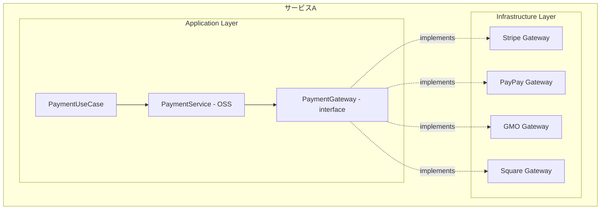
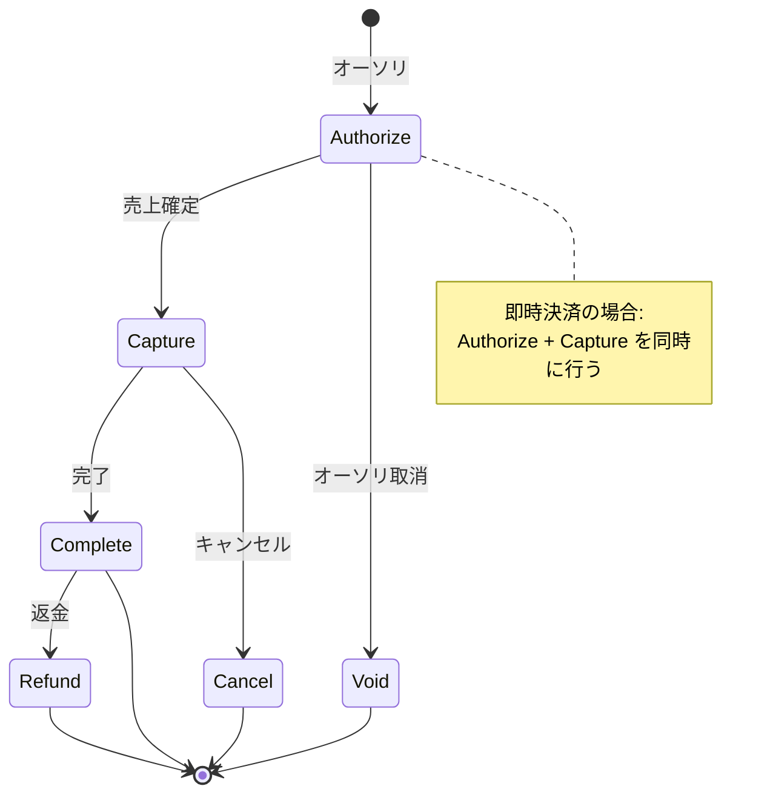
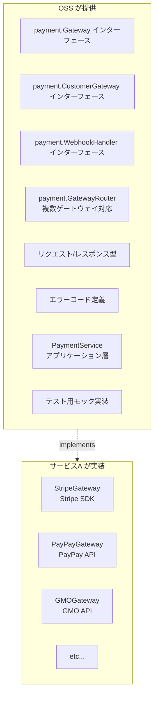

# Payment Gateway Interface 設計

## 1. 概要

決済サービス（Stripe, PayPay, GMO, Square等）に依存しない抽象化レイヤーを提供する。



---

## 2. 決済の種類と対応範囲

### 2.1 決済方法

| 決済方法 | 説明 | 対応 |
|----------|------|------|
| クレジットカード | Visa, Master, JCB等 | ✅ |
| デビットカード | 即時引落 | ✅ |
| 銀行振込 | 振込依頼→入金確認 | ✅ |
| コンビニ払い | 払込票/バーコード | ✅ |
| QRコード決済 | PayPay, LINE Pay等 | ✅ |
| キャリア決済 | docomo, au, SoftBank | ✅ |
| 後払い | Paidy, NP後払い等 | ✅ |
| 口座振替 | 定期引落 | ✅ |

### 2.2 決済フロー



---

## 3. コアインターフェース

### 3.1 PaymentGateway（メインインターフェース）

```go
// domain/payment/gateway.go
package payment

import (
    "context"
    "time"

    "github.com/yourorg/contract-billing-core/domain/shared"
)

// Gateway 決済ゲートウェイインターフェース
// 各決済サービス（Stripe, PayPay等）はこのインターフェースを実装する
type Gateway interface {
    // ============================================================
    // 基本情報
    // ============================================================
    
    // ゲートウェイ識別子（例: "stripe", "paypay", "gmo"）
    ID() string
    
    // サポートする決済方法
    SupportedMethods() []PaymentMethodType

    // ============================================================
    // 決済処理
    // ============================================================

    // Charge 即時決済（オーソリ+キャプチャ同時）
    Charge(ctx context.Context, req *ChargeRequest) (*ChargeResponse, error)

    // Authorize オーソリのみ（与信枠確保）
    Authorize(ctx context.Context, req *AuthorizeRequest) (*AuthorizeResponse, error)

    // Capture 売上確定（オーソリ後）
    Capture(ctx context.Context, req *CaptureRequest) (*CaptureResponse, error)

    // Void オーソリ取消
    Void(ctx context.Context, req *VoidRequest) (*VoidResponse, error)

    // Refund 返金
    Refund(ctx context.Context, req *RefundRequest) (*RefundResponse, error)

    // Cancel キャンセル（売上確定後）
    Cancel(ctx context.Context, req *CancelRequest) (*CancelResponse, error)

    // ============================================================
    // 決済状態
    // ============================================================

    // GetTransaction トランザクション詳細取得
    GetTransaction(ctx context.Context, transactionID string) (*Transaction, error)

    // ============================================================
    // 支払い方法管理
    // ============================================================

    // RegisterPaymentMethod 支払い方法登録（カード情報等）
    RegisterPaymentMethod(ctx context.Context, req *RegisterPaymentMethodRequest) (*PaymentMethod, error)

    // DeletePaymentMethod 支払い方法削除
    DeletePaymentMethod(ctx context.Context, paymentMethodID string) error

    // GetPaymentMethod 支払い方法取得
    GetPaymentMethod(ctx context.Context, paymentMethodID string) (*PaymentMethod, error)

    // ListPaymentMethods 支払い方法一覧
    ListPaymentMethods(ctx context.Context, customerID string) ([]*PaymentMethod, error)
}

// ============================================================
// 決済方法タイプ
// ============================================================

type PaymentMethodType string

const (
    PaymentMethodCreditCard     PaymentMethodType = "credit_card"
    PaymentMethodDebitCard      PaymentMethodType = "debit_card"
    PaymentMethodBankTransfer   PaymentMethodType = "bank_transfer"
    PaymentMethodConvenienceStore PaymentMethodType = "convenience_store"
    PaymentMethodQRCode         PaymentMethodType = "qr_code"
    PaymentMethodCarrier        PaymentMethodType = "carrier"        // キャリア決済
    PaymentMethodPostpay        PaymentMethodType = "postpay"        // 後払い
    PaymentMethodDirectDebit    PaymentMethodType = "direct_debit"   // 口座振替
)
```

### 3.2 リクエスト/レスポンス型

```go
// domain/payment/gateway_types.go
package payment

import (
    "time"

    "github.com/yourorg/contract-billing-core/domain/shared"
)

// ============================================================
// Charge（即時決済）
// ============================================================

type ChargeRequest struct {
    // 必須
    Amount      shared.Money
    CustomerID  string           // ゲートウェイ側の顧客ID
    Description string

    // 支払い方法（どちらか必須）
    PaymentMethodID *string      // 登録済みの支払い方法ID
    PaymentSource   *PaymentSource // 直接指定（カード番号等）

    // オプション
    IdempotencyKey  string       // 冪等性キー
    Metadata        map[string]string
    StatementDescriptor string   // 明細表示名

    // 3Dセキュア
    ThreeDSecure    *ThreeDSecureRequest
}

type ChargeResponse struct {
    TransactionID   string
    Status          TransactionStatus
    Amount          shared.Money
    Fee             *shared.Money    // 決済手数料
    Net             *shared.Money    // 手数料差引後
    PaymentMethodID string
    CreatedAt       time.Time
    Metadata        map[string]string
    RawResponse     []byte           // 生レスポンス（デバッグ用）
}

// ============================================================
// Authorize（オーソリ）
// ============================================================

type AuthorizeRequest struct {
    Amount          shared.Money
    CustomerID      string
    PaymentMethodID *string
    PaymentSource   *PaymentSource
    IdempotencyKey  string
    Metadata        map[string]string
    
    // オーソリ有効期限（指定しない場合はゲートウェイのデフォルト）
    ExpiresIn       *time.Duration
}

type AuthorizeResponse struct {
    AuthorizationID string
    TransactionID   string
    Status          TransactionStatus
    Amount          shared.Money
    ExpiresAt       *time.Time
    CreatedAt       time.Time
    Metadata        map[string]string
    RawResponse     []byte
}

// ============================================================
// Capture（売上確定）
// ============================================================

type CaptureRequest struct {
    AuthorizationID string
    Amount          *shared.Money   // nilの場合はオーソリ全額
    IdempotencyKey  string
    Metadata        map[string]string
}

type CaptureResponse struct {
    TransactionID   string
    AuthorizationID string
    Status          TransactionStatus
    Amount          shared.Money
    Fee             *shared.Money
    Net             *shared.Money
    CapturedAt      time.Time
    RawResponse     []byte
}

// ============================================================
// Void（オーソリ取消）
// ============================================================

type VoidRequest struct {
    AuthorizationID string
    IdempotencyKey  string
}

type VoidResponse struct {
    AuthorizationID string
    Status          TransactionStatus
    VoidedAt        time.Time
    RawResponse     []byte
}

// ============================================================
// Refund（返金）
// ============================================================

type RefundRequest struct {
    TransactionID   string
    Amount          *shared.Money   // nilの場合は全額返金
    Reason          RefundReason
    IdempotencyKey  string
    Metadata        map[string]string
}

type RefundReason string

const (
    RefundReasonDuplicate           RefundReason = "duplicate"
    RefundReasonFraudulent          RefundReason = "fraudulent"
    RefundReasonRequestedByCustomer RefundReason = "requested_by_customer"
    RefundReasonOther               RefundReason = "other"
)

type RefundResponse struct {
    RefundID        string
    TransactionID   string
    Status          RefundStatus
    Amount          shared.Money
    Reason          RefundReason
    RefundedAt      time.Time
    RawResponse     []byte
}

type RefundStatus string

const (
    RefundStatusPending   RefundStatus = "pending"
    RefundStatusSucceeded RefundStatus = "succeeded"
    RefundStatusFailed    RefundStatus = "failed"
    RefundStatusCanceled  RefundStatus = "canceled"
)

// ============================================================
// Cancel（キャンセル）
// ============================================================

type CancelRequest struct {
    TransactionID  string
    IdempotencyKey string
}

type CancelResponse struct {
    TransactionID string
    Status        TransactionStatus
    CanceledAt    time.Time
    RawResponse   []byte
}

// ============================================================
// Transaction（トランザクション）
// ============================================================

type Transaction struct {
    ID              string
    GatewayID       string            // どのゲートウェイか
    Type            TransactionType
    Status          TransactionStatus
    Amount          shared.Money
    Fee             *shared.Money
    Net             *shared.Money
    CustomerID      string
    PaymentMethodID string
    Description     string
    Metadata        map[string]string
    
    // 関連ID
    AuthorizationID *string
    RefundIDs       []string
    
    // タイムスタンプ
    CreatedAt       time.Time
    UpdatedAt       time.Time
    CapturedAt      *time.Time
    RefundedAt      *time.Time
    
    // エラー情報
    FailureCode     *string
    FailureMessage  *string
}

type TransactionType string

const (
    TransactionTypeCharge       TransactionType = "charge"
    TransactionTypeAuthorize    TransactionType = "authorize"
    TransactionTypeCapture      TransactionType = "capture"
    TransactionTypeRefund       TransactionType = "refund"
    TransactionTypeVoid         TransactionType = "void"
)

type TransactionStatus string

const (
    TransactionStatusPending    TransactionStatus = "pending"
    TransactionStatusAuthorized TransactionStatus = "authorized"
    TransactionStatusCaptured   TransactionStatus = "captured"
    TransactionStatusSucceeded  TransactionStatus = "succeeded"
    TransactionStatusFailed     TransactionStatus = "failed"
    TransactionStatusCanceled   TransactionStatus = "canceled"
    TransactionStatusRefunded   TransactionStatus = "refunded"
    TransactionStatusPartiallyRefunded TransactionStatus = "partially_refunded"
)

// ============================================================
// PaymentMethod（支払い方法）
// ============================================================

type PaymentMethod struct {
    ID          string
    CustomerID  string
    Type        PaymentMethodType
    IsDefault   bool
    CreatedAt   time.Time
    
    // タイプ別詳細（どれか1つが設定される）
    Card        *CardDetails
    BankAccount *BankAccountDetails
    QRCode      *QRCodeDetails
}

type CardDetails struct {
    Brand       CardBrand
    Last4       string
    ExpMonth    int
    ExpYear     int
    Fingerprint string   // カード識別子（重複検知用）
    Country     string
    Funding     string   // credit, debit, prepaid
}

type CardBrand string

const (
    CardBrandVisa       CardBrand = "visa"
    CardBrandMastercard CardBrand = "mastercard"
    CardBrandJCB        CardBrand = "jcb"
    CardBrandAmex       CardBrand = "amex"
    CardBrandDiners     CardBrand = "diners"
    CardBrandDiscover   CardBrand = "discover"
    CardBrandUnknown    CardBrand = "unknown"
)

type BankAccountDetails struct {
    BankName      string
    BankCode      string
    BranchName    string
    BranchCode    string
    AccountType   string  // 普通, 当座
    AccountNumber string  // マスク済み（下4桁等）
    AccountHolder string
}

type QRCodeDetails struct {
    Provider string  // paypay, linepay, etc.
    UserID   string
}

// ============================================================
// PaymentSource（直接指定用）
// ============================================================

type PaymentSource struct {
    Type PaymentMethodType
    
    // カード決済の場合
    Card *CardSource
    
    // トークン（ゲートウェイのJS SDKで取得したトークン）
    Token *string
}

type CardSource struct {
    Number   string
    ExpMonth int
    ExpYear  int
    CVC      string
    Name     string  // カード名義
}

// ============================================================
// 3Dセキュア
// ============================================================

type ThreeDSecureRequest struct {
    Required    bool
    ReturnURL   string  // 認証後のリダイレクトURL
}

type ThreeDSecureResult struct {
    Status      ThreeDSecureStatus
    RedirectURL *string  // 3DS認証ページURL
}

type ThreeDSecureStatus string

const (
    ThreeDSecureStatusSucceeded       ThreeDSecureStatus = "succeeded"
    ThreeDSecureStatusAttempted       ThreeDSecureStatus = "attempted"
    ThreeDSecureStatusFailed          ThreeDSecureStatus = "failed"
    ThreeDSecureStatusNotSupported    ThreeDSecureStatus = "not_supported"
    ThreeDSecureStatusRequired        ThreeDSecureStatus = "required"
)

// ============================================================
// 支払い方法登録
// ============================================================

type RegisterPaymentMethodRequest struct {
    CustomerID    string
    Type          PaymentMethodType
    SetAsDefault  bool
    
    // カードの場合
    Card          *CardSource
    Token         *string
    
    // 銀行口座の場合
    BankAccount   *BankAccountSource

    // 請求先住所（3Dセキュア等で使用）
    BillingAddress *Address
}

type BankAccountSource struct {
    BankCode      string
    BranchCode    string
    AccountType   string
    AccountNumber string
    AccountHolder string
}

type Address struct {
    PostalCode string
    Country    string
    State      string
    City       string
    Line1      string
    Line2      string
}
```

### 3.3 顧客管理インターフェース

```go
// domain/payment/customer.go
package payment

import (
    "context"
    "time"
)

// CustomerGateway 顧客管理インターフェース
// 決済ゲートウェイ側の顧客情報を管理
type CustomerGateway interface {
    // 顧客作成
    CreateCustomer(ctx context.Context, req *CreateCustomerRequest) (*Customer, error)
    
    // 顧客更新
    UpdateCustomer(ctx context.Context, req *UpdateCustomerRequest) (*Customer, error)
    
    // 顧客取得
    GetCustomer(ctx context.Context, customerID string) (*Customer, error)
    
    // 顧客削除
    DeleteCustomer(ctx context.Context, customerID string) error
}

type CreateCustomerRequest struct {
    Email       string
    Name        string
    Description string
    Phone       string
    Address     *Address
    Metadata    map[string]string
    
    // 内部ID（自サービスのAccountIDなど）
    InternalID  string
}

type UpdateCustomerRequest struct {
    CustomerID  string
    Email       *string
    Name        *string
    Description *string
    Phone       *string
    Address     *Address
    Metadata    map[string]string
}

type Customer struct {
    ID          string
    Email       string
    Name        string
    Description string
    Phone       string
    Address     *Address
    Metadata    map[string]string
    CreatedAt   time.Time
    UpdatedAt   time.Time
    
    // 関連する支払い方法
    DefaultPaymentMethodID *string
}
```

### 3.4 Webhookインターフェース

```go
// domain/payment/webhook.go
package payment

import (
    "context"
    "time"
)

// WebhookHandler Webhookハンドラインターフェース
type WebhookHandler interface {
    // Webhookイベントをパース・検証
    ParseEvent(ctx context.Context, req *WebhookRequest) (*WebhookEvent, error)
    
    // 署名検証
    VerifySignature(payload []byte, signature string) error
}

type WebhookRequest struct {
    Headers map[string]string
    Body    []byte
}

type WebhookEvent struct {
    ID        string
    Type      WebhookEventType
    CreatedAt time.Time
    Data      WebhookEventData
    RawData   []byte
}

type WebhookEventType string

const (
    // 決済イベント
    WebhookEventPaymentSucceeded      WebhookEventType = "payment.succeeded"
    WebhookEventPaymentFailed         WebhookEventType = "payment.failed"
    WebhookEventPaymentPending        WebhookEventType = "payment.pending"
    
    // 返金イベント
    WebhookEventRefundSucceeded       WebhookEventType = "refund.succeeded"
    WebhookEventRefundFailed          WebhookEventType = "refund.failed"
    
    // チャージバック
    WebhookEventChargebackCreated     WebhookEventType = "chargeback.created"
    WebhookEventChargebackUpdated     WebhookEventType = "chargeback.updated"
    WebhookEventChargebackClosed      WebhookEventType = "chargeback.closed"
    
    // 支払い方法
    WebhookEventPaymentMethodAttached WebhookEventType = "payment_method.attached"
    WebhookEventPaymentMethodDetached WebhookEventType = "payment_method.detached"
    WebhookEventPaymentMethodExpiring WebhookEventType = "payment_method.expiring"
    
    // サブスクリプション（ゲートウェイ側で管理する場合）
    WebhookEventSubscriptionCreated   WebhookEventType = "subscription.created"
    WebhookEventSubscriptionUpdated   WebhookEventType = "subscription.updated"
    WebhookEventSubscriptionCanceled  WebhookEventType = "subscription.canceled"
    
    // 銀行振込・コンビニ払い
    WebhookEventPaymentInstructionCreated WebhookEventType = "payment_instruction.created"
    WebhookEventPaymentReceived       WebhookEventType = "payment.received"
)

// WebhookEventData イベントデータ（型アサーションで使用）
type WebhookEventData interface {
    EventType() WebhookEventType
}

// 各イベントのデータ型
type PaymentSucceededData struct {
    TransactionID   string
    Amount          shared.Money
    CustomerID      string
    PaymentMethodID string
}

func (d PaymentSucceededData) EventType() WebhookEventType {
    return WebhookEventPaymentSucceeded
}

type ChargebackData struct {
    ChargebackID    string
    TransactionID   string
    Amount          shared.Money
    Reason          string
    Status          string
    Evidence        *ChargebackEvidence
}

func (d ChargebackData) EventType() WebhookEventType {
    return WebhookEventChargebackCreated
}

type ChargebackEvidence struct {
    DueBy           time.Time
    SubmittedAt     *time.Time
    HasEvidence     bool
}
```

### 3.5 定期課金インターフェース（オプション）

```go
// domain/payment/subscription_gateway.go
package payment

import (
    "context"
    "time"
)

// SubscriptionGateway 定期課金管理インターフェース
// ゲートウェイ側でサブスクリプションを管理する場合に使用
// （自前で管理する場合は不要）
type SubscriptionGateway interface {
    // サブスクリプション作成
    CreateSubscription(ctx context.Context, req *CreateSubscriptionRequest) (*Subscription, error)
    
    // サブスクリプション更新
    UpdateSubscription(ctx context.Context, req *UpdateSubscriptionRequest) (*Subscription, error)
    
    // サブスクリプションキャンセル
    CancelSubscription(ctx context.Context, subscriptionID string, cancelAtPeriodEnd bool) (*Subscription, error)
    
    // サブスクリプション取得
    GetSubscription(ctx context.Context, subscriptionID string) (*Subscription, error)
    
    // サブスクリプション一覧
    ListSubscriptions(ctx context.Context, customerID string) ([]*Subscription, error)
}

type CreateSubscriptionRequest struct {
    CustomerID        string
    PriceID           string           // ゲートウェイ側の価格ID
    PaymentMethodID   *string
    BillingCycleAnchor *time.Time
    TrialEnd          *time.Time
    Metadata          map[string]string
}

type UpdateSubscriptionRequest struct {
    SubscriptionID    string
    PriceID           *string
    PaymentMethodID   *string
    CancelAtPeriodEnd *bool
    Metadata          map[string]string
}

type Subscription struct {
    ID                string
    CustomerID        string
    Status            SubscriptionStatus
    PriceID           string
    Amount            shared.Money
    Interval          string
    IntervalCount     int
    CurrentPeriodStart time.Time
    CurrentPeriodEnd  time.Time
    TrialStart        *time.Time
    TrialEnd          *time.Time
    CancelAt          *time.Time
    CanceledAt        *time.Time
    EndedAt           *time.Time
    CreatedAt         time.Time
}

type SubscriptionStatus string

const (
    SubscriptionStatusTrialing       SubscriptionStatus = "trialing"
    SubscriptionStatusActive         SubscriptionStatus = "active"
    SubscriptionStatusPastDue        SubscriptionStatus = "past_due"
    SubscriptionStatusCanceled       SubscriptionStatus = "canceled"
    SubscriptionStatusUnpaid         SubscriptionStatus = "unpaid"
    SubscriptionStatusIncomplete     SubscriptionStatus = "incomplete"
    SubscriptionStatusIncompleteExpired SubscriptionStatus = "incomplete_expired"
)
```

---

## 4. エラー定義

```go
// domain/payment/errors.go
package payment

import "errors"

// 決済エラーコード
type ErrorCode string

const (
    // カード関連
    ErrorCodeCardDeclined         ErrorCode = "card_declined"
    ErrorCodeCardExpired          ErrorCode = "card_expired"
    ErrorCodeCardInsufficientFunds ErrorCode = "insufficient_funds"
    ErrorCodeCardInvalidNumber    ErrorCode = "invalid_card_number"
    ErrorCodeCardInvalidCVC       ErrorCode = "invalid_cvc"
    ErrorCodeCardInvalidExpiry    ErrorCode = "invalid_expiry"
    ErrorCodeCardLost             ErrorCode = "card_lost"
    ErrorCodeCardStolen           ErrorCode = "card_stolen"
    
    // 認証関連
    ErrorCodeAuthenticationRequired ErrorCode = "authentication_required"
    ErrorCodeAuthenticationFailed   ErrorCode = "authentication_failed"
    
    // 処理関連
    ErrorCodeDuplicateTransaction ErrorCode = "duplicate_transaction"
    ErrorCodeTransactionNotFound  ErrorCode = "transaction_not_found"
    ErrorCodeInvalidAmount        ErrorCode = "invalid_amount"
    ErrorCodeCurrencyNotSupported ErrorCode = "currency_not_supported"
    ErrorCodeRateLimitExceeded    ErrorCode = "rate_limit_exceeded"
    
    // ゲートウェイ関連
    ErrorCodeGatewayError         ErrorCode = "gateway_error"
    ErrorCodeGatewayTimeout       ErrorCode = "gateway_timeout"
    ErrorCodeGatewayUnavailable   ErrorCode = "gateway_unavailable"
    
    // その他
    ErrorCodeUnknown              ErrorCode = "unknown"
)

// GatewayError 決済ゲートウェイエラー
type GatewayError struct {
    Code           ErrorCode
    Message        string
    DeclineCode    *string           // ゲートウェイ固有の拒否コード
    Param          *string           // エラーの原因となったパラメータ
    Retryable      bool              // リトライ可能か
    RawError       error             // 元のエラー
}

func (e *GatewayError) Error() string {
    return e.Message
}

func (e *GatewayError) Unwrap() error {
    return e.RawError
}

// NewGatewayError ゲートウェイエラー生成
func NewGatewayError(code ErrorCode, message string) *GatewayError {
    return &GatewayError{
        Code:      code,
        Message:   message,
        Retryable: isRetryable(code),
    }
}

func isRetryable(code ErrorCode) bool {
    switch code {
    case ErrorCodeGatewayError, ErrorCodeGatewayTimeout, ErrorCodeRateLimitExceeded:
        return true
    default:
        return false
    }
}

// よく使うエラー
var (
    ErrCardDeclined         = NewGatewayError(ErrorCodeCardDeclined, "card was declined")
    ErrInsufficientFunds    = NewGatewayError(ErrorCodeCardInsufficientFunds, "insufficient funds")
    ErrAuthenticationRequired = NewGatewayError(ErrorCodeAuthenticationRequired, "authentication required")
    ErrTransactionNotFound  = NewGatewayError(ErrorCodeTransactionNotFound, "transaction not found")
)
```

---

## 5. 複合ゲートウェイ（ルーティング）

複数の決済ゲートウェイを使い分けるためのルーター。

```go
// domain/payment/router.go
package payment

import (
    "context"
    "errors"
)

// GatewayRouter 決済ゲートウェイルーター
// 条件に応じて適切なゲートウェイを選択
type GatewayRouter interface {
    // 条件に基づいてゲートウェイを選択
    Route(ctx context.Context, criteria *RoutingCriteria) (Gateway, error)
    
    // ゲートウェイ登録
    Register(gateway Gateway, rules []RoutingRule)
    
    // フォールバック設定
    SetFallback(gateway Gateway)
}

type RoutingCriteria struct {
    PaymentMethodType PaymentMethodType
    Amount            shared.Money
    CustomerCountry   string
    Metadata          map[string]string
}

type RoutingRule struct {
    // マッチ条件（nilは任意）
    PaymentMethodTypes []PaymentMethodType
    MinAmount          *shared.Money
    MaxAmount          *shared.Money
    Countries          []string
    
    // 優先度（高いほど優先）
    Priority           int
}

// DefaultGatewayRouter デフォルト実装
type DefaultGatewayRouter struct {
    gateways map[string]gatewayWithRules
    fallback Gateway
}

type gatewayWithRules struct {
    gateway Gateway
    rules   []RoutingRule
}

func NewGatewayRouter() *DefaultGatewayRouter {
    return &DefaultGatewayRouter{
        gateways: make(map[string]gatewayWithRules),
    }
}

func (r *DefaultGatewayRouter) Register(gateway Gateway, rules []RoutingRule) {
    r.gateways[gateway.ID()] = gatewayWithRules{
        gateway: gateway,
        rules:   rules,
    }
}

func (r *DefaultGatewayRouter) SetFallback(gateway Gateway) {
    r.fallback = gateway
}

func (r *DefaultGatewayRouter) Route(ctx context.Context, criteria *RoutingCriteria) (Gateway, error) {
    var bestMatch Gateway
    var bestPriority int = -1

    for _, gw := range r.gateways {
        for _, rule := range gw.rules {
            if r.matches(rule, criteria) && rule.Priority > bestPriority {
                bestMatch = gw.gateway
                bestPriority = rule.Priority
            }
        }
    }

    if bestMatch != nil {
        return bestMatch, nil
    }

    if r.fallback != nil {
        return r.fallback, nil
    }

    return nil, errors.New("no gateway available for criteria")
}

func (r *DefaultGatewayRouter) matches(rule RoutingRule, criteria *RoutingCriteria) bool {
    // PaymentMethodType チェック
    if len(rule.PaymentMethodTypes) > 0 {
        found := false
        for _, t := range rule.PaymentMethodTypes {
            if t == criteria.PaymentMethodType {
                found = true
                break
            }
        }
        if !found {
            return false
        }
    }

    // 金額チェック
    if rule.MinAmount != nil && criteria.Amount.Amount() < rule.MinAmount.Amount() {
        return false
    }
    if rule.MaxAmount != nil && criteria.Amount.Amount() > rule.MaxAmount.Amount() {
        return false
    }

    // 国チェック
    if len(rule.Countries) > 0 {
        found := false
        for _, c := range rule.Countries {
            if c == criteria.CustomerCountry {
                found = true
                break
            }
        }
        if !found {
            return false
        }
    }

    return true
}
```

---

## 6. 決済サービス（アプリケーション層）

```go
// application/service/payment_service.go
package service

import (
    "context"
    "time"

    "github.com/yourorg/contract-billing-core/domain/invoice"
    "github.com/yourorg/contract-billing-core/domain/payment"
    "github.com/yourorg/contract-billing-core/domain/shared"
    "github.com/yourorg/contract-billing-core/eventstore"
    "github.com/yourorg/contract-billing-core/plugin"
)

// PaymentService 決済サービス
type PaymentService struct {
    gateway        payment.Gateway        // または GatewayRouter
    paymentRepo    payment.Repository
    invoiceRepo    invoice.Repository
    eventStore     eventstore.Store
    pluginRegistry *plugin.Registry
}

func NewPaymentService(
    gateway payment.Gateway,
    paymentRepo payment.Repository,
    invoiceRepo invoice.Repository,
    eventStore eventstore.Store,
    pluginRegistry *plugin.Registry,
) *PaymentService {
    return &PaymentService{
        gateway:        gateway,
        paymentRepo:    paymentRepo,
        invoiceRepo:    invoiceRepo,
        eventStore:     eventStore,
        pluginRegistry: pluginRegistry,
    }
}

// ProcessPayment 請求書の支払いを処理
func (s *PaymentService) ProcessPayment(
    ctx context.Context,
    invoiceID shared.InvoiceID,
    input ProcessPaymentInput,
) (*payment.Payment, error) {
    // 1. 請求書取得
    inv, err := s.invoiceRepo.FindByID(ctx, invoiceID)
    if err != nil {
        return nil, err
    }

    // 2. 支払い金額決定
    amount := inv.Total()
    if input.Amount != nil {
        amount = *input.Amount  // 一部支払い
    }

    // 3. プラグインフック: BeforePayment
    payCtx := &plugin.PaymentContext{
        InvoiceID:     invoiceID,
        Amount:        amount,
        PaymentMethod: input.PaymentMethodID,
        Metadata:      input.Metadata,
    }
    for _, hook := range s.pluginRegistry.GetPaymentHooks() {
        if err := hook.BeforePayment(ctx, payCtx); err != nil {
            return nil, err
        }
    }

    // 4. 決済実行
    chargeReq := &payment.ChargeRequest{
        Amount:          amount,
        CustomerID:      input.CustomerID,
        PaymentMethodID: &input.PaymentMethodID,
        IdempotencyKey:  input.IdempotencyKey,
        Description:     "Invoice: " + invoiceID.String(),
        Metadata: map[string]string{
            "invoice_id": invoiceID.String(),
        },
    }

    chargeResp, err := s.gateway.Charge(ctx, chargeReq)
    if err != nil {
        // 失敗時のプラグインフック
        for _, hook := range s.pluginRegistry.GetPaymentHooks() {
            hook.OnPaymentFailed(ctx, payCtx, err)
        }
        return nil, err
    }

    // 5. 支払い記録作成
    p := payment.NewPayment(
        invoiceID,
        amount,
        input.PaymentMethodID,
        chargeResp.TransactionID,
    )
    p.MarkCompleted(chargeResp.TransactionID)

    if err := s.paymentRepo.Save(ctx, p); err != nil {
        return nil, err
    }

    // 6. 請求書に支払い反映
    if err := inv.RecordPayment(amount); err != nil {
        return nil, err
    }
    if err := s.invoiceRepo.Save(ctx, inv); err != nil {
        return nil, err
    }

    // 7. イベント発行
    event := eventstore.Event{
        ID:            shared.NewID(),
        AggregateID:   p.ID().String(),
        AggregateType: "Payment",
        Type:          "PaymentCompleted",
        Payload:       marshalPayload(p),
        OccurredAt:    time.Now(),
    }
    s.eventStore.Append(ctx, p.ID().String(), []eventstore.Event{event}, 0)

    // 8. プラグインフック: AfterPayment
    result := &plugin.PaymentResult{
        PaymentID:             p.ID(),
        ExternalTransactionID: chargeResp.TransactionID,
        Status:                string(chargeResp.Status),
    }
    for _, hook := range s.pluginRegistry.GetPaymentHooks() {
        hook.AfterPayment(ctx, payCtx, result)
    }

    return p, nil
}

type ProcessPaymentInput struct {
    CustomerID      string
    PaymentMethodID string
    Amount          *shared.Money  // nil = 全額
    IdempotencyKey  string
    Metadata        map[string]string
}

// Refund 返金処理
func (s *PaymentService) Refund(
    ctx context.Context,
    paymentID shared.PaymentID,
    input RefundInput,
) (*payment.RefundResponse, error) {
    // 1. 支払い記録取得
    p, err := s.paymentRepo.FindByID(ctx, paymentID)
    if err != nil {
        return nil, err
    }

    // 2. 返金リクエスト
    refundReq := &payment.RefundRequest{
        TransactionID:  p.ExternalTransactionID(),
        Amount:         input.Amount,
        Reason:         input.Reason,
        IdempotencyKey: input.IdempotencyKey,
    }

    refundResp, err := s.gateway.Refund(ctx, refundReq)
    if err != nil {
        return nil, err
    }

    // 3. 状態更新
    p.MarkRefunded(refundResp.Amount)
    if err := s.paymentRepo.Save(ctx, p); err != nil {
        return nil, err
    }

    // 4. イベント発行
    // ...

    return refundResp, nil
}

type RefundInput struct {
    Amount         *shared.Money
    Reason         payment.RefundReason
    IdempotencyKey string
}
```

---

## 7. ディレクトリ構成（決済追加後）

```
github.com/yourorg/contract-billing-core/
├── domain/
│   ├── contract/
│   ├── invoice/
│   ├── payment/
│   │   ├── entity.go           # Payment エンティティ
│   │   ├── repository.go       # Payment リポジトリIF
│   │   ├── gateway.go          # ★ Gateway インターフェース
│   │   ├── gateway_types.go    # ★ リクエスト/レスポンス型
│   │   ├── customer.go         # ★ CustomerGateway IF
│   │   ├── webhook.go          # ★ Webhook IF
│   │   ├── subscription_gateway.go  # ★ 定期課金IF（オプション）
│   │   ├── router.go           # ★ Gateway ルーター
│   │   ├── errors.go           # ★ エラー定義
│   │   └── events.go
│   ├── usage/
│   └── shared/
│
├── application/
│   └── service/
│       ├── billing_service.go
│       ├── payment_service.go  # ★ 決済サービス
│       └── subscription_service.go
│
├── plugin/
│
├── eventstore/
│
├── plugins/
│   └── coupon/
│
└── infrastructure/             # 参照実装（オプション）
    ├── gateway/
    │   ├── stripe/             # Stripe実装例
    │   │   ├── gateway.go
    │   │   ├── customer.go
    │   │   └── webhook.go
    │   └── mock/               # テスト用モック
    │       └── gateway.go
    └── postgres/
```

---

## 8. サービスAでの実装例（Stripe）

```go
// サービスA: internal/infrastructure/gateway/stripe/gateway.go
package stripe

import (
    "context"

    "github.com/stripe/stripe-go/v76"
    "github.com/stripe/stripe-go/v76/charge"
    "github.com/stripe/stripe-go/v76/paymentintent"
    "github.com/stripe/stripe-go/v76/refund"

    "github.com/yourorg/contract-billing-core/domain/payment"
    "github.com/yourorg/contract-billing-core/domain/shared"
)

// Gateway Stripe決済ゲートウェイ実装
type Gateway struct {
    apiKey string
}

func NewGateway(apiKey string) *Gateway {
    stripe.Key = apiKey
    return &Gateway{apiKey: apiKey}
}

func (g *Gateway) ID() string { return "stripe" }

func (g *Gateway) SupportedMethods() []payment.PaymentMethodType {
    return []payment.PaymentMethodType{
        payment.PaymentMethodCreditCard,
        payment.PaymentMethodDebitCard,
    }
}

func (g *Gateway) Charge(ctx context.Context, req *payment.ChargeRequest) (*payment.ChargeResponse, error) {
    params := &stripe.PaymentIntentParams{
        Amount:   stripe.Int64(req.Amount.Amount()),
        Currency: stripe.String(string(req.Amount.Currency())),
        Customer: stripe.String(req.CustomerID),
        Confirm:  stripe.Bool(true),
    }

    if req.PaymentMethodID != nil {
        params.PaymentMethod = req.PaymentMethodID
    }

    if req.IdempotencyKey != "" {
        params.SetIdempotencyKey(req.IdempotencyKey)
    }

    // メタデータ
    for k, v := range req.Metadata {
        params.AddMetadata(k, v)
    }

    pi, err := paymentintent.New(params)
    if err != nil {
        return nil, g.convertError(err)
    }

    return &payment.ChargeResponse{
        TransactionID:   pi.ID,
        Status:          g.convertStatus(pi.Status),
        Amount:          req.Amount,
        PaymentMethodID: pi.PaymentMethod.ID,
        CreatedAt:       time.Unix(pi.Created, 0),
        RawResponse:     []byte(pi.LastResponse.RawJSON),
    }, nil
}

func (g *Gateway) Refund(ctx context.Context, req *payment.RefundRequest) (*payment.RefundResponse, error) {
    params := &stripe.RefundParams{
        PaymentIntent: stripe.String(req.TransactionID),
    }

    if req.Amount != nil {
        params.Amount = stripe.Int64(req.Amount.Amount())
    }

    if req.IdempotencyKey != "" {
        params.SetIdempotencyKey(req.IdempotencyKey)
    }

    r, err := refund.New(params)
    if err != nil {
        return nil, g.convertError(err)
    }

    return &payment.RefundResponse{
        RefundID:      r.ID,
        TransactionID: req.TransactionID,
        Status:        payment.RefundStatusSucceeded,
        Amount:        shared.NewMoney(r.Amount, shared.Currency(r.Currency)),
        RefundedAt:    time.Unix(r.Created, 0),
        RawResponse:   []byte(r.LastResponse.RawJSON),
    }, nil
}

// Authorize, Capture, Void, Cancel, GetTransaction... 実装

func (g *Gateway) convertError(err error) error {
    stripeErr, ok := err.(*stripe.Error)
    if !ok {
        return payment.NewGatewayError(payment.ErrorCodeUnknown, err.Error())
    }

    var code payment.ErrorCode
    switch stripeErr.Code {
    case stripe.ErrorCodeCardDeclined:
        code = payment.ErrorCodeCardDeclined
    case stripe.ErrorCodeExpiredCard:
        code = payment.ErrorCodeCardExpired
    case stripe.ErrorCodeInsufficientFunds:
        code = payment.ErrorCodeCardInsufficientFunds
    default:
        code = payment.ErrorCodeUnknown
    }

    return &payment.GatewayError{
        Code:        code,
        Message:     stripeErr.Msg,
        DeclineCode: &stripeErr.DeclineCode,
        RawError:    err,
    }
}

func (g *Gateway) convertStatus(status stripe.PaymentIntentStatus) payment.TransactionStatus {
    switch status {
    case stripe.PaymentIntentStatusSucceeded:
        return payment.TransactionStatusSucceeded
    case stripe.PaymentIntentStatusProcessing:
        return payment.TransactionStatusPending
    case stripe.PaymentIntentStatusRequiresPaymentMethod:
        return payment.TransactionStatusFailed
    default:
        return payment.TransactionStatusPending
    }
}
```

---

## 9. サービスAでのDI設定

```go
// サービスA: cmd/api/main.go
func main() {
    // ...

    // 決済ゲートウェイ（サービスAがStripeを使う場合）
    stripeGateway := stripe.NewGateway(os.Getenv("STRIPE_API_KEY"))
    
    // または複数ゲートウェイをルーティング
    router := payment.NewGatewayRouter()
    router.Register(stripeGateway, []payment.RoutingRule{
        {PaymentMethodTypes: []payment.PaymentMethodType{payment.PaymentMethodCreditCard}, Priority: 10},
    })
    
    paypayGateway := paypay.NewGateway(...)
    router.Register(paypayGateway, []payment.RoutingRule{
        {PaymentMethodTypes: []payment.PaymentMethodType{payment.PaymentMethodQRCode}, Priority: 10},
    })
    
    router.SetFallback(stripeGateway)

    // 決済サービス初期化
    paymentService := service.NewPaymentService(
        router,  // or stripeGateway directly
        paymentRepo,
        invoiceRepo,
        eventStore,
        pluginRegistry,
    )

    // ...
}
```

---

## 10. まとめ


