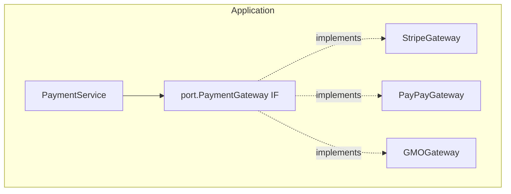
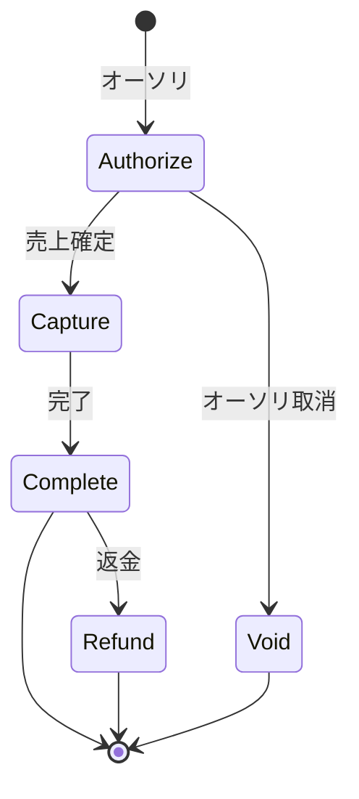

# Payment Gateway Interface 設計

> **ソースコード参照**: インターフェース定義は `application/port/` パッケージ、
> Payment エンティティは `domain/payment/`、決済サービスは `application/service/payment_service.go` を参照。

## 1. 概要

決済サービス（Stripe, PayPay, GMO, Square等）に依存しない抽象化レイヤーを提供する。

### パッケージ配置方針

| パッケージ | 配置するもの | 根拠 |
|-----------|-------------|------|
| `domain/payment/` | Payment エンティティ、ドメインイベント、Repository IF | 純粋なドメイン概念のみ |
| `application/port/` | PaymentGateway IF, CustomerGateway IF, WebhookHandler IF, GatewayRouter IF, リクエスト/レスポンス型 | 外部決済サービスとの統合境界（ポート） |
| `infrastructure/gateway/` | DefaultGatewayRouter, 各ゲートウェイ実装 | 具象実装（アダプタ） |

## 2. 決済の種類と対応範囲

### 決済方法

| 決済方法 | 説明 | 対応 |
|----------|------|------|
| クレジットカード | Visa, Master, JCB等 | ✅ |
| デビットカード | 即時引落 | ✅ |
| 銀行振込 | 振込依頼→入金確認 | ✅ |
| コンビニ払い | 払込票/バーコード | ✅ |
| QRコード決済 | PayPay, LINE Pay等 | ✅ |
| キャリア決済 | docomo, au, SoftBank | ✅ |
| 後払い | Paidy, NP後払い等 | ✅ |
| 口座振替 | 定期引落 | ✅ |

### 決済フロー

> 即時決済の場合は Authorize + Capture を同時に行う（Charge）

## 3. コアインターフェース

### PaymentGateway（メインIF）

ソース: `application/port/gateway.go`

| メソッド | 説明 |
|---------|------|
| `ID()` | ゲートウェイ識別子 |
| `SupportedMethods()` | サポートする決済方法 |
| `Charge` | 即時決済（オーソリ+キャプチャ同時） |
| `Authorize` / `Capture` / `Void` | オーソリフロー |
| `Refund` / `Cancel` | 返金・キャンセル |
| `GetTransaction` | トランザクション詳細取得 |
| `RegisterPaymentMethod` / `DeletePaymentMethod` / `GetPaymentMethod` / `ListPaymentMethods` | 支払い方法管理 |

### CustomerGateway

ソース: `application/port/customer.go`

ゲートウェイ側の顧客情報管理（CRUD）。

### WebhookHandler / WebhookProcessor

ソース: `application/port/webhook.go`

| コンポーネント | 責務 |
|--------------|------|
| `WebhookHandler` | ゲートウェイ固有のパース・署名検証 |
| `WebhookProcessor` | 横断的関心事: タイムスタンプ検証、重複検出、リトライ、DLQ |

**Webhook処理フロー:**
1. `ParseAndVerify`（署名検証 + パース）
2. タイムスタンプ双方向検証（過去・未来。デフォルト±5分、Standard Webhooks仕様準拠）
3. 重複検出（`WebhookDeduplicator`。デフォルトTTL 72時間=Stripe最大リトライ期間）
4. イベントハンドラ呼び出し（リトライ可能エラーのみリトライ、指数バックオフ+ジッター）
5. リトライ超過時は`WebhookDeadLetterQueue`に送信

#### Webhook エラーとHTTPステータスのマッピング

決済GWは「2xxか否か」でリトライ判定するため、HTTPステータスの使い分けが重要:

| 状況 | HTTPステータス | GW側の挙動 | 備考 |
|------|-------------|-----------|------|
| 処理成功 | 200 | リトライしない | — |
| 重複イベント（正常系） | 200 | リトライしない | ProcessWebhookがnil返却 |
| 非リトライエラー（DLQ行き） | 200 | リトライしない | DLQで追跡 |
| 署名検証失敗 | 401 | リトライする | 不正リクエスト |
| タイムスタンプ範囲外 | 400 | リトライする | リプレイ攻撃 or クロックスキュー |
| 重複検出ストレージ障害 | 503 | リトライする | Redis/DB一時障害 |

> **設計判断**: リトライさせたい障害→503、リトライさせたくないエラー→200（内部でDLQ/アラート対応）。
> `MapWebhookErrorToHTTP()` として実装予定（現在未実装）。

### GatewayRouter

ソース: `application/port/router.go`

条件（金額、通貨、決済方法、国）に基づいてゲートウェイを選択するルーター。
`DefaultGatewayRouter` 実装は `infrastructure/gateway/router.go`。

## 4. セキュリティ方針

**非通過型設計（PCI DSS SAQ A相当）:**
- カード番号・CVCはサーバーサイドに一切登場しない
- 決済GWのJS SDK でトークン化、サーバーにはトークン/PaymentMethodIDのみ送信
- `CardSource` 型（カード番号直接受信）は意図的に提供しない
- 改正割賦販売法（2018年施行）の非保持化要件に準拠

## 5. エラー定義

ソース: `application/port/errors.go`

`GatewayError`: Code（ErrorCode）+ Message + DeclineCode + Retryable フラグ。
カード関連（declined, expired, insufficient_funds等）、処理関連（rate_limit, duplicate等）、GW関連（unavailable, timeout, fraud等）。

## 6. 決済サービス（PaymentService）

ソース: `application/service/payment_service.go`

### ProcessPayment フロー

1. 請求書取得 → 支払い金額決定
2. `BeforeChargeHook` 実行
3. `PaymentGateway.Charge()` で決済実行
4. 失敗時: `OnPaymentFailedHook` 実行
5. 成功時: Payment記録作成、請求書に支払い反映、イベント発行
6. `AfterChargeHook` 実行

### 支払い方法の階層的フォールバック

請求書レベル → 契約レベル → アカウントデフォルトの順で支払い方法を解決。

## 7. サービス側での実装

OSS が提供するもの:
- `port.PaymentGateway` / `port.CustomerGateway` / `port.WebhookHandler` インターフェース
- リクエスト/レスポンス型、エラーコード
- `PaymentService`（アプリケーション層）
- `DefaultGatewayRouter`（インフラ層）
- テスト用モック実装

サービス側が実装するもの:
- 具象ゲートウェイ（Stripe, PayPay等）
- `WebhookDeduplicator` / `WebhookDeadLetterQueue` のストレージ実装

詳細な統合手順: [guides/usage-guide.md](../guides/usage-guide.md)

## 8. 決済手段別フロー

| 決済手段 | 代表プロバイダ | フロー |
|---------|-------------|--------|
| クレジットカード | Stripe, PAY.JP, GMO | 同期（即時結果） |
| デビットカード | Stripe, GMO | 同期 |
| 銀行振込 | GMO, PAY.JP | 非同期（入金確認はWebhook） |
| コンビニ払い | GMO, Komoju | 非同期（支払い確認はWebhook） |
| QRコード決済 | PayPay, LINE Pay | リダイレクト → Webhook |
| キャリア決済 | SoftBank, docomo | リダイレクト → Webhook |
| 後払い | Paidy, NP後払い | 非同期（与信結果はWebhook） |
| 口座振替 | GMO, 各銀行API | 非同期（引落結果はWebhook） |

## 9. 新規ゲートウェイ連携チェックリスト

新しい決済ゲートウェイを連携する際の確認事項:

1. [ ] `port.PaymentGateway` インターフェースの全メソッドを実装
2. [ ] `port.WebhookHandler` の署名検証を実装（ゲートウェイ固有のHMAC等）
3. [ ] `WebhookDeduplicator` のストレージ実装（Redis推奨）
4. [ ] エラーコードのマッピング（ゲートウェイ固有コード → `ErrorCode`）
5. [ ] 冪等性キーの送信（`IdempotencyKey` → ゲートウェイの冪等性ヘッダー）
6. [ ] 3Dセキュア対応（該当する場合）
7. [ ] テスト/サンドボックス環境での結合テスト
8. [ ] Webhookエンドポイントの登録とテスト
9. [ ] `GatewayRouter` へのルーティングルール追加
10. [ ] 本番環境でのスモークテスト
