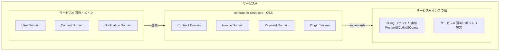

# Contract Billing Core - 利用ガイド

## 1. 利用パターン概要

### サービスAの全体構成



### 利用方法は3パターン

| パターン | 説明 | 適したケース |
|----------|------|-------------|
| **A. ライブラリ利用** | go getして自サービスに組み込み | 一般的な利用 |
| **B. フォーク利用** | forkしてカスタマイズ | 大幅な改変が必要な場合 |
| **C. 参照実装** | 設計だけ参考にして自前実装 | 学習目的、特殊要件 |

**推奨は A. ライブラリ利用** です。

---

## 2. サービスAでの導入手順

### Step 1: パッケージ取得

```bash
# サービスAのプロジェクトで
go get github.com/contract-to-cash/core
go get github.com/contract-to-cash/core/plugins/coupon  # 必要なら
```

### Step 2: ディレクトリ構成

```
service-a/
├── cmd/
│   └── api/
│       └── main.go
│
├── internal/
│   ├── domain/                      # サービスA固有ドメイン
│   │   ├── user/
│   │   │   ├── entity.go
│   │   │   └── repository.go
│   │   ├── content/
│   │   └── subscription/            # billing-coreとの連携層
│   │       ├── service.go           # ★ ここでOSSを使う
│   │       └── adapter.go
│   │
│   ├── application/
│   │   ├── usecase/
│   │   │   ├── signup_usecase.go
│   │   │   ├── subscribe_usecase.go # ★ 契約作成ユースケース
│   │   │   └── billing_usecase.go   # ★ 請求ユースケース
│   │   └── service/
│   │
│   ├── infrastructure/
│   │   ├── postgres/
│   │   │   ├── user_repository.go
│   │   │   ├── content_repository.go
│   │   │   ├── billing_repository.go  # ★ OSSインターフェースの実装
│   │   │   └── migrations/
│   │   │       ├── 001_users.sql
│   │   │       ├── 002_contents.sql
│   │   │       └── 003_billing.sql    # ★ OSSのテーブル
│   │   │
│   │   └── external/
│   │       ├── stripe/                # 決済ゲートウェイ
│   │       └── sendgrid/              # メール通知
│   │
│   ├── interface/
│   │   └── http/
│   │       ├── handler/
│   │       └── router.go
│   │
│   └── plugin/                        # ★ サービスA固有プラグイン
│       ├── loyalty_point/             # 例: ポイント付与プラグイン
│       └── notification/              # 例: 請求通知プラグイン
│
├── go.mod
└── go.sum
```

### Step 3: go.mod

```go
module github.com/yourcompany/service-a

go 1.25

require (
    github.com/contract-to-cash/core v1.0.0
    github.com/contract-to-cash/core/plugins/coupon v1.0.0
    // ... その他の依存
)
```

---

## 3. 具体的な統合コード

### 3.1 インフラ層：リポジトリ実装

OSSが定義するインターフェースを、サービスAのDBで実装する。

```go
// internal/infrastructure/postgres/billing_repository.go
package postgres

import (
    "context"
    "database/sql"

    // OSSのドメインをインポート
    "github.com/contract-to-cash/core/domain/contract"
    "github.com/contract-to-cash/core/domain/invoice"
    "github.com/contract-to-cash/core/domain/shared"
    "github.com/contract-to-cash/core/eventstore"
)

// ============================================================
// 契約リポジトリ実装
// ============================================================

// ContractRepository はOSSの contract.Repository を実装
type ContractRepository struct {
    db *sql.DB
}

func NewContractRepository(db *sql.DB) contract.Repository {
    return &ContractRepository{db: db}
}

// OSSのインターフェースを実装
func (r *ContractRepository) Save(ctx context.Context, c *contract.ContractAggregate) error {
    query := `
        INSERT INTO billing_contracts (id, account_id, type, status, ...)
        VALUES ($1, $2, $3, $4, ...)
        ON CONFLICT (id) DO UPDATE SET ...
    `
    _, err := r.db.ExecContext(ctx, query, 
        c.ContractID().String(),
        c.AccountID().String(),
        // ...
    )
    return err
}

func (r *ContractRepository) FindByID(ctx context.Context, id shared.ContractID) (*contract.ContractAggregate, error) {
    // 実装
}

func (r *ContractRepository) FindByAccountID(ctx context.Context, accountID shared.AccountID) ([]*contract.ContractAggregate, error) {
    // 実装
}

// ... 他のメソッド

// ============================================================
// 請求書リポジトリ実装
// ============================================================

type InvoiceRepository struct {
    db *sql.DB
}

func NewInvoiceRepository(db *sql.DB) invoice.Repository {
    return &InvoiceRepository{db: db}
}

// ... 実装

// ============================================================
// Event Store 実装
// ============================================================

type EventStore struct {
    db *sql.DB
}

func NewEventStore(db *sql.DB) eventstore.Store {
    return &EventStore{db: db}
}

// ... 実装
```

### 3.2 アプリケーション層：ユースケース

```go
// internal/application/usecase/subscribe_usecase.go
package usecase

import (
    "context"
    "time"

    // OSSのドメイン
    "github.com/contract-to-cash/core/domain/contract"
    "github.com/contract-to-cash/core/domain/shared"
    "github.com/contract-to-cash/core/eventstore"

    // サービスA固有ドメイン
    "github.com/yourcompany/service-a/internal/domain/user"
)

// SubscribeUseCase サブスクリプション契約ユースケース
type SubscribeUseCase struct {
    userRepo     user.Repository          // サービスA固有
    contractRepo contract.Repository      // ★ OSSのインターフェース
}

func NewSubscribeUseCase(
    userRepo user.Repository,
    contractRepo contract.Repository,
) *SubscribeUseCase {
    return &SubscribeUseCase{
        userRepo:     userRepo,
        contractRepo: contractRepo,
    }
}

// Input
type SubscribeInput struct {
    UserID    string
    ProductID string
    PriceID   string
    StartDate time.Time
}

// Output
type SubscribeOutput struct {
    ContractID string
    Status     string
}

// Execute サブスクリプション契約を作成
func (uc *SubscribeUseCase) Execute(ctx context.Context, input SubscribeInput) (*SubscribeOutput, error) {
    // 1. ユーザー存在確認（サービスA固有）
    u, err := uc.userRepo.FindByID(ctx, input.UserID)
    if err != nil {
        return nil, err
    }

    // 2. 契約アグリゲート作成（OSSのドメインモデルを使用）
    clock := shared.SystemClock{}
    contractID := shared.NewContractID()
    agg := contract.NewContractAggregate(contractID, clock)

    price := shared.NewMoney(new(big.Rat).SetInt64(980), shared.CurrencyJPY)

    // 3. Createコマンドで契約を初期化
    cmd := contract.CreateContractCommand{
        AccountID:    shared.AccountID(u.ID),           // サービスAのUserIDをAccountIDにマッピング
        PriceID:      shared.PriceID(input.PriceID),  // Price集約のID
        ContractType: contract.ContractTypeSubscription,
        BillingCycle: contract.BillingCycleMonthly,
        Price:        price,
        BasePrice:    price,
        AutoRenew:    true,
    }
    metadata := eventstore.EventMetadata{} // 必要に応じてメタデータを設定
    if err := agg.Create(cmd, metadata); err != nil {
        return nil, err
    }

    // 4. 契約を有効化
    if err := agg.Activate(metadata); err != nil {
        return nil, err
    }

    // 5. 保存（OSSのリポジトリインターフェース経由）
    if err := uc.contractRepo.Save(ctx, agg); err != nil {
        return nil, err
    }

    return &SubscribeOutput{
        ContractID: string(agg.ContractID()),
        Status:     string(agg.Status()),
    }, nil
}
```

### 3.3 請求処理ユースケース

```go
// internal/application/usecase/billing_usecase.go
package usecase

import (
    "context"

    // OSSのアプリケーションサービス
    "github.com/contract-to-cash/core/application/service"
)

// BillingUseCase 請求ユースケース
type BillingUseCase struct {
    billingService *service.BillingService  // ★ OSSのサービスをそのまま使う
}

func NewBillingUseCase(billingService *service.BillingService) *BillingUseCase {
    return &BillingUseCase{billingService: billingService}
}

// GenerateMonthlyInvoices 月次請求書生成
func (uc *BillingUseCase) GenerateMonthlyInvoices(ctx context.Context) error {
    // OSSのサービスを呼び出すだけ
    // ...
    return nil
}

// NOTE: クーポン適用はBillingServiceの直接メソッドではなく、
// プラグインシステム経由で行われる。クーポンプラグインを
// plugin.Registry に登録すると、GenerateInvoice の計算フロー内で
// DiscountHook.CalculateDiscount() が自動的に呼び出される。
// 詳細は「4. サービスA固有プラグインの作成」を参照。
```

### 3.4 DI（依存性注入）の組み立て

```go
// cmd/api/main.go
package main

import (
    "database/sql"
    "log"
    "net/http"

    _ "github.com/lib/pq"

    // OSSパッケージ
    billingService "github.com/contract-to-cash/core/application/service"
    "github.com/contract-to-cash/core/domain/balance"
    "github.com/contract-to-cash/core/domain/shared"
    "github.com/contract-to-cash/core/plugin"
    couponPlugin "github.com/contract-to-cash/core/plugins/coupon"

    // サービスA
    "github.com/yourcompany/service-a/internal/application/usecase"
    "github.com/yourcompany/service-a/internal/infrastructure/postgres"
    serviceAPlugin "github.com/yourcompany/service-a/internal/plugin/notification"
)

func main() {
    // ============================================================
    // 1. DB接続
    // ============================================================
    db, err := sql.Open("postgres", "postgres://...")
    if err != nil {
        log.Fatal(err)
    }

    // ============================================================
    // 2. リポジトリ初期化（OSSインターフェースの実装を注入）
    // ============================================================
    
    // サービスA固有
    userRepo := postgres.NewUserRepository(db)
    contentRepo := postgres.NewContentRepository(db)
    
    // OSS用（サービスAが実装したものを注入）
    contractRepo := postgres.NewContractRepository(db)    // contract.Repository を実装
    invoiceRepo := postgres.NewInvoiceRepository(db)      // invoice.Repository を実装
    eventStore := postgres.NewEventStore(db)              // eventstore.Store を実装

    // ============================================================
    // 3. プラグイン設定
    // ============================================================
    clock := shared.SystemClock{}  // shared.Clock 実装
    eventBus := NewEventBus()
    logger := NewLogger()
    
    registry := plugin.NewRegistry()

    // クーポンプラグイン（OSS提供、DiscountHook を実装）
    couponRepo := postgres.NewCouponRepository(db)
    cp := couponPlugin.NewCouponPlugin(couponRepo, clock)
    registry.Register(cp)

    // 請求通知プラグイン（サービスA独自、InvoiceLifecycleHook を実装）
    notificationPlugin := serviceAPlugin.NewNotificationPlugin(sendgridClient)
    registry.Register(notificationPlugin)

    // 全プラグイン初期化
    registry.InitializeAll(ctx, map[string]plugin.Config{
        "coupon": {"maxCouponsPerInvoice": 1},
    })

    // ============================================================
    // 4. OSSサービス初期化
    // ============================================================
    usageRepo := postgres.NewUsageRepository(db)

    balanceRepo := postgres.NewBalanceRepository(db)
    balanceConfig := balance.BalanceConfig{/* ... */}
    priceRepo := postgres.NewPriceRepository(db)
    productRepo := postgres.NewProductRepository(db)

    billingSvc := billingService.NewBillingService(
        contractRepo,
        invoiceRepo,
        usageRepo,
        balanceConfig,
        priceRepo,
        productRepo,
        registry,
        billingService.BillingConfig{
            GracePeriod:      1 * time.Hour,   // 請求書確定までの猶予期間
            DaysUntilDue:     30,               // 支払い期限（日数）
            CollectionMethod: "auto_charge",
        },
        clock,
        billingService.WithBalanceRepo(balanceRepo), // balanceRepoはオプションで注入
    )

    // ============================================================
    // 5. ユースケース初期化
    // ============================================================
    subscribeUC := usecase.NewSubscribeUseCase(userRepo, contractRepo)
    billingUC := usecase.NewBillingUseCase(billingSvc)

    // ============================================================
    // 6. HTTPハンドラ設定
    // ============================================================
    handler := setupRouter(subscribeUC, billingUC)
    
    log.Println("Starting server on :8080")
    http.ListenAndServe(":8080", handler)
}
```

---

## 4. サービスA固有プラグインの作成

OSSのプラグインインターフェースを実装して、サービスA独自の機能を追加できる。

```go
// internal/plugin/notification/plugin.go
package notification

import (
    "context"

    "github.com/contract-to-cash/core/domain/invoice"
    "github.com/contract-to-cash/core/plugin"
)

const PluginID = "service-a-notification"

// Plugin 請求書発行時にメール通知を送るプラグイン
type Plugin struct {
    emailClient EmailClient
    logger      plugin.Logger
}

func NewNotificationPlugin(emailClient EmailClient) *Plugin {
    return &Plugin{emailClient: emailClient}
}

// Plugin 基本インターフェース実装
func (p *Plugin) Name() string    { return PluginID }
func (p *Plugin) Version() string { return "1.0.0" }
func (p *Plugin) Priority() int   { return plugin.PriorityNormal }

func (p *Plugin) Initialize(ctx context.Context, config plugin.Config) error {
    return nil
}
func (p *Plugin) Shutdown(ctx context.Context) error { return nil }

// InvoiceLifecycleHook 実装
// 通知プラグインは割引・税計算に関心がないため、
// DiscountHookやTaxHookは実装しない（空実装不要）
var _ plugin.InvoiceLifecycleHook = (*Plugin)(nil)

func (p *Plugin) BeforeCalculation(ctx *plugin.CalculationContext) error {
    return nil
}

func (p *Plugin) AfterCalculation(ctx *plugin.CalculationContext, inv *invoice.Invoice) error {
    // 請求書生成後にメール通知
    err := p.emailClient.SendInvoiceNotification(ctx.Context(), SendInvoiceNotificationInput{
        AccountID: ctx.Contract().AccountID().String(),
        InvoiceID: inv.ID().String(),
        Total:     inv.Total().Amount(),
        DueDate:   inv.DueDate(),
    })
    if err != nil {
        // 通知失敗は請求処理を止めない（ログのみ）
    }
    return nil
}
```

---

## 5. AccountID のマッピング戦略

OSSは `shared.AccountID` を使うが、サービスAには `user.UserID` がある。

### 戦略1: 同一IDを使用（推奨）

```go
// サービスAのユーザーIDをそのままAccountIDとして使用
accountID := shared.AccountID(user.ID)
```

### 戦略2: マッピングテーブル

```go
// サービスA固有のマッピングテーブル
// user_billing_accounts (user_id, billing_account_id)

type AccountMapper struct {
    db *sql.DB
}

func (m *AccountMapper) GetBillingAccountID(ctx context.Context, userID string) (shared.AccountID, error) {
    var accountID string
    err := m.db.QueryRowContext(ctx, `
        SELECT billing_account_id FROM user_billing_accounts WHERE user_id = $1
    `, userID).Scan(&accountID)
    
    if err == sql.ErrNoRows {
        // 新規作成
        accountID = shared.NewAccountID().String()
        _, err = m.db.ExecContext(ctx, `
            INSERT INTO user_billing_accounts (user_id, billing_account_id) VALUES ($1, $2)
        `, userID, accountID)
    }
    
    return shared.AccountID(accountID), err
}
```

---

## 6. マイグレーション戦略

### OSSが提供するマイグレーションをサービスAに組み込む

```
service-a/
└── internal/infrastructure/postgres/migrations/
    ├── 001_users.sql           # サービスA固有
    ├── 002_contents.sql        # サービスA固有
    ├── 003_billing_core.sql    # ★ OSSからコピーまたは参照
    └── 004_billing_coupon.sql  # ★ クーポンプラグイン用
```

```sql
-- 003_billing_core.sql
-- OSSの提供するスキーマを使用（プレフィックス付与も可）

CREATE TABLE billing_contracts (
    id UUID PRIMARY KEY,
    account_id UUID NOT NULL,
    contract_type VARCHAR(50) NOT NULL,
    -- ...
);

CREATE TABLE billing_invoices (
    -- ...
);

CREATE TABLE billing_events (
    -- ...
);
```

---

## 7. 利用パターンまとめ

```mermaid
graph LR
    subgraph ServiceACode[サービスA が書くコード]
        R1[1. リポジトリ実装]
        R1D[OSSのインターフェースを<br/>PostgreSQL等で実装]
        R2[2. ユースケース]
        R2D[OSSのドメインモデル・<br/>サービスを呼び出す]
        R3[3. 固有プラグイン]
        R3D[OSSのフックを実装して<br/>カスタム処理を追加]
        R4[4. DI組み立て]
        R4D[main.goで全てを結合]
        R5[5. マイグレーション]
        R5D[OSSのスキーマを<br/>自サービスのDBに適用]
    end
    
    subgraph OSSProvides[OSS が提供するもの]
        O1[ドメインモデル<br/>Contract, Invoice, Payment...]
        O2[リポジトリインターフェース]
        O3[アプリケーションサービス<br/>BillingService等]
        O4[プラグインシステム]
        O5[公式プラグイン<br/>Coupon, Tax等]
        O6[Event Store インターフェース]
        O7[参照用マイグレーションSQL]
    end
    
    ServiceACode --> OSSProvides
```



### サービスAの実装量イメージ

| 項目 | 実装量 | 備考 |
|------|--------|------|
| リポジトリ実装 | 中 | OSSのインターフェースに沿って実装 |
| ユースケース | 小 | OSSサービスを呼ぶだけの薄いラッパー |
| 固有プラグイン | 小〜中 | 必要な分だけ |
| DI/設定 | 小 | main.goで組み立て |
| マイグレーション | 小 | OSSのSQLをコピー |

**結論**: サービスAは「リポジトリ実装」が主な作業。ドメインロジックはOSSを再利用。
