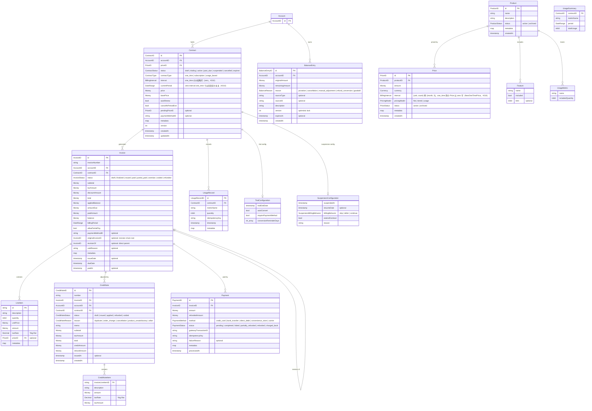

# ドメインモデル設計

## 論理データモデル図



> **凡例:** Account は外部境界（このドメイン外で管理）。Contract はイベントソーシング集約根（`ContractAggregate`）。
> Money は `big.Rat` ベースの値オブジェクト、Decimal は `*big.Rat`、ID は ULID で生成。
> TrialConfiguration / SuspensionConfiguration / UsageSummary は値オブジェクト（独立した永続化IDを持たない）。

## 1. 共通値オブジェクト

### 1.1 Money（金額）

```go
// domain/shared/money.go
package shared

import (
    "encoding/json"
    "fmt"
    "math/big"
)

// Money は通貨と金額を表現する値オブジェクト
// big.Rat を使用し、浮動小数点誤差を回避する
type Money struct {
    amount   *big.Rat
    currency Currency
}

type Currency string

const (
    CurrencyJPY Currency = "JPY"
    CurrencyUSD Currency = "USD"
    CurrencyEUR Currency = "EUR"
)

func NewMoney(amount *big.Rat, currency Currency) Money
func Zero(currency Currency) Money

func (m Money) Amount() *big.Rat
func (m Money) Currency() Currency
func (m Money) Add(other Money) (Money, error)
func (m Money) Subtract(other Money) (Money, error)
func (m Money) Multiply(factor *big.Rat) Money
func (m Money) Negate() Money
func (m Money) IsNegative() bool
func (m Money) IsZero() bool
func (m Money) GreaterThan(other Money) bool             // レガシー: 通貨不一致時は静かに false（下記注意）
func (m Money) GreaterThanStrict(other Money) (bool, error) // 通貨不一致を error で報告（issue #196）
func (m Money) Min(other Money) (Money, error)
func (m Money) MarshalJSON() ([]byte, error)
func (m *Money) UnmarshalJSON(data []byte) error

// 丸め・最小単位（issue #189）
func (m Money) Round(decimalPlaces int, mode RoundingMode) Money
func (m Money) RoundToMinorUnit(mode RoundingMode) Money
func (m Money) IsIntegralMinorUnit() bool
func (m Money) Int64() int64            // ゼロ方向切り捨て（truncate toward zero）
func (m Money) Int64Checked() (int64, error) // int64 に収まらなければ error
```

#### `GreaterThan` と `GreaterThanStrict`（issue #196）

`GreaterThan` は**通貨不一致のとき静かに `false` を返す**レガシー比較子である。金額ガード
（例: `if x.GreaterThan(limit)`）に使うと、通貨違いの過大な外貨が「大きくない」と誤読され
ガードをすり抜ける危険がある。**通貨が同一と保証されない比較には `GreaterThanStrict` を使う**
こと（不一致を `ErrCodeCurrencyMismatch` の `DomainError` で報告する）。`GreaterThan` は
同一通貨が保証済みの比較にのみ残す。`CreditNote.Apply/Refund`（`validateAdjustmentAmount`）、
`Invoice.WithAmountDue`、`CreditNoteService` の累計クレジット超過判定は本 issue で
`GreaterThanStrict` へ移行済み。

#### 通貨の最小単位（minor unit）と丸めポリシー（issue #189）

`Money` は `big.Rat` により業務計算を常に正確（有理数）に保つが、決済ゲートウェイは
整数の最小単位（minor unit）しか受け付けない。したがって**永続化・回収の直前に、金額を
通貨の最小単位へ量子化（丸め）する必要がある**。

- **最小単位指数（`Currency.MinorUnitExponent()`）**: 通貨ごとの小数桁数。JPY=0（円が最小）、
  USD/EUR=2（セント）。`Currency` は開いた string 型なので、レジストリは**拡張可能**である:
  未登録通貨は `DefaultMinorUnitExponent`（=2、ISO 4217 の多数派）へフォールバックし、
  `RegisterCurrencyMinorUnit(currency, exponent)` で追加・上書きできる（例: KWD/BHD=3）。
  登録はアプリ起動時（請求実行前）に行う。負の指数は 0 にクランプされる。
- **`RoundToMinorUnit(mode)`**: 金額を通貨の最小単位へ丸める唯一の変換。適用後は
  `IsIntegralMinorUnit()` が true になる。`mode` は `rounding.go` の `RoundingMode`
  （`RoundDown` / `RoundUp` / `RoundHalfUp`）を再利用する。
- **`IsIntegralMinorUnit()`**: 金額が既に最小単位の整数倍か（= `RoundToMinorUnit` で変化しないか）
  を判定する。請求パイプラインが全金額を量子化済みであることの表明に使う。

**丸め点（請求パイプライン）**: `BillingService.executeBillingPipeline` は
`BillingConfig.TaxRoundingMode`（後述）で **(1) 小計、(2) 割引合計、(3) 税合計** を最小単位へ
丸める。`小計`・`割引`・`税`・`合計`・`amountDue` はいずれも最小単位で整数となり、
整数のみを受け付けるゲートウェイと**正確に照合（reconcile）**できる。クレジット台帳からの
FIFO 充当（`applyBalances`）も丸め後の整数 `total` を消費するため、`amountDue = total - 充当額`
は整数を保ち、支払いバリデーション（`Invoice.ValidatePayment`）と厳密に一致する。

**デフォルトの丸めモード**は `RoundDown`（ゼロ方向切り捨て）。日本の消費税実務における
1請求単位の端数切り捨て（端数処理）に一致し、かつ**正確値を上回る丸め（過大請求）を決して
行わない**（丸めた割引が正確な割引を超えず、丸めた税が過大にならない）。管轄が要求する場合は
`WithTaxRoundingMode(shared.RoundHalfUp)` 等で上書きする。

> **⚠️ 挙動変更（issue #189）**:
> - **請求金額が最小単位へ丸められるようになった**。従来は税が正確な有理数（例: ¥101 の 10% =
>   ¥10.1）のまま請求書へ永続化され、ゲートウェイで決済不能・照合ずれの原因になっていた。
>   今後は既定で ¥10 に切り捨てられ、合計・amountDue も整数になる。
> - **`Money.Int64()` の負数バグ修正**: 従来は `big.Int.Div`（床関数）で `Int64(-1.5) == -2` と
>   なっていたが、ドキュメント通り**ゼロ方向切り捨て**に修正し `Int64(-1.5) == -1` を返す。
>   int64 に収まらない値はドキュメント化された wrap 挙動になるため、範囲保証できない呼び出しは
>   `Int64Checked()`（オーバーフローで error）を使う。

### 1.2 DateRange（期間）

```go
// domain/shared/datetime.go
package shared

import (
    "fmt"
    "time"
)

// DateRange は期間を表す値オブジェクト
// 半開区間 [start, end) を採用。endは含まない。連続する期間の隣接判定に適している。
type DateRange struct {
    start time.Time
    end   time.Time
}

func NewDateRange(start, end time.Time) (DateRange, error)

func (r DateRange) Start() time.Time
func (r DateRange) End() time.Time
func (r DateRange) Contains(t time.Time) bool
func (r DateRange) Duration() time.Duration
func (r DateRange) Equals(other DateRange) bool
func (r DateRange) IsZero() bool
func (r DateRange) String() string
func (r DateRange) Next(cycle string) DateRange
func (r DateRange) MarshalJSON() ([]byte, error)
func (r *DateRange) UnmarshalJSON(data []byte) error

// AddBillingCycleDuration は請求サイクル1周期分を加算するユーティリティ関数。
// DateRange.Next() とContractAggregate両方から参照される唯一の変換ロジック。
// cycle: "monthly" | "yearly" | "weekly" | "daily"
func AddBillingCycleDuration(t time.Time, cycle string) time.Time
```

### 1.3 共有ID型

全ドメインで使用するID型を `domain/shared/identifier.go` に集約する。
これにより各ドメインパッケージは `shared` のみに依存し、互いを参照しない（循環依存の解消）。

```go
// domain/shared/identifier.go
package shared

// 全ドメインで使用するID型
type AccountID string
type ContractID string
type InvoiceID string
type PaymentID string
type UsageRecordID string
type ProductID string
type PriceID string
type BalanceEntryID string
type CreditNoteID string

// ID生成ヘルパー
func NewAccountID() AccountID           { return AccountID(generateULID()) }
func NewContractID() ContractID         { return ContractID(generateULID()) }
func NewInvoiceID() InvoiceID           { return InvoiceID(generateULID()) }
func NewPaymentID() PaymentID           { return PaymentID(generateULID()) }
func NewUsageRecordID() UsageRecordID   { return UsageRecordID(generateULID()) }
func NewProductID() ProductID           { return ProductID(generateULID()) }
func NewPriceID() PriceID               { return PriceID(generateULID()) }
func NewBalanceEntryID() BalanceEntryID { return BalanceEntryID(generateULID()) }
func NewCreditNoteID() CreditNoteID     { return CreditNoteID(generateULID()) }

// GenerateID はイベントID等の汎用ID文字列を生成する
func GenerateID() string { return fmt.Sprintf("evt_%s", generateULID()) }
```

### 1.4 DomainError（ドメインエラー）

```go
// domain/shared/errors.go
package shared

import "fmt"

type ErrorCode string

const (
    ErrCodeInvalidStateTransition ErrorCode = "invalid_state_transition"
    ErrCodeValidation             ErrorCode = "validation_error"
    ErrCodeCurrencyMismatch       ErrorCode = "currency_mismatch"
    ErrCodeInvalidDateRange       ErrorCode = "invalid_date_range"
    ErrCodeNotFound               ErrorCode = "not_found"
    ErrCodeConflict               ErrorCode = "conflict"
    ErrCodeDuplicateRequest       ErrorCode = "duplicate_request"
    ErrCodeUnknownEvent           ErrorCode = "unknown_event"
    ErrCodeVersionConflict        ErrorCode = "version_conflict"
    ErrCodeBusinessRule           ErrorCode = "business_rule_violation"
)

// DomainError 構造化ドメインエラー
type DomainError struct {
    Code    ErrorCode
    Message string
    Cause   error
}

func NewDomainError(code ErrorCode, message string) *DomainError
func NewDomainErrorWithCause(code ErrorCode, message string, cause error) *DomainError
func (e *DomainError) Error() string   // "[code] message" 形式
func (e *DomainError) Unwrap() error
```

### 1.5 Clock（時刻抽象）

```go
// domain/shared/clock.go
package shared

import "time"

// Clock は時刻取得を抽象化するインターフェース。
// 全てのドメイン・アプリケーションコードは time.Now() ではなく Clock を使用すること。
type Clock interface {
    Now() time.Time
}

// SystemClock は本番用の Clock 実装。UTC で現在時刻を返す。
type SystemClock struct{}
func (c SystemClock) Now() time.Time { return time.Now().UTC() }

// FixedClock はテスト用の Clock 実装。固定時刻を返す。
type FixedClock struct {
    FixedTime time.Time
}
func (c FixedClock) Now() time.Time { return c.FixedTime }
```

## 2. Account（アカウント）

```go
// domain/account/entity.go
package account

import (
    "time"

    "github.com/contract-to-cash/core/domain/shared"
)

// AccountID は shared/identifier.go で定義

type Account struct {
    id          shared.AccountID
    name        string
    email       string
    billingInfo BillingInfo
    createdAt   time.Time
    updatedAt   time.Time
}

type BillingInfo struct {
    Address      Address
    TaxID        string
    PaymentTerms int              // 支払い期限（日数）
    BalanceConfig *balance.BalanceConfig // クレジット設定（nil = グローバルデフォルトを使用）
}
// NOTE: balance パッケージ（セクション9）の import が必要
// import "domain/balance"

type Address struct {
    Line1      string
    Line2      string
    City       string
    State      string
    PostalCode string
    Country    string
}
```

## 3. Contract（契約）

### 3.1 エンティティ定義

```go
// domain/contract/entity.go
package contract

import (
    "github.com/contract-to-cash/core/domain/pricing"
)

// ContractID は shared/identifier.go で定義

type ContractStatus string

const (
    ContractStatusDraft     ContractStatus = "draft"
    ContractStatusTrialing  ContractStatus = "trialing"
    ContractStatusActive    ContractStatus = "active"
    ContractStatusPastDue   ContractStatus = "past_due"    // 支払い遅延（Dunning中）
    ContractStatusSuspended ContractStatus = "suspended"
    ContractStatusCancelled ContractStatus = "cancelled"
    ContractStatusExpired   ContractStatus = "expired"
)

// ContractStatus 状態遷移ルール:
//   draft     → active | trialing | cancelled（作成直後のキャンセル）
//   trialing  → active（トライアル終了・自動移行）| cancelled（トライアル中の解約）
//   active    → past_due | suspended | cancelled | expired
//   past_due  → active（支払い成功）| suspended（リトライ上限到達）| cancelled
//   suspended → active（再開）| cancelled（一時停止中の解約）
//   cancelled → 終端状態（遷移なし）
//   expired   → 終端状態（遷移なし）

type ContractType string

const (
    ContractTypeOneTime    ContractType = "one_time"
    ContractTypeSubscription ContractType = "subscription"
    ContractTypeUsageBased ContractType = "usage_based"
)

// BillingInterval は pricing.BillingInterval のエイリアス。
// 課金サイクルは常に BillingInterval（{unit, count}）で表現する。
// 旧 BillingCycle 文字列スキャフォールディングは #111 で撤去済み。
type BillingInterval = pricing.BillingInterval

```

> **注（issue #159）**: 以前ここに定義されていた read-only な `Contract` エンティティ
> （ContractAggregate の状態保持ミラー）は、コンストラクタ・パッケージ外参照が一切なく
> 死にコードだったため削除済み。契約モデルは event-sourced な `ContractAggregate`
> （§3.2）に一本化されている。読み取りモデル / Projection は利用者側の責務。

### 3.2 ContractAggregate（イベントソーシング対応）

```go
// domain/contract/aggregate.go
package contract

import (
    "github.com/contract-to-cash/core/domain/shared"
    "github.com/contract-to-cash/core/eventstore"
)

// CreateContractCommand はContract作成時のパラメータを保持する。
// IdempotencyKey は必須（issue #159）: Create が空を
// validation エラーで拒否し、キーは ContractCreatedEvent（schema v3）に載る。
// コアが強制するのは「存在」まで — キーの一意性はリポジトリ/アダプタが
// ユニークインデックス等で強制する（contract.Repository.Save の godoc 参照）。
type CreateContractCommand struct {
    IdempotencyKey string // 必須。空は validation エラー
    AccountID      shared.AccountID
    PriceID        shared.PriceID
    ContractType   ContractType
    Interval       BillingInterval // one_time のみ省略可（zero、issue #218、§3.11）。他タイプは必須
    Price          shared.Money
    BasePrice      shared.Money
    AutoRenew      bool
    Metadata       map[string]string // 任意。統合者定義の key-value（例 creator_id）。issue #219
}

// ContractAggregate はイベントソーシングに対応した契約集約
type ContractAggregate struct {
    eventstore.BaseAggregate

    contractID        shared.ContractID
    accountID         shared.AccountID
    status            ContractStatus
    contractType      ContractType
    interval          BillingInterval
    currentPeriod     shared.DateRange
    trialConfig       *TrialConfiguration
    suspensionConfig  *SuspensionConfiguration
    paymentMethodID   *string
    priceID           shared.PriceID
    price             shared.Money
    basePrice         shared.Money
    autoRenew         bool
    cancelAtPeriodEnd bool
    pendingPriceID    *shared.PriceID
    billingAnchorDay  int              // 課金アンカー日（1..31）。月末ドリフト防止（issue #186）。3.9 参照
    metadata          map[string]string // 統合者定義 metadata（作成時のみ、issue #219）。3.10 参照
    createdAt         time.Time
    updatedAt         time.Time
}

func NewContractAggregate(id shared.ContractID, clock shared.Clock) *ContractAggregate

// コマンドメソッド（各メソッドはイベントを生成し Apply で状態を更新する）
// Create の検証（issue #196）: 不変なイベントストリームに不正値を書かないよう、
// nil Clock（NewContractAggregate に nil を渡した場合。panic ではなく validation error）、
// 空 AccountID、PriceID も非ゼロ Price も無い（価格参照が皆無）、Price と BasePrice の
// 通貨不一致（両者非ゼロのとき）を拒否する。zero の Interval は one_time のみ許容
// （issue #218、§3.11）— 他タイプでは従来どおり validation error。さらに未知の
// ContractType も拒否する（one_time / subscription / usage_based 以外は validation error。
// ContractType は下流の課金分岐を駆動するため。検証はコマンド受付時のみ — Apply /
// リプレイは歴史的イベントをそのまま受け入れる）（issue #243）。
func (a *ContractAggregate) Create(cmd CreateContractCommand, metadata eventstore.EventMetadata) error
func (a *ContractAggregate) Activate(metadata eventstore.EventMetadata) error
func (a *ContractAggregate) Suspend(config SuspensionConfiguration, metadata eventstore.EventMetadata) error
func (a *ContractAggregate) Resume(metadata eventstore.EventMetadata) error
// Cancel の Apply は pendingPriceID / trialConfig をクリアする（issue #196）。終端契約が
// HasPendingChange()==true を報告したり trialing からの解約後に trialConfig を残さないため。
// Apply でのクリアは決定的・冪等なのでリプレイ安全。ContractExpiredEvent の Apply も
// 同様に pendingPriceID / trialConfig をクリアする（issue #243）: 満了は autoRenew=false の
// RenewWithInterval から到達し、予約済みの期末価格変更を消費しないため、クリアしないと
// 満了（終端）契約が HasPendingChange()==true を報告し続ける。
func (a *ContractAggregate) Cancel(reason string, metadata eventstore.EventMetadata) error
// MarkPastDue は active な契約を past_due へ遷移させる（支払い失敗による Dunning 開始等）。
// past_due からは回復（RecoverFromPastDue）・一時停止（リトライ上限到達）・解約が可能。
func (a *ContractAggregate) MarkPastDue(reason string, metadata eventstore.EventMetadata) error
// RecoverFromPastDue は past_due の契約を active へ戻す（支払い成功で未収が解消したとき等）。
func (a *ContractAggregate) RecoverFromPastDue(metadata eventstore.EventMetadata) error
func (a *ContractAggregate) ChangePrice(newPriceID shared.PriceID, policy ChangePolicy, proration *PlanChangeProration, metadata eventstore.EventMetadata) error
// UnscheduleChange は終端契約（cancelled/expired）では invalid_state_transition を返す（issue #196）。
func (a *ContractAggregate) UnscheduleChange(reason string, metadata eventstore.EventMetadata) error
func (a *ContractAggregate) ChangePaymentMethod(paymentMethodID *string, metadata eventstore.EventMetadata) error
// StartTrial は config を集約の Clock と照合して検証する（issue #196）: ゼロ/過去の
// TrialEndDate、負の ConversionReminderDays を拒否する。
func (a *ContractAggregate) StartTrial(config TrialConfiguration, metadata eventstore.EventMetadata) error
func (a *ContractAggregate) EndTrial(converted bool, metadata eventstore.EventMetadata) error
// RenewWithInterval: zero の newInterval、または currentPeriod 未設定
// （zero-interval one_time）での更新は ErrCodeBusinessRule を返す（issue #218、§3.11）。
// cancelAtPeriodEnd / autoRenew=false の早期分岐はこのガードより先に評価されるため、
// 解約・満了は interval 無しでも従来どおり成立する。
func (a *ContractAggregate) RenewWithInterval(newInterval BillingInterval, metadata eventstore.EventMetadata) error
func (a *ContractAggregate) ScheduleCancellation(reason string, metadata eventstore.EventMetadata) error
func (a *ContractAggregate) UnscheduleCancellation(metadata eventstore.EventMetadata) error

// イベント適用・リプレイ
func (a *ContractAggregate) Apply(event eventstore.DomainEvent) error
func (a *ContractAggregate) LoadFromHistory(events []eventstore.Event) error
func (a *ContractAggregate) MarshalSnapshot() ([]byte, error)
// LoadFromSnapshot のレガシー分岐（interval が無く billing_cycle のみ）は Strict 変換を使い、
// 未知/欠落の billing_cycle を静かに Monthly へ丸めず validation error にする（issue #196 / #162 L-4）。
// 正当なレガシースナップショット（daily/weekly/monthly/yearly）はそのままロードできる。
// 例外（issue #218、§3.11）: contract_type が one_time で interval が zero かつ
// billing_cycle も無いスナップショットは、壊れたレガシーではなく正当な
// zero-interval one_time として受理する（billing_cycle が未知の非空値なら one_time でも失敗）。
func (a *ContractAggregate) LoadFromSnapshot(snapshot eventstore.Snapshot) error

// Getters
func (a *ContractAggregate) ContractID() shared.ContractID
func (a *ContractAggregate) AccountID() shared.AccountID
func (a *ContractAggregate) Status() ContractStatus
func (a *ContractAggregate) GetContractType() ContractType
func (a *ContractAggregate) GetInterval() BillingInterval
func (a *ContractAggregate) CurrentPeriod() shared.DateRange
func (a *ContractAggregate) TrialConfig() *TrialConfiguration
func (a *ContractAggregate) SuspensionConfig() *SuspensionConfiguration
func (a *ContractAggregate) PaymentMethodID() *string
func (a *ContractAggregate) Price() shared.Money
func (a *ContractAggregate) BasePrice() shared.Money
func (a *ContractAggregate) PriceID() shared.PriceID
func (a *ContractAggregate) AutoRenew() bool
func (a *ContractAggregate) CancelAtPeriodEnd() bool
func (a *ContractAggregate) PendingPriceID() *shared.PriceID
func (a *ContractAggregate) HasPendingChange() bool
func (a *ContractAggregate) BillingAnchorDay() int // 課金アンカー日（未確立なら 0）。3.9 参照
func (a *ContractAggregate) Metadata() map[string]string // 防御的コピー（常に非 nil）。3.10 参照
func (a *ContractAggregate) CreatedAt() time.Time
func (a *ContractAggregate) UpdatedAt() time.Time
```

### 3.3 イベント型一覧

```go
// domain/contract/events.go
package contract

// 全17種のドメインイベント
const (
    EventTypeContractCreated         eventstore.EventType = "contract.created"
    EventTypeContractActivated       eventstore.EventType = "contract.activated"
    EventTypeContractSuspended       eventstore.EventType = "contract.suspended"
    EventTypeContractResumed         eventstore.EventType = "contract.resumed"
    EventTypeContractCancelled       eventstore.EventType = "contract.cancelled"
    EventTypePriceChanged            eventstore.EventType = "contract.price_changed"
    EventTypeTrialStarted            eventstore.EventType = "contract.trial_started"
    EventTypeTrialEnded              eventstore.EventType = "contract.trial_ended"
    EventTypePaymentMethodChanged    eventstore.EventType = "contract.payment_method_changed"
    EventTypeContractRenewed         eventstore.EventType = "contract.renewed"
    EventTypeContractExpired         eventstore.EventType = "contract.expired"
    EventTypeCancellationScheduled   eventstore.EventType = "contract.cancellation_scheduled"
    EventTypeCancellationUnscheduled eventstore.EventType = "contract.cancellation_unscheduled"
    EventTypePriceChangeScheduled    eventstore.EventType = "contract.price_change_scheduled"
    EventTypePriceChangeUnscheduled  eventstore.EventType = "contract.price_change_unscheduled"
    EventTypeContractPastDue         eventstore.EventType = "contract.past_due"
    EventTypeContractRecovered       eventstore.EventType = "contract.recovered"
)

type ContractCreatedEvent struct {
    ContractID     shared.ContractID
    AccountID      shared.AccountID
    PriceID        shared.PriceID
    IdempotencyKey string          // SchemaVersion 3 で追加（issue #159）。歴史的イベントでは空
    Price          shared.Money
    BasePrice      shared.Money
    Interval       BillingInterval
    ContractType   ContractType
    AutoRenew      bool
    Metadata       map[string]string // SchemaVersion 4 で追加（issue #219）。歴史的イベントでは nil
    CreatedAt      time.Time
}

type ContractActivatedEvent struct {
    ContractID    shared.ContractID
    ActivatedAt   time.Time
    CurrentPeriod shared.DateRange
}

type ContractSuspendedEvent struct {
    ContractID      shared.ContractID
    SuspendedAt     time.Time
    BillingBehavior SuspensionBillingBehavior
    ResumeDate      *time.Time
    ExtendContract  bool                        // SchemaVersion 2 で追加（#194）
    Reason          string
}

type ContractResumedEvent struct {
    ContractID shared.ContractID
    ResumedAt  time.Time
}

type ContractCancelledEvent struct {
    ContractID  shared.ContractID
    CancelledAt time.Time
    Reason      string
}

type PriceChangedEvent struct {
    ContractID shared.ContractID
    OldPriceID shared.PriceID
    NewPriceID shared.PriceID
    Policy     ChangePolicy
    Proration  *PlanChangeProration
    ChangedAt  time.Time
    // レガシーフィールド（後方互換）
    OldPrice    shared.Money
    NewPrice    shared.Money
    EffectiveAt time.Time
}

type PriceChangeScheduledEvent struct {
    ContractID     shared.ContractID
    CurrentPriceID shared.PriceID
    NewPriceID     shared.PriceID
    Policy         ChangePolicy
    ScheduledAt    time.Time
}

type PriceChangeUnscheduledEvent struct {
    ContractID       shared.ContractID
    CancelledPriceID shared.PriceID
    Reason           string
    UnscheduledAt    time.Time
}

type TrialStartedEvent struct {
    ContractID  shared.ContractID
    TrialConfig TrialConfiguration
    StartedAt   time.Time
}

type TrialEndedEvent struct {
    ContractID    shared.ContractID
    EndedAt       time.Time
    Converted     bool
    CurrentPeriod shared.DateRange // 転換時（Converted=true）の初期課金期間。SchemaVersion 2 で追加
}

type PaymentMethodChangedEvent struct {
    ContractID         shared.ContractID
    OldPaymentMethodID *string
    NewPaymentMethodID *string
    ChangedAt          time.Time
}

type ContractRenewedEvent struct {
    ContractID      shared.ContractID
    OldPeriod       shared.DateRange
    NewPeriod       shared.DateRange
    OldPriceID      shared.PriceID
    NewPriceID      shared.PriceID
    PriceChanged    bool
    OldInterval     BillingInterval
    NewInterval     BillingInterval
    RenewedAt       time.Time
}

type ContractExpiredEvent struct {
    ContractID  shared.ContractID
    ExpiredAt   time.Time
    FinalPeriod shared.DateRange
}

type CancellationScheduledEvent struct {
    ContractID  shared.ContractID
    Reason      string
    ScheduledAt time.Time
}

type CancellationUnscheduledEvent struct {
    ContractID    shared.ContractID
    UnscheduledAt time.Time
}

// ContractPastDueEvent は active な契約が past_due 状態に入ったとき（典型的には
// 支払い失敗による Dunning 開始時）に発生する
type ContractPastDueEvent struct {
    ContractID shared.ContractID
    Reason     string
    MarkedAt   time.Time
}

// ContractRecoveredEvent は past_due の契約が active に復帰したとき（典型的には
// 支払い成功時）に発生する
type ContractRecoveredEvent struct {
    ContractID  shared.ContractID
    RecoveredAt time.Time
}
```

### 3.4 変更ポリシー

```go
// domain/contract/policy.go
package contract

// ChangePolicy は価格変更の適用タイミングを定義する
type ChangePolicy string

const (
    // ChangePolicyImmediate は即座に変更を適用する。日割り計算が発生しうる。
    ChangePolicyImmediate ChangePolicy = "immediate"

    // ChangePolicyEndOfTerm は次回更新時に変更を適用する。
    // 現在の期間は現行価格のまま継続する。
    ChangePolicyEndOfTerm ChangePolicy = "end_of_term"
)
```

### 3.5 トライアル設定

```go
// domain/contract/trial.go
package contract

import "time"

// TrialConfiguration トライアル設定
type TrialConfiguration struct {
    TrialEndDate          time.Time     // トライアル終了日
    AutoConvert           bool          // 自動本契約移行
    RequirePaymentMethod  bool          // 支払い方法事前登録必須
    ConversionReminderDays []int        // 移行リマインダー（何日前に通知）
}
```

`RequirePaymentMethod=true` の場合、支払い方法が未登録の契約は
`batch.TrialExpirationProcessor` が自動変換をブロックし、失敗として記録する
（契約は Trialing のまま。支払い方法を登録するか `RequirePaymentMethod` を外すまで変換されない）。

**トライアル転換時の課金期間（issue #146）**: トライアルが転換する（`EndTrial(converted=true)`）と、
契約は Active になると同時に `Activate` と同じ方法で初期課金期間（`currentPeriod`）が確立される
（`interval` を `EndedAt` に加算した `[EndedAt, interval.AddTo(EndedAt))`）。これがないと転換済み契約は
ゼロ値の期間を持ち、更新・請求サイクルから静かに脱落する。転換パスは 2 つあるが結果は一致する:

- `batch.TrialExpirationProcessor` が呼ぶ `EndTrial(converted=true)`
- 統合者が Trialing 契約に対して呼ぶ `Activate`（内部で `EndTrial(converted=true)` に委譲）

どちらも「Active + 課金期間確立 + `trialConfig` クリア + `TrialEndedEvent`（converted=true）の記録」という
同一の状態・イベントを生成する。`TrialEndedEvent.CurrentPeriod` は SchemaVersion 2 で追加された。
歴史的な v1 ペイロード（`current_period` なし）は `TrialEndedEventUpcaster` が v2 にマークし、
Apply が `interval`（先行する `ContractCreatedEvent` から復元される）を `EndedAt` に加算して期間を
決定的に導出する（`interval` はこのイベントに載っていないため Upcaster では埋められない）。
非転換（cancelled）の場合は期間を設定しない。

### 3.6 一時停止設定

```go
// domain/contract/suspension.go
package contract

import "time"

// SuspensionConfiguration 一時停止設定
type SuspensionConfiguration struct {
    SuspendedAt        time.Time
    ResumeDate         *time.Time          // nil = 手動再開
    BillingBehavior    SuspensionBillingBehavior
    ExtendContract     bool                // 契約期間延長
    Reason             string
}

// SuspensionBillingBehavior 一時停止中の請求動作
type SuspensionBillingBehavior string

const (
    // 一時停止中は請求しない
    SuspensionBillingSkip SuspensionBillingBehavior = "skip"
    // 再開時にまとめて請求
    SuspensionBillingDefer SuspensionBillingBehavior = "defer"
    // 一時停止中も請求継続
    SuspensionBillingContinue SuspensionBillingBehavior = "continue"
)
```

#### イベント往復と `ExtendContract`（#194）

`SuspensionConfiguration` の全フィールドは `ContractSuspendedEvent` に載せ、
`Apply(ContractSuspendedEvent)` が完全に復元する。以前は `Apply` が
`BillingBehavior` / `ResumeDate` / `Reason` の3フィールドからのみ設定を再構築して
いたため、`Suspend(SuspensionConfiguration{ExtendContract: true, ...})` を実行しても
リプレイ後（およびリプレイ状態から書かれたスナップショット）では `ExtendContract` が
`false`、`SuspendedAt` がゼロ値に戻ってしまう不具合があった（#194）。現在は
`ExtendContract` をイベントへ載せ、`SuspendedAt` も設定へ復元するため、ライブ変更と
リプレイが一致する。

- **イベントスキーマ**: `ContractSuspendedEvent` は SchemaVersion 2。
  `ContractSuspendedEventUpcaster` が旧 v1 ペイロードを v2 へ引き上げる。旧イベントの
  既定値は `extend_contract=false`（#194 以前の一時停止は期間延長しなかった）。
  `suspended_at` は欠落・ゼロ値の場合にイベントの `OccurredAt` へフォールバックする
  （実 v1 は常に `suspended_at` を持つが、ゼロ値だと後述の再開時延長計算が壊れるための防御）。

- **再開時の期間延長**: `ExtendContract=true` の一時停止を `Resume` すると、コアは
  `currentPeriod.End` を一時停止期間（再開時刻 − `SuspendedAt`）だけ後ろへずらす。この計算は
  `Apply(ContractResumedEvent)` 内で行われる。リプレイ時点でも一時停止設定
  （`SuspendedAt` / `ExtendContract`）は直前の `ContractSuspendedEvent`（またはスナップショット）
  から復元済みで、`ContractResumedEvent.ResumedAt` はイベントに載っているため、延長は
  イベントデータ＋リプレイ状態から決定論的に再構築できる。`ContractResumedEvent` に
  追加フィールドは不要。スナップショットは既存の `SuspensionConfiguration`（`SuspendedAt` /
  `ExtendContract` を含む）をそのまま保持するため、スナップショットスキーマの変更は不要。

### 3.7 日割り計算設定

```go
// domain/contract/proration.go
package contract

import (
    "time"

    "github.com/contract-to-cash/core/domain/shared"
)

// ProrationBehavior 日割り計算動作
type ProrationBehavior string

const (
    // 変更時に即座に日割り調整
    ProrationImmediate ProrationBehavior = "immediate"
    // 次サイクルから新価格適用（日割りなし）
    ProrationNextCycle ProrationBehavior = "next_cycle"
    // 変更時に即座に新価格で全額請求
    ProrationImmediateFull ProrationBehavior = "immediate_full"
)

// RoundingMode 端数処理モード
type RoundingMode string

const (
    RoundingUp     RoundingMode = "up"
    RoundingDown   RoundingMode = "down"
    RoundingHalfUp RoundingMode = "half_up"
)

// ProrationConfig 日割り計算設定
type ProrationConfig struct {
    Behavior     ProrationBehavior
    RoundingMode RoundingMode
}

// PlanChangeProration は価格変更時の日割り計算結果を保持する。
// billing.ProrationResult と同等だが、循環依存回避のため contract ドメイン内で定義。
type PlanChangeProration struct {
    CreditAmount     shared.Money
    ChargeAmount     shared.Money
    AdjustmentAmount shared.Money
    EffectiveDate    time.Time
}
```

### 3.8 リポジトリインターフェース

```go
// domain/contract/repository.go
package contract

import (
    "context"
    "time"

    "github.com/contract-to-cash/core/domain/shared"
)

// Repository 契約リポジトリインターフェース
type Repository interface {
    // 基本CRUD
    Save(ctx context.Context, aggregate *ContractAggregate) error
    FindByID(ctx context.Context, id shared.ContractID) (*ContractAggregate, error)
    FindByAccountID(ctx context.Context, accountID shared.AccountID) ([]*ContractAggregate, error)

    // クエリ
    FindExpiring(ctx context.Context, before time.Time) ([]*ContractAggregate, error)
    FindTrialsEndingBefore(ctx context.Context, before time.Time) ([]*ContractAggregate, error)
    FindDueForRenewal(ctx context.Context, asOf time.Time) ([]*ContractAggregate, error)

    // 時点指定（イベントソーシング）
    FindByIDAsOf(ctx context.Context, id shared.ContractID, asOf time.Time) (*ContractAggregate, error)
}
```

### 3.9 課金アンカーと月末ドリフト（issue #186）

**問題**: 課金期間の加算に `time.AddDate` を使うと、月末オーバーフローが翌月へ
正規化される（Go の仕様）。`Monthly().AddTo(1/31)` は `2/31` を `3/3` に正規化し、
以降 `4/3 → 5/3 …` と**課金基準日（アンカー）が恒久的にドリフト**する。
29〜31 日に開始した契約、および閏日（2/29）開始の年次契約が影響を受ける。

**修正は 2 層**:

1. **カレンダー正確な加算（クランプ）** — `pricing.BillingInterval.AddTo` は月・年の
   加算で、対象月に存在しない日を**その月の末日にクランプ**する（`1/31 + 1ヶ月 → 2/28`
   （閏年は `2/29`）、`2/29 + 1年 → 2/28`）。日・週の加算は従来どおり厳密。実装は
   `domain/pricing/interval.go` の `addMonthsClamped`。

2. **アンカー保持（ドリフト防止）** — クランプだけでは、各更新が「前期間末＋1インターバル」で
   次期間を求めるため依然ドリフトする（`1/31 → 2/28 → 3/28 …`）。正しくは
   `1/31 → 2/28 → 3/31 → 4/30 → 5/31` と、対象月が許す限り**元のアンカー日（31）へ復帰**
   させる必要がある。そのため `ContractAggregate` は **`billingAnchorDay`（元のアクティベーション
   日の day-of-month）** を保持し、`RenewWithInterval` は
   `newInterval.AddToWithAnchorDay(前期間末, billingAnchorDay)` で次期間末を求める
   （月・年の場合、対象の年・月は前期間末から進め、日はアンカー日を対象月末でクランプして配置）。

**アンカーの確立とリプレイ互換性**:

- `billingAnchorDay` は**イベントに新フィールドを追加せず**、初期課金期間の開始日から導出する。
  `Apply(ContractActivatedEvent)` と `Apply(TrialEndedEvent)`（converted=true）が
  `currentPeriod.Start().Day()` を `billingAnchorDay` にセットする。アンカーは**更新では変化しない**
  （`ContractRenewedEvent` の Apply は現状維持）ため、既存イベントストリームをリプレイすると
  アクティベーションイベントが持つ**元の**期間開始日から常に同じアンカーが再構築される。
  → 既存ストリームは**バイト互換のまま同一状態に再水和**する（新イベント型・新 Upcaster は不要）。
- 過去に旧コードでドリフト済みの契約（例: 現在の期間末が `4/3`）をリプレイすると、履歴上の
  期間は**そのまま忠実に適用**され（追記専用履歴は書き換えない）、アンカーはアクティベーション
  日（31）から再構築される。次回のライブ更新でアンカー（31）へ復帰し、ドリフトが**自己修復**される。
- **スナップショット**は `billing_anchor_day`（`schema_version` 3、issue #186）を新たに保持する。
  旧スナップショット（`schema_version ≤ 2`）はこのフィールドを持たないため、`LoadFromSnapshot` は
  `currentPeriod.Start().Day()` へフォールバックする（ドリフト済み期間ではクランプのみへ縮退する
  ベストエフォート復元。新スナップショットは真のアンカーを保持する）。

### 3.10 統合者定義 metadata（issue #219）

Stripe 型の `metadata map[string]string` を **Product / Price / Contract** に持たせ、
統合者が `creator_id` 等の独自キーを付与できるようにする（product 名への
name-mangling を不要にする）。エンティティごとの扱い:

| エンティティ | 受け取り方 | 変更可否 |
|---|---|---|
| Product | `SetMetadata(key, value)`（作成後いつでも） | 可変（Product は可変エンティティ） |
| Price | `NewPrice` / `NewPriceWithInterval` の `WithMetadata(map)` オプション（§7.2） | 不変（Price の不変性に従い構築時のみ） |
| Contract | `CreateContractCommand.Metadata`（作成時のみ） | 不変（更新 API なし。更新イベント種別は増やさない） |

共通ルール:

- **防御的コピー**: コマンド/オプションからの受け取り（intake defense）、イベント/スナップ
  ショットへの書き出し、getter の返却のすべてで map をコピーする。呼び出し側が自分の map や
  getter の戻り値を変更しても内部状態・イベントペイロードは変わらない。getter は常に非 nil。
- **後方互換（Contract）**: metadata は `ContractCreatedEvent` の **SchemaVersion 4** で追加
  （`json:"metadata,omitempty"`）。`ContractCreatedMetadataUpcaster`（3→4、バージョンを上げる
  のみ）が歴史的ペイロードをマークし、metadata 欠損は nil にデシリアライズされて `Apply` が
  許容する — pre-#219 履歴のリプレイは決して失敗しない。スナップショットは idempotency_key
  前例（#159）に倣い**バージョン bump なし**で `metadata,omitempty` を追加（欠損 = nil は
  自然なゼロ値で、バージョン判別によるフォールバック導出が不要なため）。
- **後方互換（Price）**: `PriceSnapshot.Metadata` は nil 許容（#219 以前のスナップショットは
  nil のままロードされ、`Metadata()` は空 map を返す）。

### 3.11 one_time 契約の interval 省略（issue #218）

one_time 契約は単発課金であり繰り返しの課金サイクルを持たないため、
`CreateContractCommand.Interval` を **省略（zero 値）できる**。設計は
「zero interval → `currentPeriod` を未設定（zero 値 DateRange）のまま残す」:
`shared.NewDateRange` は緩めず（start >= end は引き続き拒否）、`[now, now)` のような
ゼロ幅期間も作らない。コードベースは既に zero 値 period を「課金期間なし」として扱う
（`FindDueForRenewal` / `FindExpiring` は `!period.End().IsZero()` で除外し、
`BillingService.calculateSubtotal` の期間一致検証は `CurrentPeriod().IsZero()` のとき
スキップされる）。

**挙動**:

- **Create**: zero の `Interval` は `ContractType == one_time` のときのみ許容。
  subscription / usage_based では従来どおり validation error（メッセージ不変）。
- **Activate / EndTrial(converted=true)**: interval が zero なら初期課金期間を計算せず、
  `ContractActivatedEvent` / `TrialEndedEvent` は zero 値の `CurrentPeriod` を運ぶ。
  `currentPeriod` は未設定のまま、`billingAnchorDay` は 0（アンカー無し）。
- **RenewWithInterval**: zero interval / 未設定 period の契約は
  `ErrCodeBusinessRule`（"contract without a billing interval cannot be renewed"）。
  cancelAtPeriodEnd / autoRenew=false の早期分岐はガードより先に評価される。
- **更新バッチ**: 未設定 period は `FindDueForRenewal` に選択されない（in-memory 実装は
  `!period.End().IsZero()` ガード）。加えて `batch.ContractRenewalProcessor` は
  defense-in-depth として zero-interval 契約を **Skipped**（`BatchResult.Skipped`、
  Warn ログ、Failed ではない）で除外する — zero-period-end ガードを再現しない
  カスタム DB アダプタ対策。
- **請求**: `GenerateInvoice` には `agg.CurrentPeriod()`（zero 値）をそのまま渡す。
  期間一致検証はスキップされ、請求書の `BillingPeriod` も zero 値になる。
  one_time の重複ガードは期間ではなく「契約あたり非 void 請求書は最大 1 枚」なので
  影響しない。クーポンの冪等引換キー `(couponID, contractID, billingPeriod)` も
  一意性を保つ（one_time は非 void 請求書が最大 1 枚のため）。
- **`DateRange.Contains` 等の期間セマンティクス**は zero 値 period には適用されない
  （未設定 period に対する時点判定は常に「期間外」扱いになる点に注意）。
- **Price 側**: `pricing.NewOneTimePrice(productID, amount, currency, createdAt, opts...)`
  が zero interval の Price を構築する（§7.2）。`Interval()` は zero、`BillingCycle()` は
  空文字列。`NewPriceWithInterval` は従来どおり zero interval を拒否する。

**後方互換**: 既存の「interval 付き one_time」（interval をカバレッジ期間として使う
旧来の慣習）は**完全に有効なまま**であり、イベントリプレイ・スナップショットとも
無変更で動作する。#218 は追加的（additive）変更で、新イベント種別・スキーマ変更は無い:
zero interval の `ContractCreatedEvent` は `interval:null` として直列化され、既存の
Upcaster チェーンを無変更で通過する（billing_cycle が無い interval:null の one_time
ペイロードはレガシー復元の対象にならない）。スナップショットのレガシー分岐は
「one_time かつ interval zero かつ billing_cycle 無し」を正当として受理する
（§3.2 の LoadFromSnapshot 注記）。

## 4. Invoice（請求書）

### 4.1 エンティティ定義

```go
// domain/invoice/entity.go
package invoice

import (
    "math/big"
    "time"

    "github.com/contract-to-cash/core/domain/shared"
)

// InvoiceID は shared/identifier.go で定義
// account, contract パッケージへの直接依存なし（shared.AccountID, shared.ContractID を使用）

type InvoiceStatus string

const (
    InvoiceStatusDraft      InvoiceStatus = "draft"      // 生成直後（GracePeriod中）
    InvoiceStatusFinalized  InvoiceStatus = "finalized"  // 確定済み（変更不可）
    InvoiceStatusIssued     InvoiceStatus = "issued"      // 送付済み
    InvoiceStatusPaid       InvoiceStatus = "paid"
    InvoiceStatusPartialPaid InvoiceStatus = "partial_paid"  // 一部入金
    InvoiceStatusOverdue    InvoiceStatus = "overdue"
    InvoiceStatusVoided     InvoiceStatus = "voided"
    InvoiceStatusRefunded   InvoiceStatus = "refunded"
)

// InvoiceStatus 状態遷移ルール:
//   draft        → finalized（Finalize）| voided（Void）
//   finalized    → issued（MarkIssued）| overdue（MarkOverdue）| paid | partial_paid（RecordPayment）| voided（VoidWithReason）
//   issued       → paid | partial_paid（RecordPayment）| overdue（MarkOverdue）| voided（VoidWithReason）
//   partial_paid → paid（残額入金）| refunded（MarkRefunded）| voided（VoidWithReason）
//   overdue      → paid | partial_paid（RecordPayment）| voided（VoidWithReason）
//   paid         → refunded（MarkRefunded）| voided（VoidWithReason）
//   voided       → 終端状態（遷移なし。refunded へは遷移不可）
//   refunded     → 終端状態（遷移なし）
//
// issued / overdue への遷移は #159 で追加された明示メソッドで行う（従来は snapshot 経由のみ）:
//   - MarkIssued(): finalized → issued。送付（レンダリング/送信）はコアのスコープ外のため、
//     発火は統合者の送付フロー。
//   - MarkOverdue(now): finalized|issued → overdue。now が dueDate を厳密に過ぎている場合のみ。
//     dueDate 未設定の請求書は overdue にできない。検出（FindOverdue 等）と発火は統合者の
//     スケジューラ責務。partial_paid は入金済み情報を失わないため overdue へ遷移させない。
//   どちらも楽観ロックの version を bump する（#147 のルール: 永続状態を変える全メソッドが bump）。
//
// MarkRefunded の遷移元は paid / partial_paid のみ（実際に入金があった請求書だけ返金しうる）。
// voided は「入金前にキャンセルされた」別の終端状態であり、返金対象の入金が存在しないため
// voided → refunded は許可しない（VoidWithReason も voided/refunded を別終端として扱う）。
// 上位トリガー（CreditNote 全額適用 / Payment 全額返金 / 手動）の決定は呼び出し側に委ねる（issue #99）。

type LineItem struct {
    id          string
    description string
    quantity    int64            // UsageRecord.quantity と型統一
    unitPrice   shared.Money
    amount      shared.Money
    taxRate     *big.Rat
    priceID     shared.PriceID   // 料金体系トレーサビリティ用
    metadata    map[string]string
}

// NewLineItem creates a new LineItem.
// Returns an error if quantity is negative.
func NewLineItem(id, description string, quantity int64, unitPrice, amount shared.Money, taxRate *big.Rat, opts ...LineItemOption) (LineItem, error)

type LineItemOption func(*LineItem)
func WithPriceID(id shared.PriceID) LineItemOption

type Invoice struct {
    id                shared.InvoiceID
    invoiceNumber     string
    accountID         shared.AccountID
    contractID        shared.ContractID
    lineItems         []LineItem
    subtotal          shared.Money
    taxAmount         shared.Money
    discountAmount    shared.Money
    total             shared.Money              // 割引・税込み合計
    appliedBalance    shared.Money              // クレジット台帳から充当された金額
    amountDue         shared.Money              // 実請求額（total - appliedBalance）
    paidAmount        shared.Money              // 入金済み金額
    balance           shared.Money              // 未払い残高（amountDue - paidAmount）
    status            InvoiceStatus
    billingPeriod     shared.DateRange
    issueDate         time.Time
    dueDate           time.Time
    paidAt            *time.Time
    paymentMethodID   *string                   // 請求書レベルの決済手段ID上書き
    metadata          map[string]string
    allowPartialPay   bool                      // 部分入金許可

    // リビジョンサポート: void-and-recreate ワークフロー用の2レベルリンク
    // originalInvoiceID はリビジョンチェーンのルート（最初の請求書）を指す
    // revisionOf は直接の親（チェーン内の前バージョン）を指す
    originalInvoiceID *shared.InvoiceID
    revisionOf        *shared.InvoiceID
    voidReason        string
    refundReason      string
}

// コンストラクタ（金額不変条件を検証し error を返す。詳細は下記「金額不変条件」参照）
func NewInvoice(
    id shared.InvoiceID,
    accountID shared.AccountID,
    contractID shared.ContractID,
    subtotal shared.Money,
    discountAmount shared.Money,
    taxAmount shared.Money,
    opts ...InvoiceOption,
) (*Invoice, error)

// Functional Options
type InvoiceOption func(*Invoice)
// WithStatus は **draft のみ** 受け付ける（issue #238, BREAKING pre-1.0）。それ以外の
// ステータスを渡すと NewInvoice が validation の DomainError を返す — draft 以外の
// ステータスは構築時に供給できない状態（paidAmount / void・refund 理由 / version）を
// 伴うため、直接構築すると不整合なエンティティになる（例: Paid なのに paidAmount=0）。
// 目的のステータスへは実際の状態遷移メソッド（Finalize / MarkIssued / RecordPayment /
// Void / MarkRefunded 等）で到達させる。永続化アダプタの歴史的ステータス復元は
// InvoiceFromSnapshot（対象外の別 API）を使う。
func WithStatus(s InvoiceStatus) InvoiceOption
func WithBillingPeriod(p shared.DateRange) InvoiceOption
func WithDueDate(t time.Time) InvoiceOption
func WithIssueDate(t time.Time) InvoiceOption
func WithAppliedBalance(c shared.Money) InvoiceOption
func WithAmountDue(a shared.Money) InvoiceOption
func WithAllowPartialPayment(allow bool) InvoiceOption
func WithLineItems(items []LineItem) InvoiceOption
func WithInvoiceNumber(n string) InvoiceOption
func WithPaymentMethodID(id *string) InvoiceOption
func WithOriginalInvoiceID(id shared.InvoiceID) InvoiceOption
func WithRevisionOf(id shared.InvoiceID) InvoiceOption

// 状態遷移メソッド
func (inv *Invoice) Finalize() error
func (inv *Invoice) MarkIssued() error
func (inv *Invoice) MarkOverdue(now time.Time) error
func (inv *Invoice) RecordPayment(amount shared.Money, paidAt time.Time) error
func (inv *Invoice) ValidatePayment(amount shared.Money) error
func (inv *Invoice) Void() error
func (inv *Invoice) VoidWithReason(reason string) error
func (inv *Invoice) MarkRefunded(reason string) error

// リビジョンリンク設定
func (inv *Invoice) SetRevisionOf(id shared.InvoiceID)
func (inv *Invoice) SetOriginalInvoiceID(id shared.InvoiceID)

// Getters
func (inv *Invoice) OriginalInvoiceID() *shared.InvoiceID
func (inv *Invoice) RevisionOf() *shared.InvoiceID
func (inv *Invoice) VoidReason() string
func (inv *Invoice) RefundReason() string
func (inv *Invoice) PaymentMethodID() *string
```
// NOTE: 請求書生成アダプタの InvoiceLineItem.Quantity は float64（小数量=0.5時間等の表現用）。
// ドメインモデル → 請求書ドキュメントの変換時に int64→float64 キャストを行う。

#### 金額不変条件（issue #188）

`NewInvoice` は構築時に以下の金額不変条件を検証し、違反した場合は
`shared.DomainError` を返す（`*Invoice` は返さない）。これはプラグイン
（`DiscountHook` / `TaxHook`）や統合者が計算した値が請求書に流れ込む最後の防波堤であり、
負値・符号反転した請求書（例: subtotal ¥100 + discount ¥200 → Total() = -100）が生成されて
`ValidatePayment` が全ての支払いを拒否する「決済不能な請求書」を防ぐ。

- `subtotal` / `discountAmount` / `taxAmount` は**いずれも非負**でなければならない
  （負値は `ErrCodeValidation`）。
- `discountAmount ≤ subtotal`（割引が小計を超えてはならない。超過は `ErrCodeValidation`）。
- 通貨は `subtotal` / `discountAmount` / `taxAmount` で一致していなければならない
  （不一致は `ErrCodeCurrencyMismatch`。`Subtract`/`Add` が検出）。

Functional Option 側の金額ガード:

- `WithAppliedBalance(c)`: `c` は**非負**かつ `c ≤ total`（超過すると amountDue が負になる）。
  通貨不一致は `ErrCodeCurrencyMismatch`。違反は `optErr` に記録され `NewInvoice` が返す。
- `WithAmountDue(a)`: `a` は**非負**かつ `a ≤ total`、通貨は total と一致
  （`GreaterThanStrict` で判定）。`WithAppliedBalance` と同様に `balance` も同期する
  （`balance` は amountDue − paidAmount を追跡し、生成時 paidAmount はゼロなので
  amountDue を上書きしたら balance も一致させる）。以前は amountDue のみ設定され
  balance が total のまま取り残されていた（issue #196）。

> **注**: この検証は**コンストラクタ限定**であり、`InvoiceFromSnapshot` は対象外。
> 過去に緩い検証で永続化された歴史的請求書のスナップショットは引き続きロードできる
> （検証はドメイン生成経路にのみ課す）。

### 4.2 CreditNote（クレジットノート）

```go
// domain/invoice/credit_note.go
package invoice

import (
    "math/big"
    "time"

    "github.com/contract-to-cash/core/domain/shared"
)

// CreditNoteStatus クレジットノートのライフサイクルステータス
type CreditNoteStatus string

const (
    CreditNoteStatusDraft    CreditNoteStatus = "draft"
    CreditNoteStatusIssued   CreditNoteStatus = "issued"
    CreditNoteStatusApplied  CreditNoteStatus = "applied"
    CreditNoteStatusRefunded CreditNoteStatus = "refunded"
    CreditNoteStatusVoided   CreditNoteStatus = "voided"
)

// CreditNoteReason クレジットノートの発行理由
type CreditNoteReason string

const (
    CreditNoteReasonDuplicate             CreditNoteReason = "duplicate"
    CreditNoteReasonOrderChange           CreditNoteReason = "order_change"
    CreditNoteReasonCancellation          CreditNoteReason = "cancellation"
    CreditNoteReasonProductUnsatisfactory CreditNoteReason = "product_unsatisfactory"
    CreditNoteReasonOther                 CreditNoteReason = "other"
)

// CreditNoteItem は請求書明細単位の調整を表す
type CreditNoteItem struct {
    invoiceLineItemID string
    description       string
    amount            shared.Money
    taxRate           *big.Rat
    taxAmount         shared.Money
}

func NewCreditNoteItem(invoiceLineItemID, description string, amount shared.Money, taxRate *big.Rat, taxAmount shared.Money) CreditNoteItem

// CreditNote は発行済み請求書に対する調整を表すエンティティ
type CreditNote struct {
    id           shared.CreditNoteID
    number       string
    invoiceID    shared.InvoiceID
    accountID    shared.AccountID
    contractID   shared.ContractID
    status       CreditNoteStatus
    reason       CreditNoteReason
    memo         string
    items        []CreditNoteItem
    subtotal     shared.Money
    taxAmount    shared.Money
    total        shared.Money
    creditAmount shared.Money
    refundAmount shared.Money
    issuedAt     *time.Time
    createdAt    time.Time
}

// コンストラクタ
// items が空、通貨不一致、item 金額が非正、または **item の taxAmount が負**（総額を
// 過少計上する。issue #196）の場合に error を返す。
func NewCreditNote(
    id shared.CreditNoteID,
    invoiceID shared.InvoiceID,
    accountID shared.AccountID,
    contractID shared.ContractID,
    reason CreditNoteReason,
    items []CreditNoteItem,
    opts ...CreditNoteOption,
) (*CreditNote, error)

type CreditNoteOption func(*CreditNote)
func WithCreditNoteMemo(memo string) CreditNoteOption
func WithCreditNoteNumber(number string) CreditNoteOption

// 状態遷移メソッド
func (cn *CreditNote) Issue(issuedAt time.Time) error
func (cn *CreditNote) Apply(creditAmount shared.Money) error
func (cn *CreditNote) Refund(refundAmount shared.Money) error
func (cn *CreditNote) Void() error
```

### 4.3 Invoice リポジトリインターフェース

```go
// domain/invoice/repository.go
package invoice

import (
    "context"
    "time"

    "github.com/contract-to-cash/core/domain/shared"
)

type Repository interface {
    // Save の実装契約（詳細な godoc はソースが正準）:
    //  1. 並行制御（issue #130）: load → 状態チェック → save のシーケンスを
    //     lost update から守る（楽観ロック + tx.ErrVersionConflict、または行ロック/
    //     SERIALIZABLE による読み取り直列化のいずれか）。
    //  2. 期間一意性（issue #149）: 同一 (contract_id, billing_period) に対して
    //     **一意性に参加する**請求書は最多 1 件（partial unique index 等で強制、
    //     違反時は ErrCodeConflict の DomainError を返す）。
    Save(ctx context.Context, invoice *Invoice) error
    FindByID(ctx context.Context, id shared.InvoiceID) (*Invoice, error)
    FindByContractID(ctx context.Context, contractID shared.ContractID) ([]*Invoice, error)
    FindByAccountID(ctx context.Context, accountID shared.AccountID) ([]*Invoice, error)
    FindOverdue(ctx context.Context) ([]*Invoice, error)
    FindByStatus(ctx context.Context, status InvoiceStatus) ([]*Invoice, error)
    FindByContractAndStatus(ctx context.Context, contractID shared.ContractID, status InvoiceStatus) ([]*Invoice, error)
    FindByContractAndPeriod(ctx context.Context, contractID shared.ContractID, period shared.DateRange) ([]*Invoice, error)
    FindUnpaidByContract(ctx context.Context, contractID shared.ContractID) ([]*Invoice, error)

    // 時点指定
    FindByIDAsOf(ctx context.Context, id shared.InvoiceID, asOf time.Time) (*Invoice, error)
}
```

> **期間一意性の判定述語は `Invoice.ParticipatesInPeriodUniqueness()` が単一の情報源**
> （issue #232）: 「voided でない ∧ proration 調整でない ∧ billing period が非ゼロ」の
> とき一意性制約に参加する。voided は void-and-recreate で原本が差替と併存するため、
> proration は期間の通常請求書と意図的に併存するため、それぞれ除外される
> （regeneration の差替請求書は通常の期間請求書として**参加する**）。リポジトリ実装
> （`infrastructure/inmemory` がリファレンス）と `BillingService` の重複請求ガードの
> 双方がこの述語に委譲することで、サービス層の check-then-insert ガードと
> ストレージ層の制約のスコープが乖離しない。

### 4.4 CreditNote リポジトリインターフェース

```go
// domain/invoice/credit_note_repository.go
package invoice

import (
    "context"

    "github.com/contract-to-cash/core/domain/shared"
)

type CreditNoteRepository interface {
    Save(ctx context.Context, cn *CreditNote) error
    FindByID(ctx context.Context, id shared.CreditNoteID) (*CreditNote, error)
    FindByInvoiceID(ctx context.Context, invoiceID shared.InvoiceID) ([]*CreditNote, error)
    FindByAccountID(ctx context.Context, accountID shared.AccountID) ([]*CreditNote, error)
    FindByContractID(ctx context.Context, contractID shared.ContractID) ([]*CreditNote, error)
    FindByStatus(ctx context.Context, status CreditNoteStatus) ([]*CreditNote, error)
}
```

## 5. Payment（支払い）

### 5.1 エンティティ定義

```go
// domain/payment/entity.go
package payment

import (
    "time"

    "github.com/contract-to-cash/core/domain/shared"
)

// PaymentID は shared/identifier.go で定義

type PaymentStatus string

const (
    PaymentStatusPending           PaymentStatus = "pending"            // 処理中
    PaymentStatusCompleted         PaymentStatus = "completed"          // 支払い完了
    PaymentStatusFailed            PaymentStatus = "failed"             // 支払い失敗
    PaymentStatusPartiallyRefunded PaymentStatus = "partially_refunded" // 一部返金済み
    PaymentStatusRefunded          PaymentStatus = "refunded"           // 全額返金済み
    PaymentStatusChargedBack       PaymentStatus = "charged_back"       // チャージバック
)

// PaymentStatus 状態遷移ルール:
//   pending    → completed | failed
//   completed  → partially_refunded | refunded | charged_back
//   partially_refunded → refunded（残額返金時）
//   failed     → pending（リトライ時。DunningConfig.MaxRetries に達した場合は failed のまま終端）
//   charged_back, refunded → 終端状態（遷移なし）

type PaymentMethod string

const (
    PaymentMethodCreditCard  PaymentMethod = "credit_card"
    PaymentMethodBankTransfer PaymentMethod = "bank_transfer"
    PaymentMethodDirectDebit PaymentMethod = "direct_debit"
    PaymentMethodConvenience PaymentMethod = "convenience_store"  // コンビニ払い
    PaymentMethodCarrier     PaymentMethod = "carrier"            // キャリア決済
)

type Payment struct {
    id                   shared.PaymentID
    invoiceID            shared.InvoiceID
    amount               shared.Money
    refundedAmount       shared.Money      // 返金累計額
    method               PaymentMethod
    status               PaymentStatus
    gatewayTransactionID string            // 外部決済サービスのトランザクションID
    idempotencyKey       string            // リトライ時の重複防止キー
    failureReason        *string
    processedAt          time.Time
    metadata             map[string]string
}

// コンストラクタ
func NewPayment(
    id shared.PaymentID,
    invoiceID shared.InvoiceID,
    amount shared.Money,
    method PaymentMethod,
    gatewayTransactionID string,
    processedAt time.Time,
) *Payment

// 状態遷移メソッド
func (p *Payment) Complete() error
func (p *Payment) Fail(reason string) error
func (p *Payment) MarkRefunded() error
func (p *Payment) MarkPartiallyRefunded() error
func (p *Payment) MarkChargedBack() error

// RecordRefund は返金額を記録し、累計に基づいてステータスを自動更新する。
// MarkRefunded/MarkPartiallyRefunded の代替として推奨。
func (p *Payment) RecordRefund(amount shared.Money) error

func (p *Payment) SetIdempotencyKey(key string)
```

### 5.2 Payment リポジトリインターフェース

```go
// domain/payment/repository.go
package payment

import (
    "context"

    "github.com/contract-to-cash/core/domain/shared"
)

type Repository interface {
    Save(ctx context.Context, payment *Payment) error
    FindByID(ctx context.Context, id shared.PaymentID) (*Payment, error)
    FindByInvoiceID(ctx context.Context, invoiceID shared.InvoiceID) ([]*Payment, error)
    // FindByIdempotencyKey はリトライ時の重複防止に使用。見つからない場合は nil を返す。
    FindByIdempotencyKey(ctx context.Context, key string) (*Payment, error)
}
```

### 5.3 支払い失敗時のリトライ（Dunning）

```go
// domain/payment/dunning.go
package payment

import "time"

// DunningConfig 支払い失敗時の回収設定
type DunningConfig struct {
    MaxRetries     int           // 最大リトライ回数
    RetryIntervals []time.Duration // リトライ間隔
    Actions        []DunningAction // 各ステップでのアクション
}

type DunningAction struct {
    AttemptNumber int
    Action        DunningActionType
    Template      string  // 通知テンプレートID
}

type DunningActionType string

const (
    DunningActionRetry           DunningActionType = "retry"
    DunningActionNotify          DunningActionType = "notify"
    DunningActionSuspendContract DunningActionType = "suspend_contract"
    DunningActionCancelContract  DunningActionType = "cancel_contract"
)
```

> **注**: Payment Gateway インターフェース（PaymentGateway, CustomerGateway, WebhookHandler）は
> `application/port/` パッケージに配置。`domain/payment/` にはエンティティ・イベント・
> リポジトリIFのみ残す。詳細は `payment-gateway.md` を参照。

## 6. Usage（従量課金）

### 6.1 エンティティ定義

```go
// domain/usage/entity.go
package usage

import (
    "time"

    "github.com/contract-to-cash/core/domain/shared"
)

// UsageRecordID は shared/identifier.go で定義

type UsageRecord struct {
    id             shared.UsageRecordID
    contractID     shared.ContractID
    metricName     string       // 例: "api_calls", "storage_gb", "active_users"
    quantity       int64
    timestamp      time.Time
    metadata       map[string]string
    idempotencyKey string       // 重複登録防止
}

// NewUsageRecord creates a new UsageRecord. Returns an error if quantity is negative.
func NewUsageRecord(
    id shared.UsageRecordID,
    contractID shared.ContractID,
    metricName string,
    quantity int64,
    timestamp time.Time,
    idempotencyKey string,
) (*UsageRecord, error)

// Getters
func (r *UsageRecord) ID() shared.UsageRecordID
func (r *UsageRecord) ContractID() shared.ContractID
func (r *UsageRecord) MetricName() string
func (r *UsageRecord) Quantity() int64
func (r *UsageRecord) Timestamp() time.Time
func (r *UsageRecord) Metadata() map[string]string
func (r *UsageRecord) IdempotencyKey() string

// UsageSummary 集計結果
type UsageSummary struct {
    ContractID shared.ContractID
    MetricName string
    Period     shared.DateRange
    TotalUsage int64
}
```

### 6.2 リポジトリインターフェース

```go
// domain/usage/repository.go
package usage

import (
    "context"
    "time"

    "github.com/contract-to-cash/core/domain/shared"
)

type Repository interface {
    Record(ctx context.Context, record *UsageRecord) error
    GetSummary(ctx context.Context, contractID shared.ContractID, metric string, period shared.DateRange) (*UsageSummary, error)
    GetRecords(ctx context.Context, contractID shared.ContractID, metric string, from, to time.Time) ([]*UsageRecord, error)
}
```

## 7. Pricing（料金モデル）

### 7.1 BillingInterval / BillingCycle

課金サイクルの新 API は `BillingInterval`（`{unit, count}` の値オブジェクト）。
`contract` パッケージはこれをエイリアスとして参照する（セクション6.1参照）。
`BillingCycle`（文字列）は `pricing` パッケージに残っており、`Price` 構築・表示・
アダプタコードで使うが、内部では `BillingCycleToInterval` で `BillingInterval` に変換される。
新規コードでは `BillingInterval` を使う（#111）。

```go
// domain/pricing/price.go
package pricing

// BillingInterval は課金サイクルを {unit, count} で表す値オブジェクト（新 API）。
type BillingInterval struct { /* unit, count */ }

// BillingCycle は請求サイクルを表す文字列型。pricing パッケージに残存し、
// Price 構築・表示・アダプタ向けに使う。BillingCycleToInterval で BillingInterval に変換される。
type BillingCycle string

const (
    BillingCycleDaily   BillingCycle = "daily"
    BillingCycleWeekly  BillingCycle = "weekly"
    BillingCycleMonthly BillingCycle = "monthly"
    BillingCycleYearly  BillingCycle = "yearly"
)

// BillingCycleToInterval は文字列サイクルを BillingInterval に変換する。
func BillingCycleToInterval(c BillingCycle) BillingInterval
```

### 7.2 Price（価格）

```go
// domain/pricing/price.go
package pricing

import (
    "time"

    "github.com/contract-to-cash/core/domain/shared"
)

type PriceStatus string

const (
    PriceStatusActive   PriceStatus = "active"
    PriceStatusArchived PriceStatus = "archived"
)

// Price は「どう課金するか」を表すイミュータブルなエンティティ。
// 作成後は amount, currency, interval, pricingModel を変更できない。
// 価格改定時は新しい Price を作成する。
type Price struct {
    id           shared.PriceID
    productID    shared.ProductID
    amount       shared.Money
    currency     shared.Currency
    interval     BillingInterval  // 課金サイクル（新 API）。旧 billingCycle は #111 で撤去
    pricingModel PricingModel
    status       PriceStatus
    metadata     map[string]string // 統合者定義 metadata（構築時のみ、issue #219）。§3.10 参照
    createdAt    time.Time
}

// PriceOption は NewPrice / NewPriceWithInterval / NewOneTimePrice の functional option。
type PriceOption func(*Price)

// WithMetadata は構築時に統合者定義 metadata を設定する（issue #219）。
// map はコピーされるため、呼び出し側が構築後に自分の map を変更しても
// （不変な）Price には影響しない。Price は不変なのでセッターは存在しない。
func WithMetadata(m map[string]string) PriceOption

// NewPrice は後方互換の BillingCycle 文字列を受け取り、内部で BillingInterval に変換する。
// 検証（issue #196）: Price は不変なので構築時に不正値を弾く。負の amount、
// amount の通貨が currency 引数と不一致（amount が非ゼロのとき）、未知の billingCycle
// を拒否する。billingCycle は lenient な BillingCycleToInterval（未知は静かに Monthly）
// ではなく **Strict 変換**を使い、未知を error として報告する（upcaster と同一ポリシー）。
func NewPrice(
    productID shared.ProductID,
    amount shared.Money,
    currency shared.Currency,
    billingCycle BillingCycle,
    pricingModel PricingModel,
    createdAt time.Time,
    opts ...PriceOption,
) (*Price, error)

// NewPriceWithInterval は BillingInterval を直接受け取る（新規コード推奨）。
// 検証は NewPrice と同様。加えて zero 値（未初期化）の interval を拒否する（issue #196）。
func NewPriceWithInterval(
    productID shared.ProductID,
    amount shared.Money,
    currency shared.Currency,
    interval BillingInterval,
    pricingModel PricingModel,
    createdAt time.Time,
    opts ...PriceOption,
) (*Price, error)

// NewOneTimePrice は one_time 契約向けに interval 無しの Price を構築する（issue #218、§3.11）。
// 結果の Price は Interval() が zero、BillingCycle() が空文字列、PricingModel() が nil
// （フラットな Amount() を 1 回だけ課金）。amount の検証（負値・通貨不一致）は
// NewPrice / NewPriceWithInterval と同一で、interval 要件だけが免除される。
// NewPriceWithInterval は従来どおり zero interval を拒否する。
func NewOneTimePrice(
    productID shared.ProductID,
    amount shared.Money,
    currency shared.Currency,
    createdAt time.Time,
    opts ...PriceOption,
) (*Price, error)

func (p *Price) ID() shared.PriceID
func (p *Price) ProductID() shared.ProductID
func (p *Price) Amount() shared.Money
func (p *Price) Currency() shared.Currency
func (p *Price) Interval() BillingInterval // 課金サイクル（新 API）
// BillingCycle は interval から導出した文字列を返す。
// 完全一致する BillingCycle がない interval（例: quarterly）では "" を返す。
func (p *Price) BillingCycle() BillingCycle
// PricingModel は防御的コピーを返す（issue #196）: 返り値（例 TieredPrice.Tiers の
// 背後配列）を変更しても Price 内部のモデルや以降の CalculatePrice 結果は変わらない。
func (p *Price) PricingModel() PricingModel
// Metadata は防御的コピーを返す（常に非 nil。issue #219）。
func (p *Price) Metadata() map[string]string
func (p *Price) Status() PriceStatus
func (p *Price) CreatedAt() time.Time
func (p *Price) Archive() error
```

### 7.3 PriceRepository

```go
// domain/pricing/price.go
package pricing

type PriceRepository interface {
    FindByID(ctx context.Context, id shared.PriceID) (*Price, error)
    FindByProductID(ctx context.Context, productID shared.ProductID) ([]*Price, error)
    FindActiveByProductID(ctx context.Context, productID shared.ProductID) ([]*Price, error)
    Save(ctx context.Context, price *Price) error
}
```

### 7.4 PricingModel

```go
// domain/pricing/model.go
package pricing

import (
    "github.com/contract-to-cash/core/domain/shared"
)

type PricingModel interface {
    CalculatePrice(usage int64) shared.Money
}

// UsageMetric 従量課金メトリクス定義
// Deprecated: プロダクト定義には product.UsageMetric を使用すること。
// 従量料金計算で PricingModel を保持するためこの型は残存する。
type UsageMetric struct {
    Name             string
    PricingModel     PricingModel
    IncludedQuantity int64
}

// Feature 機能定義
// Deprecated: product.Feature を使用すること。
type Feature struct {
    Name     string
    Included bool
    Limit    *int64
}
```

```go
// FlatPrice 固定料金
type FlatPrice struct {
    Price shared.Money
}

func (p FlatPrice) CalculatePrice(usage int64) shared.Money {
    return p.Price
}

// TieredPrice 段階料金
type TieredPrice struct {
    Tiers []PriceTier
    Mode  TieredPricingMode
}

type TieredPricingMode string

const (
    // TieredPricingGraduated 段階別課金（デフォルト・推奨）
    // 各段階に該当する使用量にその段階の単価を適用する
    // 例: 0-100回@¥10 + 101-500回@¥8 → 250回 = (100×¥10)+(150×¥8) = ¥2,200
    TieredPricingGraduated TieredPricingMode = "graduated"

    // TieredPricingVolume 全量課金
    // 到達した段階の単価を全使用量に適用する
    // 例: 0-100回@¥10, 101-500回@¥8 → 250回 = 250×¥8 = ¥2,000
    // 注意: クリフエッジ問題（100回=¥1,000 > 101回=¥808）が発生しうる
    TieredPricingVolume TieredPricingMode = "volume"
)

type PriceTier struct {
    UpTo      int64        // この数量まで（0 = 無制限）
    UnitPrice shared.Money
    FlatFee   shared.Money // この段階の固定料金
}

// NewTieredPrice は検証付きコンストラクタ（issue #156）。
// 以下の不変条件を検証し、違反時は shared.DomainError を返す:
//   - tier が1つ以上ある（validation_error）
//   - mode が graduated / volume のいずれか（validation_error）
//   - tier が UpTo 昇順に厳密ソート済み（validation_error）
//   - UpTo==0（無制限）は最終 tier のみ、非最終 tier は UpTo>0（validation_error）
//   - 全 tier の UnitPrice / FlatFee が単一通貨（currency_mismatch）
// 未ソート tier による負の課金や、通貨混在による ¥0 黙殺を構築時に排除する。
// 公開フィールドは後方互換のため書き込み可能だが、リポジトリ内の構築は
// すべて本コンストラクタを経由する。
func NewTieredPrice(tiers []PriceTier, mode TieredPricingMode) (TieredPrice, error)

// CalculatePrice は上記不変条件を前提とする。コンストラクタを迂回した
// 通貨混在 tier では、¥0 を黙って返さず panic する（assertNonNegativeUsage と同方針）。
// 履歴価格の復元（Price.FromSnapshot）は本コンストラクタを通らず、保存済み
// PricingModel をそのまま透過するため常にロード可能（リプレイ安全性）。
func (p TieredPrice) CalculatePrice(usage int64) shared.Money

// UsagePrice 従量料金
type UsagePrice struct {
    UnitPrice shared.Money
    Minimum   *shared.Money // 最低料金
    Maximum   *shared.Money // 最大料金（上限）
}

func (p UsagePrice) CalculatePrice(usage int64) shared.Money
```

## 8. Product（プロダクト）

```go
// domain/product/entity.go
package product

import (
    "time"

    "github.com/contract-to-cash/core/domain/shared"
)

// ProductStatus プロダクトのライフサイクルステータス
type ProductStatus string

const (
    ProductStatusActive   ProductStatus = "active"
    ProductStatusArchived ProductStatus = "archived"
)

// Feature プロダクト機能定義
type Feature struct {
    Name     string
    Included bool
    Limit    *int64
}

// UsageMetric プロダクト従量課金メトリクス定義
type UsageMetric struct {
    Name             string
    IncludedQuantity int64
}

// Product は「何を売るか」を表すエンティティ。
// 「どう課金するか」は pricing.Price で定義する。
type Product struct {
    id           shared.ProductID
    name         string
    description  string
    features     []Feature
    usageMetrics []UsageMetric
    status       ProductStatus
    metadata     map[string]string
    createdAt    time.Time
}

func NewProduct(name string, description string) *Product

func (p *Product) ID() shared.ProductID
func (p *Product) Name() string
func (p *Product) Description() string
func (p *Product) Status() ProductStatus
func (p *Product) CreatedAt() time.Time
func (p *Product) Features() []Feature
func (p *Product) UsageMetrics() []UsageMetric
func (p *Product) Metadata() map[string]string

func (p *Product) AddFeature(f Feature)
func (p *Product) AddUsageMetric(m UsageMetric)
func (p *Product) SetMetadata(key, value string)
func (p *Product) Archive() error
```

### 8.1 Product リポジトリインターフェース

```go
// domain/product/repository.go
package product

import (
    "context"

    "github.com/contract-to-cash/core/domain/shared"
)

type Repository interface {
    FindByID(ctx context.Context, id shared.ProductID) (*Product, error)
    Save(ctx context.Context, product *Product) error
}
```

## 9. ドメインサービス

### 9.1 請求計算サービス

> **⚠️ 未実装の設計案**: `domain/billing` パッケージは現在のコードベースに**存在しない**。
> 以下の `Calculator` / `ProrationResult` は将来ドメインサービスとして切り出す場合の
> 設計スケッチである。現実装では、請求書生成は `application/service/billing_service.go`
> （`GenerateInvoice` → `executeBillingPipeline`）が担い、日割り計算は**統合者側の計算機**が
> 行って結果を `contract.PlanChangeProration` として `ContractAggregate.ChangePrice` /
> `BillingService.GenerateProrationInvoice` に渡す（3.7 参照）。

```go
// 設計スケッチ（未実装）— 仮に domain/billing/service.go として切り出す場合の形
package billing

import (
    "context"
    "time"

    "github.com/contract-to-cash/core/domain/shared"
)

// Calculator 請求計算ドメインサービス
// contract と invoice を橋渡しする（両方のドメインを参照してよい唯一のドメインサービス）
// Clock IF を DI で受け取り、日割り計算等の時刻判定に使用する
type Calculator interface {
    // GenerateInvoice 契約から請求書を生成
    GenerateInvoice(ctx context.Context, contractID shared.ContractID) error

    // CalculateProration 日割り計算
    CalculateProration(ctx context.Context, contractID shared.ContractID, newPrice shared.Money) (*ProrationResult, error)
}

type ProrationResult struct {
    CreditAmount     shared.Money // 旧価格残日数分（内訳記録用）
    ChargeAmount     shared.Money // 新価格残日数分（内訳記録用）
    AdjustmentAmount shared.Money // 日割り調整額（ChargeAmount - CreditAmount）
    // AdjustmentAmount > 0: 追加請求（アップグレード）
    // AdjustmentAmount < 0: 次回請求からクレジット差引（ダウングレード）
    // AdjustmentAmount = 0: 精算不要
    EffectiveDate time.Time
}

// NewProrationResult CreditとChargeからAdjustmentAmountを自動算出
func NewProrationResult(credit, charge shared.Money, effectiveDate time.Time) (*ProrationResult, error)
// 決済時の動作:
//   アップグレード（Adjustment > 0）→ AdjustmentAmount のみ1回請求
//   ダウングレード（Adjustment < 0）→ BalancePolicy に従って処理（後述）
//   同額価格変更（Adjustment = 0）→ 決済なし
```

> **注**: 旧 `domain/contract/engine.go`（`Engine`, `SubscriptionEngine`, `UsageBasedEngine`）は
> 削除済み。契約タイプ別の処理ロジックは `application/service/billing_service.go` の
> `calculateSubtotal()` に移動している（`plugin-system.md` セクション8参照）。

## 10. クレジット台帳（Credit Ledger）

価格変更（ダウングレード）、手動調整、返金のクレジット変換等で発生する
預かり金（クレジット残高）を管理する。

### 10.1 クレジットポリシー

利用者がクレジットの扱いを設定できる。

```go
// domain/balance/policy.go
package balance

// BalancePolicy クレジット発生時のポリシー
type BalancePolicy string

const (
    // BalancePolicyLedger クレジット台帳に積み、次回以降の請求書で自動差引
    BalancePolicyLedger BalancePolicy = "ledger"

    // BalancePolicyRefund 即座に元の決済手段に返金
    BalancePolicyRefund BalancePolicy = "refund"

    // BalancePolicyNone クレジットを発生させない（差額は切り捨て）
    BalancePolicyNone BalancePolicy = "none"
)

// BalanceConfig クレジット設定
// Account.BillingInfo に含める。未設定の場合はグローバルデフォルトを使用。
type BalanceConfig struct {
    DowngradePolicy    BalancePolicy
    CancellationPolicy BalancePolicy
    AllowManualRefund  bool
    ExpirationDays     int
}
```

### 10.2 クレジットエントリ

```go
// domain/balance/entity.go
package balance

import (
    "time"

    "github.com/contract-to-cash/core/domain/shared"
)

// BalanceEntryID は shared/identifier.go で定義

// BalanceEntry クレジット台帳の1エントリ
type BalanceEntry struct {
    id              shared.BalanceEntryID
    accountID       shared.AccountID
    originalAmount  shared.Money      // 発生時の金額
    remainingAmount shared.Money      // 未使用残高
    reason          BalanceReason      // 発生理由
    sourceType      string            // 発生元の種類（"proration", "manual", "refund_conversion"）
    sourceID        string            // 発生元ID（ProrationResult ID, 管理者操作ID等）
    description     string            // 説明（「Pro価格→Basic価格への日割り調整」等）
    expiresAt       *time.Time        // 有効期限（nil = 無期限）
    createdAt       time.Time
    version         int               // Consume() のたびにインクリメント。楽観的ロック用。
    loadedVersion   int               // ロード時のバージョン。Save時に比較してコンフリクト検出。
}

type BalanceReason string

const (
    BalanceReasonProration        BalanceReason = "proration"          // 価格変更の日割り差額
    BalanceReasonCancellation     BalanceReason = "cancellation"       // 解約時の未使用期間
    BalanceReasonManualAdjustment BalanceReason = "manual_adjustment"  // 手動調整（CS対応等）
    BalanceReasonRefundConversion BalanceReason = "refund_conversion"  // 返金→クレジット変換
    BalanceReasonGoodwill         BalanceReason = "goodwill"           // お詫び・補填
)

// NewBalanceEntry creates a new BalanceEntry.
// createdAt は Clock.Now() 経由で呼び出し元が提供すること。
func NewBalanceEntry(accountID shared.AccountID, amount shared.Money, reason BalanceReason, createdAt time.Time) *BalanceEntry

// ConsumeAt は有効期限を強制して残高を消費する（issue #196）: now 時点で失効済みの
// エントリからの消費を business_rule error で拒否し、それ以外は Consume に委譲する。
// これが不変条件を保持する消費 API であり、請求パイプラインが使う。FindByID など
// 失効を除外しないロードで得たエントリでも失効クレジットを消費できないことを保証する。
// now は shared.Clock から取得する。
func (e *BalanceEntry) ConsumeAt(amount shared.Money, now time.Time) (shared.Money, error)

// Consume は残高を消費し、実際に消費された金額を返す（有効期限は見ない低レベルプリミティブ）。
// 残高不足の場合は残高分のみ消費する（min(remainingAmount, amount)）。
// 消費が発生した場合は version をインクリメントする。失効を除外していない呼び出し元は
// 代わりに ConsumeAt を使うこと（issue #196）。
func (e *BalanceEntry) Consume(amount shared.Money) (shared.Money, error)

// Restore は消費済みクレジットをエントリへ戻す（Consume の逆操作、issue #184）。
// 請求書を void した際に、その請求書が消費したクレジットを台帳へ返却するために使う。
// ガード:
//   - amount が負の場合は validation エラー（負の復元は消費になってしまう）。
//   - amount の通貨がエントリと不一致なら error（Money.Add が検証）。
//   - remainingAmount + amount が originalAmount を超える場合は business_rule エラー
//     （消費した以上を戻すとクレジットを捏造することになるため）。
// ゼロ金額は version 非バンプの冪等 no-op（Consume と対称）。
// 復元が発生した場合は version をインクリメントする（楽観ロック）。
// 有効期限セマンティクス: Restore は expiresAt を参照しない。期限切れエントリにも
// クレジットを戻す（さもなくば void 復元が消失する）。復元後に期限切れのエントリは
// FindAvailable / GetBalance では提供されず、batch.BalanceExpirationProcessor の
// MarkExpired で通常の失効経路を通じて没収される。
func (e *BalanceEntry) Restore(amount shared.Money) error

// MarkExpired は期限切れエントリの残高を没収し、没収額を返す（issue #159）。
// 「失効」= remainingAmount のゼロ化（status フィールドは持たない。ゼロ残高は
// IsFullyConsumed / FindAvailable / GetBalance すべてで不活性になる）。
// originalAmount と expiresAt は監査用に保持される。
// ガード: expiresAt 未設定・未失効は business_rule エラー。全消費済みは
// ゼロ没収・version 非バンプの冪等 no-op（バッチ再実行安全）。
// 没収が発生した場合は Consume 同様 version をインクリメントする（楽観ロック）。
// 発火は batch.BalanceExpirationProcessor（スケジューラは利用者側）。
func (e *BalanceEntry) MarkExpired(now time.Time) (shared.Money, error)

func (e *BalanceEntry) IsExpired(now time.Time) bool
func (e *BalanceEntry) IsFullyConsumed() bool
func (e *BalanceEntry) Version() int
func (e *BalanceEntry) SetVersion(v int)        // リポジトリ実装がロード後に呼び出す
func (e *BalanceEntry) LoadedVersion() int
```

### 10.3 クレジット適用記録

```go
// domain/balance/application.go
package balance

import (
    "time"

    "github.com/contract-to-cash/core/domain/shared"
)

// BalanceApplication クレジットの消費記録
// どのクレジットが、どの請求書で、いくら使われたかを追跡
type BalanceApplication struct {
    ID             string
    BalanceEntryID shared.BalanceEntryID     // 消費元のクレジット
    InvoiceID      shared.InvoiceID          // 適用先の請求書
    Amount         shared.Money              // 適用額
    AppliedAt      time.Time
}

// BalanceRefund クレジット残高の返却（復元）記録
// 請求書 void 時に、その請求書が消費したクレジットを台帳へ戻した記録（issue #184）。
// BalanceApplication の対となる監査証跡。
type BalanceRefund struct {
    ID             string
    BalanceEntryID shared.BalanceEntryID
    AccountID      shared.AccountID
    Amount         shared.Money
    RefundedAt     time.Time
    // InvoiceID このクレジット復元の起点となった void 済み請求書。
    // void 復元の冪等性に使う（二重 void / リトライは既存 refund を見てスキップ）。
    InvoiceID shared.InvoiceID
    // ApplicationID 復元対象の BalanceApplication。1 請求書が複数エントリを消費し得る
    // ため、application 単位で冪等性を担保する。
    ApplicationID string
}
```

### 10.4 リポジトリインターフェース

```go
// domain/balance/repository.go
package balance

import (
    "context"

    "github.com/contract-to-cash/core/domain/shared"
)

type Repository interface {
    Save(ctx context.Context, entry *BalanceEntry) error
    FindByID(ctx context.Context, id shared.BalanceEntryID) (*BalanceEntry, error)

    // FindAvailable 有効なクレジット残高を持つエントリを取得
    // 指定通貨のみ、有効期限内、古い順（FIFO消費）
    FindAvailable(ctx context.Context, accountID shared.AccountID, currency shared.Currency) ([]*BalanceEntry, error)

    // GetBalance アカウントのクレジット残高合計
    // 有効期限内（expiresAt が nil または now より後）かつ
    // remainingAmount > 0 のエントリのみを集計する。
    GetBalance(ctx context.Context, accountID shared.AccountID, currency shared.Currency) (shared.Money, error)

    // 適用記録
    SaveApplication(ctx context.Context, app *BalanceApplication) error
    FindApplicationsByInvoice(ctx context.Context, invoiceID shared.InvoiceID) ([]*BalanceApplication, error)

    // 返金（復元）記録
    SaveRefund(ctx context.Context, refund *BalanceRefund) error

    // FindRefundsByInvoice 請求書に対して記録された復元 refund を返す（issue #184）。
    // void 復元フローが、既に復元済みの application をスキップして二重 void /
    // リトライを冪等にするために使う。
    FindRefundsByInvoice(ctx context.Context, invoiceID shared.InvoiceID) ([]*BalanceRefund, error)

    // FindByAccountID 全エントリ取得（全消費・期限切れ含む、作成時刻昇順）
    FindByAccountID(ctx context.Context, accountID shared.AccountID, currency shared.Currency) ([]*BalanceEntry, error)

    // FindExpired 期限切れかつ残高が未没収（remainingAmount > 0）のエントリを
    // 作成時刻昇順で返す（issue #159）。batch.BalanceExpirationProcessor の
    // スキャンに使用。契約側の FindDueForRenewal に相当。
    FindExpired(ctx context.Context, asOf time.Time) ([]*BalanceEntry, error)
}
```

### 10.5 請求書生成時のクレジット適用フロー

```
請求計算（BillingService.GenerateInvoice）:
  1. 基本料金計算
  2. DiscountHook（クーポン等）
  3. TaxHook（税計算）
  4. 合計算出
  5. クレジット適用
  |   - FindAvailable(accountID, invoice.Currency()) で
  |     同一通貨かつ有効期限内のクレジットをFIFO取得
  |   - 古いクレジットから順に消費（有効期限切れはスキップ）
  |   - Invoice.appliedBalance に適用額を記録
  |   - BalanceApplication レコード作成
  |   - 適用額は min(entry.remainingAmount, 残り充当必要額) で算出
  |   - BalanceEntry.remainingAmount を減算
  6. 実請求額 = 合計 - クレジット適用額
  |   - 実請求額 > 0: 決済実行
  |   - 実請求額 = 0: 決済不要（全額クレジットで充当）
```

#### void 時のクレジット復元（issue #184）

請求書を void すると、その請求書が消費したクレジットは台帳へ **復元** されなければ
ならない（さもなくば void 済み請求書に対してクレジットが消費されたまま残り、顧客の
残高が黙って失われる）。復元は消費（applyBalances）の逆操作:

```
void 復元（BillingService.restoreBalances）:
  1. FindApplicationsByInvoice(invoiceID) で消費記録を取得
  2. FindRefundsByInvoice(invoiceID) で復元済み application を除外（冪等ガード）
  3. 各 application について:
     - FindByID で消費元 BalanceEntry をロード
     - BalanceEntry.Restore(application.Amount) で remainingAmount を戻す
     - Save（楽観ロック）
     - BalanceRefund レコード作成（InvoiceID / ApplicationID をリンク）
```

- **冪等性**: 復元済み application（同一 invoice の BalanceRefund が存在）はスキップ。
  二重 void / トランザクションリトライでも各 application の復元は高々1回。
  復元全体は呼び出し側のトランザクション内で実行され、途中失敗は全体ロールバックする。
- **有効期限**: 期限切れエントリにも復元する（`BalanceEntry.Restore` は expiresAt を
  参照しない）。復元後に期限切れのエントリは `batch.BalanceExpirationProcessor` が
  通常の失効経路で没収する。
- **発火箇所**:
  - `BillingService.RegenerateInvoice`（void-and-recreate）— パイプライン内で
    クレジット再適用の**前**に voided 請求書の消費分を復元する。
  - `BillingService.RestoreBalancesForVoidedInvoice`（公開 API）—
    `CreditNoteService.ReissueInvoice` が original を void した後、置換請求書を
    生成する**前**に同一トランザクション内で呼ぶ。tx スコープの invoice repo で
    請求書をロードし、**voided ステータスでなければ business_rule エラー**で拒否する
    （生きている請求書の消費記録を復元すると使用可能残高を捏造してしまうため。
    存在しない請求書も silent no-op ではなくエラー）。RegenerateInvoice の
    パイプライン内部経路は呼び出し前に voided 検証済みのため、再ロードせず
    restoreBalances を直接呼ぶ。
  - `plugins/invoicecleanup` は例外: 残高復元手段もトランザクションも持たないため、
    `AppliedBalance() > 0` の請求書は **void せずスキップ**する（クレジット破壊を回避）。

#### トランザクション戦略

クレジット適用は **BalanceEntry（Credit集約）** と **Invoice（Invoice集約）** を
跨ぐ操作であり、イベントソーシングの「1トランザクション = 1集約」原則と緊張関係にある。

本プロジェクトでは **簡易CQRS（同一DB）** を採用しているため、以下の方式を適用する:

**方式: アプリケーションサービス層での同一DBトランザクション**

```go
// application/service/billing_service.go
func (s *BillingService) applyCredits(ctx context.Context, tx *sql.Tx, invoice *invoice.Invoice) error {
    // 同一DBトランザクション内で以下を実行:
    // 1. BalanceEntry.remainingAmount を減算（SELECT FOR UPDATE でロック）
    // 2. BalanceApplication レコードを作成
    // 3. Invoice.appliedBalance / amountDue を更新
    //
    // 同一DBを使用するため、通常のDBトランザクション(BEGIN/COMMIT)で
    // アトミック性を保証できる。イベントソーシングのイベント追加も
    // 同一トランザクション内で行われる。
    ...
}
```

**将来のフルCQRS移行時の移行パス:**

フルCQRS（別DB）に移行する場合は、以下の Saga / Process Manager パターンに置き換える:
1. `InvoiceFinalizedEvent` を発行
2. `BalanceApplicationSaga` がイベントを受信し、クレジット適用コマンドを発行
3. 成功時: `CreditAppliedEvent` → Invoice の amountDue を更新
4. 失敗時: 補償トランザクション（クレジット適用取消）を実行

現時点では簡易CQRS前提のため、DBトランザクション方式で十分である。

### 10.6 ダウングレード時のフロー（BalancePolicy別）

```
ProrationResult.AdjustmentAmount < 0（ダウングレード）
  |
  +-- BalancePolicyLedger（デフォルト）
  |   -> BalanceEntry 作成（reason: proration）
  |   -> 次回以降の請求書で自動差引
  |
  +-- BalancePolicyRefund
  |   -> PaymentGateway.Refund() で即時返金
  |   -> 元の決済手段に返金
  |
  +-- BalancePolicyNone
      -> 何もしない（差額は切り捨て）
```
