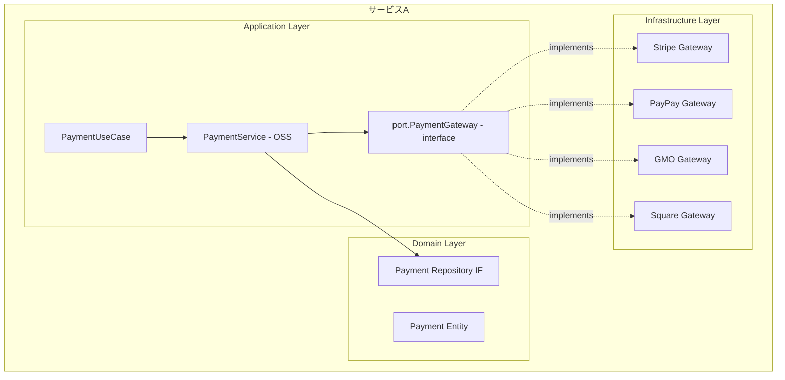
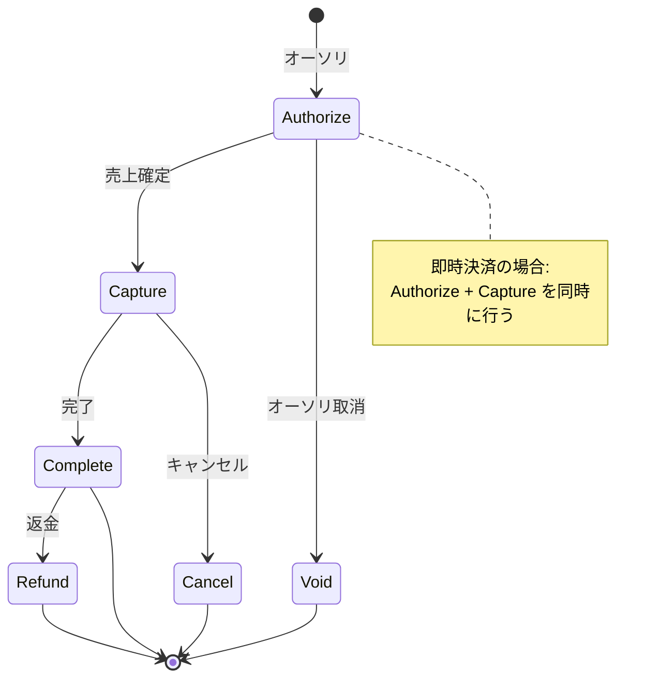
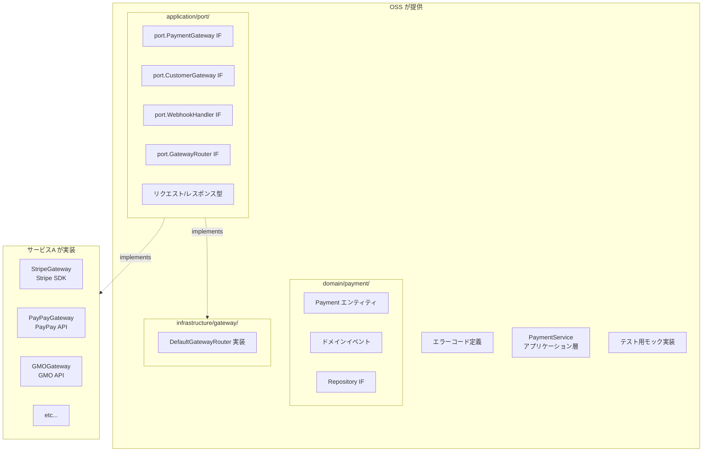

# Payment Gateway Interface 設計

## 1. 概要

決済サービス（Stripe, PayPay, GMO, Square等）に依存しない抽象化レイヤーを提供する。



### パッケージ配置方針

| パッケージ | 配置するもの | 根拠 | 本リポジトリに含まれるか |
|-----------|-------------|------|------|
| `domain/payment/` | Payment エンティティ、ドメインイベント、Repository IF | 純粋なドメイン概念のみ | ✅ 含まれる |
| `application/port/` | PaymentGateway IF, CustomerGateway IF, WebhookHandler IF, GatewayRouter IF, IdempotencyStore IF, リクエスト/レスポンス型 | 外部決済サービスとの統合境界（ポート） | ✅ 含まれる（`gateway.go` / `customer.go` / `webhook.go` / `router.go` / `idempotency_store.go`） |
| `infrastructure/gateway/` | ゲートウェイ実装（Stripe/GMO等）、`GatewayRouter` の具象実装 | 具象実装（アダプタ） | ❌ **含まれない — 利用者実装（BYO Gateway）** |

> **⚠️ 本リポジトリのスコープ（BYO Gateway）**: 本ライブラリは「BYO DB / BYO Gateway」型であり、
> `infrastructure/` にはテスト・デモ用の `inmemory/` のみが含まれる。以下は
> **利用者（またはアダプタリポジトリ）が実装する参考例**であり、本リポジトリのコードには存在しない:
> - `infrastructure/gateway/`（各ゲートウェイ実装、および §5.2 の `DefaultGatewayRouter`）
> - §3.5 の `SubscriptionGateway`
>
> コアが提供するのは `application/port/` のインターフェース（`GatewayRouter` を含む）までである。

> `docs/architecture.md` の「Domain層は外部依存なし」原則に準拠するため、
> HTTP ヘッダー・リダイレクト URL・生レスポンスバイト列等のインフラ詳細を
> `domain/payment/` から `application/port/` に移動した。

---

## 2. 決済の種類と対応範囲

### 2.1 決済方法

| 決済方法 | 説明 | 対応 |
|----------|------|------|
| クレジットカード | Visa, Master, JCB等 | ✅ |
| デビットカード | 即時引落 | ✅ |
| 銀行振込 | 振込依頼→入金確認 | ✅ |
| コンビニ払い | 払込票/バーコード | ✅ |
| QRコード決済 | PayPay, LINE Pay等 | ✅ |
| キャリア決済 | docomo, au, SoftBank | ✅ |
| 後払い | Paidy, NP後払い等 | ✅ |
| 口座振替 | 定期引落 | ✅ |

### 2.2 決済フロー



---

## 3. コアインターフェース

### 3.1 PaymentGateway（メインインターフェース）

```go
// application/port/gateway.go
package port

import (
    "context"
    "time"

    "github.com/contract-to-cash/core/domain/shared"
)

// PaymentGateway 決済ゲートウェイインターフェース
// 各決済サービス（Stripe, PayPay等）はこのインターフェースを実装する
// 旧 domain/payment/gateway.go から application/port/ に移動
type PaymentGateway interface {
    // ============================================================
    // 基本情報
    // ============================================================
    
    // ゲートウェイ識別子（例: "stripe", "paypay", "gmo"）
    ID() string
    
    // サポートする決済方法
    SupportedMethods() []PaymentMethodType

    // ============================================================
    // 決済処理
    // ============================================================

    // Charge 即時決済（オーソリ+キャプチャ同時）
    Charge(ctx context.Context, req *ChargeRequest) (*ChargeResponse, error)

    // Authorize オーソリのみ（与信枠確保）
    Authorize(ctx context.Context, req *AuthorizeRequest) (*AuthorizeResponse, error)

    // Capture 売上確定（オーソリ後）
    Capture(ctx context.Context, req *CaptureRequest) (*CaptureResponse, error)

    // Void オーソリ取消
    Void(ctx context.Context, req *VoidRequest) (*VoidResponse, error)

    // Refund 返金
    Refund(ctx context.Context, req *RefundRequest) (*RefundResponse, error)

    // Cancel キャンセル（売上確定後）
    Cancel(ctx context.Context, req *CancelRequest) (*CancelResponse, error)

    // ============================================================
    // 決済状態
    // ============================================================

    // GetTransaction トランザクション詳細取得
    GetTransaction(ctx context.Context, transactionID string) (*Transaction, error)

    // ============================================================
    // 支払い方法管理
    // ============================================================

    // RegisterPaymentMethod 支払い方法登録（カード情報等）
    RegisterPaymentMethod(ctx context.Context, req *RegisterPaymentMethodRequest) (*PaymentMethodDetail, error)

    // DeletePaymentMethod 支払い方法削除
    DeletePaymentMethod(ctx context.Context, paymentMethodID string) error

    // GetPaymentMethod 支払い方法取得
    GetPaymentMethod(ctx context.Context, paymentMethodID string) (*PaymentMethodDetail, error)

    // ListPaymentMethods 支払い方法一覧
    ListPaymentMethods(ctx context.Context, customerID string) ([]*PaymentMethodDetail, error)
}

// ============================================================
// 決済方法タイプ
// ============================================================

type PaymentMethodType string

const (
    PaymentMethodTypeCreditCard       PaymentMethodType = "credit_card"
    PaymentMethodTypeDebitCard        PaymentMethodType = "debit_card"
    PaymentMethodTypeBankTransfer     PaymentMethodType = "bank_transfer"
    PaymentMethodTypeConvenienceStore PaymentMethodType = "convenience_store"
    PaymentMethodTypeQRCode           PaymentMethodType = "qr_code"
    PaymentMethodTypeCarrier          PaymentMethodType = "carrier"        // キャリア決済
    PaymentMethodTypePostpay          PaymentMethodType = "postpay"        // 後払い
    PaymentMethodTypeDirectDebit      PaymentMethodType = "direct_debit"   // 口座振替
)
```

### 3.2 リクエスト/レスポンス型

```go
// application/port/gateway_types.go
package port

import (
    "time"

    "github.com/contract-to-cash/core/domain/shared"
)

// ============================================================
// Charge（即時決済）
// ============================================================

type ChargeRequest struct {
    // 必須
    Amount      shared.Money
    CustomerID  string           // ゲートウェイ側の顧客ID（PaymentService が AccountID から
                                 // CustomerIDResolver 経由で解決して設定する。§3.3 / issue #231）
    Description string

    // 支払い方法（いずれか必須）
    PaymentMethodID *string      // 登録済みの支払い方法ID
    Token           *string      // ワンタイムトークン（決済GWのJS SDKで取得）

    // 支払い方法種別のヒント（任意、issue #253）。呼び出し側が把握している種別
    // （例: 登録済み PaymentMethodDetail.Type）を渡す。マルチ決済手段アダプタは
    // これを使って課金ごとの PaymentMethod 取得（GET）をスキップして**よい**（MAY）。
    // ゼロ値（空）は「不明」を意味し、従来どおりアダプタが自力で解決する。
    PaymentMethodType PaymentMethodType

    // オプション
    IdempotencyKey  string       // 冪等性キー
    Metadata        map[string]string
    StatementDescriptor string   // 明細表示名

    // 3Dセキュア / リダイレクト型決済の戻り先。
    // コアの ProcessPayment は ProcessPaymentInput.ReturnURL が非空の場合のみ
    // &ThreeDSecureRequest{ReturnURL: ...} を設定する（Required は設定しない。platform#66）
    ThreeDSecure    *ThreeDSecureRequest
}

type ChargeResponse struct {
    TransactionID     string
    Status            TransactionStatus
    Amount            shared.Money
    Fee               *shared.Money     // 決済手数料
    Net               *shared.Money     // 手数料差引後
    PaymentMethodID   string
    PaymentMethodType PaymentMethodType // ゲートウェイが実際に使った支払い方法（§6.4）
    CreatedAt         time.Time
    Metadata          map[string]string
    ThreeDSecure      *ThreeDSecureResult
    // Instructions は非同期/pending/requires_action の結果でアダプタが設定する
    // 顧客向け支払い案内。同期キャプチャ（captured/succeeded）では nil（§6.5.6）
    Instructions      *PaymentInstructions
    // デバッグ用の生レスポンスはインフラ層の実装側でログに記録する
}

// PaymentInstructions は非同期・プッシュ型決済（コンビニ払込票・銀行振込の
// バーチャル口座・ホスト型決済ページ等）でゲートウェイが発行する
// **顧客向け**の支払い案内。アダプタが async/pending/requires_action の
// 結果に設定し、同期キャプチャでは nil のままにする。URL は顧客に提示する
// ためのもの（統合者が「支払い方法のご案内」通知等に使う）。
type PaymentInstructions struct {
    Kind      string     // 案内の種別: "hosted_page" / "konbini_voucher" / "bank_transfer" 等
    URL       string     // 顧客向け URL（払込票ページ、ホスト型チェックアウト等）
    Reference string     // 支払いコード・マスク済み口座番号サマリ等（任意）
    ExpiresAt *time.Time // 支払い期限（払込票の有効期限等、任意）
}

// ============================================================
// Authorize（オーソリ）
// ============================================================

type AuthorizeRequest struct {
    Amount          shared.Money
    CustomerID      string
    PaymentMethodID *string
    Token           *string      // ワンタイムトークン

    // 支払い方法種別のヒント（任意、issue #253）。ChargeRequest と同じ契約:
    // ゲートウェイは lookup のスキップに使ってよく、空は「不明」（従来挙動）。
    PaymentMethodType PaymentMethodType

    IdempotencyKey  string
    Metadata        map[string]string

    // オーソリ有効期限（指定しない場合はゲートウェイのデフォルト）
    ExpiresIn       *time.Duration
}

type AuthorizeResponse struct {
    AuthorizationID string
    TransactionID   string
    Status          TransactionStatus
    Amount          shared.Money
    ExpiresAt       *time.Time
    CreatedAt       time.Time
    Metadata        map[string]string
}

// ============================================================
// Capture（売上確定）
// ============================================================

type CaptureRequest struct {
    AuthorizationID string
    Amount          *shared.Money   // nilの場合はオーソリ全額
    IdempotencyKey  string
    Metadata        map[string]string
}

type CaptureResponse struct {
    TransactionID   string
    AuthorizationID string
    Status          TransactionStatus
    Amount          shared.Money
    Fee             *shared.Money
    Net             *shared.Money
    CapturedAt      time.Time
}

// ============================================================
// Void（オーソリ取消）
// ============================================================

type VoidRequest struct {
    AuthorizationID string
    IdempotencyKey  string
}

type VoidResponse struct {
    AuthorizationID string
    Status          TransactionStatus
    VoidedAt        time.Time
}

// ============================================================
// Refund（返金）
// ============================================================

type RefundRequest struct {
    TransactionID   string
    Amount          *shared.Money   // nilの場合は全額返金
    Reason          RefundReason
    IdempotencyKey  string
    Metadata        map[string]string
}

type RefundReason string

const (
    RefundReasonDuplicate           RefundReason = "duplicate"
    RefundReasonFraudulent          RefundReason = "fraudulent"
    RefundReasonRequestedByCustomer RefundReason = "requested_by_customer"
    RefundReasonOther               RefundReason = "other"
)

type RefundResponse struct {
    RefundID        string
    TransactionID   string
    Status          RefundStatus
    Amount          shared.Money
    Reason          RefundReason
    RefundedAt      time.Time
}

type RefundStatus string

const (
    RefundStatusPending   RefundStatus = "pending"
    RefundStatusSucceeded RefundStatus = "succeeded"
    RefundStatusFailed    RefundStatus = "failed"
    RefundStatusCanceled  RefundStatus = "canceled"
)

// ============================================================
// Cancel（キャンセル）
// ============================================================

type CancelRequest struct {
    TransactionID  string
    IdempotencyKey string
}

type CancelResponse struct {
    TransactionID string
    Status        TransactionStatus
    CanceledAt    time.Time
}

// ============================================================
// Transaction（トランザクション）
// ============================================================

type Transaction struct {
    ID              string
    GatewayID       string            // どのゲートウェイか
    Type            TransactionType
    Status          TransactionStatus
    Amount          shared.Money
    Fee             *shared.Money
    Net             *shared.Money
    CustomerID      string
    PaymentMethodID string
    Description     string
    Metadata        map[string]string
    
    // 関連ID
    AuthorizationID *string
    RefundIDs       []string
    
    // タイムスタンプ
    CreatedAt       time.Time
    UpdatedAt       time.Time
    CapturedAt      *time.Time
    RefundedAt      *time.Time
    
    // エラー情報
    FailureCode     *string
    FailureMessage  *string
}

type TransactionType string

const (
    TransactionTypeCharge       TransactionType = "charge"
    TransactionTypeAuthorize    TransactionType = "authorize"
    TransactionTypeCapture      TransactionType = "capture"
    TransactionTypeRefund       TransactionType = "refund"
    TransactionTypeVoid         TransactionType = "void"
)

type TransactionStatus string

const (
    TransactionStatusPending    TransactionStatus = "pending"
    TransactionStatusAuthorized TransactionStatus = "authorized"
    TransactionStatusCaptured   TransactionStatus = "captured"
    TransactionStatusSucceeded  TransactionStatus = "succeeded"
    TransactionStatusFailed     TransactionStatus = "failed"
    TransactionStatusCanceled   TransactionStatus = "canceled"
    TransactionStatusRefunded   TransactionStatus = "refunded"
    TransactionStatusPartiallyRefunded TransactionStatus = "partially_refunded"
)

// ============================================================
// PaymentMethodDetail（支払い方法詳細 — ポート層）
// ============================================================

type PaymentMethodDetail struct {
    ID          string
    CustomerID  string
    Type        PaymentMethodType
    IsDefault   bool
    CreatedAt   time.Time
    
    // タイプ別詳細（どれか1つが設定される）
    Card        *CardDetails
    BankAccount *BankAccountDetails
    QRCode      *QRCodeDetails
}

type CardDetails struct {
    Brand       CardBrand
    Last4       string
    ExpMonth    int
    ExpYear     int
    Fingerprint string   // カード識別子（重複検知用）
    Country     string
    Funding     string   // credit, debit, prepaid
}

type CardBrand string

const (
    CardBrandVisa       CardBrand = "visa"
    CardBrandMastercard CardBrand = "mastercard"
    CardBrandJCB        CardBrand = "jcb"
    CardBrandAmex       CardBrand = "amex"
    CardBrandDiners     CardBrand = "diners"
    CardBrandDiscover   CardBrand = "discover"
    CardBrandUnknown    CardBrand = "unknown"
)

type BankAccountDetails struct {
    BankName      string
    BankCode      string
    BranchName    string
    BranchCode    string
    AccountType   string  // 普通, 当座
    AccountNumber string  // マスク済み（下4桁等）
    AccountHolder string
}

type QRCodeDetails struct {
    Provider string  // paypay, linepay, etc.
    UserID   string
}

// ============================================================
// セキュリティ方針: カード情報の非通過型設計
// ============================================================
//
// 本ライブラリはPCI DSS SAQ A相当の「非通過型」設計を採用する。
// カード番号・CVC等のセンシティブ情報はサーバーサイドのコードに
// 一切登場しない。
//
// 決済フロー:
//   1. クライアント側で決済GWのJS SDK（Stripe Elements, payjp.js v2,
//      GMO MpToken.js, Square Web Payments SDK等）を使用
//   2. カード情報は決済GWサーバーに直接送信されトークン化
//   3. サーバーにはトークン（またはPaymentMethodID）のみが送信される
//
// CardSource型（カード番号・CVCの直接受信）は意図的に提供しない。
// これにより:
//   - PCI DSSスコープを最小化（SAQ A: 約30要件）
//   - 改正割賦販売法（2018年施行）の非保持化要件に準拠
//   - OSSライブラリ利用者のセキュリティリスクを排除
//
// 参考:
//   - PCI DSS 4.0 要件3.2.2: 認証後のCVC保持は禁止
//   - 改正割賦販売法: PCI DSS非準拠の加盟店は非通過型が義務
//   - Square: カード番号直接送信APIを提供しない設計を採用

// ============================================================
// 3Dセキュア
// ============================================================

// ThreeDSecureRequest は application/port/ に配置
// ReturnURL（リダイレクトURL）はインフラ寄りの概念だが、
// ゲートウェイIF のリクエストパラメータとしてポート層に含める
type ThreeDSecureRequest struct {
    Required    bool
    ReturnURL   string  // 認証後のリダイレクトURL
}

type ThreeDSecureResult struct {
    Status      ThreeDSecureStatus
    RedirectURL *string  // 3DS認証ページURL
}

type ThreeDSecureStatus string

const (
    ThreeDSecureStatusSucceeded       ThreeDSecureStatus = "succeeded"
    ThreeDSecureStatusAttempted       ThreeDSecureStatus = "attempted"
    ThreeDSecureStatusFailed          ThreeDSecureStatus = "failed"
    ThreeDSecureStatusNotSupported    ThreeDSecureStatus = "not_supported"
    ThreeDSecureStatusRequired        ThreeDSecureStatus = "required"
)

// ============================================================
// 支払い方法登録
// ============================================================

type RegisterPaymentMethodRequest struct {
    CustomerID    string
    Type          PaymentMethodType
    SetAsDefault  bool

    // トークン（必須）
    // 決済GWのJS SDKでカード情報/銀行口座情報をトークン化したもの
    Token         string

    // 請求先住所（3Dセキュア等で使用）
    BillingAddress *Address
}

// BankAccountSource は削除。
// 銀行口座情報もトークン化して RegisterPaymentMethodRequest.Token で渡す。
// ゲートウェイ実装が口座振替対応の場合、各GWのJS SDKまたは
// ホスト型フォームで口座情報をトークン化する。

type Address struct {
    PostalCode string
    Country    string
    State      string
    City       string
    Line1      string
    Line2      string
}
```

### 3.3 顧客管理インターフェース

```go
// application/port/customer.go
package port

import (
    "context"
    "time"
)

// CustomerGateway 顧客管理インターフェース
// 決済ゲートウェイ側の顧客情報を管理
// 旧 domain/payment/customer.go から application/port/ に移動
type CustomerGateway interface {
    // 顧客作成
    CreateCustomer(ctx context.Context, req *CreateCustomerRequest) (*Customer, error)
    
    // 顧客更新
    UpdateCustomer(ctx context.Context, req *UpdateCustomerRequest) (*Customer, error)
    
    // 顧客取得
    GetCustomer(ctx context.Context, customerID string) (*Customer, error)
    
    // 顧客削除
    DeleteCustomer(ctx context.Context, customerID string) error
}

type CreateCustomerRequest struct {
    Email       string
    Name        string
    Description string
    Phone       string
    Address     *Address
    Metadata    map[string]string
    
    // 内部ID（自サービスのAccountIDなど）
    InternalID  string
}

type UpdateCustomerRequest struct {
    CustomerID  string
    Email       *string
    Name        *string
    Description *string
    Phone       *string
    Address     *Address
    Metadata    map[string]string
}

type Customer struct {
    ID          string
    Email       string
    Name        string
    Description string
    Phone       string
    Address     *Address
    Metadata    map[string]string
    CreatedAt   time.Time
    UpdatedAt   time.Time
    
    // 関連する支払い方法
    DefaultPaymentMethodID *string
}
```

#### CustomerIDResolver（内部 AccountID → ゲートウェイ顧客ID の解決、issue #231）

```go
// application/port/customer_resolver.go

// CustomerIDResolver は内部の shared.AccountID を決済プロバイダ側の顧客IDへ写像する。
type CustomerIDResolver interface {
    // ResolveCustomerID は accountID に対応するゲートウェイ側顧客IDを返す。
    // 非 nil エラー（または空文字の解決結果）は、ゲートウェイ呼び出しの**前**に
    // 決済オペレーションを中断させる — ここでエラーを返すのは money-safe。
    // マッピングが無い場合は内部IDへ黙ってフォールバックせず not-found 系エラーを返すこと。
    ResolveCustomerID(ctx context.Context, accountID shared.AccountID) (string, error)
}
```

- `service.WithCustomerIDResolver(r)` で `PaymentService` に配線する。配線すると、
  顧客IDを運ぶ**すべてのゲートウェイ呼び出しの前**（`ProcessPayment` の Charge、
  `ResolvePaymentMethod` の `CustomerGateway.GetCustomer` 参照）にリゾルバが走り、
  解決失敗は**ゲートウェイに触れる前に**オペレーションを中断する（money-safe）。
- **未配線時は legacy identity mapping**: 内部 `shared.AccountID` をそのまま
  ゲートウェイ顧客IDとして送る。これは**呼び出し側が顧客IDを自由に決められる
  ゲートウェイ**（例: GMO PG の MemberID を自社ID体系で登録する運用）にのみ適合する。
- **ゲートウェイが顧客IDを自前で採番する方式（Stripe が典型 — `cus_...` は Stripe が
  採番する不透明値）では identity mapping は誤り**で、内部 AccountID を顧客IDとして
  参照する Charge は失敗する。そうしたゲートウェイのデプロイメントは**必ず**リゾルバを
  配線すること。実装は通常、`CustomerGateway.CreateCustomer` がプロバイダ採番IDを
  返した時点で記録したマッピングを引く。
### 3.4 Webhookインターフェース

```go
// application/port/webhook.go
package port

import (
    "context"
    "encoding/json"
    "time"

    "github.com/contract-to-cash/core/domain/shared"
)

// WebhookHandler Webhookハンドラインターフェース
// ゲートウェイごとに実装する。署名検証・トランスポート層タイムスタンプ検証・パースを担当。
// 旧 domain/payment/webhook.go から application/port/ に移動
//
// ⚠️ リプレイ攻撃防止はこのアダプタの責務（issue #191）:
//   ParseAndVerify は「HMAC署名で保護されたトランスポート層タイムスタンプ」
//   （例: Stripe の Stripe-Signature の t=、Adyen の HMAC 対象タイムスタンプ）を
//   短い許容範囲（Standard Webhooks 推奨 5分）で検証し、古い/未来のリクエストを
//   拒否する。攻撃者はこの署名済みタイムスタンプを改竄できないため、これが
//   リプレイ防止の正しい場所である。
//   一方、イベント本文の発生時刻 WebhookEvent.CreatedAt はリプレイ制御に使ってはならない。
//   ゲートウェイは失敗した Webhook を数時間〜数日にわたり「元の CreatedAt のまま」
//   再送するため、CreatedAt の古さで拒否すると正当な再送を恒久的に失う（issue #191）。
type WebhookHandler interface {
    // ParseAndVerify Webhookリクエストの検証とパースを一括で行う
    // 以下を順に実行する:
    //   1. 署名検証（HMAC-SHA256等、ゲートウェイ固有）
    //   2. トランスポート層タイムスタンプ検証（署名済みタイムスタンプでリプレイ拒否）
    //   3. ペイロードのパース
    ParseAndVerify(ctx context.Context, req *WebhookRequest) (*WebhookEvent, error)
}

// WebhookRequest HTTP Webhookリクエスト
type WebhookRequest struct {
    Headers map[string]string
    Body    []byte
}

// WebhookEvent パース済みWebhookイベント
type WebhookEvent struct {
    ID        string           // イベント一意ID（重複検出に使用）
    Type      WebhookEventType
    CreatedAt time.Time        // イベント発生時刻（UTC必須）。リプレイ制御には使わない（issue #191）
    Data      json.RawMessage
    RawData   []byte
}

// ============================================================
// Webhook処理サービス（アプリケーション層）
// ============================================================
//
// WebhookHandlerはゲートウェイ固有のパース・検証（署名 + トランスポート層
// タイムスタンプによるリプレイ防止）を担当する。
// 以下の横断的関心事はアプリケーション層の WebhookProcessor が担当する:
//   - イベント重複検出（冪等性保証。重複はここで吸収する）
//   - リトライ可能/不可能エラーの分類
//   - Dead Letter Queue（リトライ超過時の追跡）
//   - （任意）MaxEventAge による粗い陳腐化ガード（デフォルト無効）
//
// リプレイ攻撃防止は WebhookProcessor の責務ではない（issue #191）:
//   イベント本文 CreatedAt での双方向タイムスタンプ検証は廃止した。
//   ゲートウェイは失敗 Webhook を元の CreatedAt のまま数時間〜数日再送するため、
//   本文タイムスタンプで拒否すると正当な再送を恒久的に失う。リプレイ防止は
//   ParseAndVerify（署名済みトランスポート層タイムスタンプ）が担う。
//
// 設計根拠:
//   - Stripeは最長3日間リトライするため、重複検出TTLは72時間が必要
//   - 決済GWは「2xxか否か」でリトライ判定するため、HTTPステータスの使い分けが重要

// デフォルト値
const (
    DefaultDeduplicationTTL   = 72 * time.Hour     // Stripeの最大リトライ期間(3日)に合わせる
    DefaultMaxRetries         = 3
    DefaultRetryBackoff       = 1 * time.Second
)

// WebhookProcessor Webhook処理サービス
type WebhookProcessor struct {
    handler      WebhookHandler
    deduplicator WebhookDeduplicator
    dlq          WebhookDeadLetterQueue // nil許容（DLQなしでも動作）
    clock        shared.Clock           // テスト時にタイムスタンプ検証の「現在時刻」を制御
    config       WebhookProcessorConfig
}

// WebhookProcessorConfig Webhook処理設定
type WebhookProcessorConfig struct {
    // Deprecated: TimestampTolerance は本文 CreatedAt には適用されなくなり、
    // ProcessWebhook に一切影響しない（issue #191）。以前は本文 CreatedAt の
    // 双方向検証に使われていたが、それが正当な再送（元の古い CreatedAt を持つ）を
    // 恒久的に失わせていた。リプレイ防止は ParseAndVerify（署名済みトランスポート
    // 層タイムスタンプ）へ移した。粗い陳腐化ガードが必要なら MaxEventAge を使う。
    // 後方互換のためフィールドは残す（非負のみ検証）。将来のメジャーで削除予定。
    TimestampTolerance time.Duration

    // MaxEventAge >0 のとき、本文 CreatedAt がこの値より古いイベントを破棄する。
    // 粗い「一方向」の陳腐化ガードであり、リプレイ制御ではない（例: 30日）。
    // 極端に古い/ゴミなペイロードを弾く用途のみ。デフォルト 0（無効）なので、
    // 数時間〜数日遅れて届く正当な再送は常に通過する。
    //
    // 破棄時の挙動: 期限超過は一時的な状態ではないため、GW に再送させても
    // 毎回同じ拒否になるだけ（ノイズ）。したがって:
    //   - DLQ あり: 理由付き（LastError に MaxEventAge 超過、RetryCount=0 =
    //     ハンドラ未実行）で DLQ に記録し、Warn ログを出して nil を返す（ACK。
    //     GW の再送が止まり、運用者は DLQ から調査/再処理できる）。
    //     DLQ 送信自体が失敗した場合は記録できていないので error を返す（GW 再送で
    //     後続試行が DLQ 記録をやり直す）。
    //   - DLQ なし: GW 再送が唯一の回復チャネルなので、型付き
    //     *WebhookError{Code: WebhookErrorCodeEventTooOld} を返す。
    MaxEventAge time.Duration

    // DeduplicationTTL 重複検出レコードの保持期間
    // Stripeは最長3日間リトライするため、72時間以上を推奨
    // デフォルト: 72時間
    DeduplicationTTL time.Duration

    // MaxRetries リトライ可能エラー発生時の最大リトライ回数
    // デフォルト: 3
    MaxRetries int

    // RetryBackoff リトライ間隔の基準値（指数バックオフ + ジッター）
    // 実際の間隔: backoff * 2^(attempt-1) + random(0, backoff/10)
    // デフォルト: 1秒
    RetryBackoff time.Duration
}

// ============================================================
// 重複検出インターフェース
// ============================================================

// WebhookDeduplicator イベント重複検出インターフェース
// 利用者がストレージ実装を提供する（Redis SETNX + TTL、RDB UPSERT等）
type WebhookDeduplicator interface {
    // IsDuplicate イベントIDが処理済みかチェックし、未処理なら記録する
    // ttl: レコード保持期間。期限切れ後は自動削除される
    // 原子的に「チェック＆マーク」を行うこと（Redis: SETNX+EXPIRE、RDB: INSERT ON CONFLICT）
    IsDuplicate(ctx context.Context, eventID string, ttl time.Duration) (bool, error)
}

// 推奨ストレージ実装:
//
// Redis（高速・推奨）:
//   SET webhook:{eventID} 1 NX EX {ttl_seconds}
//   → OK: 初回（処理実行）、nil: 重複（スキップ）
//
// RDB（永続・監査対応）:
//   INSERT INTO processed_webhooks (event_id, processed_at, expires_at)
//   VALUES ($1, NOW(), NOW() + $2)
//   ON CONFLICT (event_id) DO NOTHING
//   → affected=1: 初回、affected=0: 重複
//
// ハイブリッド（推奨）:
//   Redis で高速フィルタ（第一防衛線）
//   + RDB で永続記録（監査ログ兼第二防衛線）

// ============================================================
// Dead Letter Queue インターフェース
// ============================================================

// WebhookDeadLetterQueue リトライ超過イベントの記録先
// リトライ上限を超えたイベントを保存し、手動/バッチでの再処理を可能にする
type WebhookDeadLetterQueue interface {
    // Send 処理失敗したイベントをDLQに記録する
    Send(ctx context.Context, entry *WebhookDLQEntry) error
}

// WebhookDLQEntry DLQエントリ
type WebhookDLQEntry struct {
    EventID    string
    EventType  WebhookEventType
    Payload    []byte           // 元のWebhookペイロード
    LastError  string           // 最後のエラーメッセージ
    RetryCount int              // 実行したリトライ回数
    CreatedAt  time.Time        // DLQ投入時刻
}

// ============================================================
// エラー分類
// ============================================================

// WebhookRetryableError リトライ可能なエラーをラップする
// ネットワークエラー、DB一時障害等に使用する
type WebhookRetryableError struct {
    Err error
}

func (e *WebhookRetryableError) Error() string { return e.Err.Error() }
func (e *WebhookRetryableError) Unwrap() error { return e.Err }

// isRetryable エラーがリトライ可能か判定する
// WebhookRetryableError でラップされている場合のみリトライする
// それ以外（ビジネスロジックエラー等）は即座にDLQへ送る
func isRetryable(err error) bool {
    var retryable *WebhookRetryableError
    return errors.As(err, &retryable)
}

// エラー分類ガイド:
//
// リトライ可能（WebhookRetryableErrorでラップ）:
//   - DB接続エラー、タイムアウト
//   - 外部API一時障害（5xx）
//   - Rate Limit（429）
//
// リトライ不可（素のerrorで返す）:
//   - 存在しない顧客ID参照
//   - 不整合なステート遷移
//   - バリデーションエラー

// ============================================================
// Webhook処理メインロジック
// ============================================================

// ProcessWebhook Webhookイベントを安全に処理する
//
// 処理フロー:
//   1. ParseAndVerify（署名検証 + トランスポート層タイムスタンプ検証 + パース）
//   2. （任意）MaxEventAge による粗い陳腐化ガード（デフォルト無効）。
//      本文 CreatedAt によるリプレイ検証は行わない（issue #191）
//   3. 重複検出（冪等性保証、TTL付き）
//   4. イベントハンドラ呼び出し（リトライ可能エラーのみリトライ）
//   5. リトライ超過時はDLQに送信
func (p *WebhookProcessor) ProcessWebhook(
    ctx context.Context,
    req *WebhookRequest,
    handler func(ctx context.Context, event *WebhookEvent) error,
) error {
    // 1. パースと署名検証（ゲートウェイ固有）。リプレイ防止は ParseAndVerify が
    //    署名済みトランスポート層タイムスタンプで担う。
    event, err := p.handler.ParseAndVerify(ctx, req)
    if err != nil {
        return &WebhookError{Code: WebhookErrorCodeInvalidSignature, Cause: err}
    }

    // 2. 任意の粗い陳腐化ガード（MaxEventAge）。
    //    リプレイ防止は行わない: ゲートウェイは失敗 Webhook を元の CreatedAt の
    //    まま数時間〜数日再送するため、本文 CreatedAt の古さ/未来で拒否しない
    //    （issue #191）。MaxEventAge は極端に古いペイロードのみを弾く一方向ガード。
    //    超過は一時的な状態ではなく再送させても毎回同じ拒否になるため、
    //    DLQ があれば「記録して ACK」、なければ型付きエラーで GW 再送に委ねる。
    if p.config.MaxEventAge > 0 {
        now := p.clock.Now()
        if age := now.Sub(event.CreatedAt); age > p.config.MaxEventAge {
            ageErr := &WebhookError{
                Code:    WebhookErrorCodeEventTooOld,
                Message: fmt.Sprintf("event %s is %v old (max: %v)", event.ID, age, p.config.MaxEventAge),
            }
            if p.dlq != nil {
                // 運用者が調査/再処理できるよう理由付きで DLQ に記録し、
                // nil（ACK）で GW の無意味な再送を止める。
                // RetryCount=0: ハンドラは一度も実行されていない。
                // DLQ 送信失敗時は記録できていないため error を返す（GW が再送）。
                if dlqErr := p.dlq.Send(ctx, &WebhookDLQEntry{
                    EventID: event.ID, EventType: event.Type, Payload: event.RawData,
                    LastError: ageErr.Error(), RetryCount: 0, CreatedAt: now,
                }); dlqErr != nil {
                    return fmt.Errorf("DLQ send failed: %w (original: %v)", dlqErr, ageErr)
                }
                // Warn ログ（event_id / age / max_event_age）
                return nil
            }
            return ageErr // DLQ なし: GW 再送が唯一の回復チャネル
        }
    }

    // 3. 重複検出（冪等性保証）
    ttl := p.config.DeduplicationTTL
    if ttl == 0 {
        ttl = DefaultDeduplicationTTL
    }
    isDup, err := p.deduplicator.IsDuplicate(ctx, event.ID, ttl)
    if err != nil {
        return &WebhookError{Code: WebhookErrorCodeDuplicate, Cause: err}
    }
    if isDup {
        return nil // 重複イベントは正常応答（HTTP 200）で無視
    }

    // 4. イベント処理（リトライ付き）
    maxRetries := p.config.MaxRetries
    if maxRetries == 0 {
        maxRetries = DefaultMaxRetries
    }
    backoff := p.config.RetryBackoff
    if backoff == 0 {
        backoff = DefaultRetryBackoff
    }

    var lastErr error
    for attempt := 0; attempt <= maxRetries; attempt++ {
        // コンテキストキャンセルチェック
        select {
        case <-ctx.Done():
            return ctx.Err()
        default:
        }

        if attempt > 0 {
            // 指数バックオフ + ジッター（同時大量失敗時のスパイク防止）
            delay := backoff * time.Duration(1<<uint(attempt-1))
            jitter := time.Duration(rand.Intn(int(delay / 10))) // 10%ジッター
            time.Sleep(delay + jitter)
        }

        if err := handler(ctx, event); err != nil {
            lastErr = err
            // リトライ不可能なエラーは即座に中断
            if !isRetryable(err) {
                break
            }
            continue
        }
        return nil // 処理成功
    }

    // 5. リトライ超過 or 非リトライエラー → DLQに送信
    //    DLQ送信失敗はログ出力するが、呼び出し元にはProcessingFailedを返す
    if p.dlq != nil {
        if dlqErr := p.dlq.Send(ctx, &WebhookDLQEntry{
            EventID:    event.ID,
            EventType:  event.Type,
            Payload:    event.RawData,
            LastError:  lastErr.Error(),
            RetryCount: maxRetries,
            CreatedAt:  p.clock.Now(),
        }); dlqErr != nil {
            // DLQ送信失敗は致命的ではないが、必ずログに記録する
            // 実装時: log.Error("failed to send to DLQ", "event_id", event.ID, "error", dlqErr)
        }
    }
    return &WebhookError{
        Code: WebhookErrorCodeProcessingFailed,
        Cause:  fmt.Errorf("after %d attempts: %w", maxRetries+1, lastErr),
    }
}

// ============================================================
// Webhookエラー型とHTTPステータスマッピング
// ============================================================

// WebhookErrorCode Webhookエラーコード
type WebhookErrorCode string

const (
    WebhookErrorCodeInvalidSignature WebhookErrorCode = "invalid_signature"
    WebhookErrorCodeInvalidPayload   WebhookErrorCode = "invalid_payload"
    WebhookErrorCodeUnsupportedEvent WebhookErrorCode = "unsupported_event"
    WebhookErrorCodeDuplicate        WebhookErrorCode = "duplicate_event"
    WebhookErrorCodeProcessingFailed WebhookErrorCode = "processing_failed"
    // MaxEventAge 超過（DLQ 未設定時のみ返る。DLQ ありなら DLQ 記録 + ACK）
    WebhookErrorCodeEventTooOld      WebhookErrorCode = "event_too_old"
)

// WebhookError Webhook処理エラー
type WebhookError struct {
    Code    WebhookErrorCode
    Message string
    Cause   error
}

func (e *WebhookError) Error() string {
    if e.Cause != nil {
        return fmt.Sprintf("[%s] %s: %v", e.Code, e.Message, e.Cause)
    }
    return fmt.Sprintf("[%s] %s", e.Code, e.Message)
}
func (e *WebhookError) Unwrap() error { return e.Cause }

// MapWebhookErrorToHTTP WebhookエラーをHTTPステータスコードに変換する
//
// 決済GWは「2xxか否か」でリトライ判定するため注意:
//   - リトライさせたい障害 → 503を返す（GW側がリトライする）
//   - リトライさせたくないエラー → 200を返す（内部でDLQ/アラート対応）
//
// | 状況                        | HTTPステータス | GW側の挙動    | 備考                    |
// |----------------------------|-------------|------------|------------------------|
// | 処理成功                     | 200         | リトライしない | —                      |
// | 重複イベント（正常系）          | 200         | リトライしない | ProcessWebhookがnil返却  |
// | 非リトライエラー（DLQ行き）     | 200         | リトライしない | DLQで追跡               |
// | 署名/トランスポートTS検証失敗   | 401         | リトライする  | 不正リクエスト（ParseAndVerify） |
// | MaxEventAge 超過（DLQあり）     | 200         | リトライしない | DLQに記録済み + ACK（nil返却） |
// | MaxEventAge 超過（DLQなし）     | 400         | リトライする  | event_too_old。再送が唯一の回復チャネル |
// | 重複検出ストレージ障害          | 503         | リトライする  | Redis/DB一時障害         |
// | リトライ可能な内部エラー         | 503         | リトライする  | ※ProcessWebhook内で処理済 |
//
// ※本文 CreatedAt の古さでは拒否しない（正当な再送を失うため。issue #191）。
//   リプレイ防止は ParseAndVerify の署名済みトランスポート層タイムスタンプが担う。
//   MaxEventAge 超過は一時的な状態ではないため、DLQ があれば ACK して再送ノイズを
//   止める（PR #200 レビュー対応）。
func MapWebhookErrorToHTTP(err error) int {
    var webhookErr *WebhookError
    if !errors.As(err, &webhookErr) {
        return 500 // 想定外エラー
    }
    switch webhookErr.Code {
    case WebhookErrorCodeInvalidSignature:
        return 401
    case WebhookErrorCodeInvalidPayload:
        return 400
    case WebhookErrorCodeEventTooOld:
        return 400 // DLQ 未設定時のみ到達（DLQ ありなら nil=200 で ACK 済み）
    case WebhookErrorCodeDuplicate:
        return 200 // 重複イベント → GW側のリトライは不要
    case WebhookErrorCodeProcessingFailed:
        return 200 // DLQに送信済み → GW側のリトライは不要
    default:
        return 500
    }
}

type WebhookEventType string

const (
    // 決済イベント
    WebhookEventPaymentSucceeded      WebhookEventType = "payment.succeeded"
    WebhookEventPaymentFailed         WebhookEventType = "payment.failed"
    WebhookEventPaymentPending        WebhookEventType = "payment.pending"
    
    // 返金イベント
    WebhookEventRefundSucceeded       WebhookEventType = "refund.succeeded"
    WebhookEventRefundFailed          WebhookEventType = "refund.failed"
    
    // チャージバック
    WebhookEventChargebackCreated     WebhookEventType = "chargeback.created"
    WebhookEventChargebackUpdated     WebhookEventType = "chargeback.updated"
    WebhookEventChargebackClosed      WebhookEventType = "chargeback.closed"
    
    // 支払い方法
    WebhookEventPaymentMethodAttached WebhookEventType = "payment_method.attached"
    WebhookEventPaymentMethodDetached WebhookEventType = "payment_method.detached"
    WebhookEventPaymentMethodExpiring WebhookEventType = "payment_method.expiring"
    
    // サブスクリプション（ゲートウェイ側で管理する場合）
    WebhookEventSubscriptionCreated   WebhookEventType = "subscription.created"
    WebhookEventSubscriptionUpdated   WebhookEventType = "subscription.updated"
    WebhookEventSubscriptionCanceled  WebhookEventType = "subscription.canceled"
    
    // 銀行振込・コンビニ払い
    WebhookEventPaymentInstructionCreated WebhookEventType = "payment_instruction.created"
    WebhookEventPaymentReceived       WebhookEventType = "payment.received"
)

```

### 3.5 定期課金インターフェース（オプション）

> **📌 利用者実装の参考例（本リポジトリには含まれない）**: 以下の `SubscriptionGateway`
> と関連型は、ゲートウェイ側でサブスクリプションを管理したい利用者向けの**設計スケッチ**である。
> `domain/payment/subscription_gateway.go` は本リポジトリに存在しない（コアは契約・請求を
> 自前で管理するため定期課金 IF を必要としない）。実装する場合は、インフラ詳細を含まない IF は
> `application/port/` に置くのが本リポジトリの配置方針に沿う。

```go
// （参考例）application/port/subscription_gateway.go — 利用者が実装する場合の配置例
package port

import (
    "context"
    "time"
)

// SubscriptionGateway 定期課金管理インターフェース
// ゲートウェイ側でサブスクリプションを管理する場合に使用
// （自前で管理する場合は不要）
type SubscriptionGateway interface {
    // サブスクリプション作成
    CreateSubscription(ctx context.Context, req *CreateSubscriptionRequest) (*Subscription, error)
    
    // サブスクリプション更新
    UpdateSubscription(ctx context.Context, req *UpdateSubscriptionRequest) (*Subscription, error)
    
    // サブスクリプションキャンセル
    CancelSubscription(ctx context.Context, subscriptionID string, cancelAtPeriodEnd bool) (*Subscription, error)
    
    // サブスクリプション取得
    GetSubscription(ctx context.Context, subscriptionID string) (*Subscription, error)
    
    // サブスクリプション一覧
    ListSubscriptions(ctx context.Context, customerID string) ([]*Subscription, error)
}

type CreateSubscriptionRequest struct {
    CustomerID        string
    PriceID           string           // ゲートウェイ側の価格ID
    PaymentMethodID   *string
    BillingCycleAnchor *time.Time
    TrialEnd          *time.Time
    Metadata          map[string]string
}

type UpdateSubscriptionRequest struct {
    SubscriptionID    string
    PriceID           *string
    PaymentMethodID   *string
    CancelAtPeriodEnd *bool
    Metadata          map[string]string
}

type Subscription struct {
    ID                string
    CustomerID        string
    Status            SubscriptionStatus
    PriceID           string
    Amount            shared.Money
    Interval          string
    IntervalCount     int
    CurrentPeriodStart time.Time
    CurrentPeriodEnd  time.Time
    TrialStart        *time.Time
    TrialEnd          *time.Time
    CancelAt          *time.Time
    CanceledAt        *time.Time
    EndedAt           *time.Time
    CreatedAt         time.Time
}

type SubscriptionStatus string

const (
    SubscriptionStatusTrialing       SubscriptionStatus = "trialing"
    SubscriptionStatusActive         SubscriptionStatus = "active"
    SubscriptionStatusPastDue        SubscriptionStatus = "past_due"
    SubscriptionStatusCanceled       SubscriptionStatus = "canceled"
    SubscriptionStatusUnpaid         SubscriptionStatus = "unpaid"
    SubscriptionStatusIncomplete     SubscriptionStatus = "incomplete"
    SubscriptionStatusIncompleteExpired SubscriptionStatus = "incomplete_expired"
)
```

---

## 4. エラー定義

```go
// application/port/errors.go
package port

import "fmt"

// 決済エラーコード
type ErrorCode string

const (
    // カード関連
    ErrorCodeCardDeclined           ErrorCode = "card_declined"
    ErrorCodeCardExpired            ErrorCode = "card_expired"
    ErrorCodeInsufficientFunds      ErrorCode = "insufficient_funds"
    ErrorCodeInvalidCard            ErrorCode = "invalid_card"
    ErrorCodeInvalidCVC             ErrorCode = "invalid_cvc"
    ErrorCodeInvalidExpiryMonth     ErrorCode = "invalid_expiry_month"
    ErrorCodeInvalidExpiryYear      ErrorCode = "invalid_expiry_year"

    // 処理関連
    ErrorCodeProcessingError        ErrorCode = "processing_error"
    ErrorCodeRateLimitExceeded      ErrorCode = "rate_limit_exceeded"
    ErrorCodeAuthenticationRequired ErrorCode = "authentication_required"
    ErrorCodeDuplicateTransaction   ErrorCode = "duplicate_transaction"
    ErrorCodeAmountTooSmall         ErrorCode = "amount_too_small"
    ErrorCodeAmountTooLarge         ErrorCode = "amount_too_large"
    ErrorCodeCurrencyNotSupported   ErrorCode = "currency_not_supported"
    ErrorCodeMethodNotSupported     ErrorCode = "method_not_supported"
    ErrorCodeCustomerNotFound       ErrorCode = "customer_not_found"

    // ゲートウェイ関連
    ErrorCodeGatewayUnavailable     ErrorCode = "gateway_unavailable"
    ErrorCodeGatewayTimeout         ErrorCode = "gateway_timeout"
    ErrorCodeFraudSuspected         ErrorCode = "fraud_suspected"
    ErrorCodeTestModeTransaction    ErrorCode = "test_mode_transaction"

    // その他
    ErrorCodeUnknown                ErrorCode = "unknown"
)

// GatewayError 決済ゲートウェイエラー
type GatewayError struct {
    Code        ErrorCode
    Message     string
    DeclineCode string            // ゲートウェイ固有の拒否コード
    Param       string            // エラーの原因となったパラメータ
    Retryable   bool              // リトライ可能か
    RawError    error             // 元のエラー
}

func (e *GatewayError) Error() string {
    if e.RawError != nil {
        return fmt.Sprintf("[%s] %s: %v", e.Code, e.Message, e.RawError)
    }
    return fmt.Sprintf("[%s] %s", e.Code, e.Message)
}

func (e *GatewayError) Unwrap() error {
    return e.RawError
}
```

---

## 5. 複合ゲートウェイ（ルーティング）

複数の決済ゲートウェイを使い分けるためのルーター。

### 5.1 GatewayRouter インターフェース（ポート層）

```go
// application/port/router.go
package port

import (
    "context"

    "github.com/contract-to-cash/core/domain/shared"
)

// GatewayRouter 決済ゲートウェイルーター
// 条件に応じて適切なゲートウェイを選択
// 旧 domain/payment/router.go から application/port/ に移動
type GatewayRouter interface {
    // 条件に基づいてゲートウェイを選択
    Route(ctx context.Context, criteria RoutingCriteria) (PaymentGateway, error)
}

type RoutingCriteria struct {
    Amount        shared.Money
    Currency      shared.Currency
    PaymentMethod PaymentMethodType
    CustomerID    string
    Country       string
    Metadata      map[string]string
}

type RoutingRule struct {
    GatewayID      string
    Priority       int
    PaymentMethods []PaymentMethodType
    Currencies     []shared.Currency
    Countries      []string
    MinAmount      *shared.Money
    MaxAmount      *shared.Money
}
```

### 5.2 DefaultGatewayRouter 具象実装（インフラ層）

> **📌 利用者実装の参考例（本リポジトリには含まれない）**: 以下の `DefaultGatewayRouter` は
> §5.1 の `port.GatewayRouter` インターフェースの**具象実装の参考例**であり、
> `infrastructure/gateway/router.go` は本リポジトリに存在しない。コアが提供するのは
> §5.1 のインターフェースまでで、ルーティング実装はアダプタ層（利用者実装）が担う。
> 以下はそのルーティングロジックの設計指針として掲載する。

```go
// （参考例）infrastructure/gateway/router.go — 利用者が実装する具象ルーター
package gateway

import (
    "context"
    "errors"

    "github.com/contract-to-cash/core/application/port"
)

// DefaultGatewayRouter デフォルト実装
// 旧 domain/payment/router.go の実装部分を infrastructure/ に移動
type DefaultGatewayRouter struct {
    gateways map[string]gatewayWithRules
    fallback port.PaymentGateway
}

type gatewayWithRules struct {
    gateway port.PaymentGateway
    rules   []port.RoutingRule
}

func NewGatewayRouter() *DefaultGatewayRouter {
    return &DefaultGatewayRouter{
        gateways: make(map[string]gatewayWithRules),
    }
}

func (r *DefaultGatewayRouter) Register(gw port.PaymentGateway, rules []port.RoutingRule) {
    r.gateways[gw.ID()] = gatewayWithRules{
        gateway: gw,
        rules:   rules,
    }
}

func (r *DefaultGatewayRouter) SetFallback(gw port.PaymentGateway) {
    r.fallback = gw
}

func (r *DefaultGatewayRouter) Route(ctx context.Context, criteria port.RoutingCriteria) (port.PaymentGateway, error) {
    var bestMatch port.PaymentGateway
    var bestPriority int = -1

    for _, gw := range r.gateways {
        for _, rule := range gw.rules {
            if r.matches(rule, criteria) && rule.Priority > bestPriority {
                bestMatch = gw.gateway
                bestPriority = rule.Priority
            }
        }
    }

    if bestMatch != nil {
        return bestMatch, nil
    }

    if r.fallback != nil {
        return r.fallback, nil
    }

    return nil, errors.New("no gateway available for criteria")
}

func (r *DefaultGatewayRouter) matches(rule port.RoutingRule, criteria port.RoutingCriteria) bool {
    // PaymentMethod チェック
    if len(rule.PaymentMethods) > 0 {
        found := false
        for _, t := range rule.PaymentMethods {
            if t == criteria.PaymentMethod {
                found = true
                break
            }
        }
        if !found {
            return false
        }
    }

    // 金額チェック（big.Rat の比較は Cmp を使用）
    if rule.MinAmount != nil && criteria.Amount.Amount().Cmp(rule.MinAmount.Amount()) < 0 {
        return false
    }
    if rule.MaxAmount != nil && criteria.Amount.Amount().Cmp(rule.MaxAmount.Amount()) > 0 {
        return false
    }

    // 国チェック
    if len(rule.Countries) > 0 {
        found := false
        for _, c := range rule.Countries {
            if c == criteria.Country {
                found = true
                break
            }
        }
        if !found {
            return false
        }
    }

    return true
}
```

---

## 6. 決済サービス（アプリケーション層）

> **正準はソース**: 完全な実装は `application/service/payment_service.go`（および
> セトルメント API の `application/service/payment_settlement.go`）を参照。
> 以下は構築・入出力・チャージ結果の分岐の**要点の抜粋**である。フルコピーは
> 陳腐化しやすいため掲載しない。

**構築（要点）**

```go
// application/service/payment_service.go（現行シグネチャ）
func NewPaymentService(
    gateway port.PaymentGateway,
    paymentRepo payment.Repository,
    invoiceRepo invoice.Repository,
    contractRepo contract.Repository,   // 支払い方法フォールバック解決用（§6.4）
    eventStore eventstore.Store,
    registry *plugin.Registry,
    clock shared.Clock,
    opts ...PaymentServiceOption,
) *PaymentService
```

オプション: `WithPaymentLogger` / `WithCustomerGateway`（顧客デフォルト支払い方法の参照、§6.4）/
`WithCustomerIDResolver`（内部 AccountID → ゲートウェイ顧客IDの解決シーム、§3.3 / issue #231）/
`WithPaymentTxManager`（**本番必須**。省略時は Noop へフォールバックし Warn ログ、
意図的な場合は `WithoutPaymentTransactions()` で明示）/ `WithIdempotencyStore`（§6.1）/
`WithPaymentOutboxWriter`（トランザクショナル・アウトボックス、plugin-system.md §11）。

**入力型（現行）**

```go
// ProcessPaymentInput に CustomerID は**無い** — ゲートウェイ顧客IDは呼び出し側が
// 渡すのではなく、請求書の AccountID から CustomerIDResolver で解決する（issue #231）。
// 解決は BeforeCharge フック・ゲートウェイ Charge より前に行われ、失敗はその場で中断する
// （money-safe: まだ何も課金されていない）。
type ProcessPaymentInput struct {
    PaymentMethodID string                // 省略時は §6.4 のフォールバックチェーンで解決
    PaymentMethod   payment.PaymentMethod // 支払い方法種別（省略時は ChargeResponse → credit_card）
    Amount          shared.Money          // ゼロ値なら invoice.AmountDue()
    Currency        shared.Currency
    IdempotencyKey  string                // 必須。空は入口で ErrCodeValidation（issue #241, BREAKING pre-1.0 — 以前の「空キーは冪等性チェックをスキップして続行」という許容は廃止）
    Metadata        map[string]string
    ReturnURL       string                // 任意。リダイレクト型決済の戻り先 URL（platform#66、下記注）

}
```

> **`ReturnURL`（platform#66）**: リダイレクト型決済（PayPay 等の qr_code ウォレット、
> カード 3DS チャレンジ）で顧客が承認後に戻る URL。非空なら `ProcessPayment` が
> `ChargeRequest.ThreeDSecure = &ThreeDSecureRequest{ReturnURL: input.ReturnURL}` として
> ゲートウェイへ伝播する。空なら `ThreeDSecure` は従来どおり nil（後方互換）。
> `ThreeDSecureRequest.Required` はこの経路では設定しない — 3DS の強制は別関心であり、
> ReturnURL の伝播はあくまで「戻り先の器」の受け渡しに限る。
> **同一 `IdempotencyKey` でのリトライでは同じ `ReturnURL` を渡すこと** — Pending
> fall-through では同一キーで再 `Charge` されるため、リクエストボディが前回と異なると
> `idempotency_error` で拒否するゲートウェイ（Stripe 等）がある。

**`ProcessPayment(ctx, invoiceID, input)` のチャージ結果分岐**

ゲートウェイの `Charge` が返す `ChargeResponse.Status` に応じて 4 系統に分岐する:

| ChargeResponse.Status | 挙動 | 戻り値 |
|---|---|---|
| `captured` / `succeeded` | 成功パス: tx 内で Payment 完了 + `inv.RecordPayment` + 両 Save + outbox（§11）。保存失敗は saga 補償（Void→Refund、§6.2）で課金を巻き戻す | `(payment, nil)` |
| `requires_action` | 3DS 認証待ち: **Pending** の Payment を保存し、請求書は未変更。saga なし（未キャプチャ）。`Instructions` があれば Metadata に保存（§6.5.6） | `(pendingPayment, ErrRequiresAction)` |
| `pending` | **非同期決済**（銀行振込・コンビニ・キャリア等、§6.5）: **Pending** の Payment（冪等キー + ゲートウェイ取引 ID + 解決済み支払い方法）を保存し、請求書は未変更。saga なし（入金前なので補償対象が存在しない）。`Instructions` があれば Metadata に保存（§6.5.6） | `(pendingPayment, ErrPaymentPending)` |
| その他（`failed` / `canceled` / `authorized` 等） | 予期しないステータスとしてエラー（成功パスへ進まない） | `(nil, error)` |

ゲートウェイ呼び出し自体がエラーを返した場合は Failed の Payment 記録を best-effort 保存し、
`OnPaymentFailedHook`（非致命）を発火してエラーを返す。`ErrRequiresAction` / `ErrPaymentPending`
はいずれも公開センチネルで、`errors.Is()` で判定する。同一冪等キーでの再試行はプリチャージ
チェックと tx 内チェックで収束する（Completed は冪等リプレイ、Pending は
Pending→Completed 昇格、terminal は `ErrCodeConflict`）。

フック発火・パニック隔離・アウトボックスの正確なタイミングは
`docs/internals/plugin-system.md` §5.3〜§5.4 / §11 を参照。

**`Refund(ctx, paymentID, input)`**（フローの正準は §6.3）:

```go
// load → ValidateRefund（事前検証、ゲートウェイ前）→ 冪等性キー導出（§6.3.2）
// → ゲートウェイ返金（1 invocation につき最大 1 回、tx の前）
// → tx.RetryOnConflict + tx.Run 内で re-load → 累積返金額の進行分類 → RecordRefund → Save（§6.3.3）
// → OnRefund フック（非致命）
func (s *PaymentService) Refund(ctx context.Context, paymentID shared.PaymentID, input RefundInput) error

type RefundInput struct {
    Amount *shared.Money // nil = 未返金残額の全額
    Reason port.RefundReason
    // IdempotencyKey は任意の明示キー。空（通常ケース）なら §6.3.2 の決定的キーを導出する。
    // 明示キーを渡す場合、「同一論理返金のリトライは同一キー・別個の返金は別キー」の契約は
    // 呼び出し側が負う（§6.3.3 の explicit-key 衝突ポリシー参照）
    IdempotencyKey string
}
```

---

## 6.1 Saga 補償と冪等性ストア（Issue #87 対応）

### 6.1.1 解決する課題

`ProcessPayment` は「Gateway Charge 成功 → ローカル DB 保存失敗」時にサガ補償で `Refund` を発火する。このとき、呼び出し元が **同じ `IdempotencyKey`** でリトライすると次の不整合が起きる:

1. Gateway は冪等性ヘッダのキャッシュにより「元の成功レスポンス」をそのまま返す（ただし実際のトランザクションは補償 Refund 済み）
2. `PaymentService` はこの「成功」をそのまま信じて Payment レコードを completed で保存
3. **Invoice は "支払済" になるが、Gateway にはお金がない**

これが Issue #87 で報告された競合。業界プラクティスの調査からの結論は「補償が発火したキーは**同じ論理オペレーション**としては再利用不可。**新しい effective key**で新規 Charge として実行する」。

### 6.1.2 IdempotencyStore インターフェース

```go
// application/port/idempotency_store.go
package port

// IdempotencyStore は補償済みキーと置換 effective key の対応を永続化する。
type IdempotencyStore interface {
    // MarkCompensated は (originalKey → effectiveKey) を記録する。
    // first-call-wins: 同じ originalKey への 2 回目以降の呼び出しは no-op。
    // 空 originalKey はエラー。
    MarkCompensated(ctx context.Context, originalKey, effectiveKey string) error

    // ResolveEffectiveKey は originalKey に対応する effective key を返す。
    // マッピングが存在しない場合は ("", false, nil)。
    ResolveEffectiveKey(ctx context.Context, originalKey string) (effectiveKey string, ok bool, err error)
}
```

### 6.1.3 ProcessPayment のフロー変更

> **📌 空 IdempotencyKey は入口で拒否（issue #241, BREAKING pre-1.0）**: `ProcessPayment` は
> 空の `input.IdempotencyKey` を最初の境界検証で `ErrCodeValidation` により拒否する。
> 以前の「空キーは冪等性チェック・store 呼び出しをスキップして続行」という許容は廃止された
> （空キーでは gateway 側でも重複課金を防げないため、静かな続行はサイレントな二重課金リスク）。
> したがって以下のフローに入る時点でキーは常に非空である。

```
入口: input.IdempotencyKey == "" → ErrCodeValidation で即時 return（#241）

Charge 前:
  if store != nil {
      if eff, ok := store.ResolveEffectiveKey(input.IdempotencyKey); ok {
          effectiveKey = eff   // 補償マーカーあり → 新キーで Charge
      }
  }

Charge(effectiveKey) → 成功
  ↓
Payment.SetIdempotencyKey(effectiveKey)  // DB 側も effective key で一貫管理
  ↓
RunInTx:
  既存の Payment を effectiveKey で検索
    あり → 既存を返却（冪等）
    なし → 新規保存

RunInTx 失敗 → Saga 補償 Refund
  ↓
  if store != nil {
      newEffectiveKey := newRetryEffectiveKey(input.IdempotencyKey) // originalKey + "-" + ULID
      store.MarkCompensated(input.IdempotencyKey, newEffectiveKey)
      // 失敗はログ出力のみ。補償自体は成功済み。
  }
```

### 6.1.4 設計ポイント

| 設計判断 | 理由 |
|---|---|
| **opt-in** (`WithIdempotencyStore`) | 後方互換。store 未設定なら完全に従来挙動 |
| **first-call-wins** | 並行リトライでも effective key が収束する。「同じ original key → 同じ effective key」の関係を保証 |
| **空 key は入口で拒否（#241, BREAKING pre-1.0）** | 空キーでは gateway 側でも重複を追跡できず、重複課金防止が成立しない。旧挙動（空キーを許容し冪等性チェックをスキップして課金続行）は廃止し、`ProcessPayment` が `ErrCodeValidation` で即時拒否する |
| **MarkCompensated 失敗は非致命的** | 補償自体は成功済み。ここで追加エラーを返すと呼び出し元が本質(local save failed)を見失う。ログ監視で検知 |
| **3DS (`requires_action`) 経路は影響なし** | 3DS では補償 Refund が発火しないためマーカーは書かれない。既存の pending retry は生キーで引き続き動作 |
| **Payment.idempotencyKey は effective key** | RunInTx 内冪等性チェックとgateway 側キーを一致させ、2回目 retry でも正しく既存 Payment を返す |
| **生 input.IdempotencyKey は Refund reason等に使わない** | effective key のみが gateway と DB をつなぐ「実キー」 |

### 6.1.5 業界プラクティスとの整合

| PSP | 挙動 | 本ライブラリの対応 |
|---|---|---|
| Stripe | v1: 成功・失敗問わず元レスポンスを 24h キャッシュ / v2: failed request は re-execute | effective key で新規 Charge → v1/v2 どちらでも動作 |
| Adyen | キー 7日以上保持 / `transient-error: true` で同キー retry 可 | transient-error は将来対応。補償発火時は本実装の新キー戦略で対応 |
| PayPal | `PayPal-Request-Id` を最大 45 日保持 / 同キー再送で元レスポンス | 同上 |
| GMO PG | 同キー retry で同じレスポンス | 同上 |

補償発火後の **新キー発行戦略** は全 PSP で安全（gateway は新キーを「別の論理オペレーション」として扱う）。

### 6.1.6 実装例

```go
// 利用者側セットアップ
store := postgres.NewPostgresIdempotencyStore(db)  // または inmemory.NewInMemoryIdempotencyStore()

paymentService := service.NewPaymentService(
    stripeGateway,
    paymentRepo,
    invoiceRepo,
    contractRepo,
    eventStore,
    pluginRegistry,
    clock,
    service.WithIdempotencyStore(store),  // ★ これ
    service.WithPaymentTxManager(txm),
)
```

### 6.1.7 Postgres 実装の推奨スキーマ

```sql
CREATE TABLE compensated_idempotency_keys (
    original_key   TEXT PRIMARY KEY,
    effective_key  TEXT NOT NULL,
    compensated_at TIMESTAMPTZ NOT NULL DEFAULT NOW()
);

-- MarkCompensated(originalKey, effectiveKey)
INSERT INTO compensated_idempotency_keys (original_key, effective_key)
VALUES ($1, $2)
ON CONFLICT (original_key) DO NOTHING;

-- ResolveEffectiveKey(originalKey)
SELECT effective_key FROM compensated_idempotency_keys WHERE original_key = $1;
```

プロダクション配備では、Payment repository と同一 DB に置き、可能ならサガ補償トランザクションと同一 tx 内で `INSERT` することで「補償成功 ∧ マーカー記録成功」を atomic に保証する（`TxManager.RunInTx` 内から `store.MarkCompensated` を呼ぶ拡張は future work）。

### 6.1.8 既知の制限

- **呼び出し元の連続 retry (2回以上)**: first-call-wins のため、同じ生キーの複数回 retry は**すべて同じ effective key** に収束する。2回目以降の retry も gateway 側で idempotent replay される(= Stripe v1 なら元の失敗結果、v2 なら再実行)。実運用では 1回の retry で成功することがほとんどなので問題にならないが、恒久的な失敗状況では呼び出し元が新しい生キーで試行する必要がある
- **TTL 管理**: 本 IF は TTL を強制しない。各実装側で gateway の key 保持期間(Stripe 24h / Adyen 7日 / PayPal 45日)より長く保持する reaper を設定することを推奨
- **MarkCompensated の DB 書き込み失敗**: 補償は成功しているのでデータ不整合は起きないが、次回リトライで再度 #87 の race が発生しうる。エラーログで監視すること
- **Effective key の長さ**: `originalKey + "-" + ULID(26 chars)` = original + 27 bytes。各 gateway の idempotency key 長制限(Stripe/PayPal/GMO PG = 255 bytes、**Adyen = 64 bytes**)に合わせて、呼び出し元は生キーを短く保つ必要がある。Adyen を使う場合は生キーを 37 bytes 以内にすること。ライブラリ側での truncation や validation は行わない(gateway 依存のため)が、compensation 時および store resolve 時に 64 bytes を超えた場合は warning ログを emit する
- **並行 ProcessPayment の成功 race** (#97): 同じ `IdempotencyKey` で**両方が成功経路**に入る並行呼び出しの正しさは、**`payment.Repository.Save` が idempotency_key に対する unique 制約を保証すること**に依存する。プロダクション実装の要件は以下:
    - **Postgres / MySQL**: `idempotency_key` に UNIQUE INDEX、または `TxManager.RunInTx` 内での `SELECT ... FOR UPDATE`
    - **DynamoDB**: `ConditionExpression` で key 既存時を拒否
    - **その他**: 同等の CAS 保証

  制約違反時、`Save` は `errors.Is(err, payment.ErrDuplicateIdempotencyKey)` を満たすエラー(典型的には `*payment.DuplicateIdempotencyKeyError`)を返す契約。`shared.ErrCodeDuplicateRequest` は使わない — その shared コードはコードベース内の他の duplicate-request 用途(usage record 等)で使われており、payment 用途と混同するとサガ補償が暴発しうる。詳細な根拠は `domain/payment/errors.go` の `WHY A PAYMENT-SCOPED SENTINEL` コメント参照。

  `PaymentService.ProcessPayment` はこのエラーを race 敗者のシグナルと解釈し、**RunInTx クロージャ内では何もせず内部 sentinel `errDuplicateKeyRaceSignal` を返してトランザクションを ROLLBACK させ、その後 OUTER ctx (= 新しい tx) で `FindByIdempotencyKey` を呼んで勝者のレコードを取得する**。saga compensation は発火させない — 両 goroutine は同一の gateway transaction を共有しており、refund すると勝者の有効な決済が取り消されてしまうため。

  失敗 tx 内で `FindByIdempotencyKey` を呼ばない理由は重要：Postgres の UNIQUE 違反は接続を `in_failed_sql_transaction` 状態(SQLSTATE 25P02)にし、同 tx 上の後続クエリは全て失敗する。失敗 tx 内で勝者を読みに行く設計だと、その読み出しも失敗 → 通常エラー扱い → `saga.Compensate` 発火 → 勝者の charge を refund、というサイレント・リグレッションになる。アダプタ実装者が Postgres 等で `Save` 失敗時に SAVEPOINT を張って outer tx を生かす必要は **無い**(application 側で fresh-tx 読み出しに切り替えているため)。

  Fresh-tx 読み出しで勝者がまだ visible でない場合(read-replica lag、MVCC スナップショット順序など)は、`shared.ErrCodeConflict` の transient エラーを返してリトライを促す。この場合も saga compensation は発火させない(勝者の gateway charge は実在し、refund してはならないため)。

  InMemory 実装 (`infrastructure/inmemory/payment_repository.go`) は unique 制約をシミュレートし、この契約を満たす。統合テスト `TestPaymentIdempotency_ConcurrentSuccess_Race_Integration` および `TestPaymentIdempotency_ConcurrentSuccess_AbortedTxSimulation_Integration` (Postgres aborted-tx シミュレーション) で end-to-end を検証済み。

  並行**失敗** (両方が compensation 発火) の safety は `comp-refund-{txnID}` の決定性で別途保証されており、`TestPaymentIdempotency_Concurrent_CompensationRace_Integration` で検証済み。
- **Compensation-after-3DS の orphan pending record** (別 issue: #98): 「Call 1 が 3DS requires_action で pending payment を保存 → Call 2 が Captured で tx commit fail → compensation が txn を refund + store がマーカー書き込み → Call 3 が新しい effective key で fresh charge として成功」のシーケンスで、Call 1 の pending payment record は誰も参照しない状態で repo に残る(orphan)。money flow は正しい(gateway 側は refund 済み、local invoice は Call 3 の新 txn で正しく recorded)が、repo に「死んだ pending record」がゴミとして残る。これは reconciliation job の責務とし、本ライブラリのスコープ外とする

---

## 6.2 Saga 補償の Void→Refund フォールバック（Issue #86 対応）

### 6.2.1 解決する課題

`ProcessPayment` は「Gateway Charge 成功 → ローカル DB 保存失敗」時、同一リクエスト内(Charge 直後)でサガ補償を発火する。PR #84 まではこの補償が **Refund のみ** だったが、一部の決済ゲートウェイ/決済方法は **Settlement（売上確定）前の即時 Refund を拒否する**:

- **Stripe**: クレジットカードは即時 Refund 可能だが、銀行振込等は Settlement に 24-48h かかる
- **GMO 等の国内 GW**: コンビニ払い・キャリア決済は Settlement 完了後でないと Refund 不可
- **口座振替**: 引落完了前の Refund は不可

補償は Charge 直後（同一リクエスト内 = 常に Settlement 前）に走るため、これらのケースでは Refund が失敗し `MANUAL RECONCILIATION REQUIRED` に陥っていた。

### 6.2.2 補償フローの新しい順序

補償はまず **Void（オーソリ取消）** を試み、失敗した場合にのみ **Refund** にフォールバックする:

```
saga 補償:
  1. Void(AuthorizationID = chargeResp.TransactionID, key = "comp-void-"+txnID)
       成功 → return（Refund は呼ばない）★money-safety
       失敗 → 2 へ（charge は既に capture/settle 済みと判断）
  2. Refund(TransactionID = txnID, key = "comp-refund-"+txnID)
       成功 → return
       失敗 → void と refund 両方のエラーを結合して返す（= MANUAL RECONCILIATION）
```

- **Settlement 前**（銀行振込・コンビニ・キャリア・口座振替の同一リクエスト補償）: Void で確実に取消できる
- **Settlement 後 / 即時確定**（クレジットカードの一般ケース）: Void は「capture 済みは Void 不可」で失敗し、Refund にフォールバックする

**可観測性（issue #257）**: 補償の実行後、コアは非致命フック
**`OnCompensationExecutedHook`**（plugin-system.md §3.7）を発火する。補償の**成功・失敗の両方**で
発火し、`CompensationResult` が元課金の gateway transaction ID / 金額、実際に効いた手段
（`void` / `refund`、双方失敗時は `none`）、補償理由（`local_save_failed` / `outbox_veto`）、
補償エラー（非 nil = MANUAL RECONCILIATION 状態）、`MarkCompensated` の失敗（#87）を運ぶ。
これにより統合者は slog のログ行をスクレイプせずに課金取消・リコンサイル要の状態を
アラートできる。フックの error / panic はログされるのみで、ProcessPayment の戻り値は変わらない。

### 6.2.3 設計ポイント

| 設計判断 | 理由 |
|---|---|
| **Void 成功時は Refund を呼ばない** | 二重取消防止。gateway の Void/Refund が冪等でない場合でも、成功した Void の後に Refund を呼ばなければ二重リバースは起きない |
| **Void/Refund とも決定性 idempotency key** | `comp-void-{txnID}` / `comp-refund-{txnID}`。並行補償でも gateway が replay を dedup し、両 goroutine が同じ分岐（両方 Void 成功 or 両方同じ Void エラー→Refund）を取る。UUID 等の非決定キーにすると二重リバースのリスクが再発する |
| **`VoidRequest.AuthorizationID` に `chargeResp.TransactionID` を渡す** | 1-step Charge は独立した AuthorizationID を返さない（`TransactionID` のみ）。Settlement 前トランザクションの識別子として TransactionID を Void に渡す。IF シグネチャは変更しない |
| **両方失敗時は結合エラー** | Void も Refund も効いていない = 二重リバースしていないので金銭安全。人手のリコンサイルにエスカレーションする（`compensation void failed (...) and refund fallback also failed: ...`）|
| **決済手段に非依存** | フォールバック自体はカード/非カードに関わらず有効。現状 `resolvePaymentMethodType` で決済手段を解決しており（旧 `PaymentMethodCreditCard` ハードコードは解消済み・成功パスの記録精度は #88 で追跡）、本フォールバックはそれと独立して機能する |

### 6.2.4 検証

`application/service/payment_service_test.go`:
- `TestProcessPayment_SagaCompensation_VoidSucceeds_NoRefund` — Void 成功時に Refund を呼ばない（+ Void の key/AuthorizationID 検証）
- `TestProcessPayment_SagaCompensation_VoidFails_FallsBackToRefund` — Void 失敗時に Refund へフォールバック（+ Refund の txnID/amount/reason/key 検証）
- `TestProcessPayment_SagaCompensation_RefundFailure_ReturnsCompoundError` — Void・Refund 双方失敗時に結合エラー（MANUAL RECONCILIATION）
- `TestProcessPayment_OnCompensationExecuted_*`（issue #257）— 補償実行後の非致命フック発火
  （Void 成功 / Refund フォールバック / 双方失敗 / outbox veto 起因 / MarkCompensated 失敗の
  報告 / フックの error・panic が戻り値を変えないこと）

---

## 6.3 Refund の冪等性キーと並行ガード（Issue #150 対応）

### 6.3.1 解決する課題

修正前の `PaymentService.Refund` は 2 つの穴を持っていた:

1. **ゲートウェイ冪等性キーが空**: `RefundRequest.IdempotencyKey` を空のまま送っていた。
   ゲートウェイタイムアウト後に呼び出し側がリトライすると、ゲートウェイは重複を判定できず
   **2 回目の実返金**が起きる。
2. **並行ガードなし**: load → `ValidateRefund` → `gateway.Refund` がトランザクション・ロック
   外で走るため、同一 payment への並行 `Refund` が両方とも未返金状態をロードし、両方
   `ValidateRefund` を通過して両方ゲートウェイに到達 → **二重返金**。敗者の `RecordRefund`
   が失敗し手動突合が必要になる。

これは `ProcessPayment` が Charge に対して行っている「決定的キー + tx 境界」の設計が
Refund 側に適用されていなかったことに起因する（Saga 補償パスは `comp-refund-<txID>` で
正しく決定的キーを使っていた）。

### 6.3.2 決定的な冪等性キーの導出（issue #235 で金額バインドに変更、BREAKING pre-1.0）

ゲートウェイ返金には**常に非空の冪等性キー**を渡す。`RefundInput.IdempotencyKey` が
指定されていればそれを使い、空なら以下から決定的に導出する（`deriveRefundIdempotencyKey`）:

```
refund-<paymentID>-<currency>-<この返金前の累積返金額>-<この返金の要求額>
```

（金額はいずれも `big.Rat` 文字列。）

**なぜ (返金前の累積額, 要求額) の組が正しい識別子か:**

- payment の `refundedAmount` は単調非減少（`ValidateRefund` が非正の額を拒否するため、
  成功する `RecordRefund` は必ず正の額を加算する）。したがって「返金前の累積額」は
  返金シーケンス上でこの試行が埋めようとしている「スロット」を識別する。
- **同一試行のリトライ**（タイムアウト後の再送、または同じ未返金状態をロードして**同じ額**を
  要求した並行呼び出し）は同じ (累積額, 要求額) を観測 → **同じキー** → ゲートウェイ
  （Stripe/Adyen/GMO PG/PayPal はいずれもキーで dedupe）が 1 回の実返金に集約する。
  これが二重返金の窓を閉じる。
- **別個の部分返金**（3000 の返金の後に 2000 の返金）は異なる累積額（0、次に 3000）を観測 →
  **異なるキー** → 両方が正当にゲートウェイに届く。
- **異なる額の並行部分返金**（両方が累積額 0 をロードした 3000 と 2000）は、要求額が
  キーに束縛されているため**異なるキー**を導出する — これが #235 の修正点。
  旧スキーム（累積額のみ）では両者が衝突し、ゲートウェイは最初の額だけを実行して
  2 本目にはキャッシュ済みレスポンスをリプレイする一方、ローカル台帳は**両方**を記録
  していた — ゲートウェイが動かしていない返金を計上する。金額を束縛すれば両方が実際の
  ゲートウェイ返金となり、台帳はゲートウェイが動かした総額と一致する。並行する別額の
  返金は**別個の実資金移動**でなければならず、台帳は両方を記録できる必要がある。

同じ累積額かつ**同じ額**の並行返金は、同一論理返金のリトライと区別できないため 1 回の
資金移動に dedupe される。同額の返金を意図的に 2 回行いたい場合は逐次実行（累積額が
進むので次の invocation は新しいキーを導出する）か、明示的に異なる
`RefundInput.IdempotencyKey` を渡す。

> **⚠️ アップグレード注意（キー形式の変更）**: #235 より前のリリースは金額成分の無い
> `refund-<paymentID>-<currency>-<prior>` を導出していた。アップグレード後のリトライは
> **新形式の（別の）キー**を使うため、アップグレード前の試行とゲートウェイ側で衝突しない —
> つまり**アップグレード前の試行が実は実行されていた場合、アップグレード後のリトライは
> もう一度お金を動かす**。アップグレード境界をまたいで in-flight / 結果不明の返金がある
> 場合は、リトライする前に必ずゲートウェイ側の状態を確認すること。

### 6.3.3 トランザクション境界と収束ポリシー（1 invocation = 最大 1 回の資金移動）

`ProcessPayment` と同じ方針: **ゲートウェイ呼び出しは tx の外（前）で、1 回の `Refund`
invocation につき最大 1 回だけ**行い、ローカル記帳を `tx.RetryOnConflict` でラップした
`tx.Run` の中で行う。**リトライループが再実行するのは記帳のみ** — ゲートウェイ呼び出しは
決して再実行されない。理由:

- 返金は補償できない（Charge と違い巻き戻せない）。遅く失敗しやすいゲートウェイ呼び出しを跨いで
  DB トランザクションを開いたままにしてロールバックすると、「お金は動いたのにローカル記録がなく
  反転もできない」状態になる。ゲートウェイを tx の外に置くことで、tx が扱うのは可逆なローカル
  記帳だけになる。
- 並行・リトライ時の安全性は §6.3.2 の決定的キーが担保する（`ProcessPayment` が Charge の冪等
  リプレイに依存するのと同じ）。

フロー: `load → ValidateRefund（事前検証）→ キー導出（このとき観測した累積返金額
= gatewayPrior を記憶）→ gateway.Refund（1 回）→ tx.RetryOnConflict { tx.Run {
tx スコープ repo で re-load → **進行分類** → RecordRefund → Save } }`。
`RecordRefund` は payment の楽観ロック version をバンプするため、並行敗者の `Save` は
version conflict で失敗し、`RetryOnConflict` が**記帳だけ**を勝者のコミット済み状態に
対して再実行する。

**tx 内の進行分類（issue #235）**: 各記帳試行は、この invocation がゲートウェイキーを
導出した時点（`gatewayPrior`）から累積返金額がどれだけ進んだかを分類してから記録する。
行ロック方式のバックエンドでは敗者の re-load が version conflict 無しで勝者のコミット済み
状態を読むため、この分類が無いと「ゲートウェイ呼び出しが dedupe リプレイだった返金」を
平気で記帳してしまう:

| 分類 | 挙動 |
|---|---|
| 進行なし | 通常どおり記録 |
| 導出キー・進行 == この返金の額 | 並行する**同一額**の返金がこの invocation のキースロットを消費した（同じ prior + 同じ額 ⇒ 同じ導出キー）: 上のゲートウェイ呼び出しは**資金移動なしのリプレイ**。記録すると幽霊返金を計上するため、**記録せず `ErrCodeConflict`** を返す（Info ログ、突合イベントではない）。並行する同一額の重複は **1 回の資金移動に収束**する。意図的に同額をもう 1 回返金したい呼び出し側は、ゲートウェイ状態を確認して `Refund` を再 invocation する（進んだ累積額から新しいキーが導出される） |
| 導出キー・それ以外の進行 | 並行返金は**別のキー**を使った、つまりこの invocation のゲートウェイ資金移動は実在する — 新しい累積額に対して記録する（`RecordRefund` が再検証。勝者が返金可能残額を使い切っていて拒否された場合、実移動が未記録のまま残るため **MANUAL RECONCILIATION** の Error ログでエスカレーション） |
| **明示キー・任意の進行** | 呼び出し側所有のキーでは「リプレイか実移動か」をローカル状態から判定できない: **記録せず `ErrCodeConflict`** を返し、**MANUAL RECONCILIATION の Error ログ**を出す。ゲートウェイを再度叩くこともしない。リトライ前にゲートウェイ状態の確認が必要 |

分類は累積額のみから推論するため、**3 者以上**が同一 payment を並行更新すると誤分類しうる
（2 本の並行部分返金の合計がちょうどこの返金の額に一致すると「キースロット消費」に見える）。
その場合の failure mode は保守的な `ErrCodeConflict`（オペレータにゲートウェイ確認を指示）
であり、**サイレントな二重資金移動や幽霊台帳記録には決してならない**。より強い保証が
必要な呼び出し側は payment 単位で返金を直列化する。

真の永続化失敗（ゲートウェイ返金後に DB がダウン等）は従来どおり MANUAL RECONCILIATION
として Error ログを出す。`tx.Run`（生の RunInTx ではない）を使うため、呼び出し側が開始済みの
外側トランザクションにはジョインする。

`OnRefund` フックは従来どおり永続化成功後に発火する（非致命）。

**関連: Charge 側のターミナル状態リプレイのポリシー（issue #234）** — `ProcessPayment` の
冪等性キーが**ターミナル状態の既存 payment** と衝突した場合の扱いも「補償が二重リバースに
ならないこと」を軸に分岐する:

- **Refunded / PartiallyRefunded / ChargedBack**（資金が既に動いた・戻されたターミナル状態）:
  直前の gateway Charge はそのターミナル記録を裏付けるトランザクションの冪等リプレイで
  あり、新しい資金は動いていない。tx 内衝突は **saga 補償を発火させずに** `ErrCodeConflict`
  を返して収束する（**Warn ログ**。補償 Refund を発火させると元トランザクションの
  **2 回目の実リバース**になる — ChargedBack では資金が既にネットワークに引き戻されており最悪）。
  なお通常はゲートウェイ呼び出し前の pre-charge ルックアップが同じ衝突を先に
  `ErrCodeConflict` で短絡させる（tx 内分岐は pre-charge 読み取りとの race に対する防御）。
- **Failed** は意図的にこの集合に**含めない**: Captured/Succeeded の ChargeResponse が
  「キャプチャされなかった」と記帳済みの Failed 記録のリプレイであることはあり得ない —
  いま行われた課金は**実在し、ローカル記録の裏付けが無い**。したがって Failed との衝突は
  従来どおり汎用の補償パス（Void→Refund）に流れ、実課金が巻き戻される。

### 6.3.4 検証

`tests/integration/refund_idempotency_test.go`:
- `TestRefund_RetryAfterGatewayTimeout_ReusesIdempotencyKey` — タイムアウト後のリトライが
  同じキーを再送し、実返金が 1 回に収束する
- `TestRefund_ConcurrentRefunds_SingleRealRefund` — 並行 2 呼び出しで実返金 1 回、勝者成功・
  敗者はドメインエラー（`-race`）
- `TestRefund_SequentialPartialRefunds_UseDistinctKeys` — 逐次の部分返金 2 回が異なるキーを使う
- `TestRefund_ExplicitIdempotencyKey_IsHonored` — 明示キーがゲートウェイへそのまま伝播する

---

## 6.4 支払い方法の解決チェーン（Invoice → Contract → Customer）

`ProcessPaymentInput.PaymentMethodID` が空の場合、`PaymentService.ResolvePaymentMethod`
（公開メソッド）が以下の 3 レベルのフォールバックチェーンで課金対象の支払い方法 ID を解決する:

1. **Invoice レベル** — `invoice.PaymentMethodID()`（請求書ごとの上書き。非 nil かつ非空なら採用）
2. **Contract レベル** — `contractRepo.FindByID(inv.ContractID())` → 集約の `PaymentMethodID()`
   （契約のデフォルト）
3. **Customer レベル** — `customerGateway.GetCustomer(accountID)` →
   `Customer.DefaultPaymentMethodID`（顧客デフォルト。`WithCustomerGateway` が配線されている
   場合のみ参照される）

3 レベルすべてで見つからない場合は `ErrCodeBusinessRule` の DomainError を返す
（どのレベルを調べたかをメッセージに含む）。

補足:

- **ゼロ額決済（issue #197）では解決をスキップする**。全額割引/全額クレジット充当の請求書は
  ゲートウェイに触れないため、支払い方法が未登録でも決済（ゼロ額 settle）を妨げない。
- Payment エンティティへ記録する**支払い方法種別**（`payment.PaymentMethod`）の解決は別系統:
  ① `ChargeResponse.PaymentMethodType`（ゲートウェイが実際に使った方法）→
  ② `ProcessPaymentInput.PaymentMethod`（呼び出し側指定）→ ③ 既定 `credit_card`
  （後方互換）。未知のゲートウェイ種別は Warn ログ付きで `credit_card` にフォールバックする。
- **ゲートウェイへの種別ヒント（issue #253）**: `ProcessPaymentInput.PaymentMethodID` と
  `PaymentMethod` の**両方**を呼び出し側が明示した場合のみ、`ProcessPayment` は宣言された
  種別を `ChargeRequest.PaymentMethodType` としてゲートウェイへ転送する（マルチ決済手段
  アダプタが課金ごとの PaymentMethod 取得をスキップできる）。`PaymentMethodID` が空で
  上記フォールバックチェーンにより解決された場合は**転送しない**（呼び出し側の
  `PaymentMethod` が解決された方法を表すとは限らず、誤ったヒントはヒント無しより有害な
  ため）。空 = 「不明」で、アダプタは従来どおり自力で解決する。

---

## 6.5 非同期決済のセトルメント（Pending → SettlePayment / MarkPaymentFailed）

### 6.5.1 解決する課題

銀行振込・コンビニ払い・キャリア決済等の**非同期決済**は、`Charge` の時点では
「支払い指示（payment instruction）の発行」しか行われず、入金は後日（顧客の払込後）に
webhook（`port.WebhookEventPaymentInstructionCreated` / `port.WebhookEventPaymentReceived`）で
通知される。従来はこの結果に一級の出口がなく、`ProcessPayment` の成功ガード
（Captured/Succeeded のみ）が pending 応答を「予期しないステータス」として拒否していた。

### 6.5.2 ProcessPayment の pending 出口

ゲートウェイが `ChargeResponse.Status == TransactionStatusPending` を返した場合、
`ProcessPayment` は:

1. **Pending の Payment を保存**する（冪等キー・ゲートウェイ取引 ID・解決済み支払い方法種別つき。
   3DS の requires_action と同じ永続化ヘルパーを共有）。請求書は**変更しない**。
   `ChargeResponse.Instructions` があれば、保存前に Payment の Metadata へ
   予約キーで書き込む（§6.5.6）。
2. `(pendingPayment, ErrPaymentPending)` を返す。`errors.Is(err, service.ErrPaymentPending)` で
   判定し、統合者は払込票 URL 等の支払い指示（`Payment.Metadata()` の
   `payment.MetadataKeyInstructions*` キー、§6.5.6）を顧客へ提示する。
3. **saga 補償は発火しない**（何もキャプチャされていないので巻き戻す対象がない。
   requires_action と同じ扱い）。
4. 同一冪等キーの `ProcessPayment` リトライは: ゲートウェイが依然 pending を返せば既存の
   Pending レコードを返し（重複保存しない）、Captured/Succeeded を返すようになれば tx 内の
   **Pending→Completed 昇格**パスで同一レコードを完了させる（従来からの 3DS 昇格と同一機構）。

### 6.5.3 SettlePayment（入金確定）

```go
func (s *PaymentService) SettlePayment(ctx context.Context, paymentID shared.PaymentID) (*payment.Payment, error)
```

統合者が webhook 処理（`payment.received`）から呼ぶ。実装は
`application/service/payment_settlement.go`。

- **Pending → Completed**: `Complete()` → `inv.RecordPayment` → 両 Save を**単一 tx**
  （`tx.RetryOnConflict(paymentMaxRetries)` + `tx.Run`、FinalizeInvoice / Refund と同じ
  楽観ロック・リトライパターン）で行う。**`PaymentOutboxWriter` は tx 内・両 Save 直後・
  コミット前に発火**（plugin-system.md §11 と同一契約）。writer の error/panic は tx を
  ロールバックさせるが、ここでは金銭移動を伴わないため無害（webhook 再配送が再試行する）。
- **冪等**: 既に Completed の支払いに対する再呼び出しは **no-op 成功**（保存・outbox・フック
  いずれも発火しない）。at-least-once の webhook 再配送に安全。並行セトルメントは楽観ロックの
  version conflict → リトライ → no-op パスに収束する。
- **terminal 拒否**: Failed / Refunded / PartiallyRefunded / ChargedBack に対しては
  `ErrCodeInvalidStateTransition` の DomainError を返す（terminal な支払いを黙って
  「支払済み」に復活させない）。
- **フック**: 実際に遷移した場合のみ、コミット後に `AfterChargeHook` と
  `OnPaymentProcessedHook` を非致命（SafeInvoke + LogNonFatalHookError）で発火する —
  `ProcessPayment` 成功パスと同じフェイタリティ・ポリシー。`BeforeChargeHook` は発火しない
  （ゲートウェイ課金を行わないため）。

### 6.5.4 MarkPaymentFailed（支払い指示の失効）

```go
func (s *PaymentService) MarkPaymentFailed(ctx context.Context, paymentID shared.PaymentID, reason string) (*payment.Payment, error)
```

払込期限切れ等で支払い指示が失効した場合に統合者が呼ぶ。

- **Pending → Failed**: `Fail(reason)` → Save（同じ RetryOnConflict + tx.Run パターン）。
  **請求書には触れない**（Pending の支払いは請求書に何も記録していないので巻き戻し不要）。
- **冪等**: 既に Failed の支払いへの再呼び出しは no-op 成功（保存済みの failure reason は
  上書きしない）。
- **terminal 拒否**: Completed / Refunded / PartiallyRefunded / ChargedBack に対しては
  `ErrCodeInvalidStateTransition`。特に、**入金確定済みの支払いを遅延した失効通知が
  Failed に戻すことはできない**。
- **フック**: 実際に遷移した場合のみ、コミット後に `OnPaymentFailedHook` を非致命で発火する
  （請求書はフックコンテキスト用に best-effort でロードし、失敗時は nil）。

### 6.5.5 設計ポイント

- **ID の対応付けは統合者の責務**: webhook ペイロードのゲートウェイ取引 ID から
  `shared.PaymentID` への解決は統合者側で行う（自前の対応表、または `ProcessPayment` が返した
  pending payment の `GatewayTransactionID()` を保存しておく）。`payment.Repository` に
  ゲートウェイ取引 ID のファインダーを**追加しない**のは意図的 — 利用者実装のインターフェースへの
  メソッド追加は破壊的変更であり（§10.2 の同型ルール）、本機能は additive（SemVer minor）に
  留める。
- **本機能（#252）はフックを追加しない**（総数は plugin-system.md §10.3 を参照。現在は
  #257 の `OnCompensationExecutedHook` を含め 23）。既存の
  `AfterCharge` / `OnPaymentProcessed` / `OnPaymentFailed` と `PaymentOutboxWriter` ポートを
  セトルメント経路でも一貫して使う。

### 6.5.6 支払い案内の伝搬（`PaymentInstructions`）

**解決する課題**: 非同期・プッシュ型決済（コンビニ払込票・銀行振込のバーチャル口座等）で
ゲートウェイは**顧客向けの支払い案内**（払込票 URL・支払いコード・支払い期限）を返すが、
従来の `ChargeResponse` にはそれを載せるフィールドがなく、アダプタは URL を
`ThreeDSecureResult.RedirectURL` に相乗りさせるしかなかった。さらに
`persistUnsettledCharge` はどちらも保存しないため、**案内がサービス境界で消失**し、
統合者が顧客に「どう支払うか」を通知できなかった。

**設計（additive）**:

1. **`port.ChargeResponse.Instructions *port.PaymentInstructions`**（§3.2）を追加。
   アダプタは **async/pending/requires_action の結果で設定**し、同期キャプチャ
   （captured/succeeded）では **nil** のままにする。`URL` は顧客向け
   （customer-facing）であり、統合者がそのまま顧客への通知に使える値を入れること。
   `ThreeDSecureResult.RedirectURL` への相乗りは不要になる（3DS リダイレクトという
   本来の用途だけに戻す）。
2. **コアの永続化**: `persistUnsettledCharge`（requires_action / pending の両出口が共有）
   が、Pending の Payment を保存する**前**に案内を `Payment.Metadata` の予約キーへ
   書き込む。専用のエンティティフィールドは追加しない（Metadata は既に全リポジトリ
   実装・スナップショットで永続化されるため、DB スキーマに影響しない）。
   空のフィールドはキー自体を書かない。

   | 予約キー（`domain/payment` の公開定数） | 値 |
   |---|---|
   | `payment.MetadataKeyInstructionsKind`（`"instructions_kind"`） | 案内種別（`"hosted_page"` / `"konbini_voucher"` / `"bank_transfer"` 等） |
   | `payment.MetadataKeyInstructionsURL`（`"instructions_url"`） | 顧客向け URL |
   | `payment.MetadataKeyInstructionsReference`（`"instructions_reference"`） | 支払いコード・口座番号サマリ等（任意） |
   | `payment.MetadataKeyInstructionsExpiresAt`（`"instructions_expires_at"`） | 支払い期限。**UTC に正規化した RFC3339**（任意） |

3. **API 面での可視性**: `ProcessPayment` が `ErrPaymentPending` / `ErrRequiresAction` と
   ともに返す pending payment は保存前に Metadata が設定済みなので、統合者は戻り値から
   直接 `pmt.Metadata()[payment.MetadataKeyInstructionsURL]` 等で案内を取り出せる
   （後から `FindByID` でロードしても同じ値が得られる）。統合者は生の文字列でなく
   公開定数を使うこと。
4. **冪等リプレイ**: 同一冪等キーのリプレイは既存の Pending レコードを**そのまま**返す
   （永続化済みの案内 Metadata は保持され、上書きされない）。払込票の**再発行**は
   新しい冪等キーで行う運用（新しい Pending レコードが新しい案内を持つ）なので、
   リプレイでの in-place 更新は不要。
5. **Payment エンティティ**: `Payment.SetMetadata(key, value string)` を追加
   （`Product.SetMetadata` と同型）。`SetIdempotencyKey` と同じ初期化時セッターで、
   楽観ロックの version は増やさない（初回 Save 前に設定する用途）。

**SemVer**: フィールド追加（`ChargeResponse.Instructions`）・型追加
（`port.PaymentInstructions`）・エンティティのメソッド/定数追加のみで **Minor**。
既存アダプタは `Instructions` 未設定でも挙動不変（nil → Metadata 書き込みなし）。

---

## 7. ディレクトリ構成（決済追加後）

```
github.com/contract-to-cash/core/
├── domain/
│   ├── contract/
│   ├── invoice/
│   ├── payment/
│   │   ├── entity.go           # Payment エンティティ
│   │   ├── repository.go       # Payment リポジトリIF
│   │   ├── errors.go           # エラー定義
│   │   └── events.go
│   ├── balance/
│   ├── billing/
│   ├── pricing/
│   ├── product/
│   ├── usage/
│   └── shared/
│
├── application/
│   ├── port/                   # ★ 外部サービスとの統合境界
│   │   ├── gateway.go          # PaymentGateway IF（13メソッド）
│   │   ├── gateway_types.go    # リクエスト/レスポンス型
│   │   ├── customer.go         # CustomerGateway IF
│   │   ├── webhook.go          # WebhookHandler IF
│   │   ├── idempotency_store.go # IdempotencyStore IF（補償マーカー、#87対応）
│   │   └── router.go           # GatewayRouter IF
│   ├── query/
│   ├── projection/
│   ├── tx/
│   └── service/                # 本リポジトリの実サービス
│       ├── billing_service.go
│       ├── payment_service.go  # ★ 決済サービス
│       ├── credit_note_service.go
│       └── snapshot_service.go
│
├── plugin/
│
├── eventstore/
│
├── plugins/
│   ├── coupon/
│   ├── tax/
│   └── invoicecleanup/
│
└── infrastructure/
    ├── inmemory/               # ✅ 本リポジトリに含まれる（テスト・デモ用）
    │
    └── gateway/                # ❌ 本リポジトリには含まれない（利用者実装・BYO Gateway）
        ├── stripe/             #    Stripe実装例（利用者が作成）
        │   ├── gateway.go
        │   ├── customer.go
        │   └── webhook.go
        └── mock/               #    テスト用モック（利用者が作成）
            └── gateway.go
```

---

## 8. サービスAでの実装例（Stripe）

```go
// サービスA: internal/infrastructure/gateway/stripe/gateway.go
package stripe

import (
    "context"

    "github.com/stripe/stripe-go/v76"
    "github.com/stripe/stripe-go/v76/charge"
    "github.com/stripe/stripe-go/v76/paymentintent"
    "github.com/stripe/stripe-go/v76/refund"

    "github.com/contract-to-cash/core/domain/payment"
    "github.com/contract-to-cash/core/domain/shared"
)

// Gateway Stripe決済ゲートウェイ実装
type Gateway struct {
    apiKey string
}

func NewGateway(apiKey string) *Gateway {
    stripe.Key = apiKey
    return &Gateway{apiKey: apiKey}
}

func (g *Gateway) ID() string { return "stripe" }

func (g *Gateway) SupportedMethods() []payment.PaymentMethodType {
    return []payment.PaymentMethodType{
        payment.PaymentMethodTypeCreditCard,
        payment.PaymentMethodTypeDebitCard,
    }
}

func (g *Gateway) Charge(ctx context.Context, req *payment.ChargeRequest) (*payment.ChargeResponse, error) {
    params := &stripe.PaymentIntentParams{
        Amount:   stripe.Int64(req.Amount.Amount()),
        Currency: stripe.String(string(req.Amount.Currency())),
        Customer: stripe.String(req.CustomerID),
        Confirm:  stripe.Bool(true),
    }

    if req.PaymentMethodID != nil {
        params.PaymentMethod = req.PaymentMethodID
    }

    if req.IdempotencyKey != "" {
        params.SetIdempotencyKey(req.IdempotencyKey)
    }

    // メタデータ
    for k, v := range req.Metadata {
        params.AddMetadata(k, v)
    }

    pi, err := paymentintent.New(params)
    if err != nil {
        return nil, g.convertError(err)
    }

    return &payment.ChargeResponse{
        TransactionID:   pi.ID,
        Status:          g.convertStatus(pi.Status),
        Amount:          req.Amount,
        PaymentMethodID: pi.PaymentMethod.ID,
        CreatedAt:       time.Unix(pi.Created, 0),
    }, nil
}

func (g *Gateway) Refund(ctx context.Context, req *payment.RefundRequest) (*payment.RefundResponse, error) {
    params := &stripe.RefundParams{
        PaymentIntent: stripe.String(req.TransactionID),
    }

    if req.Amount != nil {
        params.Amount = stripe.Int64(req.Amount.Amount())
    }

    if req.IdempotencyKey != "" {
        params.SetIdempotencyKey(req.IdempotencyKey)
    }

    r, err := refund.New(params)
    if err != nil {
        return nil, g.convertError(err)
    }

    return &payment.RefundResponse{
        RefundID:      r.ID,
        TransactionID: req.TransactionID,
        Status:        payment.RefundStatusSucceeded,
        Amount:        shared.NewMoney(r.Amount, shared.Currency(r.Currency)),
        RefundedAt:    time.Unix(r.Created, 0),
    }, nil
}

// Authorize, Capture, Void, Cancel, GetTransaction... 実装

func (g *Gateway) convertError(err error) error {
    stripeErr, ok := err.(*stripe.Error)
    if !ok {
        return payment.NewGatewayError(payment.ErrorCodeUnknown, err.Error())
    }

    var code payment.ErrorCode
    switch stripeErr.Code {
    case stripe.ErrorCodeCardDeclined:
        code = payment.ErrorCodeCardDeclined
    case stripe.ErrorCodeExpiredCard:
        code = payment.ErrorCodeCardExpired
    case stripe.ErrorCodeInsufficientFunds:
        code = payment.ErrorCodeInsufficientFunds
    default:
        code = payment.ErrorCodeUnknown
    }

    return &payment.GatewayError{
        Code:        code,
        Message:     stripeErr.Msg,
        DeclineCode: stripeErr.DeclineCode,
        RawError:    err,
    }
}

func (g *Gateway) convertStatus(status stripe.PaymentIntentStatus) payment.TransactionStatus {
    switch status {
    case stripe.PaymentIntentStatusSucceeded:
        return payment.TransactionStatusSucceeded
    case stripe.PaymentIntentStatusProcessing:
        return payment.TransactionStatusPending
    case stripe.PaymentIntentStatusRequiresPaymentMethod:
        return payment.TransactionStatusFailed
    default:
        return payment.TransactionStatusPending
    }
}
```

---

## 9. サービスAでのDI設定

```go
// サービスA: cmd/api/main.go
func main() {
    // ...

    // 決済ゲートウェイ（サービスAがStripeを使う場合）
    stripeGateway := stripe.NewGateway(os.Getenv("STRIPE_API_KEY"))
    
    // または複数ゲートウェイをルーティング
    router := gateway.NewGatewayRouter()
    router.Register(stripeGateway, []port.RoutingRule{
        {PaymentMethods: []port.PaymentMethodType{port.PaymentMethodTypeCreditCard}, Priority: 10},
    })

    paypayGateway := paypay.NewGateway(...)
    router.Register(paypayGateway, []port.RoutingRule{
        {PaymentMethods: []port.PaymentMethodType{port.PaymentMethodTypeQRCode}, Priority: 10},
    })
    
    router.SetFallback(stripeGateway)

    // 決済サービス初期化
    paymentService := service.NewPaymentService(
        router,          // or stripeGateway directly
        paymentRepo,
        invoiceRepo,
        contractRepo,    // 支払い方法フォールバック解決用
        eventStore,
        pluginRegistry,
        clock,
        service.WithCustomerGateway(customerGateway), // オプション: 顧客デフォルト支払い方法の参照用
    )

    // ...
}
```

---

## 10. まとめ


