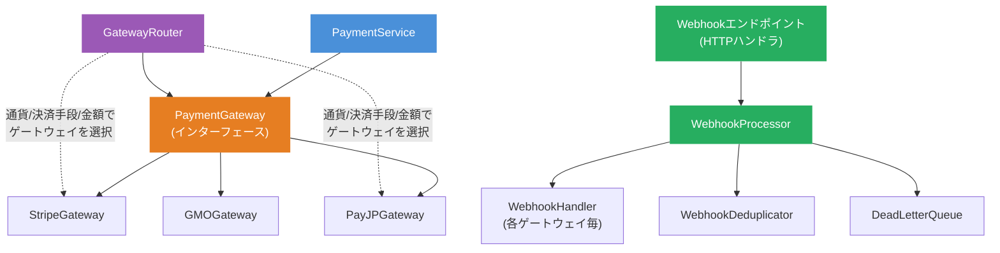
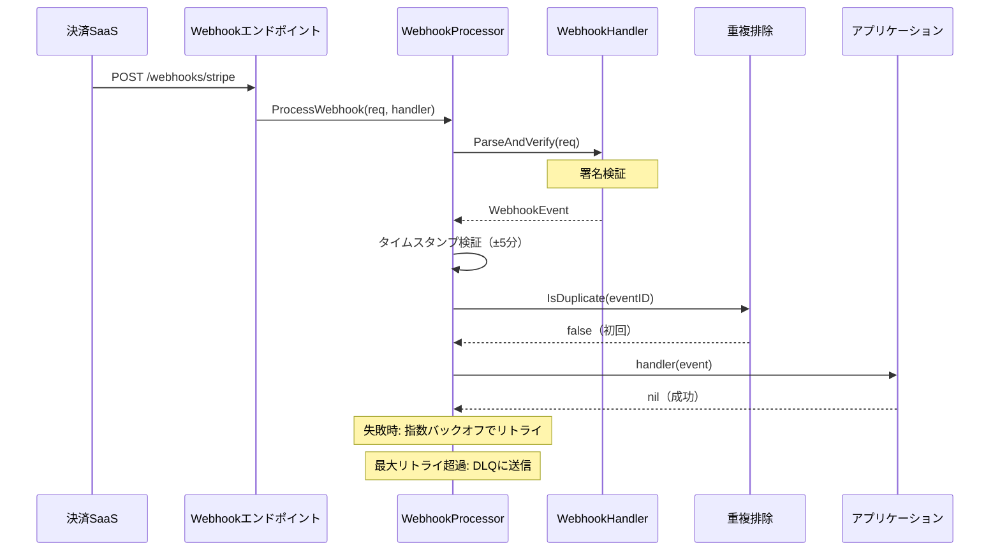

# 決済SaaS連携ガイド

Contract-to-Cash Core を外部決済サービス（Stripe、PAY.JP、GMOペイメントゲートウェイ等）と連携する方法を説明します。

## アーキテクチャ概要



## 実装が必要なインターフェース

### 1. PaymentGateway（必須）

**ファイル**: `application/port/gateway.go`

全決済操作の中核インターフェース。各決済SaaSごとに1つ実装が必要です。

```go
type PaymentGateway interface {
    ID() string
    SupportedMethods() []PaymentMethodType

    // 決済操作
    Charge(ctx, *ChargeRequest) (*ChargeResponse, error)          // ワンステップ決済
    Authorize(ctx, *AuthorizeRequest) (*AuthorizeResponse, error)  // 仮売上（与信枠確保）
    Capture(ctx, *CaptureRequest) (*CaptureResponse, error)        // 実売上（確定）
    Void(ctx, *VoidRequest) (*VoidResponse, error)                 // 仮売上取消
    Refund(ctx, *RefundRequest) (*RefundResponse, error)           // 返金
    Cancel(ctx, *CancelRequest) (*CancelResponse, error)           // 取消

    // 取引照会
    GetTransaction(ctx, transactionID string) (*Transaction, error)

    // 決済手段管理
    RegisterPaymentMethod(ctx, *RegisterPaymentMethodRequest) (*PaymentMethodDetail, error)
    DeletePaymentMethod(ctx, paymentMethodID string) error
    GetPaymentMethod(ctx, paymentMethodID string) (*PaymentMethodDetail, error)
    ListPaymentMethods(ctx, customerID string) ([]*PaymentMethodDetail, error)
}
```

### 2. WebhookHandler（非同期決済で必須）

**ファイル**: `application/port/webhook.go`

決済プロバイダからのWebhookペイロードを解析・検証します。

```go
type WebhookHandler interface {
    ParseAndVerify(ctx context.Context, req *WebhookRequest) (*WebhookEvent, error)
}
```

### 3. CustomerGateway（任意）

**ファイル**: `application/port/customer.go`

決済プロバイダ側の顧客レコードを管理します。

```go
type CustomerGateway interface {
    CreateCustomer(ctx, *CreateCustomerRequest) (*Customer, error)
    UpdateCustomer(ctx, *UpdateCustomerRequest) (*Customer, error)
    GetCustomer(ctx, customerID string) (*Customer, error)
    DeleteCustomer(ctx, customerID string) error
}
```

### 4. GatewayRouter（任意、マルチゲートウェイ構成時）

**ファイル**: `application/port/router.go`

通貨・決済手段・金額等に基づいて適切なゲートウェイを選択します。

```go
type GatewayRouter interface {
    Route(ctx context.Context, criteria RoutingCriteria) (PaymentGateway, error)
}
```

## 実装例: Stripe

```go
package stripe

type StripeGateway struct {
    apiKey string
}

func NewStripeGateway(apiKey string) *StripeGateway {
    stripe.Key = apiKey
    return &StripeGateway{apiKey: apiKey}
}

func (g *StripeGateway) ID() string { return "stripe" }

func (g *StripeGateway) SupportedMethods() []port.PaymentMethodType {
    return []port.PaymentMethodType{
        port.PaymentMethodTypeCreditCard,
        port.PaymentMethodTypeDebitCard,
    }
}

func (g *StripeGateway) Charge(ctx context.Context, req *port.ChargeRequest) (*port.ChargeResponse, error) {
    // Money を Stripe の最小通貨単位に変換（JPY はそのまま）
    amount := req.Amount.Amount().Num().Int64()

    params := &stripe.ChargeParams{
        Amount:      stripe.Int64(amount),
        Currency:    stripe.String(string(req.Amount.Currency())),
        Description: stripe.String(req.Description),
    }
    params.IdempotencyKey = stripe.String(req.IdempotencyKey)
    params.SetContext(ctx)

    ch, err := charge.New(params)
    if err != nil {
        return nil, toGatewayError(err)  // プロバイダ固有エラーを GatewayError に変換
    }

    return &port.ChargeResponse{
        TransactionID: ch.ID,
        Status:        mapStripeStatus(ch.Status),
        Amount:        req.Amount,
        CreatedAt:     time.Unix(ch.Created, 0),
    }, nil
}
```

## 実装例: PAY.JP

```go
package payjp

type PayJPGateway struct {
    apiKey string
    client *http.Client
}

func (g *PayJPGateway) ID() string { return "payjp" }

func (g *PayJPGateway) SupportedMethods() []port.PaymentMethodType {
    return []port.PaymentMethodType{port.PaymentMethodTypeCreditCard}
}

func (g *PayJPGateway) Charge(ctx context.Context, req *port.ChargeRequest) (*port.ChargeResponse, error) {
    form := url.Values{
        "amount":   {fmt.Sprintf("%d", req.Amount.Amount().Num().Int64())},
        "currency": {string(req.Amount.Currency())},
    }
    if req.Token != nil {
        form.Set("card", *req.Token)  // トークン化されたカード情報
    }

    httpReq, _ := http.NewRequestWithContext(ctx, "POST",
        "https://api.pay.jp/v1/charges", strings.NewReader(form.Encode()))
    httpReq.SetBasicAuth(g.apiKey, "")
    // ... レスポンスをパースして ChargeResponse に変換
}
```

## Webhook連携

### 処理フロー



### Stripe用WebhookHandler実装例

```go
type StripeWebhookHandler struct {
    endpointSecret string
}

func (h *StripeWebhookHandler) ParseAndVerify(ctx context.Context, req *port.WebhookRequest) (*port.WebhookEvent, error) {
    sig := req.Headers["Stripe-Signature"]
    event, err := webhook.ConstructEvent(req.Body, sig, h.endpointSecret)
    if err != nil {
        return nil, &port.WebhookError{
            Code:    port.WebhookErrorCodeInvalidSignature,
            Message: "Stripe署名検証に失敗",
            Cause:   err,
        }
    }
    return &port.WebhookEvent{
        ID:        event.ID,
        Type:      mapStripeEventType(event.Type),
        CreatedAt: time.Unix(event.Created, 0),
        Data:      event.Data.Raw,
    }, nil
}
```

### Webhookイベント種別

| イベント種別 | タイミング |
|------------|----------|
| `payment.succeeded` | 決済完了 |
| `payment.failed` | 決済失敗（カード拒否等） |
| `payment.pending` | 非同期決済の入金待ち（銀行振込、コンビニ決済） |
| `payment.received` | 非同期決済の入金確認 |
| `refund.succeeded` | 返金完了 |
| `refund.failed` | 返金失敗 |
| `chargeback.created` | チャージバック（不正利用申告）発生 |
| `chargeback.updated` | チャージバックステータス変更 |
| `chargeback.closed` | チャージバック解決 |
| `payment_method.attached` | 決済手段追加 |
| `payment_method.detached` | 決済手段削除 |
| `payment_method.expiring` | カード有効期限切れ間近 |

### 組み込みのWebhook処理機能

- **署名検証**: `WebhookHandler.ParseAndVerify()` で実装
- **タイムスタンプ検証**: 双方向チェック（デフォルト±5分）
- **冪等な重複排除**: `WebhookDeduplicator` 経由（デフォルトTTL: 72時間）
- **指数バックオフ付きリトライ** + ジッター（デフォルト: 3回）
- **デッドレターキュー**: リトライ上限超過イベントを保存

## ゲートウェイルーター（マルチゲートウェイ構成）

複数の決済プロバイダを使い分ける場合:

```go
rules := []port.RoutingRule{
    {
        GatewayID:      "stripe",
        Priority:       1,
        PaymentMethods: []port.PaymentMethodType{port.PaymentMethodTypeCreditCard},
        Currencies:     []shared.Currency{shared.CurrencyUSD, shared.CurrencyEUR},
    },
    {
        GatewayID:      "payjp",
        Priority:       1,
        PaymentMethods: []port.PaymentMethodType{port.PaymentMethodTypeCreditCard},
        Currencies:     []shared.Currency{shared.CurrencyJPY},
    },
    {
        GatewayID:      "gmo",
        Priority:       1,
        PaymentMethods: []port.PaymentMethodType{
            port.PaymentMethodTypeConvenienceStore,
            port.PaymentMethodTypeBankTransfer,
        },
        Currencies: []shared.Currency{shared.CurrencyJPY},
    },
}
```

ルーティング結果:
- **USD/EURのクレカ** -> Stripe
- **JPYのクレカ** -> PAY.JP
- **コンビニ決済 / 銀行振込** -> GMO

## エラーハンドリング

全ゲートウェイ実装は `*port.GatewayError` を構造化エラーコードと共に返すべきです:

```go
type GatewayError struct {
    Code        ErrorCode   // "card_declined", "insufficient_funds" 等
    Message     string      // 人間可読メッセージ
    DeclineCode string      // プロバイダ固有の拒否コード
    Retryable   bool        // リトライ可能かどうか
    RawError    error       // プロバイダSDKの生エラー
}
```

| エラーコード | リトライ可 | 対応 |
|------------|----------|------|
| `card_declined` | No | 顧客に決済手段の更新を通知 |
| `insufficient_funds` | No | 顧客に通知 |
| `processing_error` | Yes | バックオフ付きリトライ |
| `rate_limit_exceeded` | Yes | 待機後リトライ |
| `gateway_unavailable` | Yes | リトライまたは別ゲートウェイにフェイルオーバー |
| `gateway_timeout` | Yes | リトライ |
| `authentication_required` | No | 3Dセキュアにリダイレクト |
| `fraud_suspected` | No | 手動レビュー |

## 対応決済手段

8種類の決済手段を標準サポート:

| 種別 | 代表的なプロバイダ | フロー |
|------|-----------------|--------|
| `credit_card` | Stripe, PAY.JP, GMO | 同期決済 |
| `debit_card` | Stripe | 同期決済 |
| `bank_transfer` | GMO | 非同期: 発行 → 入金確認Webhook |
| `convenience_store` | GMO | 非同期: 発行 → 店頭支払い → Webhook |
| `qr_code` | PayPay, LINE Pay | リダイレクト: 作成 → リダイレクト → コールバック |
| `carrier` | キャリア決済 | リダイレクト/非同期 |
| `postpay` | NP後払い | 非同期: 先出荷、後払い |
| `direct_debit` | 銀行口座振替 | 非同期: 委託設定 → 定期引き落とし |

## 3Dセキュア

カード決済で本人認証が必要な場合:

```go
req := &port.ChargeRequest{
    Amount: amount,
    ThreeDSecure: &port.ThreeDSecureRequest{
        Required:  true,
        ReturnURL: "https://example.com/payment/callback",
    },
}

resp, err := gateway.Charge(ctx, req)
// 3DS認証が必要な場合、ゲートウェイはリダイレクトURLを返す
// 顧客がブラウザで認証を完了
// Webhookで最終的な決済ステータスが確認される
```

## 全体の配線

```go
// 1. ゲートウェイ実装を作成
stripeGW := stripe.NewStripeGateway(os.Getenv("STRIPE_SECRET_KEY"))
payjpGW := payjp.NewPayJPGateway(os.Getenv("PAYJP_SECRET_KEY"))

// 2. ルーター設定（マルチゲートウェイの場合）
router := NewSimpleGatewayRouter(rules, map[string]port.PaymentGateway{
    "stripe": stripeGW,
    "payjp":  payjpGW,
})

// 3. PaymentService を作成
paymentService := service.NewPaymentService(
    stripeGW,         // またはルーターで選択されたゲートウェイ
    paymentRepo,
    invoiceRepo,
    contractRepo,     // 支払い方法フォールバック解決用
    customerGateway,  // 顧客デフォルト支払い方法の参照用
    eventStore,
    pluginRegistry,
    clock,
)

// 4. Webhook処理のセットアップ
webhookProcessor := port.NewWebhookProcessor(
    stripe.NewStripeWebhookHandler(endpointSecret),
    redisDeduplicator,    // Redis等で実装
    sqsDLQ,               // SQS等で実装
    clock,
    port.WebhookProcessorConfig{
        TimestampTolerance: 5 * time.Minute,
        DeduplicationTTL:   72 * time.Hour,
        MaxRetries:         3,
    },
)

// 5. WebhookのHTTPハンドラ
http.HandleFunc("/webhooks/stripe", func(w http.ResponseWriter, r *http.Request) {
    body, _ := io.ReadAll(r.Body)
    err := webhookProcessor.ProcessWebhook(r.Context(),
        &port.WebhookRequest{
            Headers: map[string]string{
                "Stripe-Signature": r.Header.Get("Stripe-Signature"),
            },
            Body: body,
        },
        func(ctx context.Context, event *port.WebhookEvent) error {
            switch event.Type {
            case port.WebhookEventPaymentSucceeded:
                // 請求書ステータス更新、AfterChargeフックを発火
            case port.WebhookEventPaymentFailed:
                // OnPaymentFailedフック発火、契約の一時停止を検討
            case port.WebhookEventChargebackCreated:
                // アラート、契約の一時停止を検討
            }
            return nil
        },
    )
    if err != nil {
        w.WriteHeader(http.StatusBadRequest)
        return
    }
    w.WriteHeader(http.StatusOK)
})
```

## 新規ゲートウェイ連携チェックリスト

- [ ] `PaymentGateway` インターフェースを実装（全12メソッド）
- [ ] プロバイダ用の `WebhookHandler` を実装
- [ ] プロバイダ固有エラーを `GatewayError` コードにマッピング
- [ ] プロバイダ固有ステータスを `TransactionStatus` にマッピング
- [ ] 冪等キーの処理（プロバイダAPIにパススルー）
- [ ] 3Dセキュアのリダイレクトフロー対応（該当する場合）
- [ ] `CustomerGateway` を実装（プロバイダが顧客管理する場合）
- [ ] ルーティングルールを追加（マルチゲートウェイ構成の場合）
- [ ] プロバイダのテスト/サンドボックスモードで結合テストを作成
- [ ] Webhookエンドポイントのセットアップと署名検証の確認
