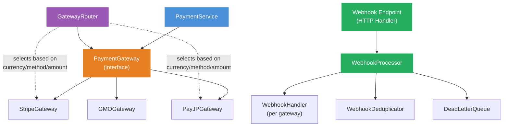
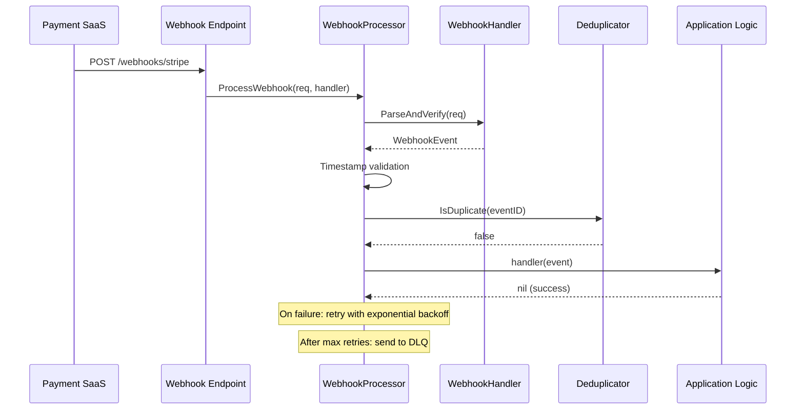

# Payment Gateway Integration Guide

This guide explains how to integrate Contract-to-Cash Core with external payment SaaS providers (Stripe, PAY.JP, GMO Payment Gateway, etc.).

## Architecture Overview



## Interfaces to Implement

### 1. PaymentGateway (Required)

**File**: `application/port/gateway.go`

The core interface for all payment operations. Each payment SaaS needs one implementation.

```go
type PaymentGateway interface {
    ID() string
    SupportedMethods() []PaymentMethodType

    // Payment operations
    Charge(ctx, *ChargeRequest) (*ChargeResponse, error)          // One-step charge
    Authorize(ctx, *AuthorizeRequest) (*AuthorizeResponse, error)  // Hold funds
    Capture(ctx, *CaptureRequest) (*CaptureResponse, error)        // Capture held funds
    Void(ctx, *VoidRequest) (*VoidResponse, error)                 // Cancel hold
    Refund(ctx, *RefundRequest) (*RefundResponse, error)           // Refund payment
    Cancel(ctx, *CancelRequest) (*CancelResponse, error)           // Cancel pending

    // Transaction query
    GetTransaction(ctx, transactionID string) (*Transaction, error)

    // Payment method management
    RegisterPaymentMethod(ctx, *RegisterPaymentMethodRequest) (*PaymentMethodDetail, error)
    DeletePaymentMethod(ctx, paymentMethodID string) error
    GetPaymentMethod(ctx, paymentMethodID string) (*PaymentMethodDetail, error)
    ListPaymentMethods(ctx, customerID string) ([]*PaymentMethodDetail, error)
}
```

### 2. WebhookHandler (Required for async payments)

**File**: `application/port/webhook.go`

Parses and verifies webhook payloads from the payment provider.

```go
type WebhookHandler interface {
    ParseAndVerify(ctx context.Context, req *WebhookRequest) (*WebhookEvent, error)
}
```

### 3. CustomerGateway (Optional)

**File**: `application/port/customer.go`

Manages customer records on the payment provider side.

```go
type CustomerGateway interface {
    CreateCustomer(ctx, *CreateCustomerRequest) (*Customer, error)
    UpdateCustomer(ctx, *UpdateCustomerRequest) (*Customer, error)
    GetCustomer(ctx, customerID string) (*Customer, error)
    DeleteCustomer(ctx, customerID string) error
}
```

### 4. GatewayRouter (Optional, for multi-gateway)

**File**: `application/port/router.go`

Selects the appropriate gateway based on currency, payment method, amount, etc.

```go
type GatewayRouter interface {
    Route(ctx context.Context, criteria RoutingCriteria) (PaymentGateway, error)
}
```

## Implementation Example: Stripe

```go
package stripe

import (
    "context"
    "fmt"

    stripe "github.com/stripe/stripe-go/v76"
    "github.com/stripe/stripe-go/v76/charge"
    "github.com/stripe/stripe-go/v76/refund"
    "github.com/contract-to-cash/core/application/port"
)

type StripeGateway struct {
    apiKey string
}

func NewStripeGateway(apiKey string) *StripeGateway {
    stripe.Key = apiKey
    return &StripeGateway{apiKey: apiKey}
}

func (g *StripeGateway) ID() string { return "stripe" }

func (g *StripeGateway) SupportedMethods() []port.PaymentMethodType {
    return []port.PaymentMethodType{
        port.PaymentMethodTypeCreditCard,
        port.PaymentMethodTypeDebitCard,
    }
}

func (g *StripeGateway) Charge(ctx context.Context, req *port.ChargeRequest) (*port.ChargeResponse, error) {
    // Convert Money to Stripe amount (smallest unit)
    amount := req.Amount.Amount().Num().Int64() // JPY = no decimal

    params := &stripe.ChargeParams{
        Amount:      stripe.Int64(amount),
        Currency:    stripe.String(string(req.Amount.Currency())),
        Description: stripe.String(req.Description),
    }
    if req.PaymentMethodID != nil {
        params.Source = &stripe.PaymentSourceSourceParams{
            Token: req.PaymentMethodID,
        }
    }
    params.IdempotencyKey = stripe.String(req.IdempotencyKey)
    params.SetContext(ctx)

    ch, err := charge.New(params)
    if err != nil {
        return nil, toGatewayError(err)
    }

    return &port.ChargeResponse{
        TransactionID: ch.ID,
        Status:        mapStripeStatus(ch.Status),
        Amount:        req.Amount,
        CreatedAt:     time.Unix(ch.Created, 0),
    }, nil
}

func (g *StripeGateway) Refund(ctx context.Context, req *port.RefundRequest) (*port.RefundResponse, error) {
    params := &stripe.RefundParams{
        Charge: stripe.String(req.TransactionID),
    }
    if req.Amount != nil {
        params.Amount = stripe.Int64(req.Amount.Amount().Num().Int64())
    }
    params.IdempotencyKey = stripe.String(req.IdempotencyKey)
    params.SetContext(ctx)

    r, err := refund.New(params)
    if err != nil {
        return nil, toGatewayError(err)
    }

    return &port.RefundResponse{
        RefundID:      r.ID,
        TransactionID: req.TransactionID,
        Status:        port.RefundStatusSucceeded,
        Amount:        req.Amount, // or full amount
        RefundedAt:    time.Unix(r.Created, 0),
    }, nil
}

// ... Authorize, Capture, Void, Cancel, GetTransaction,
//     RegisterPaymentMethod, DeletePaymentMethod, etc.
```

## Implementation Example: PAY.JP

```go
package payjp

type PayJPGateway struct {
    apiKey string
    client *http.Client
}

func NewPayJPGateway(apiKey string) *PayJPGateway {
    return &PayJPGateway{apiKey: apiKey, client: &http.Client{Timeout: 30 * time.Second}}
}

func (g *PayJPGateway) ID() string { return "payjp" }

func (g *PayJPGateway) SupportedMethods() []port.PaymentMethodType {
    return []port.PaymentMethodType{
        port.PaymentMethodTypeCreditCard,
    }
}

func (g *PayJPGateway) Charge(ctx context.Context, req *port.ChargeRequest) (*port.ChargeResponse, error) {
    form := url.Values{
        "amount":   {fmt.Sprintf("%d", req.Amount.Amount().Num().Int64())},
        "currency": {string(req.Amount.Currency())},
    }
    if req.Token != nil {
        form.Set("card", *req.Token)
    }

    httpReq, _ := http.NewRequestWithContext(ctx, "POST", "https://api.pay.jp/v1/charges", strings.NewReader(form.Encode()))
    httpReq.SetBasicAuth(g.apiKey, "")
    httpReq.Header.Set("Content-Type", "application/x-www-form-urlencoded")

    resp, err := g.client.Do(httpReq)
    // ... parse response, map to ChargeResponse
}
```

## Webhook Integration

### Flow



### WebhookHandler Example (Stripe)

```go
type StripeWebhookHandler struct {
    endpointSecret string
}

func (h *StripeWebhookHandler) ParseAndVerify(ctx context.Context, req *port.WebhookRequest) (*port.WebhookEvent, error) {
    sig := req.Headers["Stripe-Signature"]
    event, err := webhook.ConstructEvent(req.Body, sig, h.endpointSecret)
    if err != nil {
        return nil, &port.WebhookError{
            Code:    port.WebhookErrorCodeInvalidSignature,
            Message: "invalid stripe signature",
            Cause:   err,
        }
    }
    return &port.WebhookEvent{
        ID:        event.ID,
        Type:      mapStripeEventType(event.Type),
        CreatedAt: time.Unix(event.Created, 0),
        Data:      event.Data.Raw,
        RawData:   req.Body,
    }, nil
}
```

### Webhook Event Types

The system defines these standard webhook event types:

| Event Type | When |
|-----------|------|
| `payment.succeeded` | Charge completed successfully |
| `payment.failed` | Charge was declined |
| `payment.pending` | Async payment awaiting confirmation (bank transfer, convenience store) |
| `payment.received` | Async payment confirmed |
| `refund.succeeded` | Refund processed |
| `refund.failed` | Refund failed |
| `chargeback.created` | Dispute/chargeback opened |
| `chargeback.updated` | Dispute status changed |
| `chargeback.closed` | Dispute resolved |
| `payment_method.attached` | New payment method added |
| `payment_method.detached` | Payment method removed |
| `payment_method.expiring` | Card about to expire |

### Built-in Webhook Processing Features

- **Signature verification** via `WebhookHandler.ParseAndVerify()`
- **Timestamp validation** (bidirectional, default ±5 minutes)
- **Idempotent deduplication** via `WebhookDeduplicator` (default TTL: 72 hours)
- **Retry with exponential backoff** + jitter (default: 3 retries)
- **Dead letter queue** for exhausted events

## Gateway Router (Multi-Gateway)

For businesses using multiple payment providers:

```go
type SimpleGatewayRouter struct {
    rules    []port.RoutingRule
    gateways map[string]port.PaymentGateway
}

func (r *SimpleGatewayRouter) Route(ctx context.Context, criteria port.RoutingCriteria) (port.PaymentGateway, error) {
    for _, rule := range r.rules {
        if r.matches(rule, criteria) {
            gw, ok := r.gateways[rule.GatewayID]
            if ok {
                return gw, nil
            }
        }
    }
    return nil, fmt.Errorf("no gateway matched criteria")
}
```

### Routing Rules Example

```go
rules := []port.RoutingRule{
    {
        GatewayID:      "stripe",
        Priority:       1,
        PaymentMethods: []port.PaymentMethodType{port.PaymentMethodTypeCreditCard},
        Currencies:     []shared.Currency{shared.CurrencyUSD, shared.CurrencyEUR},
    },
    {
        GatewayID:      "payjp",
        Priority:       1,
        PaymentMethods: []port.PaymentMethodType{port.PaymentMethodTypeCreditCard},
        Currencies:     []shared.Currency{shared.CurrencyJPY},
    },
    {
        GatewayID:      "gmo",
        Priority:       1,
        PaymentMethods: []port.PaymentMethodType{
            port.PaymentMethodTypeConvenienceStore,
            port.PaymentMethodTypeBankTransfer,
        },
        Currencies: []shared.Currency{shared.CurrencyJPY},
    },
}
```

This routes:
- **USD/EUR credit cards** -> Stripe
- **JPY credit cards** -> PAY.JP
- **Convenience store / bank transfer** -> GMO

## Error Handling

### Gateway Errors

All gateway implementations should return `*port.GatewayError` with structured error codes:

```go
type GatewayError struct {
    Code        ErrorCode   // e.g. "card_declined", "insufficient_funds"
    Message     string      // Human-readable message
    DeclineCode string      // Provider-specific decline code
    Retryable   bool        // Whether the caller should retry
    RawError    error       // Original error from provider SDK
}
```

| Error Code | Retryable | Action |
|-----------|-----------|--------|
| `card_declined` | No | Notify customer to update payment method |
| `insufficient_funds` | No | Notify customer |
| `processing_error` | Yes | Retry with backoff |
| `rate_limit_exceeded` | Yes | Retry after delay |
| `gateway_unavailable` | Yes | Retry or failover to another gateway |
| `gateway_timeout` | Yes | Retry |
| `authentication_required` | No | Redirect to 3D Secure |
| `fraud_suspected` | No | Review manually |

## Payment Method Types

The system supports 8 payment method types out of the box:

| Type | Typical Provider | Flow |
|------|-----------------|------|
| `credit_card` | Stripe, PAY.JP, GMO | Synchronous charge |
| `debit_card` | Stripe | Synchronous charge |
| `bank_transfer` | GMO | Async: issue -> wait for payment.received webhook |
| `convenience_store` | GMO | Async: issue -> customer pays at store -> webhook |
| `qr_code` | PayPay, LINE Pay | Redirect: create -> redirect -> callback |
| `carrier` | Carrier billing | Redirect/async |
| `postpay` | NP Atobarai | Async: ship first, pay later |
| `direct_debit` | Bank direct debit | Async: mandate setup -> periodic pulls |

## 3D Secure

For card payments requiring authentication:

```go
req := &port.ChargeRequest{
    Amount:      amount,
    ThreeDSecure: &port.ThreeDSecureRequest{
        Required:  true,
        ReturnURL: "https://example.com/payment/callback",
    },
}

resp, err := gateway.Charge(ctx, req)
// If 3DS is needed, the gateway returns a redirect URL
// The customer completes authentication in their browser
// A webhook confirms the final payment status
```

## Wiring It All Together

```go
// 1. Create gateway implementations
stripeGW := stripe.NewStripeGateway(os.Getenv("STRIPE_SECRET_KEY"))
payjpGW := payjp.NewPayJPGateway(os.Getenv("PAYJP_SECRET_KEY"))

// 2. Set up router (optional, for multi-gateway)
router := NewSimpleGatewayRouter(rules, map[string]port.PaymentGateway{
    "stripe": stripeGW,
    "payjp":  payjpGW,
})

// 3. Create PaymentService
paymentService := service.NewPaymentService(
    stripeGW,       // or: router-selected gateway
    paymentRepo,
    invoiceRepo,
    eventStore,
    pluginRegistry,
    clock,
)

// 4. Set up webhook processing
webhookProcessor := port.NewWebhookProcessor(
    stripe.NewStripeWebhookHandler(endpointSecret),
    redisDeduplicator,
    sqsDLQ,
    clock,
    port.WebhookProcessorConfig{
        TimestampTolerance: 5 * time.Minute,
        DeduplicationTTL:   72 * time.Hour,
        MaxRetries:         3,
    },
)

// 5. HTTP handler for webhooks
http.HandleFunc("/webhooks/stripe", func(w http.ResponseWriter, r *http.Request) {
    body, _ := io.ReadAll(r.Body)
    err := webhookProcessor.ProcessWebhook(r.Context(),
        &port.WebhookRequest{
            Headers: map[string]string{"Stripe-Signature": r.Header.Get("Stripe-Signature")},
            Body:    body,
        },
        func(ctx context.Context, event *port.WebhookEvent) error {
            switch event.Type {
            case port.WebhookEventPaymentSucceeded:
                // Update invoice status, fire AfterCharge hooks
            case port.WebhookEventPaymentFailed:
                // Fire OnPaymentFailed hooks, possibly suspend contract
            case port.WebhookEventChargebackCreated:
                // Alert, possibly suspend contract
            }
            return nil
        },
    )
    if err != nil {
        w.WriteHeader(http.StatusBadRequest)
        return
    }
    w.WriteHeader(http.StatusOK)
})
```

## Checklist for New Gateway Integration

- [ ] Implement `PaymentGateway` interface (all 12 methods)
- [ ] Implement `WebhookHandler` for the provider
- [ ] Map provider-specific errors to `GatewayError` codes
- [ ] Map provider-specific statuses to `TransactionStatus`
- [ ] Handle idempotency keys (pass through to provider API)
- [ ] Handle 3D Secure redirect flow (if applicable)
- [ ] Implement `CustomerGateway` (if provider manages customer records)
- [ ] Add routing rules (if using multi-gateway router)
- [ ] Write integration tests with provider's test/sandbox mode
- [ ] Set up webhook endpoint and verify signature handling
