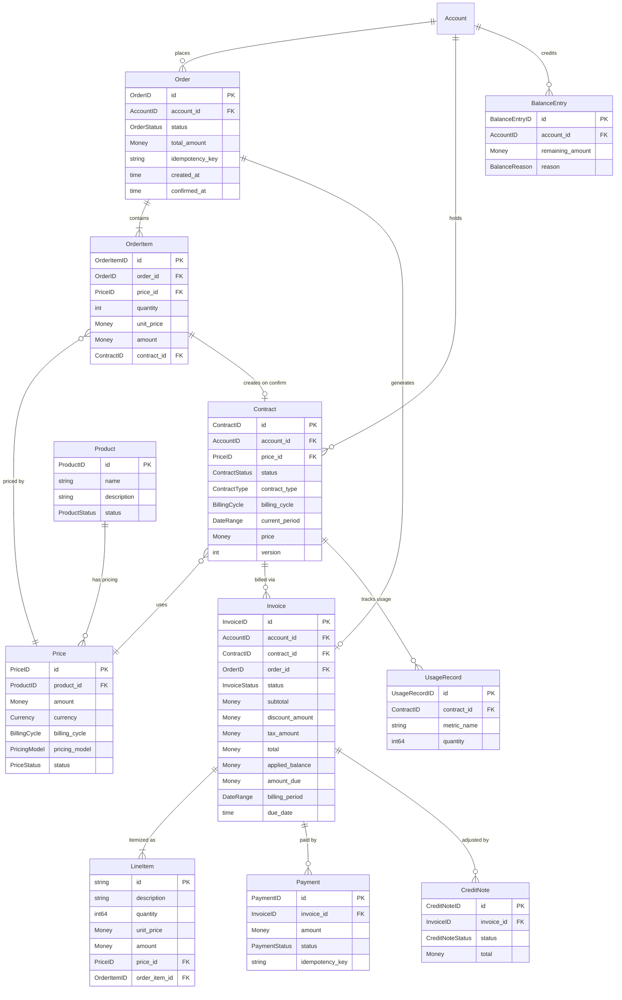

# Add Order Aggregate to Support Shopping Cart (Multi-Product Checkout)

## Summary

The current design enforces a 1:1 relationship between Contract, Price, and Invoice, which means each purchase results in a separate invoice and payment. This makes it impossible to bundle multiple products (e.g., domain + hosting + SSL) into a single checkout and payment.

We propose introducing an **Order aggregate** to act as a shopping cart that groups multiple products into a single purchase, while keeping the existing Contract model unchanged for ongoing billing.

## Problem

| Constraint | Location | Description |
|---|---|---|
| `CreateContractCommand.PriceID` | `domain/contract/aggregate.go` | Accepts only a single PriceID |
| `Invoice.contractID` | `domain/invoice/entity.go` | Bound to a single Contract |
| `BillingService.GenerateInvoice()` | `application/service/billing_service.go` | Takes a single contractID |

**Use case not supported:** A customer wants to purchase a domain registration (one-time), a hosting plan (subscription), and an SSL certificate (one-time) in a single checkout with one payment.

## Proposed Solution

Introduce a new `Order` aggregate under `domain/order/` that serves as a cart/checkout boundary.

### New Entities

**Order** (Aggregate Root)

- `OrderID`, `AccountID`, `Status` (draft / confirmed / fulfilled / cancelled)
- Contains one or more `OrderItem`s
- Generates a single `Invoice` upon confirmation

**OrderItem**

- `OrderItemID`, `PriceID`, `Quantity`, `UnitPrice`, `Amount`
- References `Price` (which in turn references `Product` — no direct ProductID to maintain 3NF)
- Generates a `Contract` upon order confirmation

### Changes to Existing Entities

| Entity | Change | Details |
|---|---|---|
| `Invoice` | Add `OrderID` field | Nullable. Mutually exclusive with `ContractID` — one or the other is set |
| `LineItem` | Add `OrderItemID` field | Nullable. Traces back to the originating OrderItem for cart purchases |

**No changes** to Contract, Payment, Price, Product, or other existing entities.

### Data Model (ER)



**Reference path (3NF compliant):**

- `OrderItem -> Price -> Product` (no transitive dependency)
- `Contract -> Price -> Product` (same pattern, already in place)

### Flow

```
1. Create Order (draft), add OrderItems
     - Domain:  PriceID=price_1, qty=1
     - Hosting: PriceID=price_2, qty=1
     - SSL:     PriceID=price_3, qty=1

2. Order.Confirm()
     - Create Contract per OrderItem (one_time or subscription based on Price.BillingCycle)
     - Generate single Invoice with LineItems mapped from OrderItems
     - Apply DiscountHook -> TaxHook -> Credit (existing plugin flow)

3. Single Payment for the Invoice

4. Subsequent billing (e.g., hosting renewal) uses existing
   Contract-based BillingService.GenerateInvoice() -- no change needed
```

### Scope of Changes

| Area | Work |
|---|---|
| `domain/order/` (new) | `Order` aggregate, `OrderItem` entity, `OrderStatus`, repository interface |
| `domain/invoice/` | Add optional `OrderID` to `Invoice`, optional `OrderItemID` to `LineItem` |
| `application/service/` | Add `OrderService` for cart management and checkout orchestration |
| `infrastructure/inmemory/` | In-memory `OrderRepository` for testing |
| `tests/` | Unit + integration tests for Order lifecycle and multi-product checkout |

### Design Decisions

1. **Order is separate from Contract** — Order represents "a purchase at a point in time"; Contract represents "an ongoing billing relationship". Mixing them would violate SRP.
2. **Invoice.ContractID and Invoice.OrderID are mutually exclusive** — An invoice is either for a single contract's recurring billing OR for a cart checkout, never both.
3. **No ProductID on OrderItem or Contract** — `PriceID -> ProductID` is a transitive functional dependency. Product is always resolved via Price to maintain 3NF.
4. **Existing plugin hooks work unchanged** — The calculation flow (DiscountHook -> TaxHook -> Credit -> Invoice) applies to Order-based invoices the same way.

## Out of Scope

- Saved carts / wishlist functionality
- Order editing after confirmation
- Splitting an order into multiple shipments/invoices
- Order-level discount hooks (can be added later as `OrderDiscountHook`)

## Checklist

- [ ] `domain/order/` does not depend on external packages (stdlib + ulid only)
- [ ] New domain events registered in `EventRegistry` and `Apply()` (if Order is event-sourced)
- [ ] `Money` operations validate currency consistency across OrderItems
- [ ] `Clock` interface used for all timestamps
- [ ] Tests pass with `-race`
- [ ] No use of `PlanID` in new code — use `ProductID` + `PriceID`
