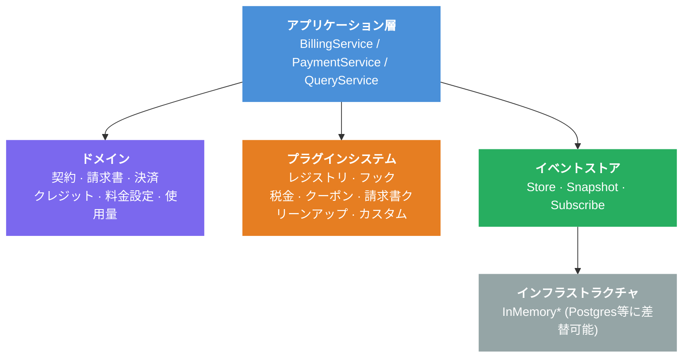
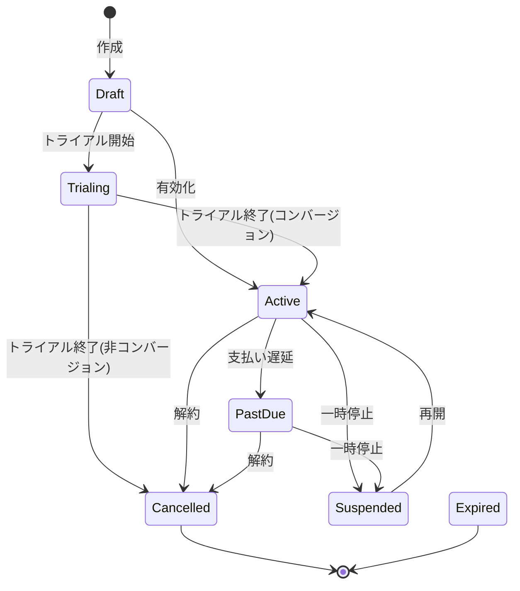

# Contract-to-Cash Core サンプル集

Contract-to-Cash Core は、**イベントソーシング**、**拡張可能なプラグインシステム**、契約・請求書・決済・クレジット・料金設定をカバーする**豊富なドメインモデル**を備えた、Go言語の課金システム構築ライブラリです。

各サンプルは外部依存なし（DB、ネットワーク不要）で動作する独立した `main.go` です。すべてインメモリ実装を使用しています。

## サンプル一覧

| サンプル | 焦点 | 主要コンセプト |
|---------|------|--------------|
| [billing-demo](billing-demo/) | 基本的な請求フロー | 契約 → 請求書 → 決済のエンドツーエンド |
| [event-sourcing-demo](event-sourcing-demo/) | 時間旅行と監査証跡 | 時点クエリ、スナップショット、イベントリプレイ |
| [plugin-pipeline-demo](plugin-pipeline-demo/) | 拡張可能なプラグインシステム | 割引/税金フック、優先度制御、カスタムプラグイン |
| [lifecycle-demo](lifecycle-demo/) | 契約ライフサイクルとクレジット | トライアル、一時停止/再開、解約、FIFO クレジット適用 |
| [hosting-integration-demo](hosting-integration-demo/) | 外部サービス連携 | ライフサイクルフックによるサーバープロビジョニング/停止 |
| [multi-service-demo](multi-service-demo/) | 複数サービス種別 | PriceIDベースのプラグインルーティング（VPS/SSL/ドメイン） |
| [pricing-models-demo](pricing-models-demo/) | 柔軟な料金設定 | 定額、段階制、ボリューム制、従量制 |

## 前提条件

- Go 1.25+

## 実行方法

```bash
# 任意のサンプルを実行
go run ./examples/billing-demo/
go run ./examples/event-sourcing-demo/
go run ./examples/plugin-pipeline-demo/
go run ./examples/lifecycle-demo/
go run ./examples/hosting-integration-demo/
go run ./examples/multi-service-demo/
go run ./examples/pricing-models-demo/
```

## 推奨読み順

1. **billing-demo** -- ここから。契約作成→税込み請求書生成→決済の基本フロー。
2. **event-sourcing-demo** -- イベントソーシングが「時間旅行」クエリと完全な監査証跡を可能にする仕組み。
3. **plugin-pipeline-demo** -- 割引・税金・ライフサイクルフックが優先度制御で合成される仕組み。
4. **lifecycle-demo** -- トライアル、一時停止、クレジット管理を含む完全な契約ライフサイクル。
5. **hosting-integration-demo** -- 課金イベントが外部サービスのプロビジョニングを駆動する仕組み（このライブラリの真価）。
6. **multi-service-demo** -- 複数サービス種別（VPS/SSL/ドメイン）がPriceIDベースのプラグインルーティングで共存する仕組み。
7. **pricing-models-demo** -- 4つの料金モデルの比較。

## アーキテクチャ概要



各レイヤーは下位レイヤーにのみ依存します。プラグインシステムにより、コアコードを変更せずに課金ロジックを拡張できます。

### 請求パイプライン（プラグインフック）


### 契約ライフサイクル（状態遷移図）


