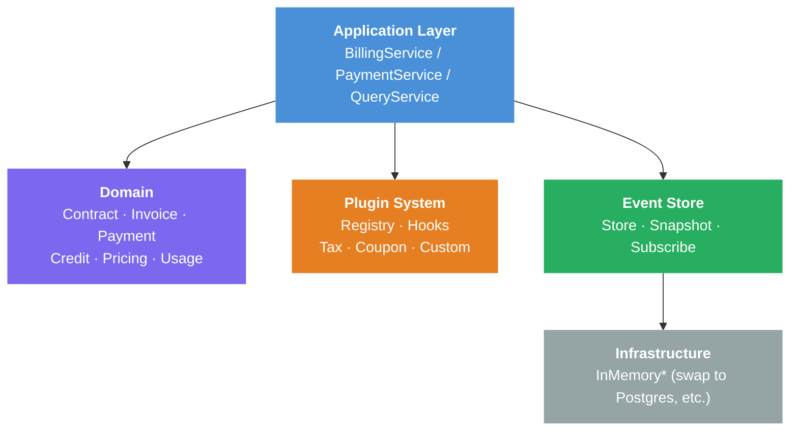
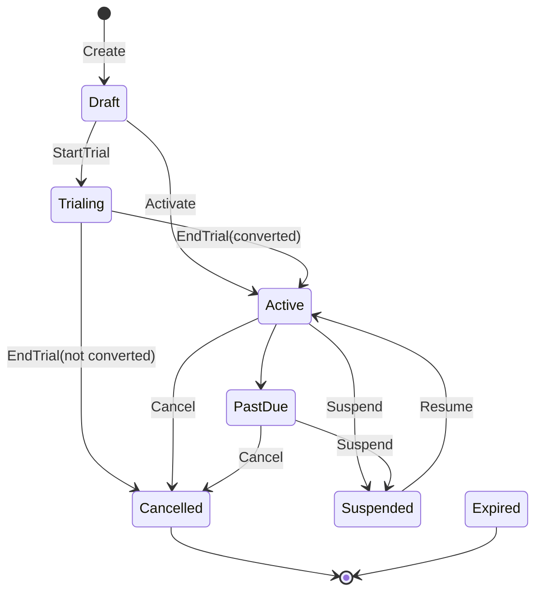

# Contract-to-Cash Core Examples

Contract-to-Cash Core is a Go library for building billing systems with **event sourcing**, an **extensible plugin system**, and a **rich domain model** covering contracts, invoices, payments, credits, and pricing.

These examples demonstrate the library's key capabilities. Each example is a standalone `main.go` that runs without any external dependencies (database, network, etc.) -- everything uses in-memory implementations.

## Examples

| Example | Focus | Key Concepts |
|---------|-------|--------------|
| [billing-demo](billing-demo/) | Basic billing flow | Contract -> Invoice -> Payment end-to-end |
| [event-sourcing-demo](event-sourcing-demo/) | Time travel & audit trail | Temporal queries, snapshots, event replay |
| [plugin-pipeline-demo](plugin-pipeline-demo/) | Extensible plugin system | Discount/tax hooks, priority ordering, custom plugins |
| [lifecycle-demo](lifecycle-demo/) | Contract lifecycle & credits | Trial, suspend/resume, cancel, FIFO credit application |
| [hosting-integration-demo](hosting-integration-demo/) | External service integration | Server provisioning/suspension via lifecycle hooks |
| [multi-service-demo](multi-service-demo/) | Multiple service types | PlanID-based plugin routing for VPS/SSL/Domain |
| [pricing-models-demo](pricing-models-demo/) | Flexible pricing | Flat, graduated tiered, volume tiered, usage-based |

## Prerequisites

- Go 1.22+

## Running

```bash
# Run any example
go run ./examples/billing-demo/
go run ./examples/event-sourcing-demo/
go run ./examples/plugin-pipeline-demo/
go run ./examples/lifecycle-demo/
go run ./examples/hosting-integration-demo/
go run ./examples/multi-service-demo/
go run ./examples/pricing-models-demo/
```

## Recommended Reading Order

1. **billing-demo** -- Start here. Covers the basic contract-to-cash flow (create contract, generate invoice with tax, process payment).
2. **event-sourcing-demo** -- See how event sourcing enables "time travel" queries and complete audit trails.
3. **plugin-pipeline-demo** -- Understand how the plugin system composes discount, tax, and lifecycle hooks with priority control.
4. **lifecycle-demo** -- Explore the full contract lifecycle (trial periods, suspension, credit management).
5. **hosting-integration-demo** -- See how billing events drive external service provisioning (the "so what?" of this library).
6. **multi-service-demo** -- See how multiple service types (VPS, SSL, Domain) coexist via PlanID-based plugin routing.
7. **pricing-models-demo** -- Compare different pricing models side by side (flat, tiered, usage-based).

## Architecture Overview



Each layer depends only on the layers below it. The plugin system allows extending billing logic without modifying core code.

### Billing Pipeline (Plugin Hooks)


### Contract Lifecycle (State Machine)


