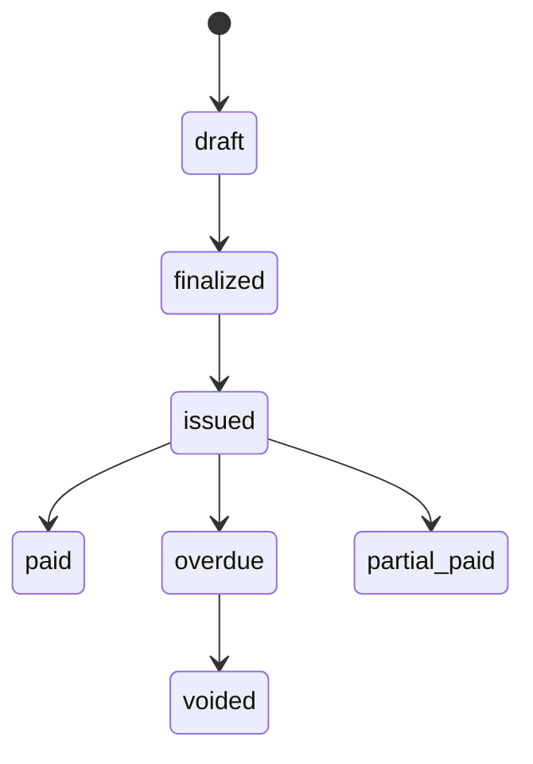

# Domain Model

The domain model consists of entities, value objects, and aggregates that represent the billing domain.

## Contract Aggregate

The contract is the central entity, modeled as an event-sourced aggregate root. It manages the full lifecycle of a billing agreement.

### States

| Status | Description |
|--------|-------------|
| `draft` | Contract created but not yet active |
| `trialing` | In trial period |
| `active` | Currently active and billable |
| `past_due` | Payment overdue |
| `suspended` | Temporarily suspended (payment issue or manual) |
| `cancelled` | Permanently cancelled |
| `expired` | Term ended without renewal |

### Contract Types

| Type | Description |
|------|-------------|
| `one_time` | Single purchase, no recurring billing |
| `subscription` | Recurring billing at a fixed interval |
| `usage_based` | Charges based on metered usage |

### Key Fields

```go
type ContractAggregate struct {
    contractID       shared.ContractID
    accountID        shared.AccountID
    priceID          shared.PriceID       // Reference to immutable Price entity
    pendingPriceID   *shared.PriceID      // Scheduled for next renewal
    priceOverride    *shared.Money         // Per-contract price adjustment
    status           ContractStatus
    contractType     ContractType
    billingCycle     BillingCycle
    currentPeriod    shared.DateRange
    autoRenew        bool
    cancelAtPeriodEnd bool
    paymentMethodID  *string               // Contract-level payment method
    // ...
}
```

### Operations

```go
// Lifecycle
agg.Create(cmd CreateContractCommand, metadata EventMetadata) error
agg.Activate(metadata EventMetadata) error
agg.Suspend(config SuspensionConfiguration, metadata EventMetadata) error
agg.Resume(metadata EventMetadata) error
agg.Cancel(reason string, metadata EventMetadata) error
agg.Renew(metadata EventMetadata) error

// Price changes
agg.ChangePrice(newPriceID PriceID, policy ChangePolicy, proration *PlanChangeProration, metadata EventMetadata) error
agg.UnscheduleChange(reason string, metadata EventMetadata) error
agg.SetPriceOverride(override Money, metadata EventMetadata) error

// Trial
agg.StartTrial(config TrialConfiguration, metadata EventMetadata) error
agg.EndTrial(converted bool, metadata EventMetadata) error

// Event sourcing
agg.LoadFromHistory(events []Event) error
agg.LoadFromSnapshot(snapshot Snapshot) error
agg.MarshalSnapshot() ([]byte, error)
```

## Invoice

Invoices are generated by `BillingService` and track the billing calculation result.

### States



### Structure

```go
type Invoice struct {
    id              shared.InvoiceID
    contractID      shared.ContractID
    accountID       shared.AccountID
    lineItems       []LineItem
    subtotal        shared.Money     // Before discounts
    discountAmount  shared.Money     // Total discount applied
    taxAmount       shared.Money     // Total tax
    total           shared.Money     // subtotal - discount + tax
    appliedCredit   shared.Money     // Credit consumed from ledger
    amountDue       shared.Money     // total - appliedCredit
    billingPeriod   shared.DateRange
    dueDate         time.Time
    status          InvoiceStatus
}
```

## Payment

Tracks individual payment transactions.

```go
type Payment struct {
    id                   shared.PaymentID
    invoiceID            shared.InvoiceID
    amount               shared.Money
    method               PaymentMethod    // credit_card, bank_transfer, etc.
    status               PaymentStatus    // pending, completed, failed, refunded
    gatewayTransactionID string
    processedAt          time.Time
}
```

## Product and Price

Following the Stripe pattern of separating what you sell from how you charge:

```go
// Product — what you sell
type Product struct {
    id           shared.ProductID
    name         string
    features     []Feature
    usageMetrics []UsageMetric
    status       ProductStatus    // active, archived
}

// Price — how you charge (IMMUTABLE after creation)
type Price struct {
    id           shared.PriceID
    productID    shared.ProductID
    amount       shared.Money
    currency     shared.Currency
    billingCycle BillingCycle     // monthly, yearly, etc.
    pricingModel PricingModel    // nil for flat pricing
    status       PriceStatus     // active, archived
}
```

**Key principle**: Prices are immutable. To change a price, create a new Price object. Existing contracts keep their current Price reference until explicitly changed or renewed.

## Shared Value Objects

### Money

Arbitrary-precision monetary values with currency safety:

```go
price := shared.NewMoney(new(big.Rat).SetInt64(3000), shared.CurrencyJPY)
tax := price.Multiply(new(big.Rat).SetFrac64(10, 100)) // 10%
total, err := price.Add(tax) // Currency mismatch returns error
```

Supported currencies: `JPY`, `USD`, `EUR`

### DateRange

Half-open interval `[start, end)` for billing periods:

```go
period, _ := shared.NewDateRange(start, end)
period.Contains(someTime) // true if start <= someTime < end
period.Duration()
```

### ID Types

All IDs are ULID-based for time-ordered uniqueness:

```go
shared.NewContractID()   // ContractID
shared.NewInvoiceID()    // InvoiceID
shared.NewPaymentID()    // PaymentID
shared.NewProductID()    // ProductID
shared.NewPriceID()      // PriceID
shared.NewAccountID()    // AccountID
```

## Credit Ledger

FIFO-based credit system for handling prorations, cancellation credits, and adjustments:

```go
type CreditEntry struct {
    id              shared.CreditEntryID
    accountID       shared.AccountID
    originalAmount  shared.Money
    remainingAmount shared.Money
    reason          CreditReason  // proration, cancellation, manual_adjustment, etc.
    expiresAt       *time.Time
}
```

Credits are automatically consumed during invoice generation, oldest first.
