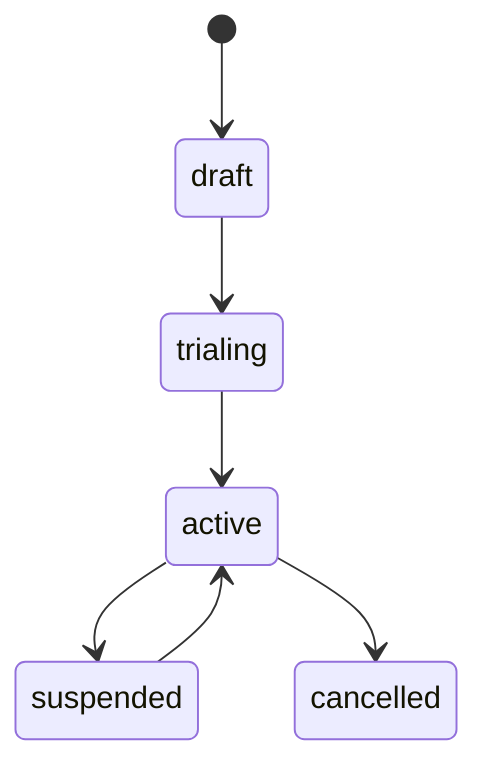

# Contract Lifecycle Demo

This example demonstrates the full contract lifecycle including trials, suspension, resumption, cancellation, and the credit ledger.

## Running the Example

```bash
go run ./examples/lifecycle-demo/
```

## Lifecycle Flow



### Trial Period

```go
agg.StartTrial(contract.TrialConfiguration{
    Duration: 14 * 24 * time.Hour, // 14-day trial
}, metadata)

// End trial with conversion to paid
agg.EndTrial(true, metadata) // converted = true
```

### Suspension and Resume

```go
// Suspend for non-payment
agg.Suspend(contract.SuspensionConfiguration{
    BillingBehavior: contract.SuspensionBillingSkip,
    Reason:          "payment overdue",
}, metadata)

// Resume after payment
agg.Resume(metadata)
```

Suspension billing behaviors:
- `Skip` — Don't generate invoices during suspension
- `Defer` — Defer billing until resume
- `Continue` — Continue billing even while suspended

### Cancellation and Credits

```go
agg.Cancel("customer request", metadata)
```

When configured with `CreditPolicyLedger`, unused days are credited to the account's credit ledger. These credits are automatically applied (FIFO) on future invoices.

## Key Takeaways

- Contracts follow a strict state machine
- Suspension supports multiple billing behaviors
- Credit ledger handles prorated refunds automatically
- All lifecycle events are recorded for audit
