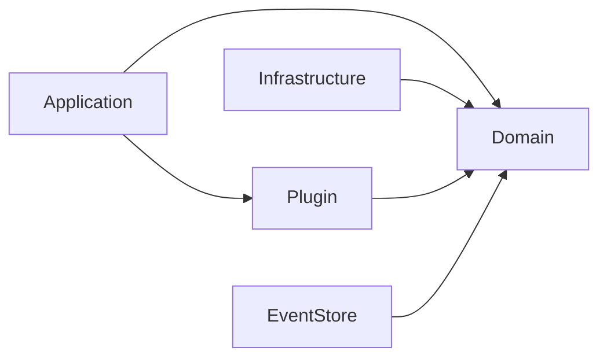

# Architecture

Contract Billing Core follows a layered architecture based on Domain-Driven Design (DDD) with event sourcing at its core.

## Package Structure

```
github.com/contract-to-cash/core/
├── domain/              # Domain layer — entities, value objects, aggregates
│   ├── contract/        # Contract aggregate (event-sourced)
│   ├── invoice/         # Invoice entity
│   ├── payment/         # Payment entity
│   ├── balance/          # Credit ledger entries
│   ├── usage/           # Usage records and summaries
│   ├── pricing/         # Price entity and pricing models
│   ├── product/         # Product entity
│   └── shared/          # Shared value objects (Money, DateRange, IDs, Clock)
├── application/         # Application layer — services, ports, queries
│   ├── service/         # BillingService, PaymentService, CreditNoteService, SnapshotService
│   ├── port/            # PaymentGateway interface (hexagonal port)
│   ├── tx/              # Transaction manager abstraction (TxManager, Saga, NoopTxManager)
│   ├── query/           # TemporalQueryService
│   └── projection/      # Projection service for read models
├── eventstore/          # Event sourcing infrastructure
│   ├── store.go         # Store interface
│   ├── event.go         # Event types and metadata
│   ├── aggregate.go     # Base aggregate root
│   └── snapshot.go      # Snapshot types
├── plugin/              # Plugin system
│   ├── plugin.go        # Plugin interface and priorities
│   ├── registry.go      # Plugin registry
│   ├── context.go       # Calculation context
│   ├── hooks.go         # Discount, Tax, InvoiceLifecycle hooks
│   ├── hooks_contract.go # Contract lifecycle hooks
│   ├── hooks_payment.go  # Payment hooks
│   ├── hooks_metrics.go  # Metrics collection hooks
│   ├── hooks_invoicegen.go # Invoice generation hooks
│   └── hooks_creditnote.go # Credit note and invoice revision hooks
├── plugins/             # Official plugin implementations
│   ├── tax/             # Tax calculation (Japanese consumption tax)
│   ├── coupon/          # Coupon/discount management
│   └── invoicecleanup/  # Invoice cleanup utilities
├── infrastructure/      # Infrastructure implementations
│   └── inmemory/        # In-memory implementations (for testing/demos)
├── batch/               # Batch processors
└── examples/            # Runnable examples
```

## Dependency Flow



- **Domain** has zero external dependencies. It defines repository interfaces and domain events.
- **Application** orchestrates domain operations and plugin execution.
- **Infrastructure** implements domain interfaces (repositories, event store).
- **Plugin** extends application behavior through hooks, depending on domain types.

## Invoice Generation Pipeline

`BillingService.GenerateInvoice()` executes a 14-step pipeline:

1. Load contract aggregate
2. **BeforeCalculation** hook (InvoiceLifecycleHook)
3. Calculate subtotal (loads Price entity, applies PriceOverride)
4. Apply **DiscountHooks** (multiple, priority-ordered)
5. Cap discount to subtotal
6. Calculate subtotal after discount
7. Apply **TaxHooks** (on post-discount amount)
8. Calculate total
9. Apply credits (FIFO from credit ledger)
10. Calculate amount due
11. Create draft invoice
12. Save invoice
13. **AfterCalculation** hook (InvoiceLifecycleHook)
14. Return invoice

## Payment Processing

Payment processing follows a two-phase approach:

1. **Charge flow**: `ProcessPayment` → BeforeChargeHook → Gateway.Charge → AfterChargeHook
2. **Auth/Capture flow**: Authorize → Capture (for payment-gated provisioning)

Payment method resolution uses a hierarchical fallback:

```
Explicit PaymentMethodID (in ProcessPaymentInput)
  → Invoice.PaymentMethodID
    → Contract.PaymentMethodID
      → Customer.DefaultPaymentMethodID
```

:::note
The Contract and Customer fallback levels require `contractRepo` to be passed to `PaymentService`. If omitted, resolution stops at Invoice level.
:::

## Design Decisions

| Decision | Rationale |
|----------|-----------|
| Event sourcing for contracts only | Contracts need full audit trail; invoices/payments are simpler CRUD entities |
| Immutable Price entities | Prevents silent re-pricing; price changes create new objects |
| Plugin priority ordering | Discounts must run before tax; audit hooks run first |
| FIFO credit consumption | Industry standard for credit ledgers; predictable behavior |
| Half-open DateRange `[start, end)` | Prevents billing period gaps and overlaps |
| `big.Rat` for Money | Arbitrary precision avoids floating-point rounding errors |
