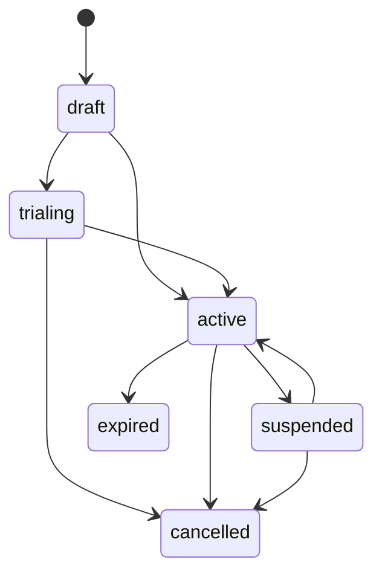
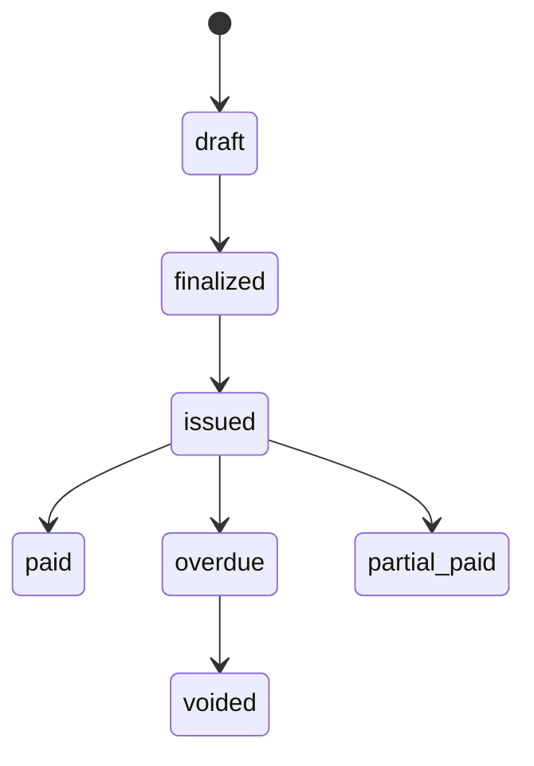

# Domain Model

The domain model consists of entities, value objects, and aggregates that represent the billing domain. For complete type definitions, see the [API Reference](../api/domain-types).

## Contract Aggregate

The contract is the central entity, modeled as an event-sourced aggregate root. It manages the full lifecycle of a billing agreement.

### State Machine



| Status | Description |
|--------|-------------|
| `draft` | Contract created but not yet active |
| `trialing` | In trial period |
| `active` | Currently active and billable |
| `past_due` | Payment overdue |
| `suspended` | Temporarily suspended (payment issue or manual) |
| `cancelled` | Permanently cancelled |
| `expired` | Term ended without renewal |

### Contract Types

| Type | Description |
|------|-------------|
| `one_time` | Single purchase, no recurring billing |
| `subscription` | Recurring billing at a fixed interval |
| `usage_based` | Charges based on metered usage |

### Lifecycle Example

The following demonstrates a full contract lifecycle including trials, suspension, and cancellation:

```go
// Create a contract in draft
agg := contract.NewContractAggregate(contractID, clock)
agg.Create(contract.CreateContractCommand{
    AccountID:    shared.AccountID("acct-001"),
    PlanID:       shared.PlanID("plan-standard"),
    PriceID:      priceEntity.ID(),
    ContractType: contract.ContractTypeSubscription,
    BillingCycle: contract.BillingCycleMonthly,
    Price:        moneyJPY(3000),
    BasePrice:    moneyJPY(3000),
}, metadata)

// Start trial
agg.StartTrial(contract.TrialConfiguration{
    Duration: 14 * 24 * time.Hour, // 14-day trial
}, metadata)

// Convert trial to paid
agg.EndTrial(true, metadata) // converted = true → active

// Suspend for non-payment
agg.Suspend(contract.SuspensionConfiguration{
    BillingBehavior: contract.SuspensionBillingSkip,
    Reason:          "payment overdue",
}, metadata)

// Resume after payment
agg.Resume(metadata)

// Cancel
agg.Cancel("customer request", metadata)
```

Suspension billing behaviors:
- **Skip** — Don't generate invoices during suspension
- **Defer** — Defer billing until resume
- **Continue** — Continue billing even while suspended

## Invoice

Invoices are generated by `BillingService` and track the billing calculation result.



Invoices support a two-level linking model for void-and-recreate workflows:

- **`originalInvoiceID`** — always points to the first invoice in the revision chain (the root)
- **`revisionOf`** — points to the direct parent (the immediate predecessor)

## Product and Price

Following the Stripe pattern of separating what you sell from how you charge:

- **Product** — What you sell (name, features, usage metrics)
- **Price** — How you charge (amount, currency, billing cycle, pricing model). **Immutable after creation.**

This separation enables:
- Price revisions without affecting existing subscribers (grandfathering)
- Multiple prices per product (monthly vs yearly, multi-currency)
- Clean price migration with `pendingPriceID`

## Credit Ledger

FIFO-based credit system for handling prorations, cancellation credits, and adjustments. When configured with `BalancePolicyLedger`, unused days are credited to the account. Credits are automatically consumed during invoice generation, oldest first.
