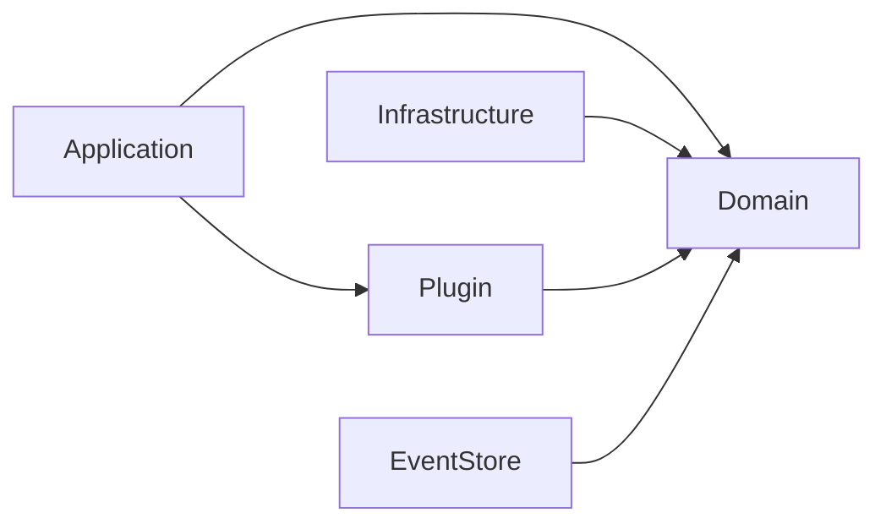
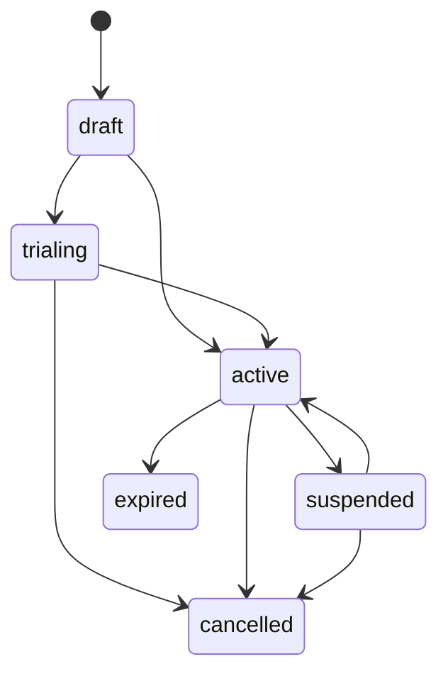

# アーキテクチャ

Contract Billing Coreは、ドメイン駆動設計（DDD）に基づくレイヤードアーキテクチャを採用し、イベントソーシングを中核に据えています。

## パッケージ構成

```
github.com/contract-to-cash/core/
├── domain/              # ドメイン層 — エンティティ、値オブジェクト、集約
│   ├── contract/        # 契約集約（イベントソース）
│   ├── invoice/         # 請求書エンティティ
│   ├── payment/         # 支払いエンティティ
│   ├── balance/          # クレジット台帳エントリ
│   ├── usage/           # 使用量レコードとサマリー
│   ├── pricing/         # Priceエンティティと価格モデル
│   ├── product/         # Productエンティティ
│   └── shared/          # 共有値オブジェクト（Money, DateRange, ID, Clock）
├── application/         # アプリケーション層 — サービス、ポート、クエリ
│   ├── service/         # BillingService, PaymentService, CreditNoteService, SnapshotService
│   ├── port/            # PaymentGatewayインターフェース（ヘキサゴナルポート）
│   ├── tx/              # トランザクション管理抽象化（TxManager, Saga, NoopTxManager）
│   ├── query/           # TemporalQueryService
│   └── projection/      # プロジェクションサービス（読み取りモデル）
├── eventstore/          # イベントソーシング基盤
│   ├── store.go         # Storeインターフェース
│   ├── event.go         # イベント型とメタデータ
│   ├── aggregate.go     # 集約ルートの基本実装
│   └── snapshot.go      # スナップショット型
├── plugin/              # プラグインシステム
│   ├── plugin.go        # Pluginインターフェースと優先度
│   ├── registry.go      # プラグインレジストリ
│   ├── context.go       # 計算コンテキスト
│   ├── hooks.go         # Discount, Tax, InvoiceLifecycleフック
│   ├── hooks_contract.go # 契約ライフサイクルフック
│   ├── hooks_payment.go  # 決済フック
│   ├── hooks_metrics.go  # メトリクス収集フック
│   ├── hooks_invoicegen.go # 請求書生成フック
│   └── hooks_creditnote.go # クレジットノート・請求書リビジョンフック
├── plugins/             # 公式プラグイン実装
│   ├── tax/             # 税計算（日本の消費税）
│   ├── coupon/          # クーポン/割引管理
│   └── invoicecleanup/  # 請求書クリーンアップユーティリティ
├── infrastructure/      # インフラ実装
│   └── inmemory/        # インメモリ実装（テスト・デモ用）
├── batch/               # バッチプロセッサ
└── examples/            # 実行可能サンプル
```

## 依存関係の方向



- **Domain** は外部依存ゼロ。リポジトリインターフェースとドメインイベントを定義。
- **Application** はドメイン操作とプラグイン実行をオーケストレーション。
- **Infrastructure** はドメインインターフェース（リポジトリ、イベントストア）を実装。
- **Plugin** はフックを通じてアプリケーション動作を拡張。

## 集約ルートとしてのContract

`ContractAggregate`は中心的なイベントソースエンティティです。すべての状態変更がドメインイベントを生成します：

```
ContractCreatedEvent → ContractActivatedEvent → ContractRenewedEvent → ...
```

状態遷移は厳格な状態機械に従います：



## 請求書生成パイプライン

`BillingService.GenerateInvoice()`は14ステップのパイプラインを実行します：

1. 契約集約のロード
2. **BeforeCalculation**フック（InvoiceLifecycleHook）
3. 小計計算（Priceエンティティのロード、PriceOverride適用）
4. **DiscountHook**の適用（複数、優先度順）
5. 割引の上限キャップ
6. 割引後小計の計算
7. **TaxHook**の適用（割引後金額に対して）
8. 合計計算
9. クレジット適用（FIFO消費）
10. 請求金額の計算
11. ドラフト請求書の作成
12. 請求書の保存
13. **AfterCalculation**フック（InvoiceLifecycleHook）
14. 請求書を返却

## Product/Priceモデル

Stripeパターン（2020年にモノリシックPlanを廃止）に準拠：

- **Product** — 何を売るか（名前、機能、使用量メトリクス）
- **Price** — どう課金するか（金額、通貨、課金サイクル、価格モデル）。**作成後は不変。**

この分離により以下が可能：
- 既存サブスクライバーに影響を与えない価格改定（グランドファザリング）
- 同一プロダクトに複数価格（月額/年額、マルチ通貨）
- `pendingPriceID`によるクリーンな価格移行

## Event Store

Event Storeは以下の機能を提供します：

- **Append** — 楽観的ロック（`expectedVersion`）によるイベント保存
- **Load** — ストリームの全イベント取得
- **LoadUntil** — 特定時点までのイベント取得（時間旅行クエリ）
- **Subscribe** — プロジェクション向けイベント購読
- **Snapshots** — 高速リカバリのための集約スナップショット保存/読み込み

データベースに対して`eventstore.Store`インターフェースを実装します。テスト用のインメモリ実装が提供されています。

## 決済処理

決済処理は二段階のアプローチに従います：

1. **Chargeフロー**: `ProcessPayment` → BeforeChargeHook → Gateway.Charge → AfterChargeHook
2. **Auth/Captureフロー**: Authorize → Capture（決済ゲート付きプロビジョニング向け）

決済手段の解決は階層的なフォールバックを使用します：

```
ProcessPaymentInput内の明示的PaymentMethodID
  → Invoice.PaymentMethodID
    → Contract.PaymentMethodID
      → Customer.DefaultPaymentMethodID
```

:::note
ContractおよびCustomerレベルのフォールバックには、`PaymentService`に`contractRepo`を渡す必要があります。省略した場合、解決はInvoiceレベルで止まります。
:::

## 設計判断

| 判断 | 理由 |
|------|------|
| Contractのみイベントソーシング | 契約は完全な監査証跡が必要。請求書/支払いはシンプルなCRUDエンティティ |
| 不変Priceエンティティ | サイレントな再価格設定を防止。価格変更は新オブジェクトを作成 |
| プラグイン優先度順序 | 割引は税の前に実行。監査フックが最初に実行 |
| FIFOクレジット消費 | クレジット台帳の業界標準。予測可能な動作 |
| 半開区間DateRange `[start, end)` | 課金期間のギャップと重複を防止 |
| Moneyに`big.Rat` | 任意精度で浮動小数点の丸め誤差を回避 |
