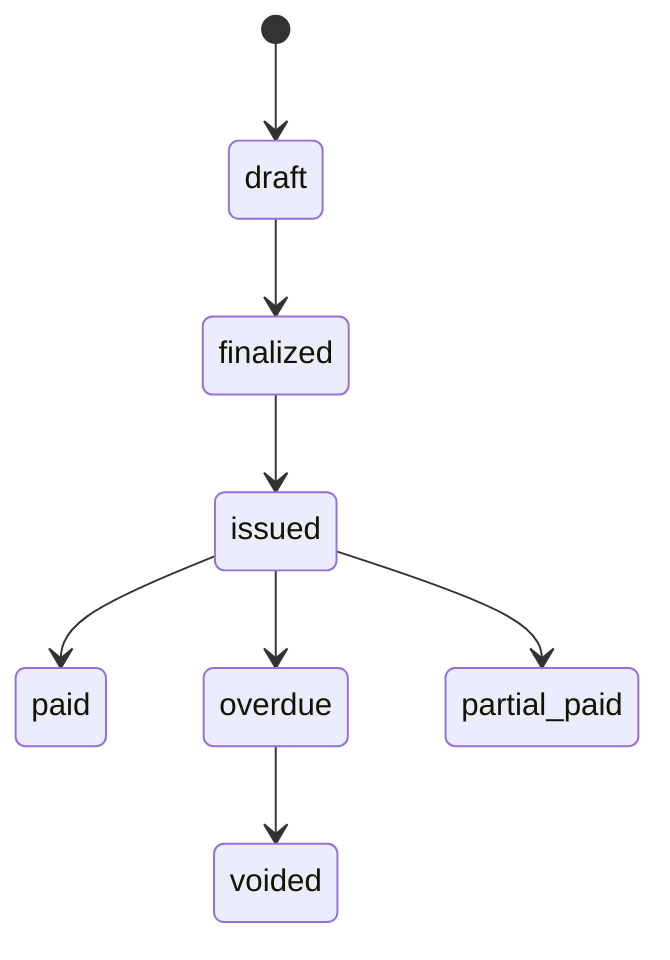

# ドメインモデル

ドメインモデルは、課金ドメインを表現するエンティティ、値オブジェクト、集約で構成されています。

## 契約集約（Contract Aggregate）

契約は中心的なエンティティで、イベントソースの集約ルートとしてモデリングされています。課金契約の全ライフサイクルを管理します。

### 状態

| ステータス | 説明 |
|-----------|------|
| `draft` | 作成済みだが未有効化 |
| `trialing` | トライアル期間中 |
| `active` | 有効。課金対象 |
| `past_due` | 支払い期限超過 |
| `suspended` | 一時停止中（支払い問題または手動） |
| `cancelled` | 永久的に解約済み |
| `expired` | 更新なしで期間終了 |

### 契約タイプ

| タイプ | 説明 |
|-------|------|
| `one_time` | 買い切り。定期課金なし |
| `subscription` | 一定間隔の定期課金 |
| `usage_based` | メータリングされた使用量に基づく課金 |

### 主要フィールド

```go
type ContractAggregate struct {
    contractID       shared.ContractID
    accountID        shared.AccountID
    priceID          shared.PriceID       // 不変Priceエンティティへの参照
    pendingPriceID   *shared.PriceID      // 次回更新時に適用予定
    priceOverride    *shared.Money         // 契約別の価格調整
    status           ContractStatus
    contractType     ContractType
    billingCycle     BillingCycle
    currentPeriod    shared.DateRange
    autoRenew        bool
    cancelAtPeriodEnd bool
    paymentMethodID  *string               // 契約レベルの決済手段
}
```

### 操作

```go
// ライフサイクル
agg.Create(cmd CreateContractCommand, metadata EventMetadata) error
agg.Activate(metadata EventMetadata) error
agg.Suspend(config SuspensionConfiguration, metadata EventMetadata) error
agg.Resume(metadata EventMetadata) error
agg.Cancel(reason string, metadata EventMetadata) error
agg.Renew(metadata EventMetadata) error

// 価格変更
agg.ChangePrice(newPriceID PriceID, policy ChangePolicy, proration *PlanChangeProration, metadata EventMetadata) error
agg.UnscheduleChange(reason string, metadata EventMetadata) error
agg.SetPriceOverride(override Money, metadata EventMetadata) error

// トライアル
agg.StartTrial(config TrialConfiguration, metadata EventMetadata) error
agg.EndTrial(converted bool, metadata EventMetadata) error

// イベントソーシング
agg.LoadFromHistory(events []Event) error
agg.LoadFromSnapshot(snapshot Snapshot) error
agg.MarshalSnapshot() ([]byte, error)
```

## 請求書（Invoice）

請求書は`BillingService`によって生成され、課金計算の結果を追跡します。

### 状態遷移



### 構造

```go
type Invoice struct {
    id              shared.InvoiceID
    contractID      shared.ContractID
    accountID       shared.AccountID
    lineItems       []LineItem
    subtotal        shared.Money     // 割引前
    discountAmount  shared.Money     // 適用された割引合計
    taxAmount       shared.Money     // 税額合計
    total           shared.Money     // subtotal - discount + tax
    appliedCredit   shared.Money     // クレジット台帳から消費されたクレジット
    amountDue       shared.Money     // total - appliedCredit
    billingPeriod   shared.DateRange
    dueDate         time.Time
    status          InvoiceStatus
}
```

## 支払い（Payment）

個々の支払いトランザクションを追跡します。

```go
type Payment struct {
    id                   shared.PaymentID
    invoiceID            shared.InvoiceID
    amount               shared.Money
    method               PaymentMethod    // credit_card, bank_transferなど
    status               PaymentStatus    // pending, completed, failed, refunded
    gatewayTransactionID string
    processedAt          time.Time
}
```

## ProductとPrice

Stripeパターンに倣い、「何を売るか」と「どう課金するか」を分離：

```go
// Product — 何を売るか
type Product struct {
    id           shared.ProductID
    name         string
    features     []Feature
    usageMetrics []UsageMetric
    status       ProductStatus    // active, archived
}

// Price — どう課金するか（作成後は不変）
type Price struct {
    id           shared.PriceID
    productID    shared.ProductID
    amount       shared.Money
    currency     shared.Currency
    billingCycle BillingCycle     // monthly, yearlyなど
    pricingModel PricingModel    // 定額課金の場合はnil
    status       PriceStatus     // active, archived
}
```

**重要原則**: Priceは不変です。価格を変更するには新しいPriceオブジェクトを作成します。既存の契約は明示的に変更されるか更新されるまで、現在のPrice参照を保持します。

## 共有値オブジェクト

### Money

通貨安全性を持つ任意精度の金額値：

```go
price := shared.NewMoney(new(big.Rat).SetInt64(3000), shared.CurrencyJPY)
tax := price.Multiply(new(big.Rat).SetFrac64(10, 100)) // 10%
total, err := price.Add(tax) // 通貨不一致はエラーを返す
```

対応通貨: `JPY`, `USD`, `EUR`

### DateRange

課金期間用の半開区間 `[start, end)`:

```go
period, _ := shared.NewDateRange(start, end)
period.Contains(someTime) // start <= someTime < end ならtrue
period.Duration()
```

### ID型

時間順ユニーク性のためのULIDベース識別子：

```go
shared.NewContractID()   // ContractID
shared.NewInvoiceID()    // InvoiceID
shared.NewPaymentID()    // PaymentID
shared.NewProductID()    // ProductID
shared.NewPriceID()      // PriceID
shared.NewAccountID()    // AccountID
```

## クレジット台帳

日割り計算、解約クレジット、調整処理のためのFIFOベースクレジットシステム：

```go
type CreditEntry struct {
    id              shared.CreditEntryID
    accountID       shared.AccountID
    originalAmount  shared.Money
    remainingAmount shared.Money
    reason          CreditReason  // proration, cancellation, manual_adjustmentなど
    expiresAt       *time.Time
}
```

クレジットは請求書生成時に自動的に消費されます（古いものから順に）。
