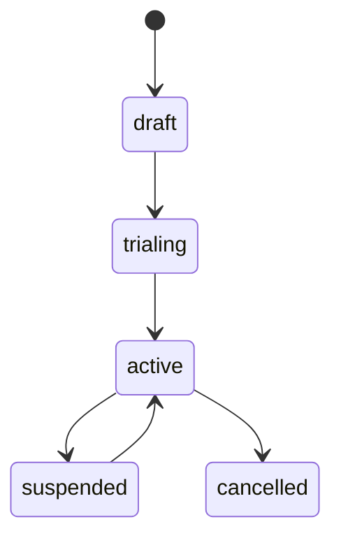

# 契約ライフサイクルデモ

この例では、トライアル、停止、再開、解約、クレジット台帳を含む契約の全ライフサイクルを実演します。

## サンプルの実行

```bash
go run ./examples/lifecycle-demo/
```

## ライフサイクルフロー



### トライアル期間

```go
agg.StartTrial(contract.TrialConfiguration{
    Duration: 14 * 24 * time.Hour, // 14日間トライアル
}, metadata)

// トライアル終了（有料プランへ転換）
agg.EndTrial(true, metadata) // converted = true
```

### 停止と再開

```go
// 未払いによる停止
agg.Suspend(contract.SuspensionConfiguration{
    BillingBehavior: contract.SuspensionBillingSkip,
    Reason:          "支払い遅延",
}, metadata)

// 決済後に再開
agg.Resume(metadata)
```

停止中の課金動作：
- `Skip` — 停止中は請求書を生成しない
- `Defer` — 再開まで課金を延期
- `Continue` — 停止中も課金を継続

### 解約とクレジット

```go
agg.Cancel("お客様のご要望", metadata)
```

`CreditPolicyLedger`が設定されている場合、未使用日数分がアカウントのクレジット台帳にクレジットされます。これらのクレジットは将来の請求書に自動的に（FIFO順で）適用されます。

## ポイント

- 契約は厳格な状態機械に従う
- 停止は複数の課金動作をサポート
- クレジット台帳が日割り返金を自動処理
- すべてのライフサイクルイベントが監査のために記録
