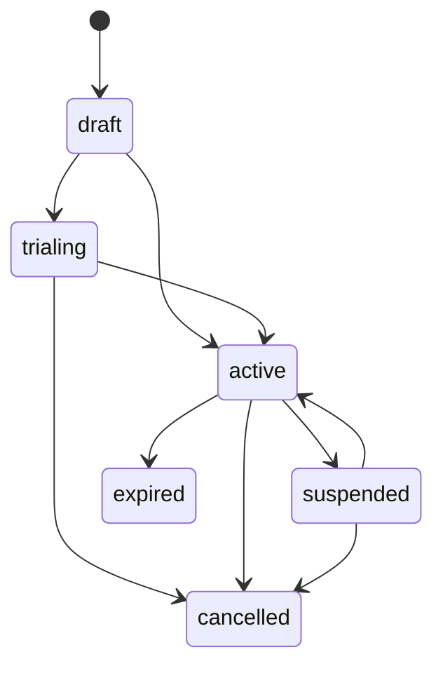
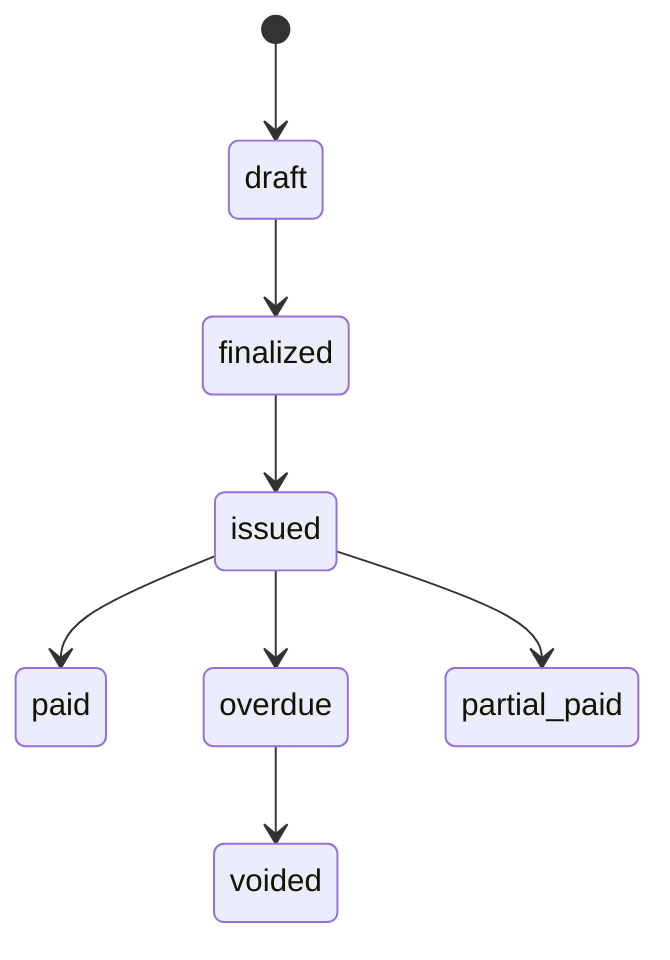

# ドメインモデル

ドメインモデルは、課金ドメインを表現するエンティティ、値オブジェクト、集約で構成されています。完全な型定義については[APIリファレンス](../api/domain-types)を参照してください。

## 契約集約（Contract Aggregate）

契約は中心的なエンティティで、イベントソースの集約ルートとしてモデリングされています。課金契約の全ライフサイクルを管理します。

### 状態機械



| ステータス | 説明 |
|-----------|------|
| `draft` | 作成済みだが未有効化 |
| `trialing` | トライアル期間中 |
| `active` | 有効。課金対象 |
| `past_due` | 支払い期限超過 |
| `suspended` | 一時停止中（支払い問題または手動） |
| `cancelled` | 永久的に解約済み |
| `expired` | 更新なしで期間終了 |

### 契約タイプ

| タイプ | 説明 |
|-------|------|
| `one_time` | 買い切り。定期課金なし |
| `subscription` | 一定間隔の定期課金 |
| `usage_based` | メータリングされた使用量に基づく課金 |

### ライフサイクル例

以下はトライアル、停止、解約を含む契約の全ライフサイクルを示します：

```go
// ドラフト状態で契約を作成
agg := contract.NewContractAggregate(contractID, clock)
agg.Create(contract.CreateContractCommand{
    AccountID:    shared.AccountID("acct-001"),
    PlanID:       shared.PlanID("plan-standard"),
    PriceID:      priceEntity.ID(),
    ContractType: contract.ContractTypeSubscription,
    BillingCycle: contract.BillingCycleMonthly,
    Price:        moneyJPY(3000),
    BasePrice:    moneyJPY(3000),
}, metadata)

// トライアル開始
agg.StartTrial(contract.TrialConfiguration{
    Duration: 14 * 24 * time.Hour, // 14日間トライアル
}, metadata)

// トライアル終了（有料プランへ転換）
agg.EndTrial(true, metadata) // converted = true → active

// 未払いによる停止
agg.Suspend(contract.SuspensionConfiguration{
    BillingBehavior: contract.SuspensionBillingSkip,
    Reason:          "支払い遅延",
}, metadata)

// 決済後に再開
agg.Resume(metadata)

// 解約
agg.Cancel("お客様のご要望", metadata)
```

停止中の課金動作：
- **Skip** — 停止中は請求書を生成しない
- **Defer** — 再開まで課金を延期
- **Continue** — 停止中も課金を継続

## 請求書（Invoice）

請求書は`BillingService`によって生成され、課金計算の結果を追跡します。



請求書はvoid-and-recreateワークフローのための二段階リンクモデルをサポートします：

- **`originalInvoiceID`** — リビジョンチェーンの最初の請求書（ルート）を常に指す
- **`revisionOf`** — 直接の親（直前の前任者）を指す

## ProductとPrice

Stripeパターンに倣い、「何を売るか」と「どう課金するか」を分離：

- **Product** — 何を売るか（名前、機能、使用量メトリクス）
- **Price** — どう課金するか（金額、通貨、課金サイクル、価格モデル）。**作成後は不変。**

この分離により以下が可能：
- 既存サブスクライバーに影響を与えない価格改定（グランドファザリング）
- 同一プロダクトに複数価格（月額/年額、マルチ通貨）
- `pendingPriceID`によるクリーンな価格移行

## クレジット台帳

日割り計算、解約クレジット、調整処理のためのFIFOベースクレジットシステム。`BalancePolicyLedger`が設定されている場合、未使用日数分がアカウントのクレジット台帳にクレジットされます。クレジットは請求書生成時に自動的に消費されます（古いものから順に）。
