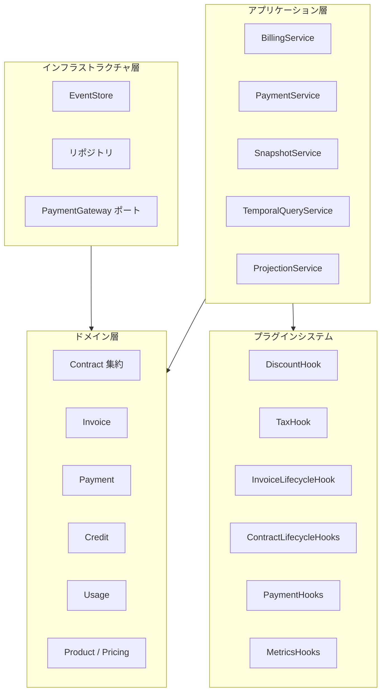

# はじめに

Contract Billing Coreは、契約ベースの課金システムを構築するためのオープンソースGoパッケージです。イベントソーシング、プラグインアーキテクチャ、ドメイン駆動設計パターンを採用し、SaaS・サブスクリプションビジネスに必要な機能を提供します。

## なぜContract Billing Coreなのか？

課金システムをゼロから構築するのは複雑です。契約ライフサイクル、請求書生成、決済処理、税計算、割引、従量課金メータリング、監査証跡 — これらすべてをデータ整合性を維持しながら実装する必要があります。

Contract Billing Coreは、これらの構成要素をコンポーザブルなライブラリとして提供します。特定のフレームワークに縛られることはありません。データベース、決済ゲートウェイ、ビジネスルールはあなた自身が持ち込みます。ライブラリはドメインモデル、イベントソーシング基盤、拡張ポイントを提供します。

## 主な特徴

- **イベントソーシング** — すべての状態変更は不変のイベントとして記録されます。任意の時点のエンティティ状態を再構築可能。監査証跡が標準装備。
- **プラグインアーキテクチャ** — 割引、税金、請求書ライフサイクル、契約ライフサイクル、決済処理、メトリクス収集のためのフックで課金ロジックを拡張。必要なインターフェースだけを実装（ISP準拠）。
- **Product/Price分離** — Stripeモデルに倣い、プロダクト（何を売るか）とプライス（どう課金するか）を分離。プライスは不変 — 価格改定は新しいPriceオブジェクトを作成し、既存顧客の価格据え置き（グランドファザリング）とクリーンな移行を実現。
- **複数の課金モデル** — 買い切り、サブスクリプション、従量課金。定額、段階制、ボリューム、契約別オーバーライドに対応。
- **契約更新** — pendingPriceIDによる保留価格のプロモーション付き自動更新。期末適用（END_OF_TERM）または即時適用（IMMEDIATE）の価格変更。
- **決済ゲートウェイ抽象化** — チャージ、オーソリ/キャプチャ、ボイド、返金、決済手段管理のプラグインインターフェース。階層型フォールバック解決（Invoice → Contract → Customer）。
- **クレジット台帳** — 日割り計算、解約クレジット、手動調整のためのFIFOベースクレジットシステム。
- **時間旅行クエリ** — イベントリプレイやスナップショット復元による過去任意時点の契約状態クエリ。

## アーキテクチャ概要

## 設計原則

1. **ドメイン駆動設計** — Contractを主要な集約ルートとする明確な境界コンテキスト。
2. **依存性逆転** — コアドメインは実装ではなくインターフェースに依存。リポジトリとゲートウェイの実装はあなたが提供。
3. **インターフェース分離** — プラグインは必要なフックだけを実装。税プラグインが割引フックを実装する必要はない。
4. **不変イベント** — 一度記録されたイベントは変更不可。スキーマの進化はアップキャスターで対応。
5. **不変Price** — Priceエンティティは作成後に変更不可。価格変更は新しいPriceオブジェクトを作成し、履歴を保全。

## 対象ユーザー

- **SaaS/サブスクリプションプラットフォーム** — 課金システムをゼロから構築、またはモノリシックな課金システムの置き換え
- **ホスティング/クラウドプロバイダー** — プロビジョニングフック付きの契約ライフサイクル管理
- **B2Bプラットフォーム** — 監査証跡付きのマルチ契約・マルチ通貨課金
- **開発者** — 特定の決済プロセッサへのベンダーロックインなしの課金ドメインモデル

## 次のステップ

- [クイックスタート](./quick-start) — インストールして数分で最初の課金フローを実行
- [アーキテクチャ](./architecture) — システム設計の詳細
- [サンプル](./examples/billing-flow) — 動作するコード例
